# 使用 Python 和 AWS Lambda 将任何 ML 模型部署为 API 的综合指南

> 原文：<https://towardsdatascience.com/comprehensive-guide-to-deploying-any-ml-model-as-apis-with-python-and-aws-lambda-b441d257f1ec>

## 把那个模型放到网上


**照片由** [**苏西**](https://www.pexels.com/photo/blue-and-red-galaxy-artwork-1629236/) 拍摄

## 介绍

人们说 Python 最好的一点是它丰富的开源库。恕我不能苟同。

在完成一项任务时有多种选择可能会给你带来很大的灵活性，但它们最终可能会造成巨大的混乱，让程序员感到困惑和愤怒。

现在，这是关于机器学习操作(MLOps)的情况。近年来，它已经成为一个如此重要的领域，以至于 Python 社区已经出色地应对了这种情况——通过创建尽可能多的工具和库来执行 MLOps 规程。

现在，对于一个普通用户来说，筛选所有的信息，比较并提出一套最终的工具来解决他们的业务问题是一个挑战。

即使他们做到了，把他们放在一起，让他们交流，并达成一个现成的，像样的机器学习解决方案也是一个完全独立的问题。

以将模型部署为 API 为例(本文的主题)。你会选择哪一套工具来完成这项工作？

暂时，让我们忘记所有开始时的忙乱，比如数据版本化、模型选择和特征工程，并且说你已经有了一个现成的模型。

如何将模型转换成 HTTPS 地址，以便用户可以发送请求？有这么多的选择，像 Flask，Django，FastAPI 等等。

即使选择了框架，让它上线也不容易。你使用 AWS，Heroku，GCP，或其他几十个几乎声称他们提供了“唯一最好的方法”来做到这一点吗？

为了省去您回答所有这些问题的麻烦，在本文中，我将介绍一个解决方案，与其他替代方案相比，它应该非常简单明了，没有任何麻烦。你只需要知道`scikit-learn`和`xgboost`；其余的我会教。

最后，我们将构建[这个 API](https://mbzblb2ude.execute-api.us-west-1.amazonaws.com/) :

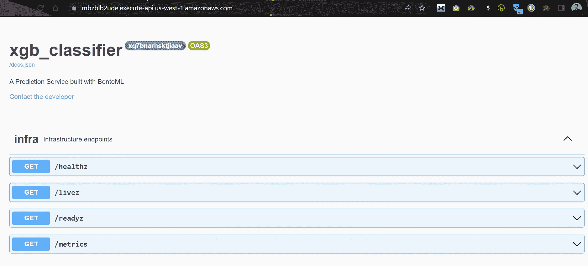

作者图片

用户可以向它的`classify`端点发送请求以获得预测，并通过一个链接在任何地方嵌入这个 API。

<https://ibexorigin.medium.com/membership>  

获得由强大的 AI-Alpha 信号选择和总结的最佳和最新的 ML 和 AI 论文:

<https://alphasignal.ai/?referrer=Bex>  

## 我们将使用的堆栈

在我们开始之前，让我概述一下我们将使用的技术列表，并解释我选择它们的原因。

*   熊猫，[熊猫](https://numpy.org/)——无需解释。
*   [Sklearn](https://scikit-learn.org/) 和 [XGBoost](https://xgboost.readthedocs.io/en/stable/) —模型训练。它们只是为了说明的目的而被选择的，并且这些指令将在来自任何其他框架的模型上工作
*   [BentoML](https://docs.bentoml.org/en/latest/)——将训练好的模型打包到本地 API 中(后面会详细解释)
*   [bentoctl](https://github.com/bentoml/bentoctl) —一个 CLI 工具，允许您构建 Docker 映像，并使用一个命令将它们保存为云兼容格式
*   [Terraform](https://www.terraform.io/) —另一款用于管理云基础设施的 CLI 工具。它负责创建资源和函数，并将容器推送给它们，而不需要访问 50 万个页面。
*   [AWS](https://aws.amazon.com/) —最受欢迎、最可靠、最灵活的云平台(你可以通过 [Google Trends](https://trends.google.com/trends/explore?q=aws,google%20cloud) 确认)。
*   [AWS Lambda](https://aws.amazon.com/lambda/) —在无服务器云上运行代码——高度可扩展且舒适。

所以，事不宜迟，让我们开始吧。

## BentoML 是什么，它的目的是什么？

为了最大化机器学习的商业影响，数据科学家和工程师之间从模型训练到部署的交接应该是快速和迭代的。

然而，数据科学家通常不具备打包训练好的模型并将其推给工程师的技能，而工程师发现很难处理来自几十个不同 ML 框架的模型。

BentoML 的创建就是为了解决这些问题，并尽可能容易/快速地交付到生产部署。在接下来的几节中，您将看到 BentoML 如何使执行繁琐的 MLOps 操作变得容易。这些例子是:

*   将任何框架的任何模型保存为统一格式，以简化协作。
*   使用单个 Python 函数创建 HTTP API 端点，以加快迭代速度。
*   使用 Docker 和一个 CLI 命令将模型需要的所有东西打包。

阅读文档[这里](https://docs.bentoml.org/en/latest/#https://docs.bentoml.org/en/latest/#)了解更多信息，或者继续阅读。

## 数据集准备和模型训练

这篇文章的核心是关于模型部署的，所以我想把您的全部注意力集中在这个领域。

为此，我假设您在阅读本文时已经有了训练有素的模型，并且希望尽快部署它。

为了在这里进行模拟，我们将创建一个合成数据集，训练一个 XGBoost 模型，并继续前进，就好像您已经完成了 MLOps 生命周期的所有先前步骤，如数据清理、探索、特征工程、模型实验、超参数调整，并找到了在您的数据集上表现最佳的模型。

我们创建了一个简单的数据集，包含七个特征和 10k 个样本，目标是二进制分类。

我们将它加载回来，训练一个普通的 XGBoost 分类器，并假设它是我们调优的模型。

## 将训练好的模型保存为 BentoML 格式

通过调用特定于框架的`save`命令，可以将训练好的模型保存为 BentoML 兼容的格式:

返回的对象是 BentoML `Model`类的一个实例，带有一个名为*标签*的标签。

标签由两部分组成——用户给出的名称和版本字符串，以区分不同时间保存的模型。即使保存了相同的模型，BentoML 也会创建一个新的目录和一个版本字符串。

BentoML 支持几乎所有基本的 ML 框架:

*   经典:Sklearn、XGBoost、CatBoost、LightGBM
*   深度学习:TensorFlow，PyTorch，PyTorch Lightning，Keras，Transformers
*   其他:ONNX，MLFlow，fast.ai，statsmodels，spaCy，h2o，Gluon 等。

每个框架都有一个相应的`bentoml.framework.save_model`命令。

当一个模型被保存时，它进入一个名为 BentoML model store 的本地目录。从最后一个输出(`path`参数)中，我们看到我的模型商店位于`/home/bexgboost/bentoml/models`。您可以通过在终端中调用`bentoml models list`命令来查看您所有型号的列表:

你也可以看到我其他项目的模型。

> 注意:在 BentoML 文档和本文中，名称“model”和“tag”可以互换使用，以指代模型存储中保存的模型。

`save_model`具有其他参数，用于传递关于模型的额外信息，从元数据到其他用户定义的对象(例如，作为单独对象的模型的特征重要性):

上面，我们保存了我们的 XGBoost 模型和其他数据，比如作者(我)，特性重要性分数，您可以用`booster.get_score`和一个虚拟指标来检索。

## 共享模型

使用`bentoml models export`命令，BentoML 模型存储中的模型可以作为独立的档案共享:

当您不知道标签的确切版本字符串时，可以使用“:latest”后缀来选择最新的版本。使用上面的命令，我们将分类器导出到`models`目录下的`.bentomodel`档案中。当队友发送给你一个`.bentomodel`存档时，你可以使用`import`命令将其发送到你当地的 BentoML 模型商店:

## 检索保存的模型

有几种方法可以将保存的模型从模型库中加载到您的环境中。最简单的就是`load_model`功能。和`save_model`一样，`load_model`也是特定于框架的:

该函数将以保存前的相同格式加载模型，这意味着您可以使用其本机方法，如`predict`:

要将模型作为 BentoML `Model`对象加载，您可以使用`models.get`命令，它不是特定于框架的:

```
tag = bentoml.models.get("xgb_custom:latest")
```

您可能希望以这种格式加载模型的原因是，现在您可以访问它的附加组件，如元数据和标签:

检索模型的最后也是最重要的方法是将它们作为跑步者加载:

Runners 是 BentoML 的特殊对象，根据它们的框架进行优化，以最有效的方式使用系统资源。运行器是我们将在下一节构建的 API 的核心组件。

现在，我们已经准备好开始构建 API 了！

<https://ibexorigin.medium.com/membership>  

## 组织成脚本

到目前为止，我们一直使用笔记本。我们需要切换到 Python 脚本来构建 API 服务。我们来整理一下前面几节的代码。在`generate_data.py`文件中，创建一个保存来自“数据集准备”部分的合成数据的函数:

> 完整的`generate_data.py`脚本可以在[这里](https://github.com/BexTuychiev/bentoml_sample_project/blob/main/src/generate_data.py)找到。

在一个`train.py`文件中，创建一个函数来训练我们的 XGBoost 分类器，并将其保存到 BentoML 模型存储中:

> 完整的`train.py`脚本可以在[这里](https://github.com/BexTuychiev/bentoml_sample_project/blob/main/src/train.py)找到。

为了完整起见，请以正确的顺序运行这两个脚本，以生成数据集并将一个新模型保存到模型存储中。

## 创建 API 服务脚本

现在，是时候创建本地 API 了。为此，我们只需要一个简单的脚本，如下所示:

在加载了以`models.get`作为跑步者的模型后，我们创建了一个名为`svc`的对象。这将是一个 BentoML `Service`对象的实例。`Service`是抽象表示我们的 API 的高级类。

我们通过创建一个同名的函数向服务对象添加一个名为`classify`的端点:

让我们一行一行地理解上面的片段。

首先，我们从`bentoml.io`导入一个新的类`NumpyNdarray`——输入/输出模块。为了标准化输入和输出，BentoML 提供了几个类似于`NumpyNdarray`的类，如`Text`、`File`、`Image`、`PandasDataFrame`等。

将这些类添加到`svc.api`装饰器的`input`和`output`参数中可以确保正确的数据类型被传递到我们的 API 端点。在我们的例子中，我们确保传递给我们的`classify`函数的数据总是一个 NumPy 数组。

如果我们正在处理图像模型，我们的输入类可能是一个`File`或`Image`类，而输出将再次是`NumpyNdarray`。

在函数内部，我们使用 runner 的`predict.run`方法来获得对输入的预测。该方法调用了 XGBoost booster 对象的`predict`方法。

下面是脚本最终的样子:

就是这样！通过使用`bentoml serve`，我们可以创建一个本地调试服务器:

```
$ bentoml serve service.py:svc --reload
```

> 重要提示:上述命令中的`service.py`和`svc`变量根据您的脚本名和服务对象名而变化。如果在一个名为`api.py`的脚本中有一个名为`api`的服务对象，那么命令应该是`bentoml serve api.py:api --reload`。标签确保 BentoML 无需重启服务器就能检测到对脚本的修改。

以下是该命令的输出示例:

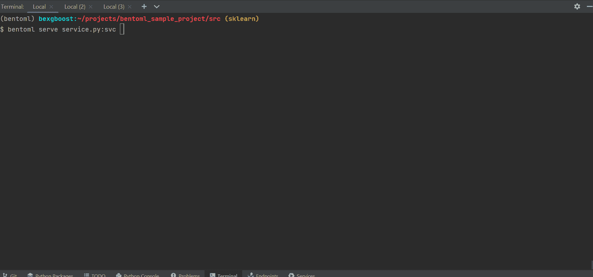

作者图片

GIF 显示该 API 在本地运行于 [http://127.0.0.1:3000:](http://127.0.0.1:3000:)

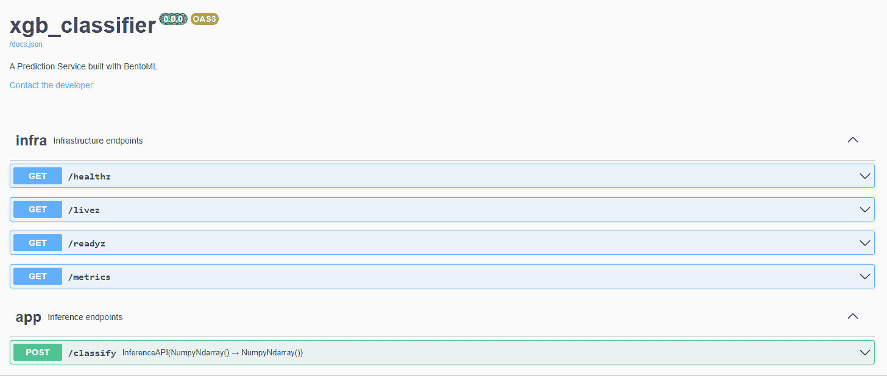

作者 GIF

通过使用 Swagger UI，BentoML 向您展示了我们 API 的交互式文档。我们已经可以向它发送请求来获得预测:

耶！我们的 API 起作用了——它将给定的样本分类为第一类。

## 做便当

现在，我们将 API 打包成一个便当。

Bento 是由 BentoML 引入的一个术语，指的是一个包含使我们的 API 工作所需的所有东西的档案——以一种统一的格式。在便当中，将会有关于构建 Docker 映像和我们的 API 模型的依赖关系的说明。

我们通过在与脚本相同的目录级别中创建一个`bentofile.yaml`文件(名称应该相同)来开始构建便当。它将如下所示:

`include`字段用于列出运行我们的便当所需的所有脚本。在我们的例子中，我们只是添加了所有的 Python 脚本。接下来是`packages`字段，它应该列出依赖项及其版本。

在大型项目中，很难跟踪所有的依赖项及其版本，所以您可以使用`pipreqs`库为您的项目创建一个`requirements.txt`文件:

```
$ pip install pipreqs
$ pipreqs --force .  # --force overrides existing req file
```

然后，您可以将依赖项复制到`bentofile.yaml`。

在您准备好`bentofile.yaml`之后，我们调用`build`命令并指定到`bentofile.yaml`的路径，在我们的例子中是项目根(`.`):

```
$ bentoml build .
```

如果成功，您将看到如下输出:

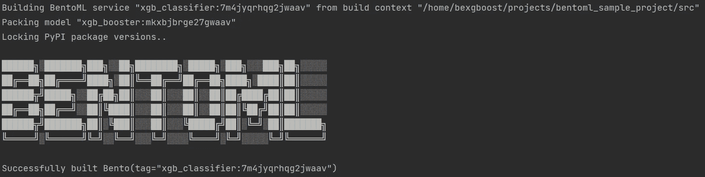

作者图片

您也可以在 CLI 中运行`bentoml list`来检查便当:

如您所见，我的系统上有三个便当，其中两个属于当前项目。有现成的便当意味着我们可以在线部署它。

## 设置 AWS 凭据

因为我们将 API 部署为 AWS Lambda 函数，所以我们必须设置我们的 AWS 凭证。最好的方法是通过 CLI。

首先，转到您的 [AWS IAM 控制台](https://console.aws.amazon.com/console/home)并找到您的凭证。通常可通过按钮“管理访问密钥按钮”获得:

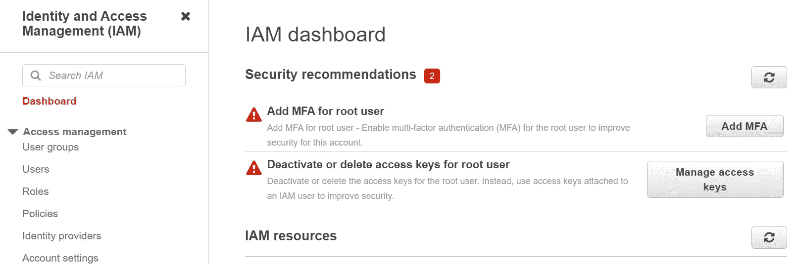

作者图片

点击它，你将到达这里:

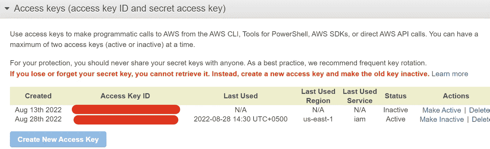

作者图片

创建一组新密钥或下载现有密钥。然后，转到您的终端并运行以下命令:

对于 Linux 或 osX:

对于 Windows:

这将仅为当前虚拟环境设置您的 AWS 凭据。

## 将便当部署到 AWS Lambda

为了部署我们的 Bento，我们将使用 BentoML 的名为`bentoctl`的本地 CLI 包。用`boto3`包安装它(对于 AWS 依赖项)并安装`aws-lambda`操作符。然后，调用`bentoctl init`:

```
$ pip install bentoctl boto3
$ bentoctl operator install aws-lambda
$ bentoctl init
```

该命令将询问您几个问题。您只需要为部署提供一个名称— `xgb_classifier`。您可以将其余部分保留为默认值。

> 部署说明取自`bentoctl`文件上的[这里的](https://github.com/bentoml/aws-lambda-deploy)。

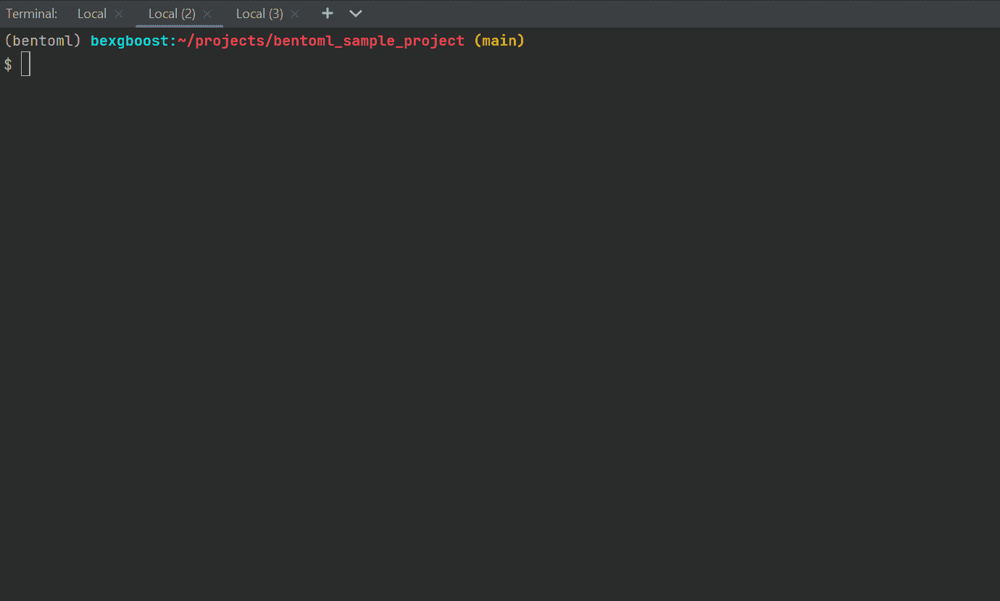

作者 GIF

将创建三个文件— `deployment_config.yaml`、`bentoctl.tfvars`和`main.tf`。他们会喜欢下面的:

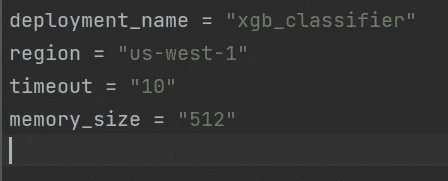

作者图片

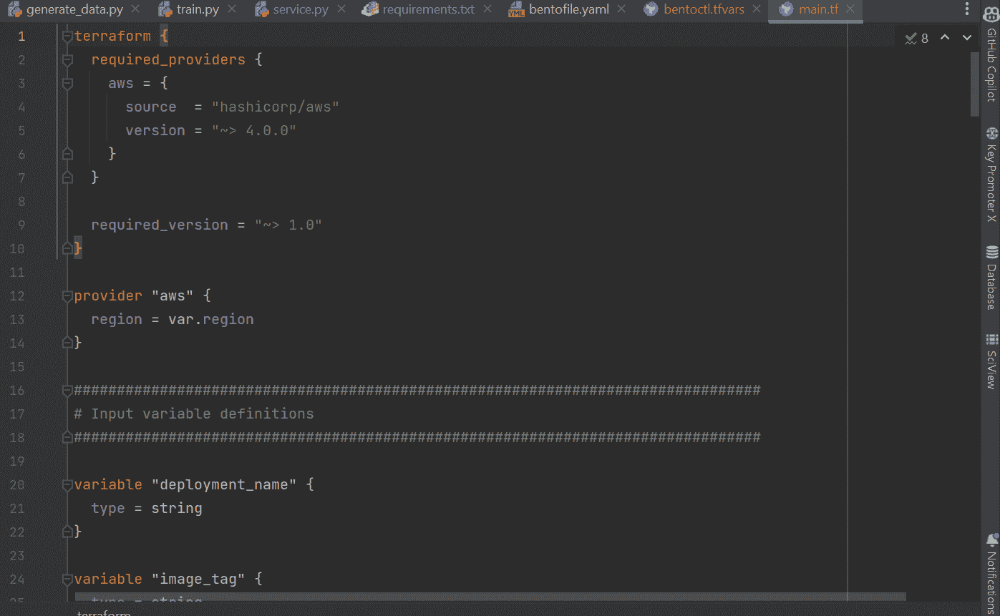

作者 GIF

现在，我们将安装另一个名为`terraform`的工具。Terraform 简化了直接从 CLI 创建和管理云资源。它将使用上述三个文件，主要是`main.tf`文件，该文件列出了我们即将推出的 AWS Lambda 函数的所有细节。

你可以在[找到 Terraform 的安装说明，这里是 Linux 的](https://www.terraform.io/cli/install/apt)。对于其他系统，遵循此处的说明[。要检查安装是否成功，请使用:](https://learn.hashicorp.com/tutorials/terraform/install-cli)

```
$ terraform -h
```

如果它打印出命令列表，则安装成功。

之后，我们用`bentoctl build`命令构建一个 AWS Lambda 兼容的 Docker 映像:

```
$ bentoctl build -b xgb_classifier:latest -f deployment_config.yaml
```

我们添加我们的便当的名称和版本，并通过`deployment_config.yaml`文件指定构建规范。该过程应该如下所示:

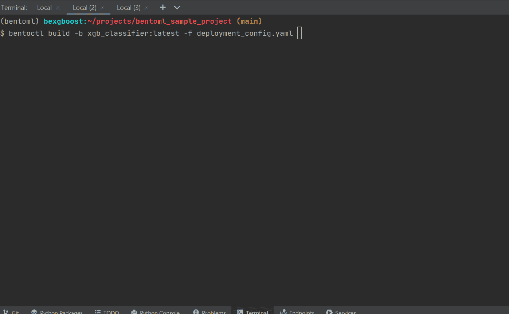

作者 GIF

> 如果您收到`botocore.exceptions.ClientError`，那么 AWS 凭证没有正确设置。再回到那一步。

如果映像构建成功，您应该会看到如下所示的输出:

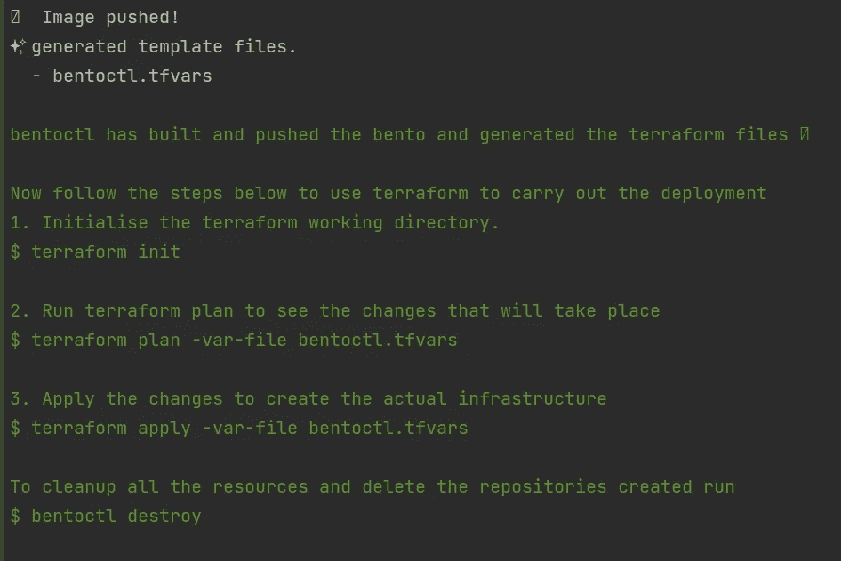

作者图片

最后，我们使用 Terraform 将图像推送到 AWS Lambda 函数。使用以下命令:

```
$ terraform init
$ terraform apply -var-file=bentoctl.tfvars -auto-approve
```

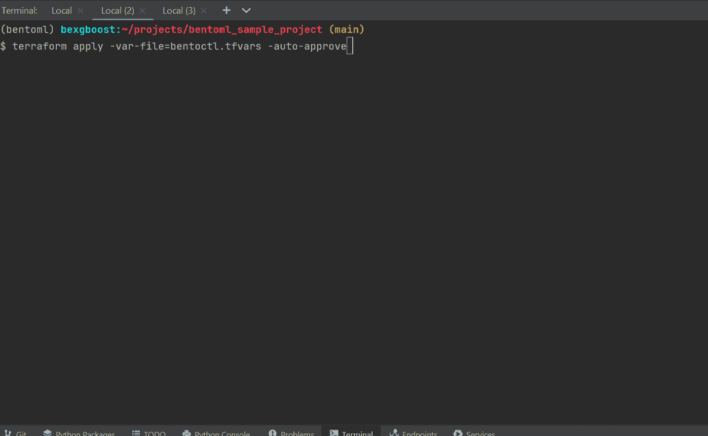

作者 GIF

最后，您将看到下面的消息，它显示了我们部署的 Lambda API 的 URL:

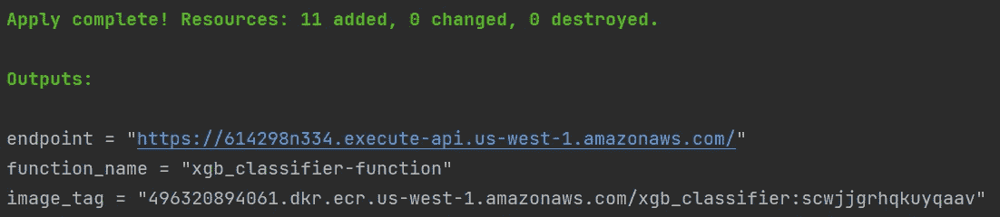

作者图片

显示 UI 需要一段时间，但完成后，当您单击链接时，将会看到 API 文档:

> 第一次启动时，链接会显示一条内部服务器错误消息。忽略它。


作者图片

但是它将立即可用于发送请求和获得预测:

## 结论

唷！考虑到我在开始时说过文章会很简单，这需要很多步骤。但是，由于我们手头有现成的 ML 解决方案，这一切都是值得的。

将模型部署为 API 是让用户与模型交互的最佳方式之一。以 Dalle-E 或 GPT-3 等著名服务为例。两者都是暴露在一个简单的 API 下的大规模模型，并放在一个网站内。使用本文中的技术，您可以创建相同的产品，尽管一开始它们可能不是十亿参数模型。

感谢您的阅读！

<https://ibexorigin.medium.com/membership>  <https://ibexorigin.medium.com/subscribe>  

更多来自我的故事…

</25-advanced-pandas-functions-people-are-using-without-telling-you-b65fa442f0f4>  </25-numpy-treasures-buried-in-the-docs-waiting-to-be-found-60d8e17931cd>  </advanced-tutorial-how-to-master-matplotlib-like-an-absolute-boss-aae2d4936734>  <https://ibexorigin.medium.com/28-weekly-machine-learning-tricks-and-resources-that-are-pure-gems-1-8e5259a93c94>  </the-easiest-way-to-deploy-your-ml-dl-models-in-2022-streamlit-bentoml-dagshub-ccf29c901dac> 