# 面向数据科学家的 GitHub 综合指南

> 原文：<https://towardsdatascience.com/comprehensive-guide-to-github-for-data-scientist-d3f71bd320da>

## 通过 UI 和命令行为数据科学家提供的 GitHub 教程


由
[罗曼·辛克维奇·🇺🇦](https://unsplash.com/@synkevych)从 [Unsplash](https://unsplash.com/photos/UT8LMo-wlyk) 拍摄的图像

本文的目的是向数据科学家/分析师(或任何非工程专业人士)简要介绍如何使用 GitHub 以及应遵循的最佳实践。本教程将包含使用 UI 和命令行(终端)的组合指南。Git 命令的命名约定在 GitHub 提供的平台上是一致的，因此如果您更喜欢使用 Github desktop 或 GitLab 而不是 web UI 或命令行，这些技能应该是可交换的。以下是文章的提纲。

**目录**

*   为什么要用 GitHub？
    -什么是版本控制？
*   创建帐户和 Git 安装
*   创建存储库
    - Git 忽略&环境文件
    -授权访问
*   基础 Git 命令
    -克隆存储库
    -状态
    -添加文件
    -提交文件&提交消息
    -推送变更
    -拉取变更
*   合并冲突
*   检查文件版本历史
*   ReadME.md 的重要性
*   GitHub 背后的直觉
*   结束语
*   资源

# 为什么要用 GitHub？

GitHub 或任何版本控制软件对于任何软件开发项目都很重要，包括那些数据驱动的项目。GitHub 是一个软件，它允许通过一个叫做 Git 的工具对你的项目进行版本控制。它允许用户分发代码、在项目上协作、通过 CI/CD(持续集成/持续部署)帮助项目的部署、恢复到项目的先前版本等等。如果有多个人在同一个项目上合作，那么使用 GitHub 尤其重要。对于行业专业人士和为开源项目做贡献的个人来说，这是一种很常见的情况。

使用 GitHub 不仅从行业角度来看很重要，而且它也是展示你在科技行业求职技能的有力工具。它让潜在的雇主看到你目前拥有的技能水平，你参与过的项目，你编写代码、文档和解决问题的能力。它是许多有抱负的软件工程师、数据科学家、分析师、研究人员等使用的不可或缺的工具。来帮助他们找工作。

## 什么是版本控制？

版本控制本质上就像它的名字一样，你控制着你正在工作的项目的版本。如果您引用许多流行的开源项目，如 Airflow 或 Pandas，当您安装它时，它们有各种相关的版本，每个版本都有不同的实现&在特定的时间点对项目的更改。

# 创建帐户和 Git 安装

创建一个 GitHub 帐户并在命令行上安装 Git 相当简单明了。

你可以进入与 GitHub 相关的[注册页面](https://github.com/join)，用你的邮箱创建一个账户。请注意，如果你是一名学生/有一个学生电子邮件，注册它可以免费访问 GitHub 上的升级计划。

要在命令行上下载 Git，您可以参考下面的[网站](https://git-scm.com/downloads)并下载与您的计算机相关的适当文件。根据提示提供的建议配置下载，应该不会有任何问题。要检查您是否已经在命令行中成功安装了 Git，您可以打开您的命令行/终端并键入`git --version`。这将返回如下内容:

```
git version 2.30.1 (Apple Git-130)
```

这表明 Git 已经成功安装在您的计算机上，现在您可以使用 Git 命令了。

## 将 Git 链接到您的帐户

运行以下命令将允许您通过 Git 连接到您的 GitHub 帐户。

```
git config --global user.email "[you@example.com](mailto:you@example.com)"
git config --global user.name "your name"
```

# 创建存储库

创建 GitHub 资源库有两种方法。您可以在本地计算机上创建一个文件夹并初始化它(通过在命令行中导航到该文件夹并键入`git init`)或者您可以使用 UI 来创建 repo。我将向你展示如何使用 UI，因为它允许你用一个简单的项目模板进行初始化，该模板包括`gitignore`和`README.md`文件。

要创建一个新的资源库，请导航到您的 GitHub 帐户上的资源库部分，然后按下按钮`New`。如果您找不到存储库部分，可以根据您的帐户更新以下 url:

```
[https://github.com/<USER_NAME>?tab=repositories](https://github.com/vatsal220?tab=repositories)
- Replace `<USER_NAME>` with your GitHub username or visit [https://github.com/new](https://github.com/new)
```

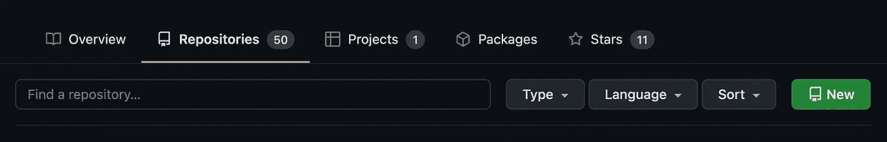

在 GitHub 上创建新存储库的位置。图片由作者提供。

点击`New`，您将被要求提供存储库的名称、描述、隐私设置、自述文件、gitignore 和许可证。您需要填写的唯一必填字段是`Repository Name`。根据您的工作地点，您可能需要为您的项目遵循特定的命名约定。根据经验，您应该将您的存储库命名为您将要工作的项目的缩写描述符。应该简短明了。然而，请注意，有许多流行的开源存储库并不遵循这种命名约定。

明智的做法是提供一个描述，并用 README.md 文件和 gitignore 文件初始化您的存储库。README.md 文件将由您提供的描述组成。我已经为 Python 使用了提供的 gitignore 模板。如果愿意，您也可以添加许可模板。如果你正在做一个开源项目，添加一个许可文件是非常重要的。

> 为了让你的库真正开源，你需要许可它，这样其他人就可以自由地使用、修改和分发软件。
> -[https://docs . github . com/en/repositories/managing-your-repository ys-settings-and-features/customizing-your-repository/licensing-a-repository](https://docs.github.com/en/repositories/managing-your-repositorys-settings-and-features/customizing-your-repository/licensing-a-repository)[1]

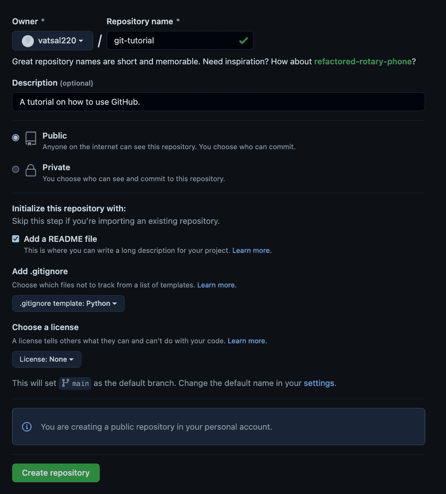

我为本文创建的存储库。图片由作者提供。

准备好后，点击`Create repository`。在创建时，下面应该是你所看到的。

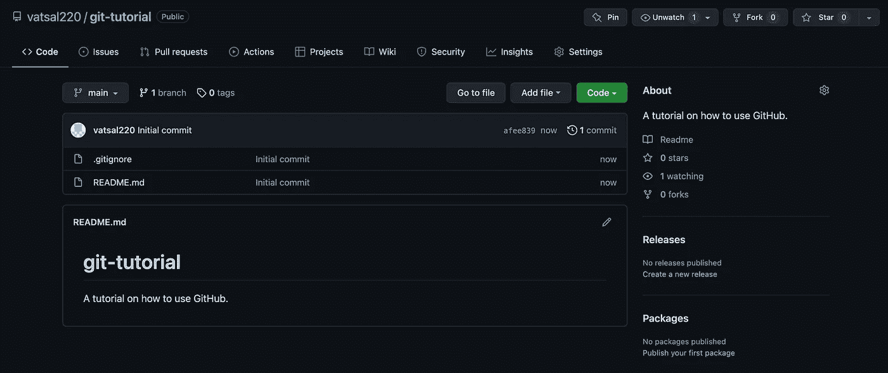

git——使用作者提供的 README.md 和. gitignore. Image 创建的教程存储库。

请注意，每个 GitHub 存储库都有一个空间限制，表明目录的大小不得超过 free & pro 帐户的最大阈值 2GB(根据他们的[文档](https://docs.github.com/en/repositories/working-with-files/managing-large-files/about-git-large-file-storage))。因此，如果您正在处理像机器学习模型或大型 CSV 这样的大文件，不建议将这些结果上传到 GitHub。如果您没有使用 AWS，最好将这些结果上传到您的 S3 桶或等效物中。

## Git 忽略环境文件

`gitignore`文件所做的是忽略特定的文件，不将其推送到 GitHub 存储库。当您在处理包含高度敏感信息的项目时，这一点至关重要，例如包含用户信息、API 凭证、数据库凭证等的 CSV。无论回购是公开的还是私有的，这都是您不希望推送到存储库的信息。

当您在 Python 中使用 API 凭证时，最好使用环境文件。环境文件本质上是一个文本文件，它包含运行项目所需的环境变量的键值对。例如，如果您通过 Python 中的`boto3`连接到 AWS，您将需要 AWS 秘密密钥和 AWS 秘密访问密钥。然后，您将创建一个保存该信息的`.env`文件，如下所示:

```
secret_key='my secret key'
secret_access_key='my access key'
```

你可以通过像`os`和`[python-dotenv](https://pypi.org/project/python-dotenv/)`这样的库在你的代码中访问这个文件。请注意，当您用`gitignore`文件初始化存储库时，它不会自动将`.env`和其他敏感文件包含在其中。这是您必须手动更新的内容。

## 授予访问权限

如果你正在与他人合作，教程的这个部分是非常重要的。在机构工作的时候比较常见。要将一个合作者或一个合作者团队添加到项目中，您首先需要进入该存储库的设置。然后，您可以单击左侧边栏上的协作者选项。最后，您可以通过搜索来添加人员/团队，并邀请他们参与项目协作。

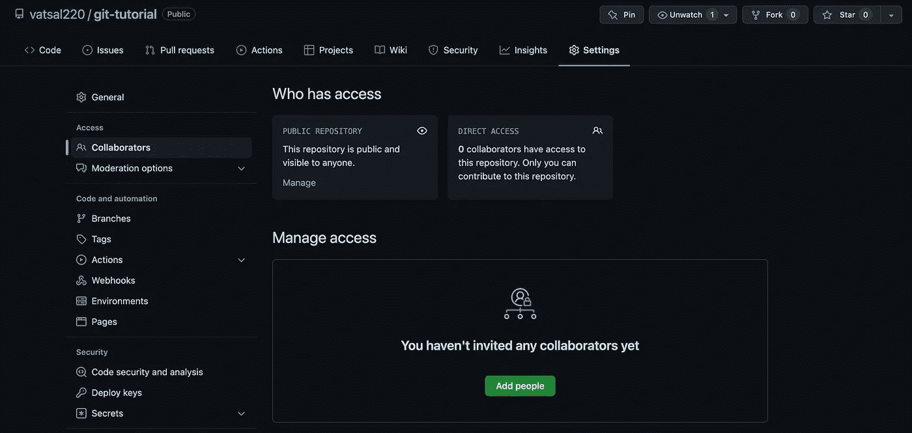

关于如何将协作者添加到存储库中的指南。图片由作者提供。

# 基本 Git 命令

有 6 个基本的 git 命令，每个人都应该知道这是软件的基础。这些命令如下所示:

```
git clone
git status
git add
git commit
git push
git pull
```

请注意，通过使用 UI 或 GitHub 桌面，您可以在不了解这些命令的情况下使用 GitHub 的全部功能。出于本教程的目的，我将向您展示如何通过终端/命令行使用这些命令。

此外，请注意，这些并不是 Git 提供的所有命令，还有更多命令与 UI / GitHub 桌面上产品的各种功能相关联。这些是您在大多数数据驱动项目中需要用到的最基本的方法。

## 克隆存储库

克隆存储库将允许您将存储库的内容下载到本地计算机。要克隆存储库，您需要存储库 URL 或 SSH 密钥。你可以通过点击“代码”按钮找到网址，并把网址复制到 HTTPS 部分(如下所示)。

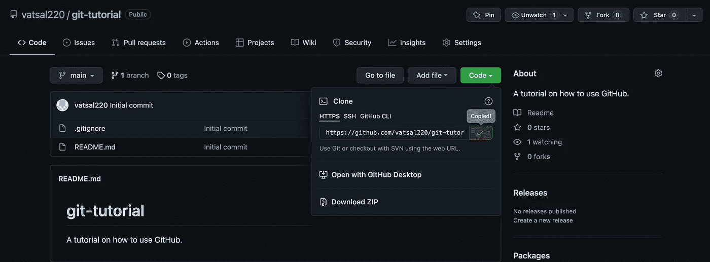

在哪里可以找到存储库 URL。图片由作者提供。

然后导航到您的命令行，您可以在您想要的位置克隆(下载)这个存储库。键入以下命令:

```
git clone <url>
- Where `<url>` is the URL associated with your repository. I'll be running the following command to clone this tutorial.git clone [https://github.com/vatsal220/git-tutorial.git](https://github.com/vatsal220/git-tutorial.git)
```

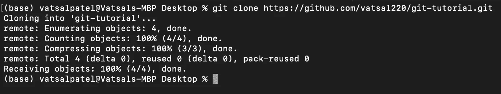

将 GitHub 库克隆到您的本地计算机上。图片由作者提供。

现在您已经成功地克隆了存储库。您应该能够在自己选择的 IDE 中打开它。

## 状态

运行`git status`命令将允许您检查本地目录中所做的更改。它将指示文件已被创建/修改/删除。

我创建了一个名为`test.py`的新文件，其中有一行代码打印 hello world。我还更新了`gitignore`文件，添加了以下内容:

```
# Environment files
.env
```

导航到链接到这个存储库的适当目录后，我可以运行`git status`。以下是您应该看到的结果:

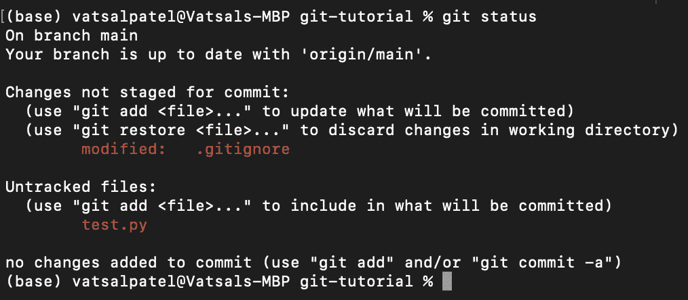

检查目录状态是否有任何文件更改。图片由作者提供。

显示`.gitignore`文件已被修改，`test.py`文件未被跟踪。未跟踪的文件本质上表明它是一个以前在项目中没有见过的新文件。

## 添加文件

随着项目的进展，您可能希望更新您的存储库。这就是`git add`命令允许你做的事情。该命令表示存储库中已经进行了更改。它表示您希望在下一次提交时更新文件。

您可以通过运行以下命令来单独添加文件:

```
git add <file name>
- Where `<file name>` is the name of the file you want to add.git add .gitignore
git add test.py
```

或者，您可以运行以下命令来表明您想要添加对存储库所做的所有更改:

```
git add .
```

添加文件后，您可以再次检查状态。它应该表明这些文件已经被添加并准备好提交。

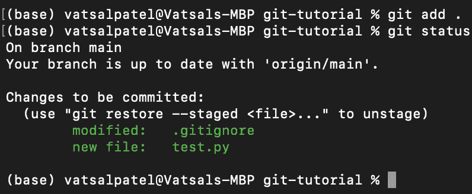

将文件添加到项目后文件的状态。图片由作者提供。

## 提交文件和提交消息

编写好的提交消息对于任何项目都是至关重要的。当你浏览项目的历史，查看进展的不同阶段，看看你以前做了什么，有一个好的提交消息将节省你大量的时间。提交信息应该简短，并且与你对项目所做的改变直接相关。例如，一个错误的提交消息应该是这样的:`updated project`。虽然这是准确的，但它显然不会产生任何有用的信息。一个好的提交消息应该是这样的:`added .env to gitignore and created test file`。

以下是在终端/命令行中编写提交消息的约定:

```
git commit -m "<your message>"
- Replace `<your message>` with the commit message. This message should be in quotes.git commit -m "added .env to gitignore and created test file"
```

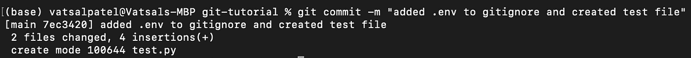

与我添加到项目中的文件相关联的提交消息。图片由作者提供。

## 推动变革

现在，为了让这些更改被记录下来并在 UI 中可见，您需要推送它们。这可以使用`git push`命令轻松完成。

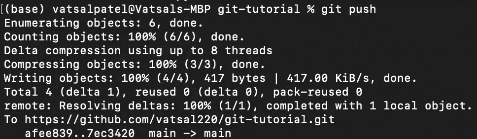

将变更推回存储库。图片由作者提供。

现在检查 UI 中的存储库，您应该看到文件已经被添加/修改。您将看到与更改相关联的最新提交消息以及与最近更改相关联的时间。

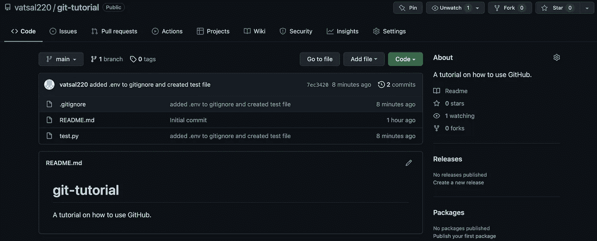

在推送更改后，在 web UI 中显示存储库中的更改。图片由作者提供。

有一个推送内容的最佳实践列表，尤其是当您处理与生产环境相连接的存储库时。对于大多数数据科学家/分析师来说，情况并非如此，因此它不应该太适用于本文的目标受众，但是如果您感兴趣，[这篇文章](https://sourcelevel.io/blog/7-git-best-practices-to-start-using-in-your-next-commit)清楚地概述了最佳实践。我想强调的一个最佳实践是，在开发过程中，您应该定期提交和推动变更。不仅仅是在你完成了文件/项目之后。提交和推送应该是频繁的，并且应该突出项目中的持续变化和进展。

## 拉动变化

类似于我们刚刚将变更推送到我们的存储库，我们也可以拉取其他贡献者所做的变更。最佳实践是在进行新的开发之前检查存储库，查看项目是否有任何变更，如果有变更，那么将变更提取到您的本地存储库。

例如，如果我让这个项目的另一个贡献者创建一个名为`setup.py`的新文件，那么我可以运行`git pull`命令来指示执行一个拉请求。运行以下命令将允许您获取其他贡献者对存储库所做的更改。

```
git pull origin main
- The word `main` reflects the name of the branch I am pulling from. Unless you've created a new branch, the name of the current branch you're working on will either be `main` or `Master`.
```

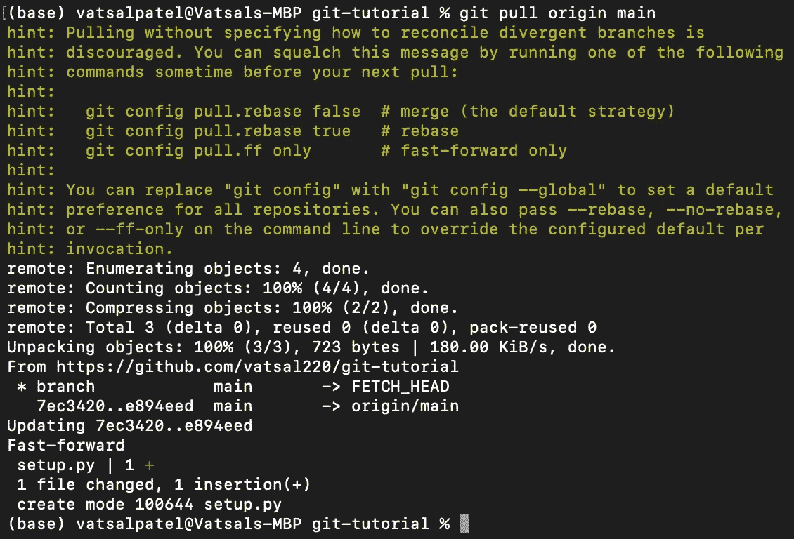

提取其他贡献者对存储库所做的更改。图片由作者提供。

# 合并冲突

当有多个合作者时，GitHub 中的冲突是很常见的。当多个合作者更改与同一文件相关联的代码时，会发生合并冲突。Git 无法识别哪个版本的代码是正确的，因此解决这个问题的唯一方法是通过手工检查每个合作者所做的更改。合并分支时，这些冲突很常见。

# 检查文件版本历史

您可以通过查看提交历史来检查与文件相关联的版本历史。这将允许您查看与该文件相关的代码中的差异。它将显示添加的内容(以绿色突出显示)和删除的内容(以红色突出显示)。要导航到提交历史，请单击下面以蓝色突出显示的提交按钮。

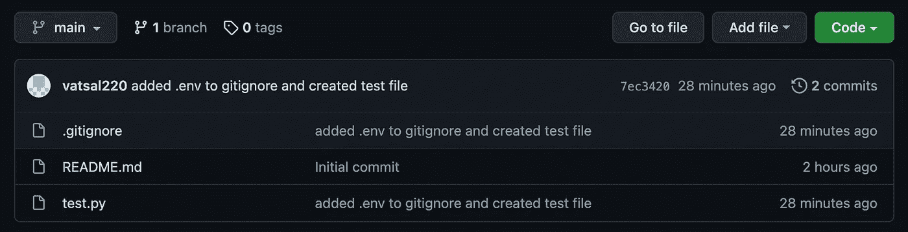

导航到与项目关联的提交历史记录的指南。单击提交按钮。图片由作者提供。

这会将您带到一个页面，该页面包含提交、时间戳和提交消息的列表。您可以导航到任何提交，并查看与该推送相关的项目中的差异。

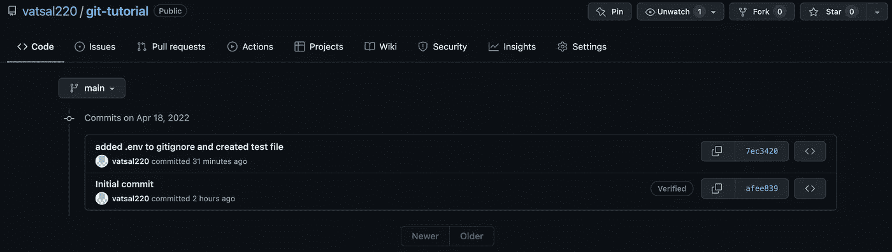

与项目关联的提交历史记录。图片由作者提供。

正如您在下面看到的，与我们刚刚推送的提交消息相关联。它包括对`.gitignore`和`test.py`文件所做的更改。用绿色突出显示(在右手边),这表明我们向 gitignore 添加了`.env`,向测试脚本添加了`print("hello world")`。在左侧，我们可以看到这些文件在包含这些更改之前的样子。

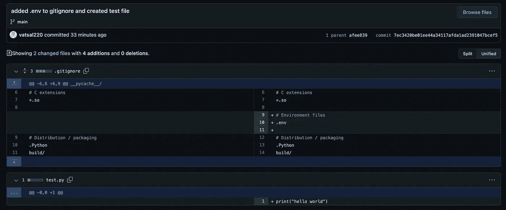

与提交相关的版本差异。图片由作者提供。

正如本文开头所指出的，这是 GitHub 最重要的方面之一，也是它如此有用的原因。

# ReadME.md 的重要性

通常，当用户导航到一个新项目时，自述文件是开发人员浏览的第一个文件。这个文件应该提供关于项目的上下文信息，以及如何运行适当的脚本/复制结果。如果复制结果需要环境文件和环境变量，自述文件应该明确指出这一点。如果没有自述文件，对于不熟悉该项目的人来说，找出如何重现从中生成的结果就变得很麻烦。

下面这个由 [othneildrew](https://github.com/othneildrew) 创建的存储库包含一个[模板](https://github.com/othneildrew/Best-README-Template)用于一个优秀的自述文件。请随意查看并将其用于您的项目。

# GitHub 背后的直觉

让我们围绕 GitHub 背后的直觉来结束这篇文章，因为现在您应该熟悉它的基本命令和大多数最佳实践。您可以将每个 GitHub 存储库想象成一个图，其中初始节点是与其相关联的第一个提交。那么每一个进行中的提交都会用一个新的节点来扩展该图，本质上是将以前版本的存储库连接到当前版本。查看与项目相关的版本历史与识别一个节点相对于另一个节点所做的更改是一样的。

在存储库中创建一个新的分支与向图中的最新节点添加一个新的叶子是一样的。该新叶可以通过分支中的附加提交和推送来扩展。合并回初始流程，您将会把新开发的分支中的变更合并到初始分支中。下面可以直观地看到整个过程:

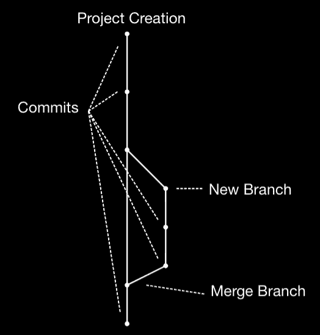

与 GitHub 存储库相关的示例树结构。图片由作者提供。

# 结束语

本教程中没有提到各种命令。`git log`和`git diff`仅举几个例子。在我看来，学习新事物的最好方法是投入进去，亲自尝试。使用 UI、GitHub Desktop、Git 和其他资源来完成你正在做的项目。这将极大地提高你的技能和未来合作的能力。Git 是一个文档非常丰富的资源，如果你感到困惑或者只是好奇，我强烈推荐你访问他们的[网站](https://git-scm.com/doc)。

在我的 GitHub 页面[这里](https://github.com/vatsal220/git-tutorial)，你可以随意查看与本教程相关的资源库。

如果你想转型进入数据行业，并希望得到经验丰富的导师的指导和指引，那么你可能想看看最敏锐的头脑。Sharpest Minds 是一个导师平台，导师(他们是经验丰富的实践数据科学家、机器学习工程师、研究科学家、首席技术官等。)将有助于你的发展和学习在数据领域找到一份工作。点击查看它们[。](https://www.sharpestminds.com/?r=vatsal-patal)

# 资源

*   [1][https://docs . github . com/en/repositories/managing-your-repository ys-settings-and-features/customizing-your-repository/licensing-a-repository](https://docs.github.com/en/repositories/managing-your-repositorys-settings-and-features/customizing-your-repository/licensing-a-repository)

如果你喜欢读这篇文章，我写的其他文章你可能也会喜欢。

[](/active-learning-in-machine-learning-explained-777c42bd52fa)  [](/text-similarity-w-levenshtein-distance-in-python-2f7478986e75)  [](/text-summarization-in-python-with-jaro-winkler-and-pagerank-72d693da94e8)  [](/link-prediction-recommendation-engines-with-node2vec-c97c429351a8)  [](/word2vec-explained-49c52b4ccb71)  [](/recommendation-systems-explained-a42fc60591ed)  [](/random-walks-with-restart-explained-77c3fe216bca)  [](/bayesian-a-b-testing-explained-344a6df88c1a) [## 贝叶斯 A/B 测试解释

towardsdatascience.com](/bayesian-a-b-testing-explained-344a6df88c1a)