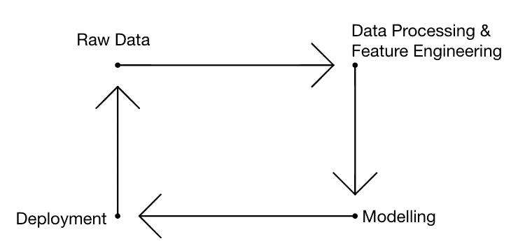
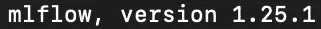
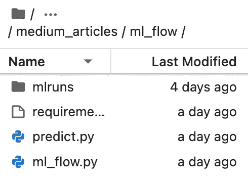
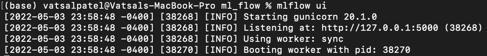
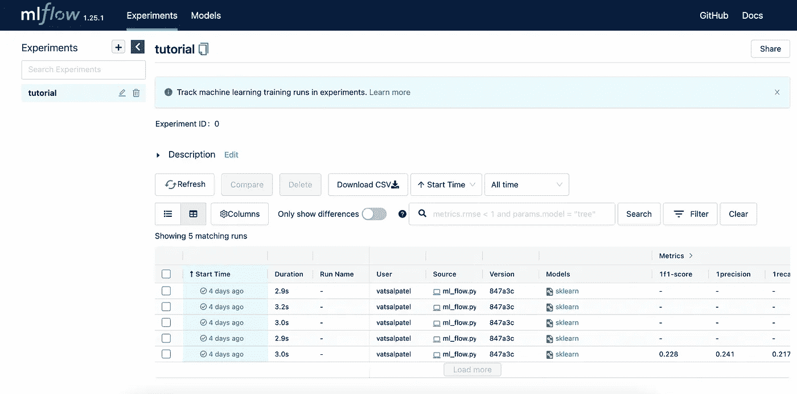
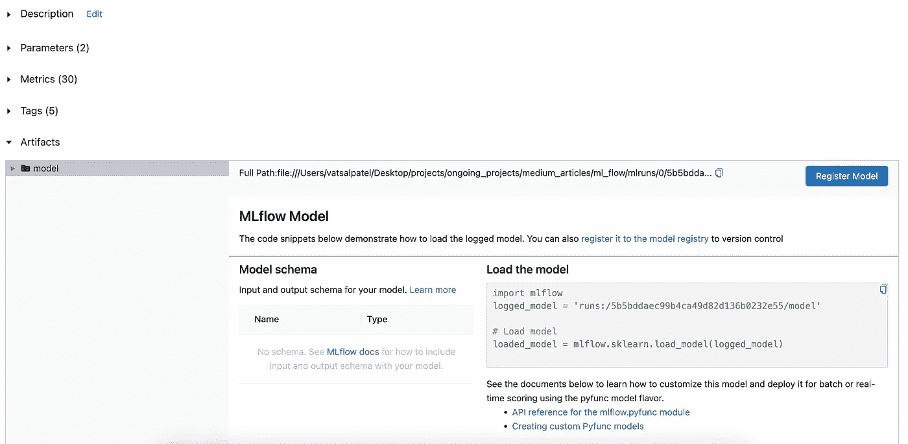
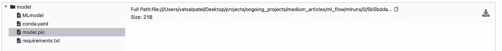

# MlFlow 综合指南

> 原文：<https://towardsdatascience.com/comprehensive-guide-to-mlflow-b84086b002ae>

## 使用 ML Flow 跟踪数据科学项目的 ML 工作流


图片由[麦特·哈迪](https://unsplash.com/@matthardy)从 [Unsplash](https://unsplash.com/photos/6ArTTluciuA) 拍摄

从事数据科学项目时的一个常见问题是，随着您运行越来越多的实验，跟踪您的机器学习模型的性能。 [MLFlow](https://mlflow.org/docs/latest/quickstart.html) 是一个开源的 Python 库，帮助开发者跟踪与各种应用相关的各种实验，包括但不限于经典机器学习、自然语言处理、推荐系统、时间序列分析等。本文将提供一个深入的教程，介绍如何使用 MLFlow 来优化项目的实验组件。以下是文章的结构:

## 目录

*   机器学习工作流
*   什么是 MLFlow？
    -跟踪
    -项目
    -模型
    -注册
*   装置
*   教程
    -需求
    -预测脚本
    -使用 MLFlow 更新预测脚本
*   MLFlow GUI
*   结束语
*   资源

# 机器学习工作流

机器学习工作流程通常由 4 个步骤组成。首先是原始数据，然后是数据预处理和特征工程，接着是模型开发，最后是部署。可以想象，这个生命周期是一个由许多要运行的实验组成的迭代过程。MLFlow 的重点主要放在模型开发上，您希望将性能最好的模型推向生产。即使选择并部署了最佳模型，最好的做法是引入一个监控系统来跟踪模型的性能，以确定何时需要重新培训。每个数据科学项目都会出现这种迭代过程，当个人同时从事多个项目时，或者当您稍后重新访问一个项目时，很难跟踪/调整这一过程。这就是机器学习工作流棘手和困难的原因，MLFlow 有助于解决上面提到的许多痛点。



机器学习生命周期。图片由作者提供。

# 什么是 MLFlow？

MLFlow 是一个开源库，帮助数据和研究科学家优化他们的机器学习工作流程。它由 4 个部分组成，跟踪，项目，模型和模型注册。该工具旨在与任何流行的开源机器学习库结合使用，包括 Sci-Kit Learn、PyTorch、Keras、TensorFlow 等。该库的使用有助于数据驱动的研究人员和科学家使他们的项目可被他人复制和重用。

## 跟踪

MLFlow 的跟踪组件指的是在构建机器学习管道时记录参数、性能/其他指标、版本和其他工件[1]。当进行大量实验时，以有效的方式跟踪与每个实验相关的参数和性能指标对于识别最佳性能参数至关重要。该组件易于设置，并与笔记本和脚本兼容。MLFlow 的跟踪功能是连接 MLFLow 其他组件的基础。

## 项目

MLFlow 的这一组成部分旨在帮助其用户实现与他们正在进行的项目相关的再现性。将该组件与 GitHub 等[版本控制软件结合使用，可以最大限度地发挥其功能。将此组件与 MLFlow 跟踪结合使用，将允许 MLFLow 记住项目版本和所有跟踪的参数[1]。该组件将其结果保存在一个通常称为`mlruns`的文件夹中，该文件夹由 MLFlow 创建。这个文件夹可以被推送到你的 GitHub 库，因为它不应该包含任何敏感信息。](/comprehensive-guide-to-github-for-data-scientist-d3f71bd320da)

## 模型

MLFlow 的建模组件指的是已开发模型的打包以及与它们相关的辅助部署。它兼容各种基于云的工具，包括 Azure、AWS (SageMaker)，以及 Docker 和 Airflow 等服务。它允许将模型保存并加载为`.sav`或`.pkl`文件，以供日后参考使用。

## 登记处

MLFlow 的注册组件旨在帮助管理 MLFlow 生命周期。

> 它提供了模型沿袭(MLflow 实验和运行产生了模型)、模型版本化、阶段转换(例如从阶段转换到生产或归档)和注释。
> 【1】[https://www.mlflow.org/docs/latest/concepts.html](https://www.mlflow.org/docs/latest/concepts.html)

# 装置

MLFlow 的安装过程非常简单，您可以依靠 pip 并在您的终端/命令行中运行`pip install mlflow`，或者转到他们的 [GitHub 存储库](https://github.com/mlflow/mlflow)并将其克隆到您的本地计算机上。安装后，您可以在终端/命令行中运行命令`mlflow --version`来确认它已经安装在本地。



用于本教程的 MLFlow 版本。图片由作者提供。

# 辅导的

我将概述如何使用 MLFlow 更新现有的模型训练过程。

## **要求**

我正在使用的 Python 的当前版本是 3.8.8，在本教程中需要以下软件包:

```
mlflow=1.25.1
numpy=1.20.1
sklearn=0.24.1
```

## 预测脚本

上面的代码显示了如何构建一个梯度推进分类器来预测用户的年龄范围。该脚本将自动生成随机数据集，训练模型并评估模型的性能。

## 使用 MLFlow 更新预测脚本

上面的脚本显示了包含 MLFlow 功能的预测脚本的更新。使用了几个不同的函数:

1.  `mlflow.start_run`
    该功能指示新运行的开始，它将跟踪指标和参数。如果您想要引用一个现有的运行，那么您可以传递与该运行相关联的`run_id`。
2.  `mlflow.log_metric`
    该功能将记录当前活动运行下的一个指标。在上面的脚本中，我们记录了训练模型后生成的准确性指标。
3.  `mlflow.log_param` 该功能将记录当前正在运行的参数。在上面的脚本中，我们记录了用于训练模型的参数。
4.  `mlflow.sklearn.log_model`
    记录当前运行下的 scikit-learn 模型。在上面的脚本中，我们将 GradientBoostingClassifier 模型保存为 sklearn 模型。
    **注:**ml flow 支持的其他流行的机器学习库还有很多。这些库包括 TensorFlow、PyTorch 等。

MLFlow 内置了上面没有提到的各种其他函数。这些是用于任何通常的分类/回归相关管道的主要指标。MLFlow 确实为各种人工智能领域提供了相当广泛的支持，包括推荐系统、计算机视觉、自然语言处理等。

运行更新的脚本将在目录中创建一个名为`mlruns`的新文件夹，该文件夹将保存记录的值、模型等。对于每次运行。这允许您在给定一些特定参数的情况下比较哪些运行具有更好的结果。



本地目录中 mlruns 文件夹的位置。图片由作者提供。

您可以手动检查文件夹，也可以通过 GUI 查看结果，GUI 有一个很棒的 UI。

# MLFlow GUI

要初始化贵由，只需在终端/命令行中运行命令`mlflow ui`。应该出现的是一个到本地主机服务器的链接，该服务器保存着与每次运行相关联的日志模型、参数和指标。



MLFlow GUI 的初始化。图片由作者提供。

转到链接`http://127.0.0.1:5000`将引导您进入以下页面:



MLFlow GUI。图片由作者提供。

点击任何一次运行，您将进入以下页面:



MLFlow GUI 显示参数、度量、模型等。图片由作者提供。

您可以比较所有运行的参数和指标，因为我们已经记录了模型，所以我们也获得了关于如何为未来的管道加载和使用模型的相当多的信息。模型是一个下拉菜单，包括模型信息、与 conda 环境相关的 yaml 文件、模型和需求的可下载 pickle 文件。



GUI 中的模型分解。图片由作者提供。

这可能是这个模块最有用的特性之一。在比较结果以查看哪个模型具有最佳准确性之后，我们可以轻松地下载与最佳性能相关联的模型。然后，这个模型可以很容易地输入到与项目相关的生产管道中。

# 结束语

本教程展示了如何使用 MLFlow 更新现有的模型训练和预测管道，以跟踪各种参数、指标和日志模型。它有助于与用户相关的机器学习生命周期，因为记录实验结果更加有效和容易。

请在我的 GitHub 页面[这里](https://github.com/vatsal220/medium_articles/tree/main/ml_flow)查看与本教程相关的资源库。

如果你想转型进入数据行业，并希望得到经验丰富的导师的指导和指引，那么你可能想看看最敏锐的头脑。Sharpest Minds 是一个导师平台，导师(他们是经验丰富的实践数据科学家、机器学习工程师、研究科学家、首席技术官等。)将有助于你的发展和学习在数据领域找到一份工作。在这里查看。

# 资源

*   [1]https://www.mlflow.org/docs/latest/concepts.html

如果你觉得读这篇文章有用，这里是我写的其他文章，你可能也会觉得有用。

</comprehensive-guide-to-github-for-data-scientist-d3f71bd320da>  </recommendation-systems-explained-a42fc60591ed>  </active-learning-in-machine-learning-explained-777c42bd52fa>  </text-summarization-in-python-with-jaro-winkler-and-pagerank-72d693da94e8>  </text-similarity-w-levenshtein-distance-in-python-2f7478986e75>  </word2vec-explained-49c52b4ccb71>  </link-prediction-recommendation-engines-with-node2vec-c97c429351a8>  <https://pub.towardsai.net/community-detection-with-node2vec-6cd5a40c7155> 