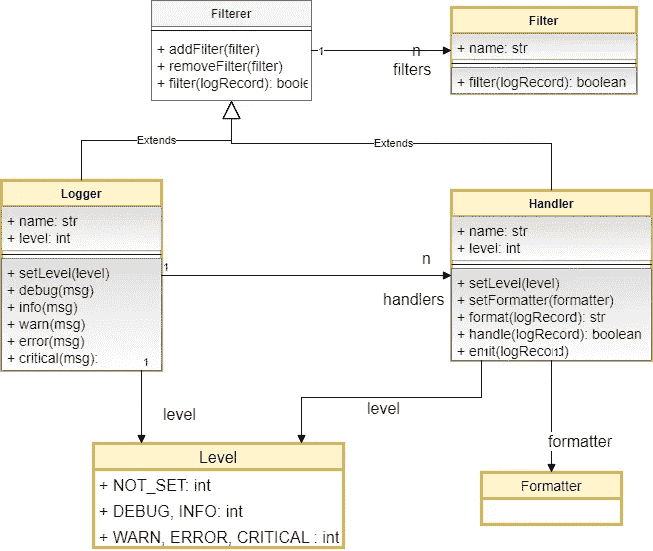
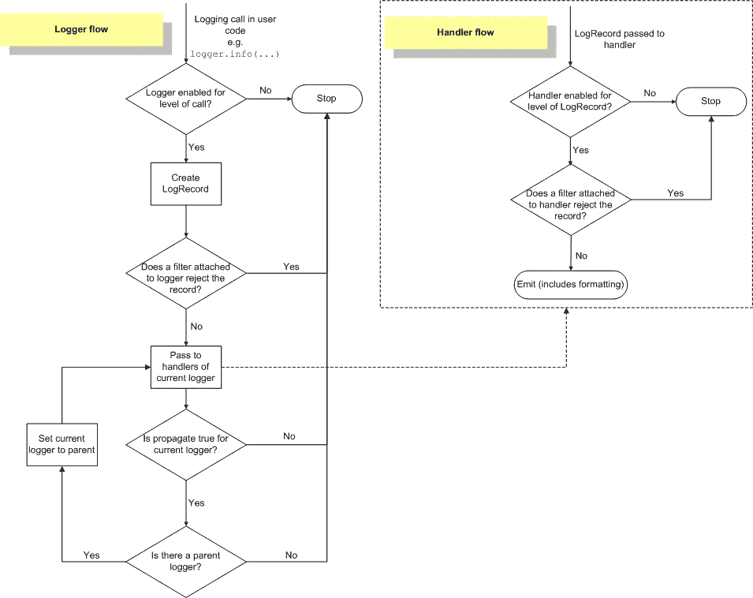

# 真实世界中 Python 日志的综合指南第 1 部分

> 原文：<https://towardsdatascience.com/comprehensive-guide-to-python-logging-in-the-real-world-part-1-8762d5aa76da>

## 基础知识、生命周期、层次结构、陷阱和最佳实践


照片由 [Unsplash](https://unsplash.com?utm_source=medium&utm_medium=referral) 上的 [Dariusz Sankowski](https://unsplash.com/@dariuszsankowski?utm_source=medium&utm_medium=referral) 拍摄

Python *日志*模块是现实生活中日志记录的首选机制。它使用起来非常简单，但是当日志失败时，很难理解为什么，除非你完全理解生命周期和细微差别。在本系列的第一部分中，您将从逻辑上理解日志模块的内部工作方式——层次结构、生命周期和工作方式，以及支持理解的小代码片段。那些有可能让你的生活变得痛苦的陷阱都在前面列出来了。在第二部分中，您将了解 python 日志记录的首选使用模式、各种日志记录配置方法，以及最重要的是，如何有效地使用日志记录进行异常处理，最后一部分将介绍典型应用程序堆栈中 python 异常处理的最佳实践。事不宜迟，我们从一个哲学问题的简短答案开始:既然有方便的 *print* ()为什么要进行日志记录，然后直接跳到所有日志记录操作的中间。

# 为什么要伐木

想象一下，一个被数百或数千并发用户访问的多用户应用程序使用 *print* ()方法向 stdout 发送定制的消息。以下是关于 *print* ()的潜在问题以及 python 日志记录如何解决这些问题。

1.  **对日志消息持久性的控制**:传统系统没有人看 *print* ()发送到 stdout/stderr 的输出。这些消息可能会凭空消失，或者没有机制在以后的某个时间点检索它们以进行分析和故障排除。Python 日志让我们透明地将消息发送到不同的持久目的地(比如一个文件)，而不影响用户在应用软件中调用的底层 API。软件开发者仍将继续调用 *logger.info* ()、 *logger.warn* ()等。但是消息会到达不同的目的地。[这种对使用 *print* ()的反对现在已经不太相关了，因为现代应用程序堆栈使用 docker、AWS redirect stdout 等容器。到选择的目的地—分别是 json 或纯文本日志文件和 cloudwatch 日志]
2.  **细粒度控制** : *打印*()输出没有严重性概念的普通文本。Python 日志记录具有内置的六级日志消息严重性概念和定制选项。该控件有助于从日志文件中过滤具有特定或更高严重性的日志消息，并忽略较低严重性的消息。
3.  **功能性和非功能性方面的分离**:如果我们想将一个非常冗长的模块的输出限制为只有警告和错误消息，而没有代码中根深蒂固的 if-else 块，那么就没有办法使用 *print* ()。使用 python 日志模块，可以在应用程序之外对其进行声明式控制。一般来说，非功能方面与功能关注点是正交的，应该在功能软件之外一起处理。优雅架构的这一方面是日志模块的核心设计目标。
4.  **分离内容和方式** : Python 日志记录是分离内容(记录)和方式(记录)的理想解决方案。如果仅仅是为了*打印*()，第三方库将无法登录到通常由应用软件在连接应用程序时使用库决定的不可预见的目的地。
5.  **特定于环境的日志**:一个软件开发团队可能想要在不同的环境中记录不同的级别。例如，您可能希望在开发环境中看到调试和信息消息，而在生产环境中关闭它们可能是更好的选择。Python 日志中的声明性日志配置工具允许在不修改代码的情况下实现这一目标。
6.  **在日志中捕获用户上下文**:我们通常想知道日志消息出现的时间。有时，知道哪个模块发出了某个日志消息对调试很有帮助。在多用户场景中，拥有线程 id、会话 id 等可以节省大量时间。在日志消息中，从数百万个日志行中隔离出实际错误的执行路径。这类似于众所周知的从干草堆里挑针的能力。
7.  **日志文件的旋转和归档**:海量的日志文件很难读写。日志模块允许轻松地控制文件的大小，在特定大小或特定时间滚动文件，并存档旧日志。这些铃声和口哨声对故障排除非常有帮助，并且经常用于举几个例子。
8.  **商业智能**:具有上述所有特性的经过深思熟虑的日志记录策略有助于生成关于软件使用情况的统计数据，检测异常情况，并消除安全事故。

好吧。为什么说得够多了。让我们继续讨论什么和如何做。

# 用伐木机把你的脚弄湿

开始记录很容易。只需使用*日志*中的内置方法之一——无论是*调试*()、*信息*()、*警告*()、*错误*()、*关键*()。下面的代码将消息`This is a warning`打印到控制台。

```
import logging

logging.warning("This is a warning") # prints message - This is a warning
```

然而，这不是你如何使用它。我们永远不会想直接从*日志*模块调用日志功能。我们总是先获得一个 *Logger* 对象，然后使用它进行日志记录，如下面的代码片段所示。

```
logger = logging.getLogger() # gets the root logger
logger.error("This is an error") # prints message - This is an error

# gets the logger with name mylogger
named_logger = logging.getLogger("mylogger")
named_logger.critical("Very critical") # prints message - Very critical
```

在上面的代码片段中可以看到两种风格的 *getLogger* ()。

1.  不带任何参数的函数返回根日志记录器——原始日志记录器，即使没有显式配置也存在，并且在加载日志记录模块时可用。
2.  随后的变化按需创建一个名为`mylogger`的记录器。如果名为`mylogger`的记录器已经存在，那么返回对那个预先存在的*记录器*的引用。

虽然*记录器*是一个类，可以直接实例化，但是强烈建议不要这样做，原因有二:

1.  我们希望日志模块能够控制日志程序的生命周期(比如使用最后的日志处理程序等等)。—关于这一点的更多信息可以在本文后面找到)
2.  我们希望 python 运行时通过在全局字典中保留日志的引用来重用日志

> **最佳实践**:应用程序和模块不应该使用根日志记录器直接记录。应为应用程序和模块配置特定的记录器。

# 日志记录级别

根据日志消息的严重性定义了五个日志记录级别。它们分别对应于五个*记录器*方法*调试*()、*信息*()、*警告*()、*错误*()、*关键*()，数值分别从 10 到 50，以调试<信息<警告等等。日志级别表示消息的重要性(或严重性)。

使用 Logger.setLevel()方法将日志级别分配给记录器，如下所示:

```
# gets the logger with name mylogger
named_logger = logging.getLogger("mylogger")
named_logger.setLevel(logging.WARN)

named_logger.warn("I am warning you") # prints message - I am warning you

named_logger.info("FYI") # this is not printed
```

分配给记录器的级别充当严重性标记阈值。任何记录低严重性消息的尝试都会被忽略。在上面的代码片段中，记录器级别被设置为 WARN。因此，记录器将打印严重性至少为 WARN(或更高)的消息。严重性较低的消息，即调试和信息被忽略——就好像它们从未被调用过一样。

如果记录器上没有设置级别，那就太意外了！它的默认日志记录级别是 NOT_SET，数值为 0，不会记录任何消息。

**突击测验**:在这篇文章的前两个代码片段中，我们从未设置任何明确的日志级别，但是警告日志消息被打印出来。您可能认为这可能是因为默认的日志级别是 WARN。然而，这与我之前的默认日志级别= NOT_SET 的说法相矛盾。这是交易。的确，WARN 是 root logger 的默认日志级别，但不是其他日志级别。这个第 22 条军规的完整答案需要等到你读到这篇文章中关于日志层次结构的部分，以及有效日志级别的概念。坚持住！

## 自定义级别

Python 日志作为一个可扩展的模块，允许您定义自己的级别。但是它们在大多数情况下是不必要的，因为现有的级别是根据以前的使用情况选择的。但是，如果您觉得需要自定义级别，以下是添加自定义级别的快速方法。优选地，在任何日志记录开始之前，将该代码放置在应用引导逻辑中

```
import logging
FATAL_LEVEL_NUM = 60
logging.addLevelName(FATAL_LEVEL_NUM, "FATAL")
def fatal(self, message, *args, **kwargs):
    if self.isEnabledFor(FATAL_LEVEL_NUM):
        self._log(FATAL_LEVEL_NUM, message, args, **kwargs) 

logging.Logger.fatal = fatal

# Now you can use the fatal
named_logger = logging.getLogger("mylogger")
named_logger.setLevel(logging.WARN)
named_logger.fatal("A fatal error indeed")
```

> **最佳实践**:如果您正在开发 python 库，尤其是供其他应用程序使用的第三方库，而您事先并不知道，那么尽可能避免在库中定义和使用自定义日志级别。自定义级别的语义有待解释，并影响分配的数字级别。这会导致库之间的混乱以及库和使用自定义级别的应用程序之间的摩擦。

# python 日志的四大支柱

日志模块有四个主要的逻辑组件:记录器、处理器、过滤器和格式化程序。

1.  Logger 为应用程序代码提供了启动日志记录的函数。对于提供的每条日志消息，Logger 都会创建一条日志记录，并将其发送给相关的处理程序。记录器与一个日志记录级别相关联。记录器是日志记录的必要组成部分。
2.  每个处理程序对应一个日志目的地。对应于多个目的地(文件、控制台等),可以将多个处理程序附加到一个记录器。).处理程序还与日志记录级别相关联(除了日志记录器中的级别之外，用于更好地控制每个目的地是否接收/忽略日志消息)。记录器必须至少有一个处理程序
3.  过滤器是一个可选的工具，用于应用细粒度的逻辑来确定是处理还是丢弃日志记录。我们可以将日志记录级别看作是粗过滤器，决定日志记录器/处理程序是否接受日志消息。就像级别一样，过滤器可以与记录器及其处理程序相关联。
4.  格式化程序指定输出中的日志消息的布局，并输出到目的地。自然，它是一个只与 Handler 相关联的构造。



图一。UML 图显示了日志模块的重要组件(图片由作者提供)

上面的图 1 捕获了 UML 图中所有四个重要的组件。如果你不懂 UML，没关系。你还是可以直观的跟着箭头走，感受一下关系。

1.  记录器和处理程序都扩展了一个公共的父类。由于这种继承，记录器和处理程序都持有一个过滤器集合(零个或更多)。
2.  记录器持有一个处理程序集合(零个或多个)
3.  可以在记录器和处理程序上设置日志记录级别
4.  处理程序只有一个格式化程序来格式化日志消息

**突击测验**:为什么在记录器和处理器上都有设置记录级别的选项？在 Logger 上设置日志级别的选项还不够吗？下面标题为“层级感知日志记录生命周期”一节中的最佳实践回答了这个问题。

## 简化的日志生命周期

既然我们已经理解了日志模块的重要结构组件，我们可以在层次结构中的固定级别上跟踪它们的交互。下一节将全面讨论层次感知交互。把这一部分当成是之后正餐的开胃菜。图 2 显示了当应用程序试图记录警告级别的消息时的流程。记录器、处理程序、过滤器和格式化程序在流中的角色是不言自明的。


图二。不考虑层级的简化日志记录过程(图片由作者提供)

> **最佳实践**:尽管可以在记录器及其相应的处理程序上设置日志记录级别，但最好在记录器上设置级别，而不要在处理程序上设置日志记录级别。当一个记录器有多个附加的处理程序，并且我们希望每个处理程序(目的地)只记录来自记录器的消息的一个子集时，在处理程序上设置日志记录级别的选项是最有益的。例如，如果记录器级别设置为 INFO，并且有两个附加的处理程序(记录到 consile . sys . stderr 的流处理程序)和一个 FileHandler，并且我们只想在文件中记录错误消息，那么我们保留 Stream Handler 的级别不变，但是将 FileHandler 的级别设置为 error。

# 日志记录层次结构

Python 记录器形成了一个层次结构。根日志记录器位于层次结构的顶端。任何用名称 say `myapp`创建的记录器都是根记录器的子记录器。名为`myapp.mymodule`的记录器是`myapp`记录器的子代。

Logger 有一个重要的属性叫做 *propagate* 。默认情况下，其值为`True`。

1.  为 True 时，所有子记录器将日志消息传递给其祖先记录器的处理程序，通常向上传播到根记录器，在根记录器中配置了大多数处理程序。
2.  当 propagate 设置为 False 时，子记录器仅将日志消息传递到其值设置为 False 的祖先记录器(或根记录器，以较早者为准)。

> **最佳实践**:最好为大多数记录器保留默认值 propagate = True，并且只为某些顶级记录器、propagate = False 的记录器和根记录器配置处理程序。在没有显式处理程序的情况下，根据需要为每个模块创建子记录器。

```
app_logger = logging.getLogger("myapp")
module_logger = logging.getLogger("myapp.mymodule")
class_logger = logging.getLogger("myapp.mymodule.myclass")
print(app_logger.parent) # prints root
print(module_logger.parent) # prints myapp
print(class_logger.parent) # prints myapp.mymodule
```

## 注意点标记层次结构中那些缺失的父代

如前所述，名为`myapp.mymodule`的 logger 是`myapp` logger 的子代。然而，有一个问题。这假设了`myapp`记录器的存在。如果从未创建过`myapp`记录器，那么记录器`myapp.mymodule`将被创建为根记录器的子记录器！

```
class_logger = logging.getLogger("myapp.mymodule.myclass")
print(class_logger.parent) # prints root !!!
```

## 支持层次结构的日志生命周期

有了简化的日志生命周期和日志层次结构的知识，使用 [Python 日志高级教程](https://docs.python.org/3/howto/logging.html#logging-advanced-tutorial)中的图表就不难理解完整的生命周期。



图二。层级感知完整日志生命周期(图片来自 Python 日志高级教程)

1.  和以前一样，日志生命周期始于记录器接收到在适当级别记录消息的请求。
2.  记录器确定是否可以继续执行指定的记录级别阈值，然后检查配置是否过滤了绿色信号。到目前为止一切顺利。然而，在这一点上，由于 propagate 被设置为 True，所以向前的流程略有不同
3.  如果在当前层次结构中有显式配置的处理程序分配给记录器，则调用它们。
4.  除了步骤 3 中的处理之外，日志记录器还将日志消息处理委托给其父日志记录器(如果存在)，直到 propagate 设置为 False 或到达根日志记录器
5.  递归地执行上述步骤 2、3 和 4，直到满足退出条件之一。
6.  在第 3 步和第 4 步中，当日志消息处理传递给处理程序时，它会执行类似于第 2 步的检查。然而，在处理程序方面没有层次化的处理(就像与记录器相关的第 3 步和第 4 步)。无论哪个处理程序被要求做日志记录工作，都会毫不犹豫地去做。

> **最佳实践**:从上面的层次化流程流可以清楚地看出，一个处理程序应该明确地绑定到一个日志记录器上。多个记录器不应该共享同一个处理程序引用(尽管这在技术上是可能的)。在多个记录器中使用同一个处理程序违背了实现逻辑分离的目的，而这正是最初设计多个记录器的目的。最好只为 propagate=False 或 root logger 的记录器显式配置单独的处理程序。除了是一个好的设计之外，这还有助于防止由于讨厌的重复记录到目的地而引起的混乱。

# 日志层次结构的重要含义

缺少处理程序、最后一个处理程序是两种行为边界情况，它们来自层级感知日志记录流程。但是最好将这种边界情况行为明确化，以避免混淆。

当使用 *getLogger* ()函数创建记录器时，记录级别设置为`NOTSET`。我们通常显式调用 *setLevel* ()来为层次结构中的某个日志记录者分配日志记录级别，但不是为所有的日志记录者。出现了两种情况

## 未找到记录器 XYZ 的处理程序

如果没有为整个记录器链显式设置日志记录级别，并且某个祖先记录器的 propagate = False，则日志消息会传播到父记录器，直到到达 propagate = False 的祖先记录器。如果 propagate = False 的祖先记录器 XYZ 具有适当的日志记录级别设置，但没有错误配置的处理程序，则提供错误消息“找不到记录器 XYZ 的处理程序”。

## 最后的处理者

如果未显式设置日志记录级别，并且 propagate = True，则日志消息会传播到父日志记录器。遍历父记录器链，直到找到一个级别不是`NOTSET`的祖先，或者到达根记录器。根日志记录器有一个默认的`WARNING`级别设置。默认情况下，root logger 还配置了一个最后处理程序。因为在根处没有其他处理程序，所以使用 lastResort 处理程序。这个 lastResort 处理程序是一个方便的处理程序，用于防止消息被完全忽略，并将警告级别的消息写入 sys.stderr。这就是为什么在几乎没有配置的情况下调用日志记录时，我们只能在控制台(Jupyter 笔记本或终端)中看到警告级别的消息。出于某种原因，如果您想要标记这种行为(如 Python 3.2 之前的版本)，那么您可以将 lastResort 处理程序设置为 None，如下面的代码片段所示

```
import logging
rootLogger = logging.getLogger()
rootLogger.lastResort = None

# this shows a message - no handlers could be found for root
rootLogger.warning("Sample warning) 
```

## 有效测井水平

层次结构的另一个重要成果是有效的日志级别。正如您已经知道的，当使用 *getLogger* ()函数创建一个日志记录器时，日志记录级别被设置为`NOTSET`。如果子日志记录器没有设置级别，则日志记录模块沿着其父日志记录器的链向上移动，直到找到具有设置级别的日志记录器。这是子记录器的有效日志级别。因此，有效日志级别是日志记录器显然计划自己记录消息的级别。这个有效的日志级别或者等于显式设置的级别，或者等于其级别显式设置的最近的祖先，如下面的代码所示。

```
import logging

rootLogger = logging.getLogger() #logs at WARN level

# logging level not set explicitly in app_logger. Falls back to root level
app_logger = logging.getLogger("myapp")

# module_logger has the logging level set explicitly to INFO
module_logger = logging.getLogger("myapp.mymodule")
module_logger.setLevel(logging.INFO)

# logging level not set explicitly in class_logger
# falls back to paernt's level = INFO
class_logger = logging.getLogger("myapp.mymodule.myclass")

print(rootLogger.getEffectiveLevel()) # WARN
print(app_logger.getEffectiveLevel()) # WARN

print(module_logger.getEffectiveLevel()) # INFO
print(class_logger.getEffectiveLevel())  # INFO
```

# 总结和前进

这就是本期节目的全部内容。希望你喜欢阅读这篇逻辑和直觉优先的日志介绍，而不是事实优先的方法。在这一部分中，我们已经讨论了很多内容——从 hello world 开始，全面了解日志生命周期，发现其中的隐患，并总结相关的最佳实践。最精彩的部分还在后面。他们很快就会来。下一部分将涵盖使用模式、python 日志配置、有效的异常处理日志。在本系列的最后，我们将深入探讨 python 异常处理的最佳实践，并结合在实际应用程序堆栈中有效使用 python 日志记录。请留意他们。