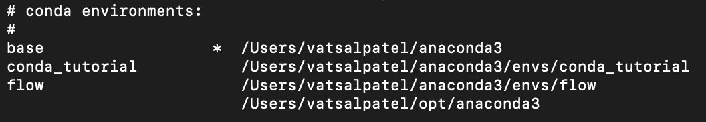
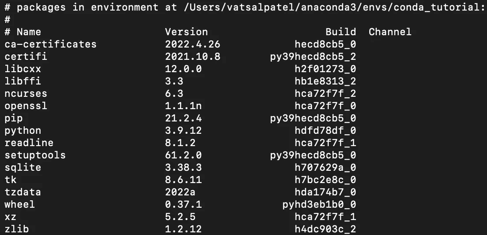

# 数据科学家使用 Conda 的 Python 虚拟环境综合指南

> 原文：<https://towardsdatascience.com/comprehensive-guide-to-python-virtual-environments-using-conda-for-data-scientists-6ebea645c5b>

## Conda via 终端虚拟环境指南


图片由[罗伯特·祖尼科夫](https://unsplash.com/@rzunikoff)从 [Unsplash](https://unsplash.com/photos/5gnLz583gCY) 拍摄

本文将全面指导数据科学家如何使用 Conda 为您的项目创建、导出和使用虚拟环境。本教程将专门针对 Python 虚拟环境。下面概述了文章的结构。

## 目录

*   什么是康达虚拟环境？
*   为什么要使用虚拟环境？
*   康达装置
*   创建一个虚拟环境
    -通过命令行
    -通过环境文件
    -激活环境
    -停用环境
*   环境列表
    -环境中已安装软件包的列表
*   导出虚拟环境
*   克隆虚拟环境
*   删除虚拟环境
*   结束语
*   资源

# 什么是康达虚拟环境？

简而言之，虚拟环境就是位于您计算机上的一个目录，用于在一个隔离的位置运行您的脚本。您可以创建许多不同的虚拟环境，每个环境都是相互隔离的。这允许您用不同版本的不同包运行您的项目和代码。

有各种各样的服务提供给你创建虚拟环境，这些服务因编码语言不同而不同。特别是对于 Python，创建和使用虚拟环境的两种最常见的方式是通过包管理器`pip`和`conda`。尽管它们的功能可能重叠，但每个管理器的总体设计是不同的。我使用 conda 来管理我的虚拟环境的主要原因是因为它非常强大，可以通过 conda 和 pip 打包安装，它允许安装不同版本的 Python 和其他编程语言，并且该软件是为数据科学家设计的。

# 为什么要使用虚拟环境？

虚拟环境的使用在数据科学中是至关重要的，尤其是在项目协作、将项目交付生产化、管理包依赖冲突以及使结果更容易重现时。Python 并不是管理包的最佳工具，你安装在电脑上的每个包都带有当前包所依赖的其他几个包。所有这些软件包都会以不同的版本安装，以确保最新安装的软件包能够正常工作。如果不指定检查与您正在安装的软件包相关联的版本，这将成为一个问题。

假设你在项目 Y 上工作，你使用的是版本 2.0.1 的`pandas`，然而当你在项目 X 上工作时，你使用的是版本 2.0.0 的`pandas`。想象一下，这些版本之间的差异是随着 X 项目使用的 pandas 上的各种功能被弃用而产生的。这实际上意味着，随着库版本的更新，您为项目 X 编写的调用不推荐使用的函数的脚本将不再工作。当您刚刚开始数据科学之旅，并且没有很多项目时，这个问题可能不会出现，但是在某个时候，您会遇到这个或非常类似的问题。

最佳实践是为您正在进行的每个项目创建一个独立的虚拟环境。这是由于两个主要原因；首先，项目的依赖关系和版本可能会不同，您会继续处理越来越多的项目。其次，生产环境将需要这些依赖项及其相关版本。较旧/较新的版本可能已弃用或向库中添加了新函数。当将您的模型交付给数据/机器学习工程师以投入生产时，您将向他们提供模型、与使用模型生成预测相关联的脚本以及保存加载和运行模型所需的包和那些包的版本的需求/环境文件。

# 康达装置

Conda 有大量关于其安装的文件。遵循下面的指南将指出在 Windows / Mac / Linux 操作系统中安装 anaconda / miniconda 的必要步骤和说明。

  

# 创建虚拟环境

## 通过命令行

在安装了`conda`之后，您可以在终端/命令行的任何路径运行以下命令:

```
conda create -n <env_name>
```

`-n`代表名称，您可以将`<env_name>`替换为您想要创建的环境的名称。出于本教程的目的，我将通过下面的命令创建一个名为`conda_tutorial`的环境。一个好的技巧是保持环境名称与您将要使用该环境的项目非常相似或相关。

```
conda create -n conda_tutorial
```

您还可以通过以下命令指定您希望使用环境创建的 Python 版本:

```
conda create -n conda_tutorial python=3.9
```

根据 Conda 文档，如果在创建环境时没有指定 Python 版本，它将默认使用 Python 3.9[3]。

## 通过 Yaml 文件

以下是与 conda 环境文件相关的结构，通常命名为`environment.yml`。

您将在本文后面看到如何创建这个环境文件。现在，要使用提供给您的环境文件在您的计算机上创建环境，您可以运行以下命令。

```
conda env create -f environment.yml
```

请注意，这将要求您在命令行/终端上使用与`environment.yml`文件相同的路径。

创建这些环境时，它会提示您继续(参考下图)。键入`y`并按回车键，如果你想继续，否则按`n`。


继续创建 conda 环境。图片由作者提供。

## 激活环境

创建环境后，您需要激活环境。这样做的命令是:

```
conda activate <env_name>
```

一旦环境被激活，您将在命令行的括号中看到它。


conda_tutorial 已激活。图片由作者提供

## 停用环境

同样，要停用环境，您只需运行:

```
conda deactivate
```

一旦环境被停用，您将返回到默认的`base`环境。


停用 conda_tutorial，现在回到默认基础环境。图片由作者提供。

# 环境列表

通过运行以下命令，您可以获得在您的计算机上创建的所有环境的列表:

```
conda env list
```

运行此命令后，您将看到在您的计算机上创建的所有环境的列表，以及可以找到这些环境的相关路径。`*`指当前活动环境，`base`环境为默认环境。



康达环境列表。图片由作者提供。

## 环境中已安装软件包的列表

运行命令`conda list`将在一个活动的 conda 环境中展示所有已安装的包。正如你在下面的图片中看到的，它展示了包的名字，版本和内部版本。



活动 conda 环境中已安装软件包的列表。图片由作者提供。

# 导出虚拟环境

导出虚拟环境对于项目移交/协作至关重要。以下命令将允许您将当前活动环境导出到一个`environment.yml`文件中。以下命令将允许您导出环境:

```
conda env export > environment.yml
```

它应该产生以下文件:

# 克隆虚拟环境

当您知道一个项目所必需的库与您以前工作过的另一个项目相同(如果不是非常相似的话)时，克隆一个环境可以节省时间。以下命令允许您克隆环境:

```
conda create --name <clone_name> --clone <existing_env>
```

在这里，您可以用新环境的名称替换`<clone_name>`，用您试图克隆的现有环境的名称替换`<existing_env>`。

# 删除虚拟环境

无论出于何种原因，您可能在某个时候想要删除现有的虚拟环境。以下命令向您展示了如何做到这一点。对想要删除的多个环境重复该过程。

```
conda remove --name <env_name> --all
```

您用想要删除的环境的名称替换`<env_name>`。

# 结束语

本质上，本教程概述了什么是虚拟环境，以及为什么您应该在您的下一个项目中使用它们。在团队环境中工作时，使用虚拟环境至关重要，原因如下:

1.  使结果的协作和再现性更易于管理
2.  降低依赖性冲突的可能性
3.  使项目移交更容易

如果你想转型进入数据行业，并希望得到经验丰富的导师的指导和指引，那么你可能想看看最敏锐的头脑。Sharpest Minds 是一个导师平台，导师(他们是经验丰富的实践数据科学家、机器学习工程师、研究科学家、首席技术官等。)将有助于你的发展和学习在数据领域找到一份工作。点击这里查看它们。

# 资源

*   [1][https://docs . conda . io/projects/conda/en/latest/user-guide/tasks/manage-environments . html](https://docs.conda.io/projects/conda/en/latest/user-guide/tasks/manage-environments.html)
*   [2][https://docs . conda . io/projects/conda/en/latest/user-guide/install/download . html](https://docs.conda.io/projects/conda/en/latest/user-guide/install/download.html)
*   [3][https://docs . conda . io/projects/conda/en/latest/user-guide/tasks/manage-python . html #](https://docs.conda.io/projects/conda/en/latest/user-guide/tasks/manage-python.html#)

如果你喜欢读这篇文章，下面是我写的其他文章，你可能也会觉得很有见地:

[](/recommendation-systems-explained-a42fc60591ed)  [](/comprehensive-guide-to-mlflow-b84086b002ae)  [](/comprehensive-guide-to-github-for-data-scientist-d3f71bd320da)  [](/active-learning-in-machine-learning-explained-777c42bd52fa)  [](/text-summarization-in-python-with-jaro-winkler-and-pagerank-72d693da94e8)  [](/word2vec-explained-49c52b4ccb71)  [](/link-prediction-recommendation-engines-with-node2vec-c97c429351a8)  [](/text-similarity-w-levenshtein-distance-in-python-2f7478986e75)  [](https://pub.towardsai.net/community-detection-with-node2vec-6cd5a40c7155) 