# 关于在分类中使用混淆矩阵的综合教程

> 原文：<https://towardsdatascience.com/comprehensive-tutorial-on-using-confusion-matrix-in-classification-92be4d70ea18>

## 学习使用混淆矩阵，根据问题的重要性来控制模型输出

使用 Sklearn 掌握混淆矩阵的基础知识，并为二进制分类中最常用的三个指标建立实用的直觉:精确度、召回率和 F1 分数。


**照片由** [**汤玛士蕾**](https://pixabay.com/users/tskirde-3014515/?utm_source=link-attribution&utm_medium=referral&utm_campaign=image&utm_content=1594638)**[**pix abay**](https://pixabay.com/?utm_source=link-attribution&utm_medium=referral&utm_campaign=image&utm_content=1594638)**

## **介绍**

**分类是机器学习的一个重要部分。它的好处和应用是无穷无尽的——从探测新的小行星和行星到识别癌细胞，所有这些都是通过分类算法完成的。**

**分类解决的问题类型分为两种:无监督的和有监督的。无监督分类器通常是神经网络，可以对视频、音频和图像等非结构化数据进行训练。相比之下，监督模型处理带标签的表格数据，是经典机器学习的一部分。本文的重点是后者；特别是，我们将探索所有监督分类问题的共同点:*混淆矩阵*。**

**[](https://ibexorigin.medium.com/membership)  

获得由强大的 AI-Alpha 信号选择和总结的最佳和最新的 ML 和 AI 论文:

[](https://alphasignal.ai/?referrer=Bex)  

## 开发分类预处理流水线

好的模型需要好的数据。因此，即使在基于混淆矩阵对模型进行调整之前，也必须尽可能多地处理可用信息，以实现最佳的模型性能。

典型的预处理工作流包括处理缺失值、缩放/归一化数字特征、编码分类变量以及执行所需的所有其他特征工程步骤。我们将在本节中看到一个这样的例子。

我们将使用来自 UCI 机器学习库的[信用卡审批数据集](http://archive.ics.uci.edu/ml/datasets/credit+approval)来预测信用卡审批。银行在向新客户发放信用卡之前，需要考虑很多因素:收入水平、贷款余额、个人信用报告等。这通常是一个困难而平凡的任务，所以现在，银行使用 ML 算法。让我们来看一下数据:

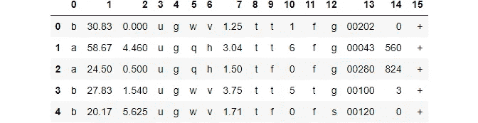

作者图片

因为它是私有数据，所以特征名称保留为空。让我们先解决这个问题:

数据集包含数值和分类特征。此数据集中缺失的值用问号(？).我们将用`NaN` s 替换它们:

要素 0、1、3、4、5、6 和 13 包含缺失值。检查数据，我们可能会猜测特性 13 包含邮政编码，这意味着我们可以删除它。对于其他行，由于它们只占数据集的不到 5%，我们也可以删除这些行:

我们没有使用插补技术，因为空值的数量很少。如果您想了解其他稳健插补技术，本文将有所帮助:

[](/advanced-missing-data-imputation-methods-with-sklearn-d9875cbcc6eb)  

现在让我们把重点放在数值上。具体来说，我们将查看它们的分布:

```
>>> df.describe().T.round(3)
```

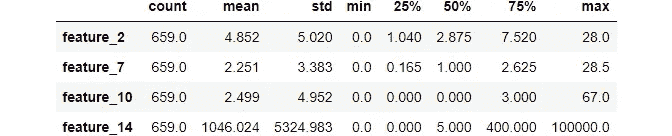

所有要素的最小值都为 0，但它们都在不同的比例上。这意味着我们必须使用一些标准化，我们将通过直观地探索这些特性来了解是哪种标准化:

```
import seaborn as sns>>> df.hist();
```

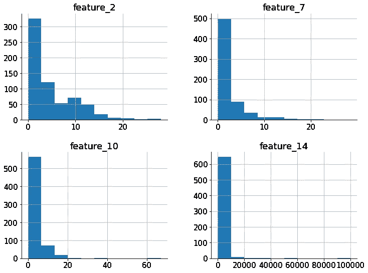

作者图片

特征具有偏斜分布，这意味着我们将执行非线性变换，如`PowerTransformer`(使用对数):

如果您想了解更多关于其他数字特征转换技术的信息，我也已经介绍过了:

[](/how-to-differentiate-between-scaling-normalization-and-log-transformations-69873d365a94)  

为了编码分类特征，我们将使用一个`OneHotEncoder`。在隔离要在编码中使用的列之前，让我们将数据分成特性和目标数组:

现在，隔离要进行 OH 编码的分类列:

最后，我们将构建预处理管道:

[](/how-to-use-sklearn-pipelines-for-ridiculously-neat-code-a61ab66ca90d)  

## 混淆矩阵介绍

最后一步，我在管道中添加了一个`RandomForestClassifier`作为基础模型。我们希望该模型能够更准确地预测批准的申请，因为这意味着银行会有更多的客户。这也将使批准的申请成为我们预测中的*阳性类别*。让我们最后评估一下管道:

所有分类器的默认得分是准确性得分，其中我们的基础管道令人印象深刻地达到了约 87%。

但是，这里有一个准确性的问题——什么是模型*准确*？它能更好地预测合适的应用程序，还是能更准确地检测不合适的候选程序？从商业角度来看，你的结果应该回答这两个问题，而准确性不能做到这一点。

作为解决方案，让我们最终引入一个混淆矩阵:

由于这是一个二元分类问题，矩阵的形状为 2x2(目标中的两个类)。矩阵的对角线显示正确分类样本的数量，非对角线单元显示模型出错的位置。为了理解矩阵，Sklearn 提供了一个可视化的，这要好得多:

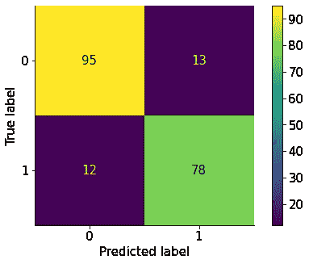

作者图片

这个混淆矩阵提供了更多的信息。以下是一些需要注意的事项:

*   这些行对应于实际值
*   这些列对应于预测值
*   每个单元格都是每个真实/预测值组合的计数

请注意轴标签，第一行代表实际的负面类别(拒绝的申请)，而第二行代表实际的正面类别(批准的申请)。类似地，第一列是正面预测，第二列是负面预测。

在我们继续解释这个输出之前，让我们先确定这个矩阵的格式。在其他文献中，您可能会看到实际的正类出现在第一行，而预测的正类出现在第一列。我也习惯了这种格式，并发现它更容易解释。

我们将翻转矩阵，使第一行和第一列是正类。我们还将使用 Sklearn 的`ConfusionMatrixDisplay`函数来绘制定制矩阵。下面是一个包装函数:

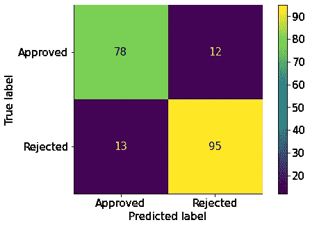

作者图片

我们使用`np.flip`翻转矩阵，并通过`ConfusionDisplayFunction`绘制它，它只接受一个矩阵，并通过`display_labels`参数接受自定义类别标签。

让我们最终解读这个矩阵:

*   **(左上)** — 78 个申请实际上被*批准，*和模型*正确地将它们归类为*批准**
*   **(右下)** —实际上有 95 份申请被*拒绝，*和模型*正确地*将它们归类为*被拒绝的*
*   **(左下)** — 13 份申请实际上被*拒绝，*但是模型*错误地将它们归类为*批准**
*   **(右上)** —实际上有 12 份申请被*批准，*但是模型*错误地*将它们归类为*拒绝*。

由于混淆矩阵的流行，每个真实/预测单元组合在社区中都有自己的名称:

*   **真阳性(TP)** —实际阳性，预测阳性(左上角，78)
*   **真阴性(TN)** —实际阴性，预测阴性(右下角，95)
*   **假阳性(FP)** —实际阴性，预测阳性(左下角，13)
*   **假阴性(FN)** —实际阳性，预测阴性(右上，12)

尽管您可能会看到不同格式的矩阵，但上述四项将始终存在。这就是为什么在创建模型之前，在心里记下上述四个术语在您的特殊情况下指的是什么是有帮助的。

拟合模型后，您可以在混淆矩阵上使用`.ravel()`方法提取上述 4 个元素中的每一个:

## 精确度、召回率和 F 分数

在这一节中，我们将了解让我们进一步比较一个混淆矩阵与另一个混淆矩阵的指标。假设我们有另一个使用`LogisticRegression`作为分类器的管道:

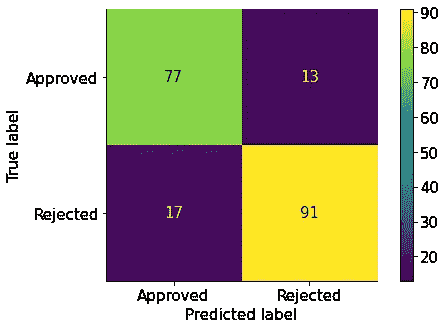

左逻辑回归，右随机森林分类器。作者图片。

看着上面的图，我们可以说随机森林和逻辑回归的结果是相似的。然而，我们可以从混淆矩阵中得出三个常见的度量标准，以便对它们进行比较。这些被称为*精度*、*召回、*和 *F1 得分*。让我们详细了解每一个:

1.  **精度**是正确分类的阳性类别数与预测阳性类别总数之比。在我们的例子中，它是正确分类的总数，*批准的应用程序* (TP = 77)除以预测的批准分类总数(所有预测的阳性，不管它们是否正确，TP + FP = 94)。使用矩阵术语，它是:

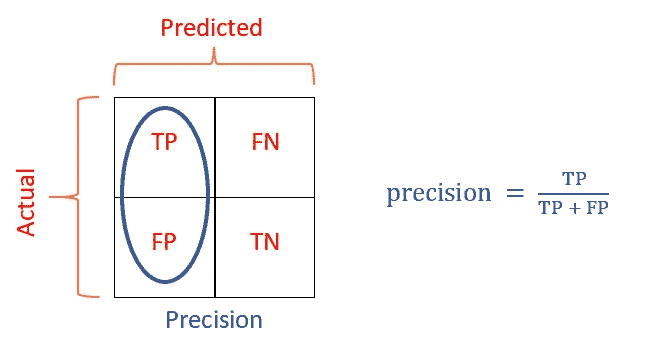

作者图片

你可以很容易地用三 P 法则记住这一点——precision 包括所有的正数，并使用矩阵左侧的术语。

Sklearn 对精度的官方定义是:“分类器不将一个阴性样本标记为阳性的能力。”在我们的例子中，我们的模型能够不将*拒绝的申请*标记为批准。因此，如果我们希望模型在过滤不合适的应用程序时更加准确，我们应该针对精度进行优化。换句话说，尽可能增加真阳性，减少假阳性。0 假阳性给出 1 的精度。

1.  **回忆** : *灵敏度，命中率，*或*真阳性率(TPR)* 。它是正确分类的阳性数除以目标中实际阳性总数的比率。在我们的例子中，它是正确分类的*批准的申请数* (TP = 77)除以*实际批准的申请总数*(不管它们是否被正确预测，TP + FN = 90)。使用混淆矩阵的术语:

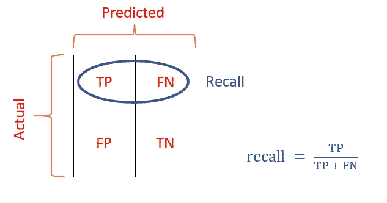

作者图片

回忆使用混淆矩阵第一行中的术语。

Sklearn 对召回的官方定义是:“分类器找到所有正样本的能力。”如果我们优化召回，我们将减少假阴性(错误分类，批准的申请)的数量，增加真阳性的数量。但是这可能是以假阳性的增加为代价的——即错误地将被拒绝的申请归类为被批准的。

由于它们的性质，精确度和召回率是一种权衡关系。根据您的业务问题，您可能需要以牺牲另一个为代价来优化其中一个。然而，如果你想要一个平衡的模型，也就是说，一个同样善于发现积极和消极因素的模型呢？

在我们的案例中，这是有意义的——如果一家银行能够找到尽可能多的客户，同时避免不良候选人，从而消除潜在的损失，那么它将受益最大。

1.  第三个指标，称为 *F1 得分*，试图精确测量:它量化了模型正确预测两个类别的能力。它通过取精度和召回率的调和平均值来计算:

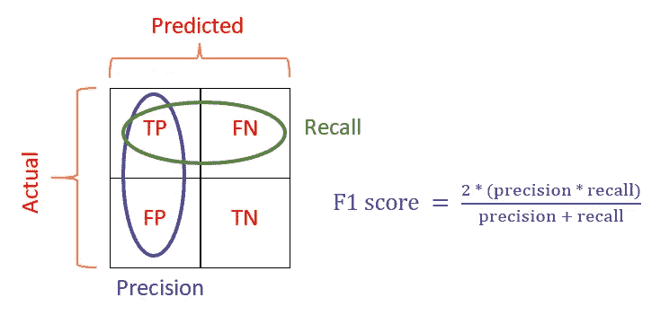

作者图片

你会问，为什么调和意味着什么？因为它是如何计算的，调和平均数真正给出了一个平衡的分数。如果精度或召回率的值较低，F1 分数会受到很大影响。与简单平均值相比，这是一个有用的数学特性。

所有这些指标都可以使用 Sklearn 进行计算，并且可以在`metrics`子模块下获得:

RandomForest 具有更高的精确度，这表明它在发现可批准的应用程序方面更好，同时降低了假阳性，即不正确地分类不需要的候选对象。

RandomForests 也赢得了回忆。类似地，它在过滤假阴性方面更好，即减少被分类为阴性的阳性样本的数量。由于 RandomForests 在这两个分数上都赢了，我们可以期待它也有一个更高的 F1:

正如预期的那样，RF 具有更高的 F1，对于我们的情况来说，它是一个更健壮的模型。

您可以使用`classification_report`功能一次打印出所有这些分数:

在我们关注这些指标的优化之前，让我们看一下其他场景来加深我们的理解。

## 在解释精确度、召回率和 F1 方面进行更多练习

由于这些指标之间的差异是微妙的，您需要一些实践来培养对它们的强烈直觉。在本节中，我们将做到这一点！

假设我们正在检测跳伞商店出售的降落伞是否有缺陷。助手检查所有可用的降落伞，记录它们的属性，并对它们进行分类。我们希望将这一过程自动化，并建立一个能够非常好地检测故障降落伞的模型。

出于示例目的，我们将综合创建数据集:

由于工作降落伞多得多，这是一个不平衡的分类问题。让我们建立术语:

*   正面类:有缺陷的降落伞
*   反面课堂:工作降落伞
*   真正的正面:故障降落伞预测正确
*   真正的否定:工作降落伞预测正确
*   误报:故障降落伞预测错误
*   假阴性:工作降落伞预测错误

让我们根据这些数据评估一个随机森林模型:

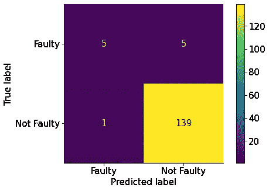

作者图片

在这个问题中，我们应该尽可能地降低右上方(假阴性)，因为即使是一个有故障的降落伞也意味着跳伞者的死亡。看看分数，我们应该优化召回分数:


作者图片

如果假阳性增加是完全可以的，因为我们将拯救人们的生命，即使我们可能会损失一些钱。

在第二个场景中，我们将尝试预测客户流失(停止或继续使用我们公司的服务)。同样，让我们为这个问题建立术语:

*   积极类:继续使用
*   负面类:流失
*   真阳性:想要继续，预测正确
*   真正的负面因素:流失，预测正确
*   误报:流失，预测错误
*   假阴性:想要继续，预测错误

我们将再次构建一个合成数据集，并在其上评估 RF:

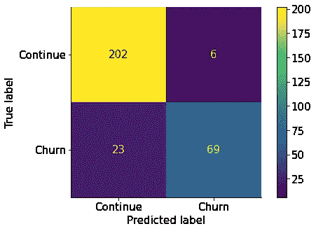

作者图片

在这种情况下，我们希望留住尽可能多的客户。这意味着我们必须降低误报率，这表明我们应该优化精度:


作者图片

在本文中，我们只关注三个指标。但是，您可以从混淆矩阵中获得许多其他得分，如特异性、NPV、FNR 等。看完这篇文章，你应该能读到关于该话题的[维基百科页面](https://en.wikipedia.org/wiki/Confusion_matrix)。如果你对指标感到困惑，也可以看看这篇[的精彩文章](https://medium.com/swlh/how-to-remember-all-these-classification-concepts-forever-761c065be33)。

最后，让我们看看如何针对我们今天讨论的每个指标进行优化。

## 使用 HalvingGridSearchCV 优化特定指标的模型

在本节中，我们将了解如何针对我们选择的指标提升模型的性能。在上面的章节中，我们使用了带有默认参数的模型。为了提高它们的性能，我们必须进行超参数调整。具体来说，我们应该找到为我们期望的度量给出最高分数的超参数。

寻找这个神奇的布景既乏味又费时。因此，我们将引出`HalvingRandomSearchCV`类，它在模型的可能参数网格上进行探索，并为传递给它的`scoring`参数的评分函数找到给出最高分数的集合。

> 你可能会惊讶于我没有使用 GridSearch。在我的一篇文章中，我展示了减半网格搜索比常规网格搜索快 11 倍。并且减半网格搜索甚至更快，允许我们在很大程度上拓宽我们的超参数空间。你可以在这里阅读对比:

[](/11-times-faster-hyperparameter-tuning-with-halvinggridsearch-232ed0160155)  

作为第一步，我们将构建超参数空间:

现在，我们将在这个网格上搜索三次，针对我们今天讨论的每个指标进行优化:

我们在精确度方面得分较高，但在召回和 F1 方面得分较低。这是一个迭代的过程，所以你可以继续搜索，直到分数提高。或者，如果你有时间，可以换成 HalvingGridSearch，它比 HalvingRandomSearch 慢很多，但是给出的结果要好得多。

## 摘要

任何分类问题中最困难的部分是理解您试图解决的业务问题，并相应地优化度量标准。一旦你从理论上构造了合适的混淆矩阵及其项，就只剩下编码部分了。

就编码而言，拥有一个优秀的预处理管道可以确保您为自己选择的基础模型获得最好的分数。确保根据底层分布对数据进行缩放/规范化。预处理之后，为多个分类器创建管道的副本。逻辑回归、随机森林和 KNN 分类器都是不错的选择。

为了优化，选择对半网格或对半随机搜索。事实证明，它们比以前的同类产品要好得多。感谢阅读！**