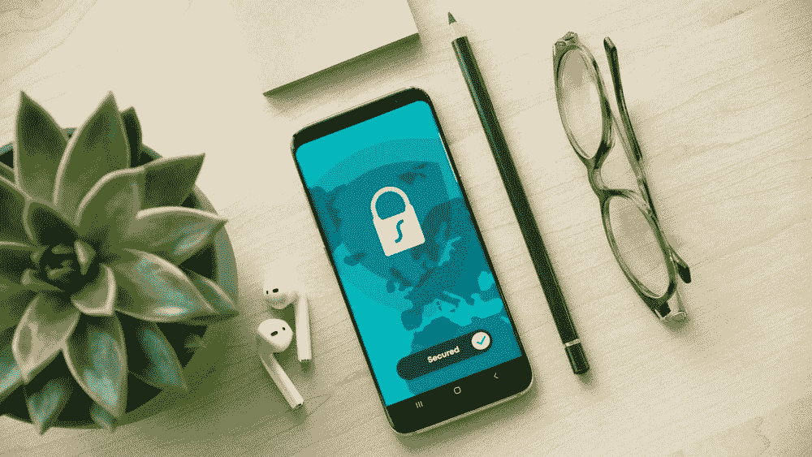

# CompTIA Security+ (Plus) SY0-601 考试指南:你需要知道的一切

> 原文：<https://towardsdatascience.com/comptia-security-plus-sy0-601-exam-guide-everything-you-need-to-know-f813606ebe52>

## 正确通过 CompTIA Security+ (Plus) SY0-601 考试

## 文章最后更新时间:2022 年 7 月



丹·尼尔森在 [Unsplash](https://unsplash.com/photos/ah-HeguOe9k) 上拍摄的照片

## 介绍

在当今的技术环境中，数据专业人员比以往任何时候都更需要考虑数据和系统的安全性。随着网络攻击[的数量以前所未有的速度增长](https://www.accenture.com/us-en/blogs/security/triple-digit-increase-cyberattacks)，从 [IBM](https://www.ibm.com/security/artificial-intelligence) 到上市后初创公司 [Darktrace](https://www.darktrace.com/en/) 的许多公司都在将数据科学支持的网络安全作为未来五到十年的业务重点。如果你是一名想要进入人工智能网络安全行业的数据科学家，参加 [CompTIA Security+ (Plus)](https://www.comptia.org/certifications/security) 考试是一个很好的起点。这篇文章包含了你需要了解的关于 SY0-601 的一切，SY0-601 是 CompTIA 的全球认证考试，旨在验证你在 IT 安全方面的技能。

列出考试规格后，我们将开始浏览 SY0–601 考试的内容，以及您将会遇到的问题类型。然后，我们将回顾一些准备工作的注意事项，我将介绍哪些资源可以用来学习，哪些应该避免。一旦你准备好参加考试，我会告诉你如何安排考试，考试当天会发生什么，以及如何在你通过考试后保持你的认证。

## 考试规格

CompTIA Security+测试是一项相当复杂的考试。以下是详细情况:

*   **长度:**最多 90 个问题(但你可以少问一些)
*   **时长:** 90 分钟时限
*   **考试价格:**参考[考试价格网页](https://www.comptia.org/testing/exam-vouchers/exam-prices#security)在此找到您所在地区的价格信息。
*   **问题格式:**选择题(一个或多个正确答案)和表现型问题(PBQs)。回答不正确是没有惩罚的，所以一定要回答好每一个问题。
*   **及格分数:** 750 / 900 分(83.3%)
*   考试最后更新日期:2020 年 11 月 12 日
*   [**夺回策略:**](https://www.comptia.org/testing/testing-policies-procedures/test-policies/comptia-certification-retake-policy) 第一次失败后没有等待期。超过这个时间后，任何失败都有 14 天的等待期——没有考试次数的上限。
*   [**认证到期政策**](https://www.comptia.org/faq/security/how-long-does-the-comptia-security-certification-last) **:** 认证在认证考试后 3 年到期。他们可以通过培训、重新认证考试和资格认定活动进行更新。稍后将详细介绍。
*   **测试环境:**通过[培生 VUE](https://home.pearsonvue.com/Clients/CompTIA.aspx) 在线或现场。

## 考试内容

考试内容分为 5 个领域:

1.  攻击、威胁和漏洞(24%)
2.  建筑和设计(21%)
3.  实施(25%)
4.  运营和事故响应(16%)
5.  治理、风险和法规遵从性(14%)

在你做任何事情之前，我强烈建议你阅读一下[官方考试目标](https://www.comptia.org/training/resources/exam-objectives)大纲，了解更多关于考试内容的细节。要访问考试目标，您需要加入 CompTIA 电子邮件列表(很容易取消订阅)，并且获得大纲是非常值得的。该文件将 5 个领域中的每一个细分为子列表，这些子列表给出了考试中可能涉及的每个主题的综合列表。它还包含 Security+(SY0–601)缩略词列表，这是一个 4 页的概要，列出了考试中可能出现的每个缩略词。

## 题型

考试有几个不同类型的问题，你应该做好准备。从官方的测试指南中还不清楚你是否可以因为你的任何一个答案得到部分分数，但是不正确的答案是没有惩罚的。这意味着回答每个问题对你最有利。通过皮尔森 VUE 在线考试时，所有的问题都可以标记为待复习，所以你也可以标记棘手的问题，如果你不能马上确定答案，稍后再回来。

考虑到这些细节，让我们来看看问题类型。

## **基于绩效的问题(pbq)。**

您将从 2-6 道 pbq 开始考试。这些交互式问题旨在测试您解决现实问题的能力。可能会要求您根据控制台日志识别攻击类型，根据一组网络要求配置一组访问控制列表，或者将一组协议与其正确的端口号进行匹配。pbq 可能包含多项选择、填空或拖放考试组件，有些甚至要求您与模拟虚拟环境进行交互。

## **有 1 个或更多正确答案的多项选择**

选择题部分占了考试的大部分。大多数问题只有一个正确答案。但是，有些会要求您选择多个正确答案。通过问题提示后的**(选择两个)**或**(选择三个)**括号说明，您将能够识别有多个正确答案的问题，因此请务必仔细阅读。

## **准备注意事项**

这里有一些帮助我第一次通过 CompTIA Security+ SY0-601 的学习技巧。

*   **务必使用合法的免费 CompTIA Security+ SY0-601 学习资源。互联网上有很多精彩的免费资源可以帮助你准备考试。[刀子乐队教授精彩的 SY0-601 培训视频](https://www.professormesser.com/security-plus/sy0-601/sy0-601-video/sy0-601-comptia-security-plus-course/)、[参加十次小测验](http://CompTIA Security+ Take Ten Challenges)、[每月学习小组](https://www.professormesser.com/category/security-plus/sy0-601/sy0-601-study-group/)提供超过 21 小时的高质量内容，与 SY0-601 考试目标保持一致。这些视频是开始准备的好地方。另外，考虑使用别人制作的免费的 [Quizlet](https://quizlet.com/526530796/security-cert-exam-objectives-syo-601-flash-cards/) 或 [Anki](https://ankiweb.net/shared/info/34417453) 抽认卡来学习。如果你担心免费的抽认卡可能包含错误，考虑制作你自己的抽认卡，并在[脸书](https://www.facebook.com/groups/comsecplus/)或 [Discord](https://discord.com/invite/dtf4uQPDZq) 上与安全+社区分享，供同行评审，尽管这更费时间。**
*   请考虑购买一本好的 CompTIA Security+ SY0-601 书籍。如果从课本上学的好，我推荐买一本 SY0-601 考试的优质书。你会在网上找到很多选择，但我个人在亚马逊上买了 [Chapple 和 Seidl](https://www.amazon.com/CompTIA-Security-Study-Guide-SY0-601/dp/1119736250)(很遗憾，不是赞助商)，毫无保留地推荐。内容组织得很好，每一章都链接到考试目标中的一个特定子点，使其易于阅读。它还带有两个免费的实践测试，抽认卡和章节测验，可通过在线门户网站获得。
    *注:如果钱不是问题，可以尽情挥霍* [*官方 CompTIA Security+学习指南*](https://store.comptia.org/the-official-comptia-security-plus-self-paced-study-guide/p/SEC-601-SPPB-20-C?utm_source=google&utm_medium=free_shopping&utm_campaign=Certs_shopping_security_601_paperback_02_2021&utm_content=security_601_paperback&gclid=Cj0KCQjw5ZSWBhCVARIsALERCvzoaCFdmoqFlBeK5JlSihhDgg7BwJirsbSRB121aNQxzLFLC87TqN4aApK6EALw_wcB) *，但我个人认为在有其他更低价格点的优质选择时，不值得花那么多钱。*
*   务必仔细阅读每个问题，并注意粗体和大写单词。除了选择多项提示，CompTIA 多项选择题通常包含大写的最高级。他们会询问最有可能的解决方案或最佳方法或第一优先事项。即使多个其他答案可能有些正确，也要选择最佳答案。
*   **一定要适应安全+pbq。**要想知道会发生什么，请务必查看 [CompTIA 提供的安全性+示例模拟](https://demosim.comptia.io/)。更多 PBQ 风格的例子，请查看[电子学习课程中的 CompTIA pbq](https://www.smartbuilder.com/examples/comptia/index.php)。并非所有这些电子学习 pbq 都基于安全+考试内容，但它们肯定会帮助您获得一般的舒适 pbq。CompTIA 也有一些填写 PBQ 的[提示](https://www.comptia.org/testing/testing-options/about-comptia-performance-exams/performance-based-questions-explained)以及 [PBQ FAQ](https://www.comptia.org/testing/testing-options/about-comptia-performance-exams/performance-based-questions-faq) 页面来帮助你。

以下是我建议你在准备过程中避开的一些事情。

*   **不要使用考试垃圾网站或以其他方式违反** [**CompTIA 考生协议**](https://www.comptia.org/testing/testing-policies-procedures/test-policies/comptia-candidate-agreement) **。如果你在谷歌上搜索安全+认证考试，你一定会找到考试垃圾网站。考试转储网站包含过去安全+考试的真题，由已经参加过考试的人编辑。不幸的是，考试垃圾不是好的学习材料，原因有很多。首先，CompTIA 测试人员也有 Google。考试经常轮换和更新，考试组织者保持警惕，以确保这些网站上出现的问题不会出现在您的实际考试中。更重要的是，访问考试转储被认为是作弊，违反了 [CompTIA 考生协议](https://www.comptia.org/testing/testing-policies-procedures/test-policies/comptia-candidate-agreement)。任何违反协议的行为都会让你被长期禁止参加 CompTIA 认证,同时你当前的考试成绩也会立即不及格。练习规避风险，避开这些网站。
    *注:如果你在找练习题，我推荐* [*CompTIA 免费安全+练习题*](https://www.comptia.org/training/resources/practice-tests) *，* [*刀子乐队教授的十个小测验*](http://CompTIA Security+ Take Ten Challenges) ， [*杰森·戴恩的 Udemy 课程和考试*](https://www.udemy.com/course/securityplus/) ，*和* [*迈克·梅尔斯的练习测试*](https://www.udemy.com/course/total-comptia-security-cert-sy0-601-practice-tests/) 这些是我用来熟悉 CompTIA Security+问题风格的资源，我发现它们都相当准确地代表了实际测试。**
*   不要购买或使用 SY0-501 考试的学习材料来代替 SY0-601 考试。 [SY0-501 于 2021 年 7 月 31 日被 SY0-601](https://www.comptia.org/blog/the-new-comptia-security-your-questions-answered#:~:text=The%20English%20version%20of%20the,completely%20replaced%20by%20SY0%2D601.) 取代为 CompTIA Security+认证考试。它们是类似的测试，但新的 SY0-601 有一些旧 SY0-501 版本中没有的额外考试目标。在你购买或使用任何学习材料之前，确保你得到的是测试的正确版本。
*   **不要等太久才安排考试。实际上，请阅读下一部分，并马上安排考试。安排考试给你一个准备工作的日期，并迫使你保持动力，因为你已经在游戏中得到一些钱。如果你不能及时到达你需要的地方，你可以在考试前 24 小时重新安排考试。另外，关于准备的一个快速提示:你可能永远不会为安全+考试做好 100%的准备。我的意思是，你看过考试目标表和它的四(4)页缩略词吗？好消息是，你不需要为通过这次考试做 100%的准备——你只需要取得 750/900 分(83.3%)。现在就安排考试，争取在考试日期前完成 83.3%的模拟考试。**

## **安排考试和考试日提示**

准备好安排考试了吗？太好了！您可以直接从 [CompTIA 网站](https://www.comptia.org/certifications/security#buyoptions)购买考试，价格为[当地的全价](https://www.comptia.org/testing/exam-vouchers/exam-prices#security)。然而，在你这样做之前，一定要四处看看有没有折扣。在安排 CompTIA Security+考试时，许多合作公司和供应商都会提供折扣券，为您节省一些费用。我工作的公司允许我拿到一张 15%折扣的优惠券参加考试，所以在支付全价之前一定要和你的雇主核实一下。[刀子乐队教授还提供了一张 10%折扣的考试代金券，美国和加拿大的所有人都可以使用，同时在培生 VUE 网站](https://www.professormesser.com/discounted-comptia-security-plus-voucher/)[上还有关于如何兑换代金券的精彩说明](https://home.pearsonvue.com/comptia)。

无论您决定为考试支付多少费用，都要准备好创建 CompTIA 认证档案并验证您的一些个人信息。何时参加考试由你决定——如果你感到冲动，你可以(通常)将考试安排在你想参加的日子，但我建议你如果可以的话，提前几周安排考试。

您还可以选择亲自参加考试还是通过皮尔逊 VUE 在线考试。我决定参加在线考试，所以我不能对现场监督发表评论，但我要说的是，我在皮尔逊 VUE 的经历非常积极，这次考试也不例外。这里有一些建议，可以让你在皮尔森 VUE 的经历尽可能顺利:

*   确保你的考试空间是安静的，并且在考试期间你不会被打扰。为了防止作弊，如果你考试时有其他人和你在一起，你的考试成绩可能会作废。皮尔逊 VUE 软件还将使用你的计算机的麦克风记录你考试时发出的任何声音，以防止通过音频信号作弊。这也意味着你需要在整个考试中保持沉默——不要大声朗读问题，因为这可能会导致失格。
*   确保你的考试空间尽可能的空着。你需要在考试前拍四张你的考试区域的前、后、左、右的照片。在拍摄这些照片之前，请确保移除任何纸张、铅笔、外部键盘或鼠标等。符合测试规则。你不允许在测试过程中书写(尽管你可以使用虚拟记事本)或使用外部设备，所以最好完全清空你的测试区域。
*   考试时要注意你的眼睛。您的前置摄像头将记录您的整个测试过程，并且您将在整个过程中受到皮尔森 VUE 监考人的监控。如果你在考试时不看电脑屏幕，会让人怀疑你可能作弊。如果你是那种喜欢在思考的时候盯着远处看的人，那么在考试的 90 分钟里，尽你所能抵制这种冲动。

虽然这些规则看起来很多，但在测试过程中并不明显。如果你没有作弊，你真的没有什么好担心的。想象一下，你回到了高中，遵循你在真实课堂上遵循的规则——保持沉默，眼睛盯着考试，不要从任何人或任何事物获得帮助。

## 维护您的 CompTIA Security+认证

如果这一部分与你相关，那么恭喜你！您已经通过了安全+考试，并且在接下来的三年内获得了正式认证。庆祝活动结束后，请前往本页了解如何维护和更新您的认证。当你玩得开心的时候，时间过得很快！

您正在顺利通过 CompTIA Security+ SY0-601 认证考试。最后一点:永远记住认证只是你学习之旅的开始，而不是结束。一旦你获得认证，你就要好好利用这个认证——无论是工作还是个人项目。

祝你考试顺利，认证愉快！

```
*Acknowledgments: A big thank you to the wonderful Claire Hoffman for proofreading and editing this article and putting up with my neglect of the Oxford comma. If you liked this story and want to read more, follow me on Medium and subscribe via my referred members link here:* [https://sethbilliau.medium.com/membership](https://sethbilliau.medium.com/membership). 
```