# 计算创造力

> 原文：<https://towardsdatascience.com/computational-creativity-6a5d77b3ed12>

## 在建筑计算工具中集成横向思维的人工智能实验管道

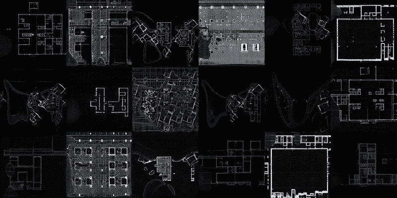

生成的计划|来源:作者

建筑工具从传统到现代计算的转变已经集中在效率和生产力上。这是因为建筑师使用的许多计算工具都是工业学科的遗产，如汽车和制造业。例如，CATIA 是 Frank Gehry 和他的团队用来实现复杂设计的软件，最初是为航空业开发的。

作为从这些领域继承的结果，这些其他学科的价值和标准已经离散地渗透到建筑中。因此，优化、标准化和效率的概念，垂直思维的所有品质，或工业时代的推理，在这些工具中不可避免地优先于横向思维品质，如不准确、不确定性和事故，这些品质通常与艺术实践相关。

然而，正如布莱恩·劳森、奈杰尔·克罗斯和凯斯·多斯特等学者的工作所指出的，创造力和优秀设计之间有着明显的关系。他们的工作指出，成功的建筑设计必须有创造性的设计过程，这种创造性的过程表现为设计师平衡发散和收敛思维的能力——发散思维与爱德华·德·波诺创造的术语“横向思维”密切相关。这种创造性的设计过程往往会带来意想不到的设计机会。

因此，随着我们的工具变得越来越数字化，这些工具强加的功能和方法极大地关注了垂直思维，已经自动地和无意地限制了可能的设计空间。

本文的目标是将横向思维策略重新整合到建筑设计工具中。我们认为，缺乏这些特定品质的今天的计算工具可以受益于在建筑设计过程的早期阶段嵌入人工智能，作为一种在我们的过程中解决横向思维方法的方法。具体而言，我们提出了一个基于生成式对抗网络(GANs)的 4 步人工智能驱动的管道，该管道利用访问机器潜在空间的能力，并将该空间用作设计 3D 建筑结构的实验性数字环境。

# **相关工作**

过去十年左右的架构工具主要集中在参数化方法上。这些方法的特点是为元素之间的关系赋值，并操纵这些值来控制和组织这些关系。另一方面，机器学习算法通过探索数据并识别其中的模式来工作，而不依赖于预定的方程作为模型。几位建筑师和研究人员最近探索了机器学习算法的潜力，特别是生成性对抗网络(GANs)，以提高创造性的可能性。这些 GAN 算法可以统计地学习和模仿呈现给它们的任何数据分布，并且通常用于生成目的。

## 可预测的产出

黄等将 GANs 应用于建筑图纸的识别与生成。作者使用 pix2pixHD，这是一种经过修改的 GAN，它成对学习图像数据，并根据输入生成新图像。他们使用不同颜色标记的房间图作为输入来制作公寓平面图。Chang 等人提出了一个图约束的生成对抗网络，用于从建筑气泡图中自动生成多个房屋布局选项。

这些作品清楚地展示了 GANs 生成建筑计划并可能优化建筑流程和工作流的潜力和能力。结果的可接受性取决于它们与当前架构状态的熟悉程度或相似程度。因此，就横向思维方法而言，这些方法表现不佳，因为它们的输出往往总是相当可预测、可预期的，并且受限于已知的内容。

然而，正如菲利普·莫雷尔所说，“任何建筑师的任务都不是用计算机来复制或自动化已经想到和产生的东西，而是让计算机揭示一种全新形式的建筑智能。”他详细阐述了“机器，[……]将在逻辑上产生一种也超出我们通常能力的建筑”，并指出这种建筑仍有待产生。我们的工作旨在扩展这一点，并让机器揭示一种新的“不可思议的架构”

> “任何建筑师的任务都不是用计算机来复制或自动化已经想到和产生的东西，而是让计算机展现一种全新的建筑智能。”

## 不可预测的产出

Chaillou 提出了一种使用嵌套 GAN 模型生成整个公寓建筑的方法。使用这种方法，作者演示了嵌套不同的模型如何产生独特的输出和介于当前已知风格之间的新的架构风格。尽管这种方法显示了很好的结果，但该过程仍然涉及大量的图像对的管理以进行训练。

我们的工作建立在这些研究的基础上，并提出了一系列的步骤和方法，通过这些步骤和方法，我们讨论了人工智能驱动的横向思维在建筑工具中的潜力。

# 方法学

我们提出了一个使用 StyleGAN 生成 3D 结构的管道，并探索其潜在空间作为 512 维虚拟环境进行设计。潜在空间是 n 维空间，其中，在训练 GAN 模型之后，该模型的生成器学习将该空间中的点映射到特定生成的图像，该图像类似于其最初被训练的数据集的图像。每次模型定型时，这些映射都会发生变化。

潜在空间具有可以被查询和导航的结构，其中该空间中的每个点是表示图像的 512D 向量。我们的 4 步过程利用这个空间的能力和属性来设计一个 3D 结构。(1)它首先包括通过 StyleGAN 模型的训练来初始化点的虚拟潜在空间。(2)接下来的步骤是通过选择或生成表示图像的 512D 向量来进入该空间并访问其维度。(3)此外，在获得一个点(图像)之后，我们通过使用向量算术运算和插值来在空间中导航，以生成被转换成图像的新点。(4)最后，我们通过使用这些图像的像素值来生成体素 3D 结构。我们展示了这条管道，并建议它如何将建筑数字工具推向实验领域。

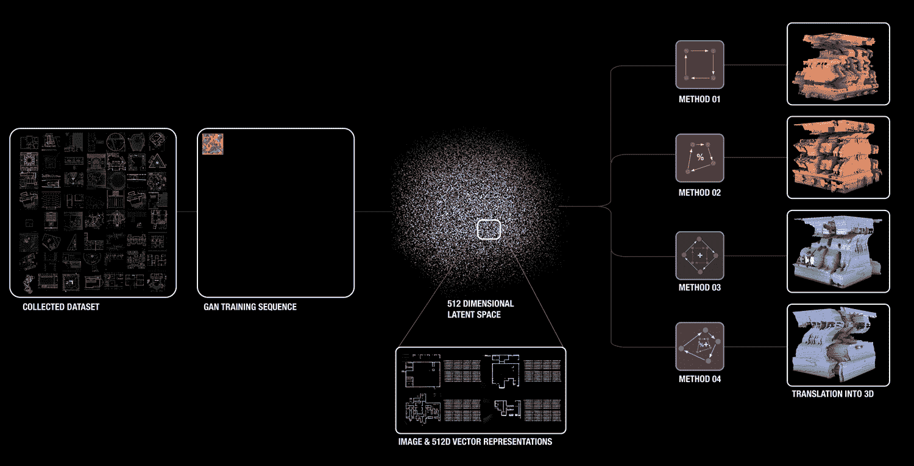

管道流程图|来源:作者

虚拟环境代表建筑师当前设计、分析、编辑和生成 3D 结构的数字设计空间。目前使用的工具，如 Rhino3D，侧重于正交方法，并依赖于曲线，直线，曲面，NURBS 等。，并操纵这些元素在 3D 虚拟空间中创建设计。在本文中，我们通过训练机器来初始化一个 512D 虚拟设计环境，并提出在该空间中进行设计的不同方法。

## I .初始化虚拟环境

为了初始化虚拟环境，StyleGAN 模型在从几个不同的在线来源(如 ArchDaily 和 Artstor)收集的 5000 个建筑平面图上进行训练。收集的数据集主要由不同风格和时期的房屋平面图组成。这允许对机器可能学习的可能图像特征进行更好的控制。在训练之后，生成 512D 的潜在空间，其中具有相似特征的数据点(表示图像)在该空间中被放置得更靠近。我们使用这个生成的“虚拟环境”作为搜索和设计可能性的设计基础。

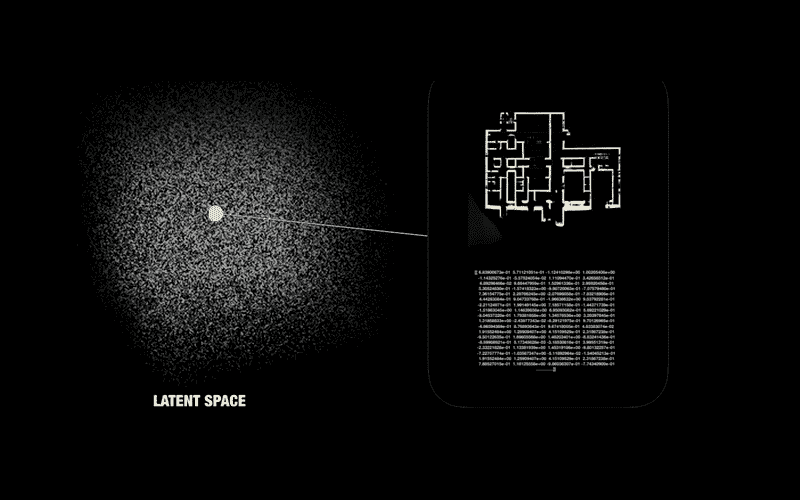

潜在空间|来源:作者

## 二。进入空间

接下来的一步就是进入这个空间。我们使用两种主要方法来访问这个潜在空间的维度:通过点生成，通过随机使用 512 维向量(图像)的一组值，或者通过用户选择或设计的绘图的图像嵌入。

在第一种方法中，机器遍历潜在空间并生成对应于指定向量值的图像。在第二种方法中，可以使用 StyleGAN 嵌入算法，其中机器将嵌入的图像映射到空间中最接近具有相似特征的图像的特定点。

## 三。遨游太空

在这个空间中生成或选择点之后，我们在矢量算术运算中使用这些点来创建新的点，然后将这些点转换为图像。举例来说，通过添加向量，我们组合空间中具有不同特征的不同点，并生成一个新点。具体来说，就建筑平面图而言，通过在空间中添加不同的点(图像向量)，我们正在添加对应于建筑设计中不同属性和可能风格的平面图的向量，这取决于初始数据集是什么。这允许有目标但不可预测的图像生成。下图显示了我们流程中的一个输出。

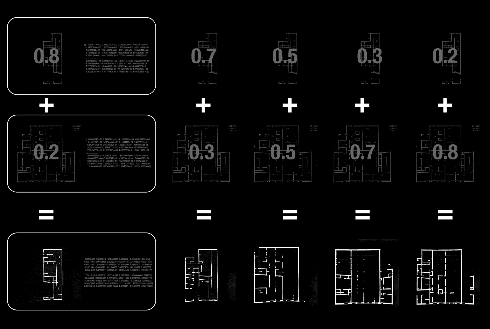

混合不同因素的计划|来源:作者

此外，除了组合向量，我们在两个或更多点之间进行线性插值。通过从一个点到另一个点的插值，我们创建了一系列具有不同数量的步骤或相似度的变换或过渡图像，如下图所示。

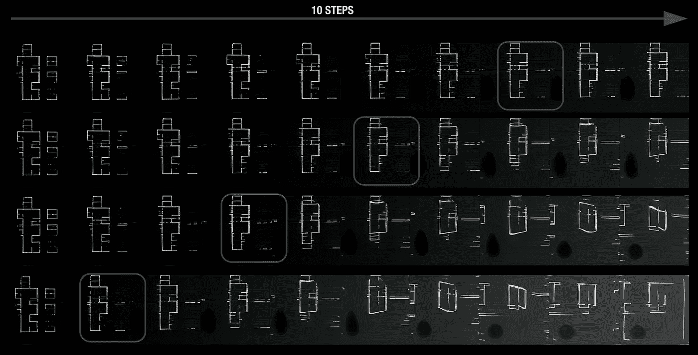

不同系数的􀀗interpolating |来源:作者

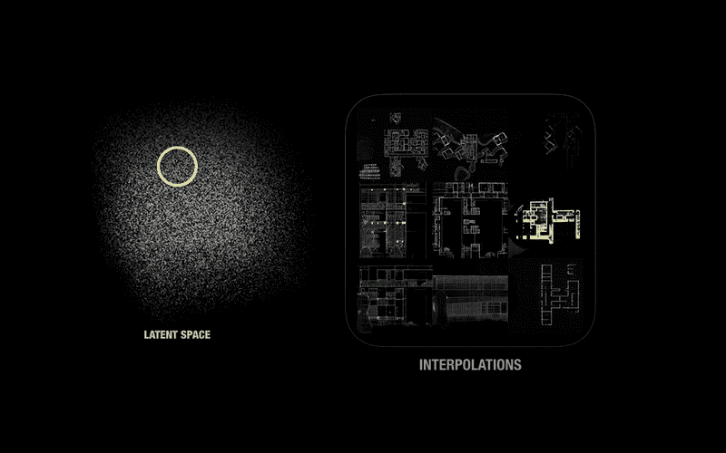

插值|来源:作者

## 四。生成 3D 体素化结构

最后，为了创建 3D 形状，我们堆叠在 Z 空间中生成的一系列图像，并生成体素结构。为此，在该步骤中，内插图像的像素值被读取并被转换成定义实体体素体积的布尔值的 3D 阵列。

这种生成的虚拟环境(潜在空间)作为我们当前计算工具(如 Rhino 和 AutoCAD)环境的替代空间。在一台机器的空间内工作会带来新的偏见。然而，我们认为当前的“机械”操作通常在当前的 3D 建模软件中执行，如切片、放样、修剪等。，通过遵循一系列步骤和规则来产生相对可预测的输出。

然而，通过我们集成的非顺序和非逻辑管道和潜在空间方向导航技术，我们的目标是摆脱操纵工具的曲线、直线和表面的既定方法，并转向使用矢量算术运算和像素和体素作为横向思维方法的构建块。这种方法可以为设计和激发新的空间和形式概念提供新的机会。此外，在这个过程中，机器在设计输出中扮演着积极的角色，而不仅仅是达到目的的手段。在接下来的部分中，我们将通过一系列独特的 3D 形式来展示这一点，这些形式是在潜在空间中使用 4 个初始起点生成的。

# 结果

为了测试我们的管道，我们在生成的潜在空间中选择 4 个随机点(平面图的图像:A、B、C、D ),并获得它们的矢量表示。然后，我们测试了 4 种不同的插值方法和在这些点之间导航的方法，并生成了总共 200 幅图像，我们稍后将使用这些图像来生成 3D 体素结构。

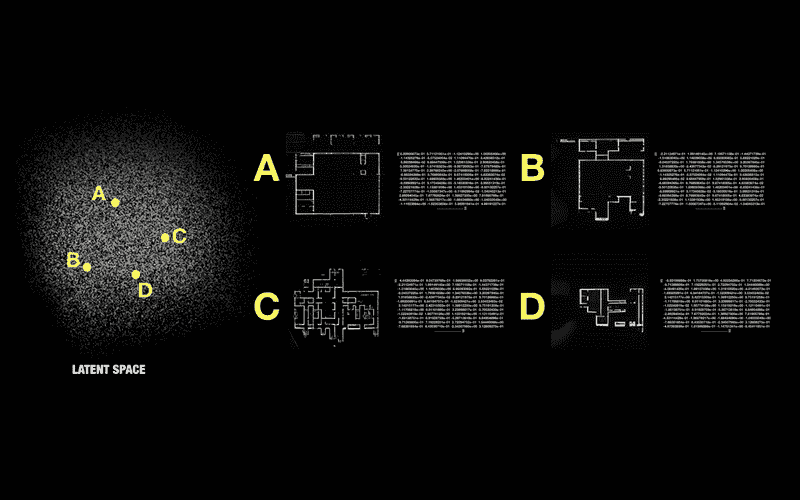

随机点|来源:作者

## 一.导航方法 1:等比例

在第一种方法中，我们测试了在插值期间两个平面之间的比率变化对生成形式的影响。作为第一个测试，我们给两个计划一个平等的机会(50:50)。

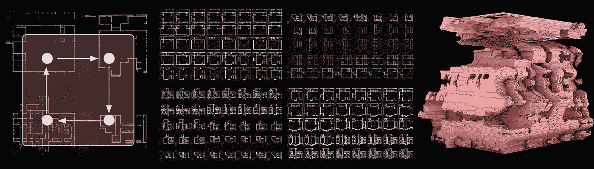

等比|来源:作者

## 二。导航方法 2:不等比率

在第二种方法中，我们改变每个插值点的比率。通过改变比率，我们给其中一个图像更高的百分比，以生成与其自身比与另一个图像更相似的图像。

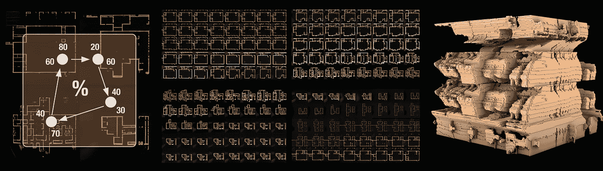

不平等比率|来源:作者

## 三。导航方法 3:混合

对于第三种方法，我们找到两个点的平均向量，我们在这两个点之间进行插值，并在这些新向量之间进行插值。在这个步骤中，在图像之间进行 50:50 的插值。在下图中，我们显示了每个平面图像的不同百分比的混合结果。

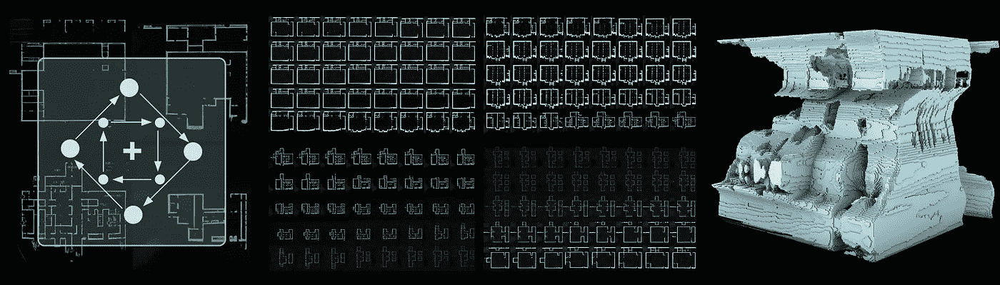

混合|来源:作者

## 四。导航方法 4:组合混合和不等比率

最后，在最后一种方法中，我们结合了最后两种方法:混合和不等比插值。

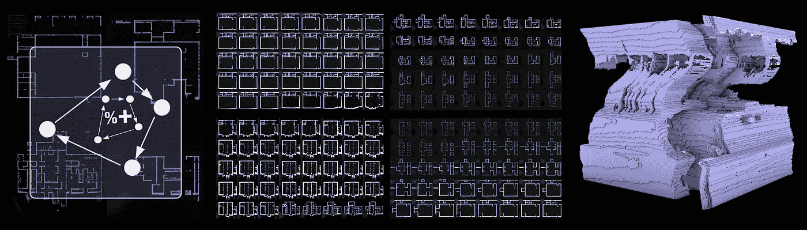

混合和不平等比率|来源:作者

上图展示了四种方法的性能。所有这些方法的插值顺序都是从 A 点到 B 点，然后到 C 点，最后到 D 点，每次插值之间有 50 步。

## 动词 （verb 的缩写）改变顺序

然而，以这种顺序进行插值仅仅是一种可能的方法。在下图中，我们看到了点与点之间不同顺序的插值结果，并展示了这种简单的变化如何显著影响生成的输出。

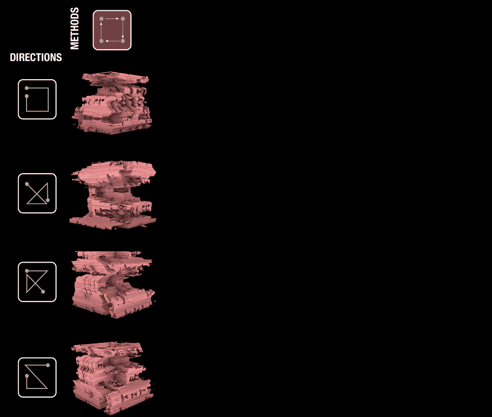

使用相同的点但不同的插值序列生成的表格|来源:作者

## 不及物动词改变点

此外，所有这些 3D 结构都是在四个选定点之间进行插值的结果。然而，在如此广阔的潜在空间中，我们有无限的选择空间。下图显示了由不同组的 4 个初始点生成的输出图库。

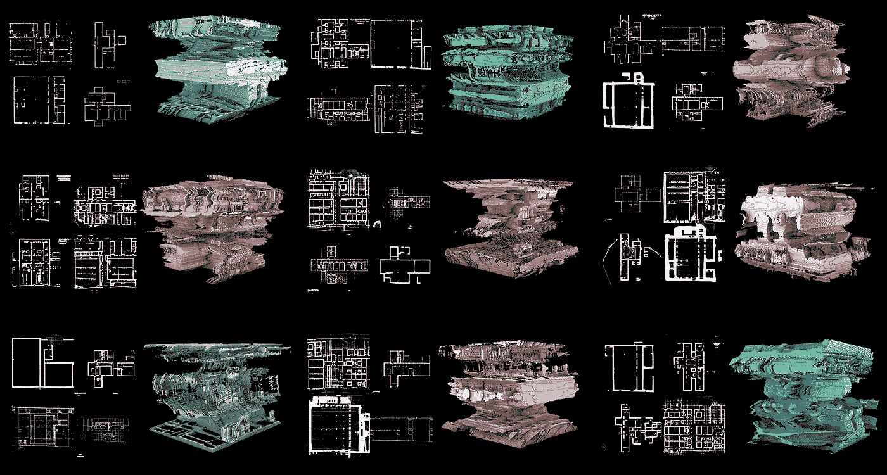

使用 4 个初始点的不同集合生成的表格|来源:作者

# 讨论

本文中对 gan 及其内部属性的使用向我们展示了一组新的交互方法，这些方法通常位于传统的架构学科边界之外。通过将这些离散的步骤结合到我们的过程中，我们展示了一个替代的实验空间，其中的形式是通过一系列不同的连续 2D 图像间接生成的。我们认为，使用像素和体素作为建筑的组成部分可以将建筑图纸从精确的工具中解放出来，还可以检索图纸的潜在生成性和横向思维。虽然产生于建筑平面图，但由此产生的高度复杂的形式画廊落在概念模型和建筑结构的交叉点上，描绘了独特的美学特征，并超越了我们今天熟悉的建筑输出。

尽管这些形式源自 2D 计划，但这种方法并不意味着是建筑项目的唯一驱动力。此外，在生成 3D 结构后，需要建筑师的专业知识来将这些形式转化为有意义的架构方案。因此，为了将其转化为一个实用的工具，需要进行进一步的探索，以更好地理解所用方法产生的结果的差异和变化。

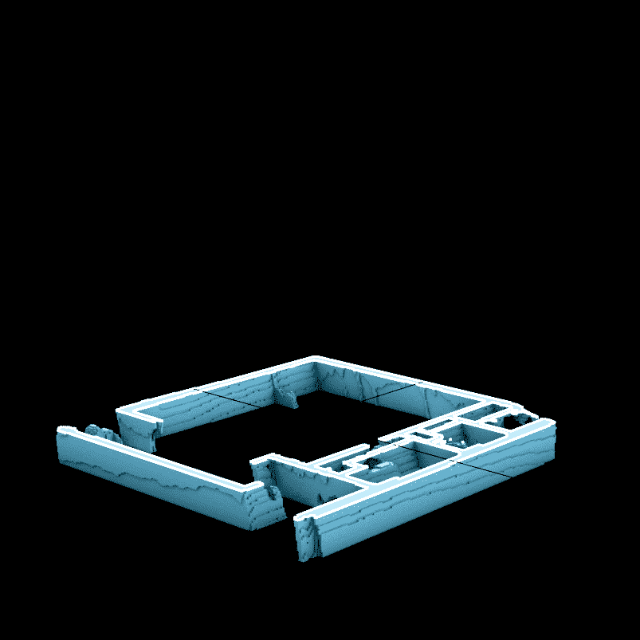

3D 结构部分|来源:作者

然而，引入的管道，如果整合到我们的数字流程中，允许产生几个不同的输出，这些输出可能不一定彼此直接相关，这些质量与横向思维方法非常一致。这种方法，以其众多不同的输出和实验性质，可能允许设计者从一个新的角度看待一个问题，或激发新的思考方式。因此，这项新的研究不仅有可能为设计过程中的潜在思维创造新的机制，还可以让设计师摆脱既定的思维方式，并质疑我们通常认为理所当然的工具中嵌入的当前设计技术。

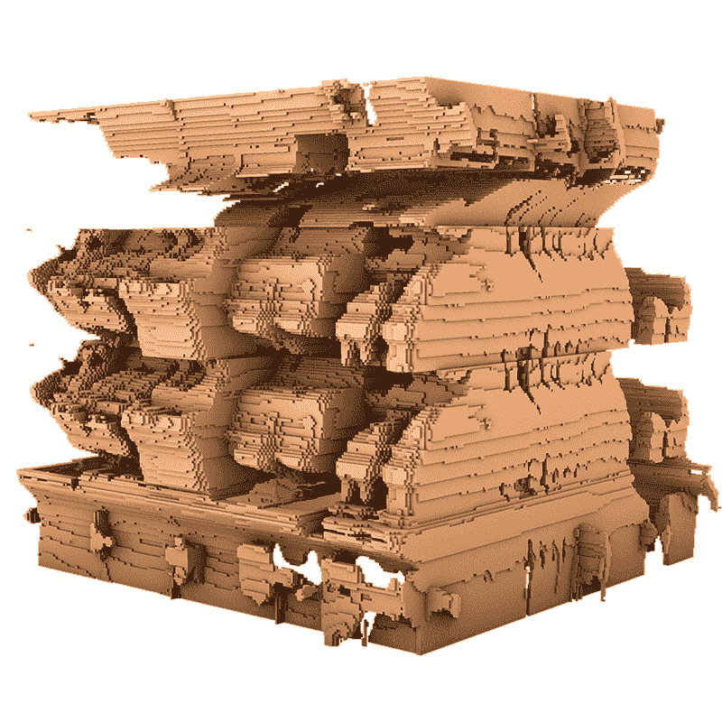

生成的结构|来源:作者

# 结论

这篇文章展示了未来探索设计工具的管道，这些工具鼓励并强调建筑计算工具中的实验和横向思维方法，这些品质在我们今天的工具中并没有得到优先考虑。具体来说，在本文中，我们介绍了一个 4 步人工智能驱动的管道，它使用机器的潜在空间作为数字环境进行设计，我们演示了在这个空间中导航以生成 3D 体素结构的示例。该过程的结果旨在作为可能的架构过程场景的示例，并作为当前方法到推测性设计方法之间的过渡。

我们假设，这样的管道，如果完全整合到数字建筑工具中，可能使我们能够将横向思维融入到我们当前的数字过程中，并将我们的建筑工具从工业时代的思维中拉出。因此，通过强化不确定性和不可预测性，这门学科的课程可以根据我们的数字未来进行调整。

这篇文章还提出了计算机不仅作为工具，而且作为设计过程中的合作者的使用，以及人机交互的下一步。与我们今天拥有的数字工具不同，所呈现的管道不是遵循直接的输入输出关系，而是允许机器自由地处理像素，并贡献自己对输入的理解来生成绘图。这种基于机器感知和习得特征的不精确和不准确的特殊空间是想象力和横向思维的潜力所在。这为我们提供了以新的和新颖的方式处理建筑图纸的机会，并可能允许发现新的空间和以前“不可想象”的概念。这也引入了一个由人类逻辑和偏见做出的设计决策，并允许我们重新想象我们的设计方式，以及我们如何以新的和令人兴奋的方式表达我们的建筑环境。

# 参考

奥斯汀，m .，&马修斯，L. (2018 年 1 月)。绘图不精确:以位和像素表示的数字绘图。《不精确和不忠的重新校准——建筑计算机辅助设计协会第 38 届年会论文集》，ACADIA 2018。

博诺，经济学博士(1985 年)。六顶思考帽。利特尔·布朗公司。

Chaillou，S. (2019 年 7 月 17 日)。ArchiGAN:公寓建筑设计的生成堆栈。检索自[https://dev blogs . NVIDIA . com/archigan-generative-stack-apartment-building-design/](https://devblogs.nvidia.com/archigan-generative-stack-apartment-building-design/)

马萨诸塞州克莱普尔(2019)。大会 2019。大会 2019。从 https://www.youtube.com/watch?v=PxAQL7y9wCw[取回](https://www.youtube.com/watch?v=PxAQL7y9wCw)

马萨诸塞州克莱普尔(2020 年 1 月 9 日)。建筑中的数字:过去、现在和未来。从[https://space10.com/project/digital-in-architecture/](https://space10.com/project/digital-in-architecture/)取回

纽约克罗斯(2006 年)。设计者的认知方式。斯普林格伦敦。doi:10.1007/1–84628–301–9。

k .多斯特和 n .克罗斯(2001 年)。设计过程中的创造力:问题解决方案的共同进化。设计研究，22(5)，425–437 页。

黄，魏，郑，H. (2018 年 10 月)。基于机器学习的建筑图纸识别和生成。《建筑计算机辅助设计协会(ACADIA)第 38 届年会论文集》，墨西哥墨西哥城(第 18-20 页)。

t .卡拉斯、s .莱恩和 t .艾拉(2019 年)。一种基于风格的生成对抗网络生成器体系结构。IEEE 计算机视觉和模式识别会议论文集(第 4401–4410 页)。

Klemmt，c .，Pantic，I .，Gheorghe A .，Sebestyen，a .(2019)。离散与离散生长:用细胞生长模拟生成的几何形状的离散制造。《阿卡迪亚学报》，2019 年。

劳森，B. (2006 年)。设计师如何思考:设计过程去神秘化？劳特利奇。

刘，h，廖，l，斯里瓦斯塔瓦，A. (2019)。匿名作文。《阿卡迪亚学报》，2019 年。

j .梅(2018)。信号。形象。建筑。哥伦比亚大学出版社。

米勒，人工智能(2019)。机器中的艺术家:人工智能驱动的创造力世界。麻省理工出版社。

1999 年，张克宏，郑春燕，森和古川。House-GAN:用于图约束房屋布局生成的关系生成对抗网络。arXiv 预印本:2003.06988。

牛顿博士(2019)。建筑设计中的生成性深度学习。技术|建筑+设计，3(2)，176–189。

伊索拉，p .，朱，J. Y .，周，t .，& Efros，A. A. (2017)。基于条件对抗网络的图像到图像翻译。IEEE 计算机视觉和模式识别会议论文集(第 1125-1134 页)。

Retsin，G. (2019)。离散:重新评价建筑中的数字化。约翰·威利父子公司。

m . w . Steen son(2017 年)。建筑智能:设计师和建筑师如何创造数字景观。麻省理工出版社。