# 计算机视觉:卷积基础

> 原文：<https://towardsdatascience.com/computer-vision-convolution-basics-2d0ae3b79346>

## 深入探究许多神经网络的基本单元。

图 0:火焰的火花，类似于使用卷积提取的特征(图片由作者提供)

在这个深度学习的时代，我们有先进的计算机视觉模型，如 YOLO、Mask RCNN 或 U-Net 等，所有这些模型背后的基础细胞是卷积神经网络(CNN)，或者更精确地说是卷积运算。这些网络试图解决对象检测、分割和实时推理的问题，这导致了许多现实生活中的用例。

因此，让我们来看看基础知识，在这一系列教程中，我将深入探讨以下基本主题，以创建能够带来许多此类创新的整体学习:

1.  卷积的 A-Z。
2.  深入分析 1D，2D 和三维有线电视新闻网层。
3.  CNN 在 2D 的前向传播。

说够了…我们开始吧:)

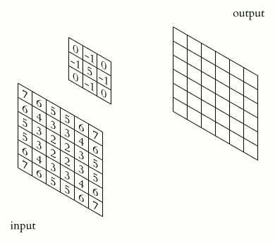

图 1: 2D 卷积示例([维基媒体](https://commons.wikimedia.org/wiki/File:2D_Convolution_Animation.gif))

# 介绍

在本教程中，我们将发现卷积运算符及其各种参数的本质。完成本教程后，您将了解:

1.  回旋
2.  过滤器和内核
3.  步幅和衬垫
4.  真实世界的用例

什么是卷积？这有什么关系？为什么要用卷积？

这些是每个数据科学家在其深度学习之旅中至少会遇到一次的一些问题。我时不时会有这些疑问。

> 因此，从数学上讲，卷积是两个函数(矩阵)上的一个运算符，它产生第三个函数(矩阵)，第三个函数是具有不同特征(矩阵中的值)的另一个函数的修改输入。

在计算机视觉中，卷积通常用于从输入图像中提取或创建特征图(在内核的帮助下)。

# 基本术语

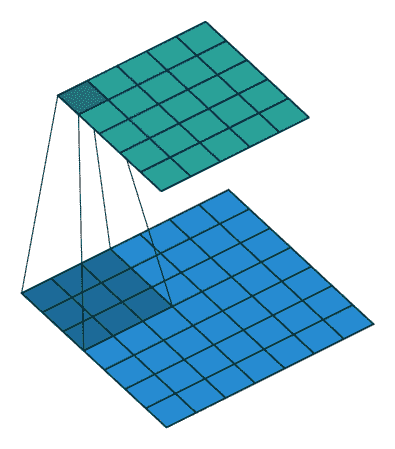

图 2: 2D 卷积(GIF 由[文森特](https://github.com/vdumoulin/conv_arithmetic)提供)

在上图中，蓝色矩阵是输入，绿色矩阵是输出。而我们有一个内核通过输入矩阵来获取/提取特征。所以我们先来了解一下输入矩阵。

**输入矩阵:**一幅图像由像素组成，其中每个像素都在[0，255]的包含范围内。所以我们可以用矩阵来表示一幅图像，每个位置代表一个像素。像素值代表其亮度，即 pixel - > 0 为黑色，pixel - > 255 为白色(最高亮度)。灰度图像只有一个像素矩阵，即它没有任何颜色，而彩色图像(RGB)有 3 个通道，每个通道代表其颜色密度。

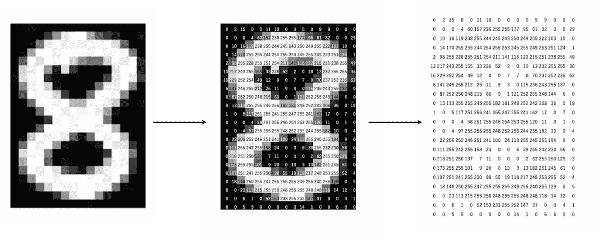

图 3:数字 8 的灰度图像；形状(24x 16)；每个像素(0-255)代表颜色的亮度/密度(图片由作者提供)

上图的形状是:(24，16)其中高度= 24，宽度= 16。类似地，我们有一个有 3 个通道的彩色图像(RGB ),它可以用一个形状矩阵来表示:(高度、宽度、通道)

现在，我们知道了卷积算子的第一个输入是什么，但是如何对这个输入进行变换，得到输出的特征矩阵。这里出现了术语“**内核**，它作用于输入图像以获得所需的输出。

**内核:**在一幅图像中，我们可以说一个像素包围另一个像素具有相似的值。为了利用图像的这一特性，我们有了核。核是一个小矩阵，它使用定位能力从给定的图像(输入)中提取所需的特征。通常，内核比输入图像小得多。我们有不同的内核用于不同的任务，如模糊，锐化或边缘检测。

> 卷积发生在输入图像和给定的核之间。它是输入图像的内核和本地化部分之间的滑动点积。

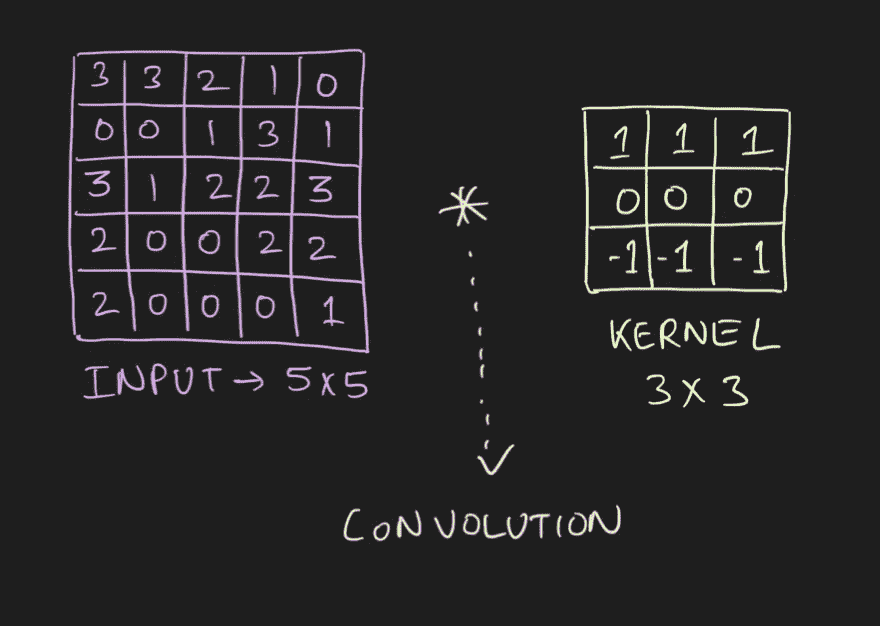

图 4:输入(5，5)；内核(3，3)；卷积 2D(作者图片)

在上面的图像中，对于第一次卷积，我们将在图像中选择一个 3x3 的区域(顺序)，并与内核进行点积。哒哒！这是我们做的第一个卷积，我们将逐个像素地移动感兴趣的区域。

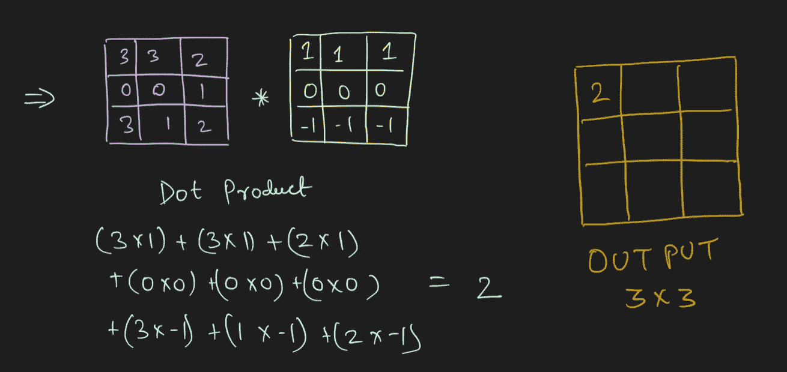

图 5:图像中内核和选定区域之间的卷积(图片由作者提供)

感兴趣区域(ROI)的维度总是等于核的维度。我们在每个点积之后移动这个 ROI，并继续这样做，直到我们得到完整的输出矩阵。

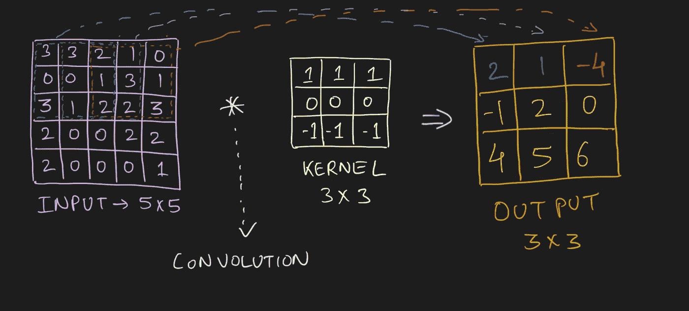

图 6:水平核的 2D 卷积(图片由作者提供)

现在，我们知道了如何执行卷积，输入到底是什么，以及内核是什么样子。但是在每个点积之后，我们将 ROI 滑动一些像素(可以跳过 1、2、3 …个像素)。该功能由一个名为**步幅**的参数控制。

**步幅:**该参数控制/修改图像中 ROI 的移动量。大于 1 的跨距用于减小输出尺寸。直观地说，它跳过了每个点积中的几个像素的重叠，这导致了输出的最终形状的减少。

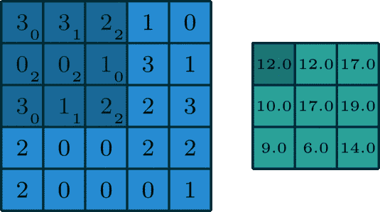

图 7:2D 卷积的例子

在上面的图像中，我们总是将 ROI 移动 1 个像素，并使用内核执行点积。但是如果我们增加步距，假设步距= 2，那么输出矩阵的维数将是-> 2 x 2(图 8)。

图 8:2D 卷积中的步幅= 2

# 多通道图像卷积

现在，我们知道了输入是什么样子，还有一些通用参数，比如 kernel 和 stride。但是，如果我们在图像中有多个通道，即图像是彩色的，或者更准确地说，如果输入矩阵的形状是:(高度、宽度、通道)，其中通道大于 1，那么卷积如何工作呢？

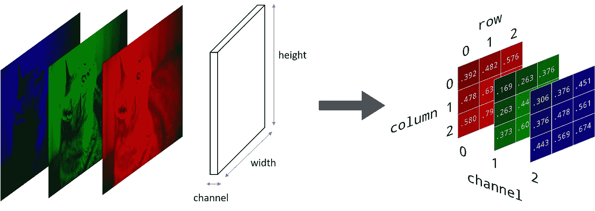

图 9:彩色图像；RGB (BGR)通道(图片由作者提供)

现在你可能有一个问题，我们只有一个内核，如何在一堆 2D 矩阵上使用它(在我们的例子中，三个 2D 矩阵堆叠在一起)。所以这里我们将引入术语'**滤波器**。

> 通常人们会互换过滤器和内核，但实际上它们是不同的。

**滤波器:**是一组用于图像卷积的核。例如:在一个彩色图像中，我们有 3 个通道，对于每个通道，我们有一个内核(用于提取特征)，一组这样的内核被称为过滤器。对于灰度图像(或 2D 矩阵)，术语**滤波器**等于**内核。**在一个过滤器中，所有的内核可以相同，也可以不同。特定的核可以用于提取特定的特征。

那么卷积是如何发生的呢？

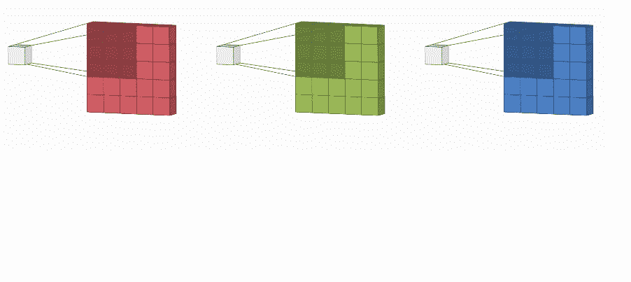

图 10:彩色图像上的 2D 卷积

每个通道由它的内核来执行(完全类似于灰度图像上的卷积)以提取特征。所有的内核应该有相同的尺寸。因此，我们将多个输出矩阵(每个通道一个)组合(借助矩阵加法)成一个输出。

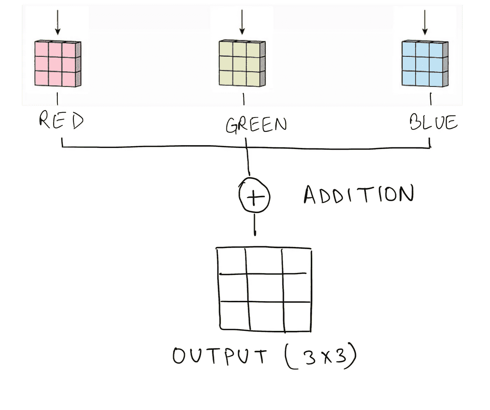

图 11:将多个通道的输出聚合成一个通道(图片由作者提供)

因此输出是给定图像的特征图(提取的特征)。我们可以进一步将该输出与经典的机器学习算法一起用于分类/回归任务，或者该输出也可以被用作给定图像中的变化之一。

# 填充和输出尺寸

此时，我们对图像和内核之间的卷积是如何发生的有了相当不错的理解。但这还不够。有时，需要得到与给定输入尺寸相同的精确输出尺寸，我们需要将输入转换成不同的形式，但大小相同。下面是**填充**的用法。

**填充**:它有助于保持恒定的输出大小，否则在使用内核的情况下，输出是一个较小的维度，在某些情况下可能会产生瓶颈。此外，填充有助于保留图像边界的信息。在填充中，我们用假像素填充图像的边界(边缘)。更常见的是，我们使用零填充，即在矩阵的边缘添加暗像素，这样原始边缘像素的信息不会丢失。

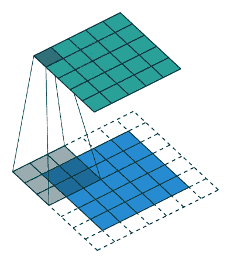

图 12:填充示例([Vincent](https://github.com/vdumoulin/conv_arithmetic)的 GIF)

我们还可以添加多个填充，即，我们可以在边界使用 n 个像素，而不是在每个边缘使用单像素填充。这通常由卷积中使用的核维数决定。

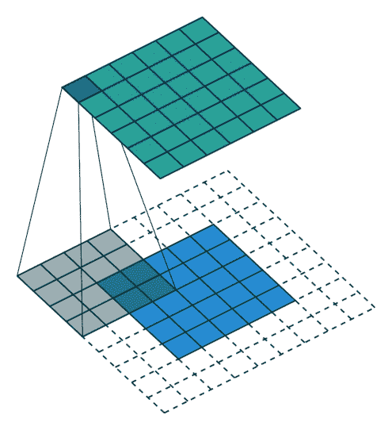

图 13:2D 卷积中两个像素的填充

恭喜你！我们已经讲述了卷积运算的基本概念。但是，我们如何知道矩阵的输出形状呢？为了回答这个问题，我们有一个简单的公式来帮助计算输出矩阵的形状。

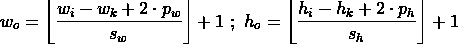

图 14:计算输出矩阵的宽度和高度(图片由作者提供)

其中:
wᵢ - >输入图像宽度，hᵢ - >输入图像高度
wₖ - >内核宽度，hₖ - >内核高度
sᵥᵥ - >步幅为宽度，sₕ - >步幅为高度
pᵥᵥ - >沿图像宽度填充，pₕ - >沿图像高度填充

通常，卷积中的填充、步幅和内核是对称的(高度和宽度相等)，这将上述公式转换为:

图 15:对称输入图像的宽度/高度和其他参数的计算(图片由作者提供)

其中:
i - >输入形状(高度=宽度)
k - >内核形状
p - >沿图像边缘填充
s - >用于卷积的步幅(用于滑动点积)

那么，现在怎么办？在接下来的部分中，我们将学习不同类型的内核，它们被设计来对图像执行特定的操作。

# 图像内核

卷积有两种不同的用法:或者在梯度下降的帮助下利用卷积神经网络中的可学习内核，或者利用预定义内核来转换给定图像。今天，我们将关注后一种，并学习在内核的帮助下，所有不同类型的转换都是可能的。

让我们把这看作一个输入图像。

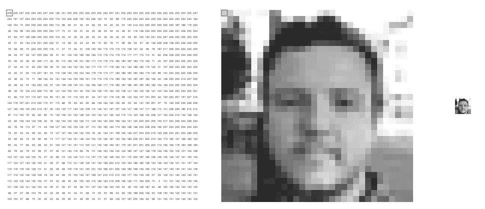

图 16:输入图像(代表图像的矩阵)(图像由[维克多](https://setosa.io/ev/image-kernels/)拍摄)

现在，在内核的帮助下，并对输入图像和给定内核使用卷积，我们将给定图像转换成所需的形式。下面是一些变换，可以在图像卷积中的自定义内核的帮助下完成。

1.  检测水平线和垂直线
2.  边缘检测
3.  Photoshop 中的模糊、锐化、轮廓、浮雕和其他各种变形
4.  侵蚀和膨胀

那么我们先来看一个最基础的内核，它就是**模糊内核。**模糊内核有很多种，但最著名的是高斯模糊和方块模糊。

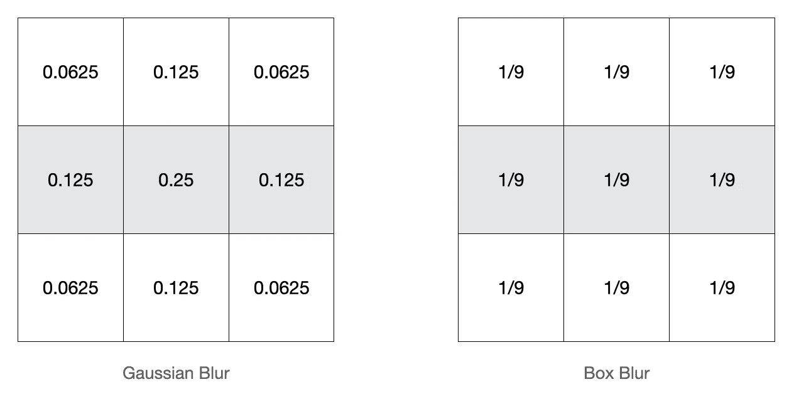

图 17:模糊内核(作者图片)

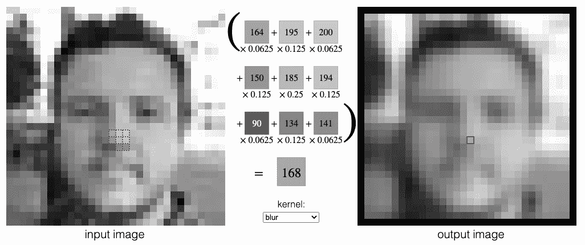

图 18:给定图像上的高斯模糊(图像由[维克多](https://setosa.io/ev/image-kernels/)拍摄)

类似地，其他内核有助于将图像转换成所需的形式。在上面的图片中，我们有一个很好的插图来尝试不同的内核:【https://setosa.io/ev/image-kernels/

但一般来说，有一些核心，我们作为数据科学家应该掌握，它是线检测核心，主要包括水平，垂直和对角线。

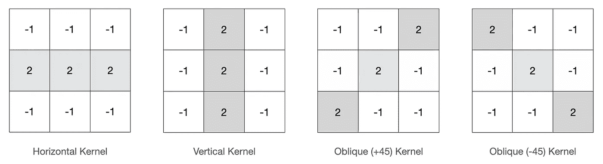

图 19:线条检测内核(图片由作者提供)

从上图来看，这些线检测内核的直观性非常清晰。假设任务是检测图像中的水平线。让我们构建一个相同的内核。所以一般来说，3 x 3 内核是一个不错的选择。现在来检测水平线(根据上面的直觉),如果我们减去所有附近的像素，认为它是一条水平线。在这种情况下，水平线将很容易看到，因为我们已经减少了其附近的像素值，这将是一条直线或与我们希望检测的线类型精确平行。

但是对于要检测的线，我们应该以什么样的比例减少附近的像素或者增加像素呢？实际上，这完全取决于用例以及内核的几次迭代，以获得良好的匹配。

我们来玩一下给定的水平核及其卷积结果。

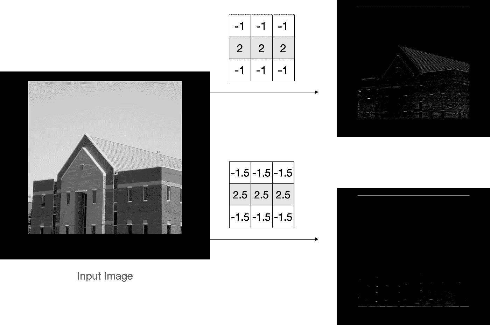

图 20:水平线检测(图片由作者提供)

惊讶！因此，从图 20 中，我们可以很容易地说明，如果我们增加基本水平内核中的值，那么只会检测到几行。这就是内核对图像的影响。此外，我们还可以通过给定值的对称修改来增加/减少给定核的密度。

这就是了…希望你了解并喜欢:D 的博客

# **结论**

在给定的博客帖子中，讨论了以下主题:

1.  卷积的基本术语:输入、内核、步长、填充、滤波器
2.  灰度图像和彩色图像的区别
3.  灰度和彩色图像的 2D 卷积
4.  卷积运算符输出的形状
5.  探索不同的图像内核

在接下来的教程中，您将了解 CNN 图层的深入工作、CNN 图层的前向和后向传播、不同类型的 CNN 图层以及一些用于提取特征地图的最新深度学习模型。

# 参考

[1] CS231n 用于视觉识别的卷积神经网络*、*、[https://cs231n.github.io/convolutional-networks/](https://cs231n.github.io/convolutional-networks/)

[2] Vincent Dumoulin，Francesco Visin，深度学习卷积算法指南，[https://arxiv.org/abs/1603.07285](https://arxiv.org/abs/1603.07285)

[3]线路检测，【https://en.wikipedia.org/wiki/Line_detection】T2

[4] Irhum Shafkat，直观理解用于深度学习的卷积，[https://towards data science . com/intuitive-Understanding-Convolutions-for-Deep-Learning-1 f6f 42 faee 1](/intuitively-understanding-convolutions-for-deep-learning-1f6f42faee1)

[5]维克托·鲍威尔，图像内核，[https://setosa.io/ev/image-kernels/](https://setosa.io/ev/image-kernels/)