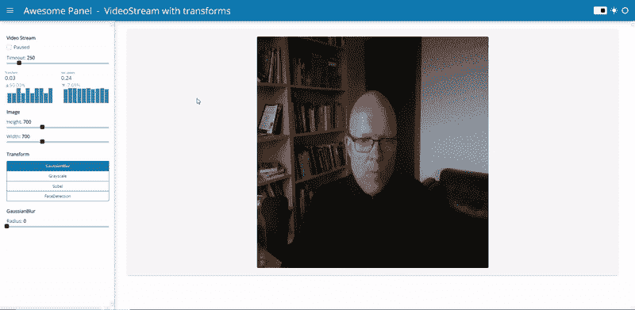
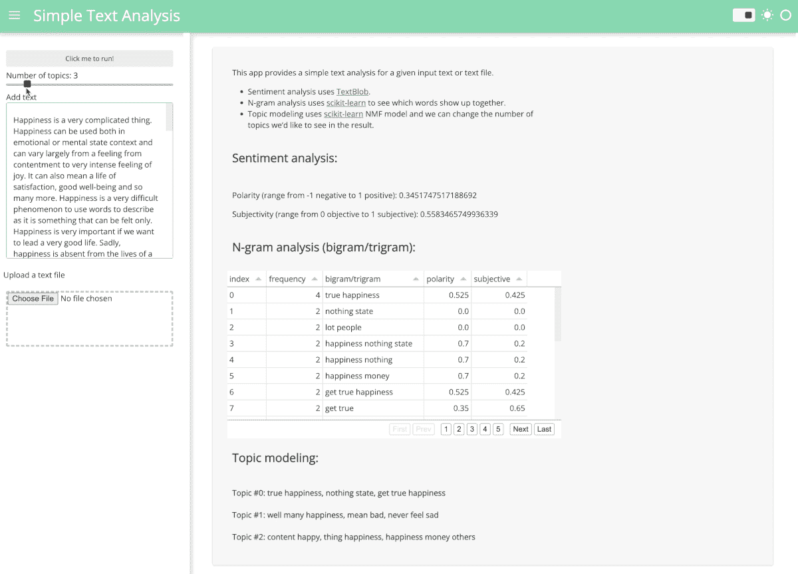
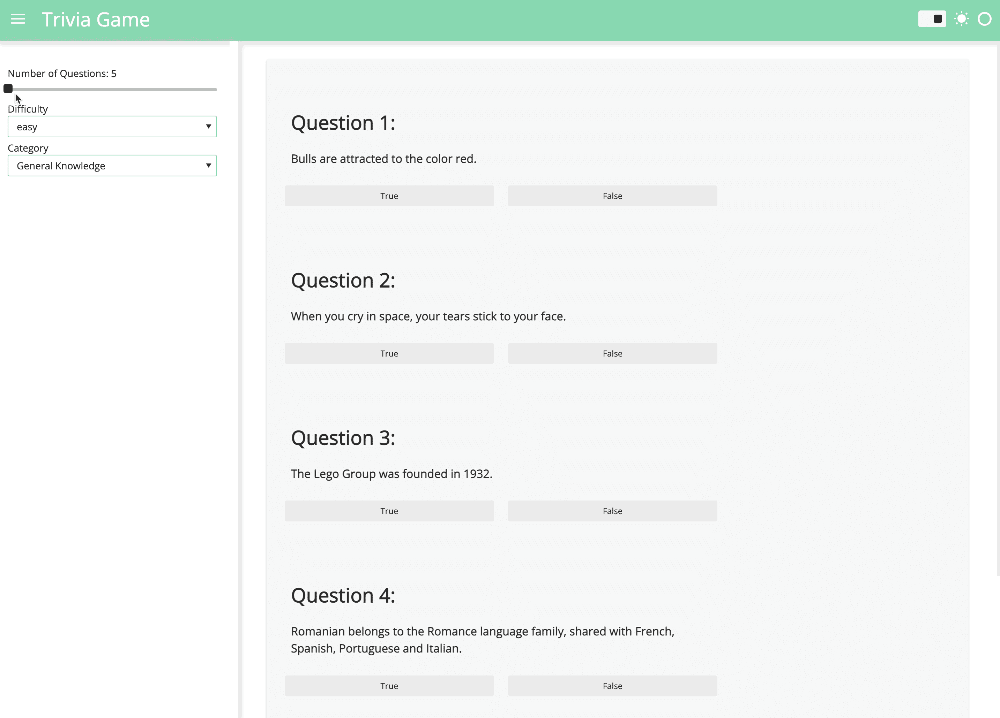

# 浏览器中的计算机视觉、自然语言处理和游戏

> 原文：<https://towardsdatascience.com/computer-vision-nlp-and-gaming-in-the-browser-8e5fcf895a14>

## 释放 Python Panel、Pyodide 和 PyScript 的威力

由[索菲亚·杨](https://twitter.com/sophiamyang)和[马克·斯科夫·麦德森](https://twitter.com/MarcSkovMadsen)


照片由 [Karly Santiago](https://unsplash.com/@clothandtwig?utm_source=unsplash&utm_medium=referral&utm_content=creditCopyText) 在 [Unsplash](https://unsplash.com/?utm_source=unsplash&utm_medium=referral&utm_content=creditCopyText) 上拍摄

我们现在生活在一个可以在浏览器中运行 Python 的时代，拥有 WebAssembly、Pyodide 和 PyScript 的强大功能！这对数据从业者和开发者意味着什么？这意味着我们可以运行计算机视觉任务，NLP 任务，甚至完全用 Python 开发游戏，并直接在浏览器中运行您的 Python 代码。一切都发生在你的浏览器里！

本文将向您展示三个简单的示例，展示在浏览器中运行 Python 计算机视觉应用程序、文本分析应用程序和简单的琐事游戏的潜力。

# 怎么会？

本文中的三个例子都是从 Python 面板仪表板开始的。 [Panel](https://panel.holoviz.org/) 是来自开源 HoloViz 生态系统的 dashboarding 库。要了解如何用 Python 制作面板仪表盘，请查看我们之前的博客文章[构建面板仪表盘的三种主要方式](/3-ways-to-build-a-panel-visualization-dashboard-6e14148f529d?sk=2cd93ae39586305bae8cfaead2bf7bb4)和[如何将面板可视化仪表盘部署到 Github 页面](https://medium.com/towards-data-science/how-to-deploy-a-panel-visualization-dashboard-to-github-pages-2f520fd8660)。

一旦你有了一个 Panel 应用`app.py`，用一行代码使用`panel convert`，你就可以将你的 Panel 应用转换成 WebAssembly(这个特性非常感谢 [Philipp Rudiger](https://twitter.com/PhilippJFR) ):

```
panel convert app.py — to pyodide-worker — out docs
```

Panel convert 可以使用 pyodide 或 pyscript 作为后端，但 pyodide worker 目前是更快的选择。查看[面板文档](https://panel.holoviz.org/user_guide/Running_in_Webassembly.html#formats)以了解您可以选择的不同参数。

# 计算机视觉



**自己试试 app**:[https://awesome-panel . github . io/examples/videostream-interface/app . html](https://awesome-panel.github.io/examples/videostream-interface/app.html)

**Code:**[https://github . com/awesome-panel/examples/blob/main/src/videostream-interface/app . py](https://github.com/awesome-panel/examples/blob/main/src/videostream-interface/app.py)

我们的第一个示例显示了一个计算机视觉应用程序，用于显示来自网络摄像头本地流的视频，并执行实时视频转换和人脸检测。该应用程序有两个主要组件:

*   `pn.widgets.VideoStream`是一个面板小工具，允许我们与网络摄像头流进行交互。
*   Scikit-image 是 Python 中的一个图像处理库，它处理所有的变换和人脸检测。

只需几百行 Python 代码，您就可以在 Python 广泛的开源库生态系统的基础上，轻松构建一个像这样进行复杂图像处理的应用程序。

# 自然语言处理



**自己试试 app:**[https://sophiamyang . github . io/panel _ simple _ text _ analysis/text _ analysis . html](https://sophiamyang.github.io/panel_simple_text_analysis/text_analysis.html)

**代码:**[https://github . com/sophiamyang/panel _ simple _ text _ analysis/blob/main/text _ analysis . ipynb](https://github.com/sophiamyang/panel_simple_text_analysis/blob/main/text_analysis.ipynb)

我们的第二个例子展示了一个简单的文本分析。您可以在输入文本框中键入文本或上传文件，然后您将看到该文本的情感分析、N 元语法分析和主题建模结果:

*   情感分析使用 [TextBlob](https://textblob.readthedocs.io/en/dev/) 并返回极性和主观性。极性范围从-1 到 1，其中-1 为负，1 为正。TextBlob 还可以使用主观性函数来计算主观性，主观性的范围是从 0 到 1，0 是客观的，1 是主观的。
*   n 元语法分析通常用于查看哪些单词经常一起出现。我们通常喜欢研究两个或三个单词的组合，即二元/三元模型。
*   有许多方法可以进行主题建模。在这个例子中，我们使用了[非负矩阵分解(NMF)方法](https://scikit-learn.org/stable/auto_examples/applications/plot_topics_extraction_with_nmf_lda.html)。

要了解更多关于 Python 中基本文本分析的知识，请查看我们的[之前关于这个主题的博文](/text-analysis-basics-in-python-443282942ec5?sk=a9fa5a9995fc6547d009119d5bec5094)。

# 赌博



【https://sophiamyang.github.io/panel_trivia_game/trivia.html】亲自试用 app:

**代码:**[https://github . com/sophiamyang/panel _ trivia _ game/blob/main/trivia . ipynb](https://github.com/sophiamyang/panel_trivia_game/blob/main/trivia.ipynb)

你能做一个游戏并在浏览器中运行吗？是的，绝对的！您的 Panel 应用程序完全不需要与数据相关。

在这个例子中，我们构建了一个非常简单的琐事游戏应用程序。我们定义了问题的数量、难度和游戏的类别，然后我们会看到一个问题列表，让我们决定每个问题是对还是错。这款应用有两点值得一提:

*   我们使用`requests`从 [Open Triva 数据库 API](https://opentdb.com/) 中获取琐事游戏问题。
*   类似于 Java 中的 SetOnClickListener 等方法和其他语言中的类似方法，使用 Panel，我们可以传递一个 Python 函数`on_click`来确定当有点击时执行什么。

这三个应用只是展示我们可以用 Panel 和浏览器做什么的潜力的开始，不需要服务器！再努力一点，你就可以制作更多复杂的面板应用程序，并在浏览器中运行它们。请随时在[https://discourse.holoviz.org/](https://discourse.holoviz.org/)分享您的申请，我们期待看到您的创造。

# **鸣谢:**

感谢 Jim Bednar 和 Phillipp Rudiger 的指导和反馈！

# **参考文献:**

*   [https://panel . holo viz . org/user _ guide/Running _ in _ web assembly . html](https://panel.holoviz.org/user_guide/Running_in_Webassembly.html)
*   [https://pyviz-dev . github . io/panel/reference/widgets/videostream . html](https://pyviz-dev.github.io/panel/reference/widgets/VideoStream.html)
*   [https://textblob.readthedocs.io/en/dev/](https://textblob.readthedocs.io/en/dev/)
*   [https://scikit-image.org/](https://scikit-image.org/)
*   [https://scikit-learn.org/stable/](https://scikit-learn.org/stable/)

. . .

由[索菲亚杨](https://twitter.com/sophiamyang)和[马克斯科夫麦德森](https://twitter.com/MarcSkovMadsen)于 2022 年 10 月 26 日。

Sophia Yang 是 Anaconda 的高级数据科学家。在 [LinkedIn](https://www.linkedin.com/in/sophiamyang/) 、 [Twitter](https://twitter.com/sophiamyang) 和 [YouTube](https://www.youtube.com/SophiaYangDS) 上与我联系，并加入 ds/ml[❤️读书俱乐部](https://discord.com/invite/6BremEf9db)