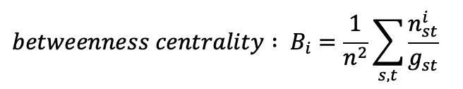
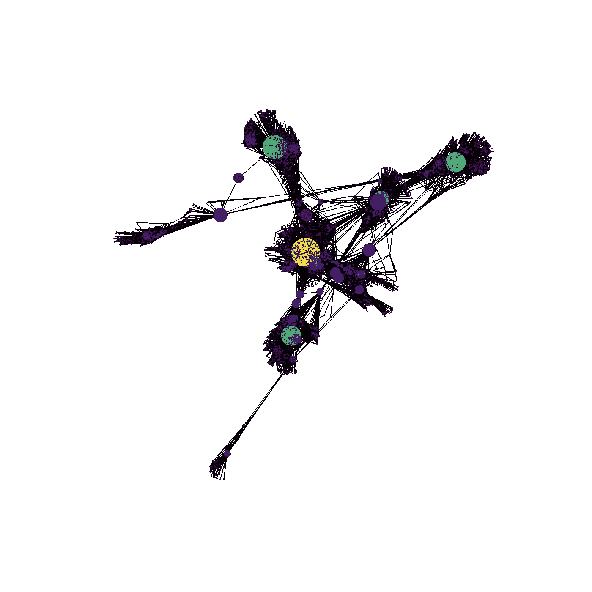
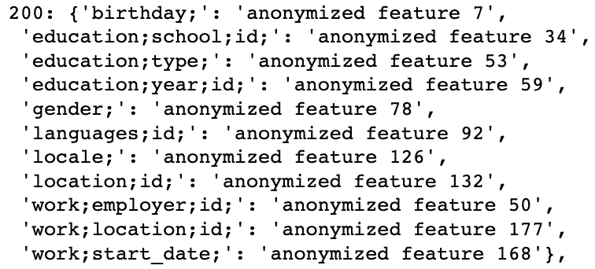
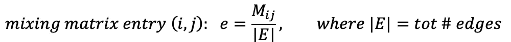
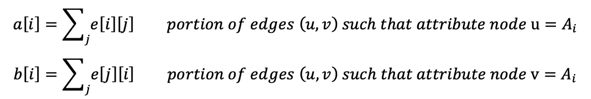
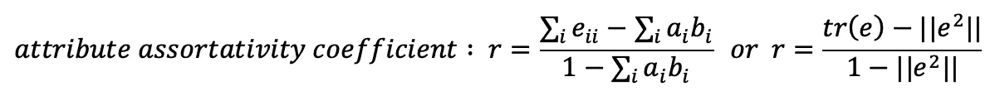
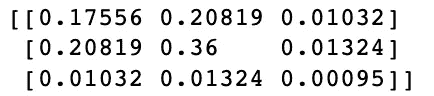
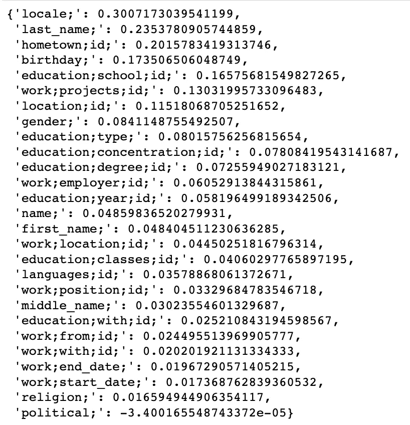

# 在社交网络数据集上计算分类系数

> 原文：<https://towardsdatascience.com/computing-assortativity-coefficients-on-a-social-network-dataset-7f65796feb70>

## 分类性有助于分析网络中的连接模式。让我们用它来确认人们是否倾向于与相似的人联系。

照片由[法比奥](https://unsplash.com/@fabioha?utm_source=medium&utm_medium=referral)在 [Unsplash](https://unsplash.com?utm_source=medium&utm_medium=referral) 上拍摄

在本文中，我们将使用一些脸书数据来探索网络分类性(也称为同向性)的概念，我们将其定义为节点连接到其相似节点的趋势。

网络或图形是由节点(顶点)和边(链接)组成的数据表示:在本文中，我们将只考虑无向和未加权的边。我们将首先呈现我们打算使用的数据集，经历数据加载和争论步骤，并呈现网络。

接下来，我们将介绍网络匹配度的概念。将使用的主要理论框架是 Newman 等人 2003 年[1]的文章，该文章定义并解释了网络分类度的概念。

然后，我们将把这一指标应用到数据集上，以确认是否——如文章所述——人们倾向于与和他们相似的人联系。

# 1.数据

文中用到的数据[2]可以从[本页](https://snap.stanford.edu/data/ego-Facebook.html)下载。我们需要两套文件:

1.  [文件](https://snap.stanford.edu/data/facebook_combined.txt.gz)“Facebook _ combined . txt . gz”包含来自 10 个网络的 4039 个节点的边。边以邻接表格式表示(即[0，1]表示节点 0 和节点 1 之间有一条边)。
2.  [文件](https://snap.stanford.edu/data/facebook.tar.gz)“Facebook . tar . gz”包含其他几个文件。我们将只使用”。“和”的壮举。featnames”文件，它对应于所有节点的网络属性(及其名称)。

# 1.1 加载网络

我们将使用 Python 中的 NetworkX 库。

导入主网络文件非常简单:

让我们快速浏览一下网络。以下表示允许显示两个重要特征:

1.  节点颜色将随节点度数(即每个节点拥有的连接数)而变化。
2.  节点大小将根据节点介数中心性而变化，介数中心性是一种量化节点有多少位于其他节点之间的路径上的度量，或者换句话说，该度量量化移除具有高介数中心性的节点会破坏网络的程度。这一指标的公式如下:

作者图片

n^i_st:表示从“s”到“t”经过节点“I”的最短路径数；
g_st:是从“s”到“t”的不一定经过节点“I”的最短路径总数；
n:是节点的总 nr，可以省略 1/n 项。

作者图片

# 1.2 添加节点属性

为了给节点分配属性，我们需要解析以下文件:

*   ".feat”文件包含 0/1 条目的矩阵。每行代表一个节点，每列代表一个属性。如果节点“I”具有属性“j ”,则条目
*   每一行都在”。featnames "文件包含来自"的相应列的名称。“档案壮举。这样，我们就能够理解每个属性的名称。

使用 nx 库，我们可以通过以下方式为节点分配属性:

最后，我们可以获得每个节点的所有属性信息，例如节点 id“200”:

作者图片

# 2.属性匹配系数

在社会网络的研究中，分析节点之间的连接模式起着重要的作用。分类性有助于理解人们是否倾向于连接到相似或不相似的节点，并且这种网络属性可能影响网络结构:例如，在离散属性上的强分类性可能将网络分成子网。假设出生年份是一个非常强的分类属性:因此我们可以期望不同年龄的人的子网连接在一起。

纽曼等人。all (2003)在他们的文章中定义了一种度量网络中的配合度的方法，即配合度系数(也可在 NetworkX 库 [Link1](https://networkx.org/documentation/stable/reference/algorithms/generated/networkx.algorithms.assortativity.attribute_assortativity_coefficient.html) 、 [Link2](https://networkx.org/nx-guides/content/algorithms/assortativity/correlation.html) ):

*   让我们考虑一个节点的属性*和*。该属性可以取值:*【A1，A2，…】*
*   我们可以构建一个*混合矩阵* M，其中条目 *e[i][j]* 表示网络(E)中 tot 条边的分数，该网络将具有属性 *A = A[i]* 的节点连接到具有属性 *A = A[j]* 的节点

作者图片

*   然后，我们构建以下数量:

作者图片

*   配合系数可以用下面的公式计算(第二个公式使用 tr()迹的矩阵符号。我们将在下面看到一个例子):

作者图片

# 2.1 计算匹配系数

让我们计算可用数据集的一个属性的系数:“性别”。在我们的数据集中，该属性可以采用 3 个值:“匿名特征 77”、“匿名特征 78”和“无”。

首先，以这种方式获得混合矩阵:

作者图片

(*注意:*通过设置 normalized = False，我们将在矩阵中获得有效的边数)。

我们现在将使用矩阵符号公式计算系数:

*   矩阵轨迹(主要对角线元素的总和)表示连接节点之间性别相同的连接部分。这种情况下的痕迹是:53.65%
*   然后我们需要混合矩阵的平方和

最终结果是:0.0841

这个系数可以从-1(完全不同配的情况)到+1(完全匹配)，在这种情况下，我们在这个属性上有一个低的但是正的匹配。

# 3.结论

通过对每个属性重复上述过程，我们可以找到网络中最合适的属性:

作者图片

正如所料，网络似乎是分类的，特别是在与地理位置、出生年份、姓氏、学校相关的属性上，这些属性可以决定人们相遇的环境或原因。唯一有点不相称的属性是政治倾向。

# 参考

*   [1]纽曼等人，“网络中的混合模式”，2003 年(可在[这里](https://arxiv.org/abs/cond-mat/0209450)获得)
*   [2]本文中使用的数据来自 Jure Leskovec 和 Andrej Krevl 在 http://snap.stanford.edu/data[的 SNAP Stanford _ 大型网络数据集](http://snap.stanford.edu/data)