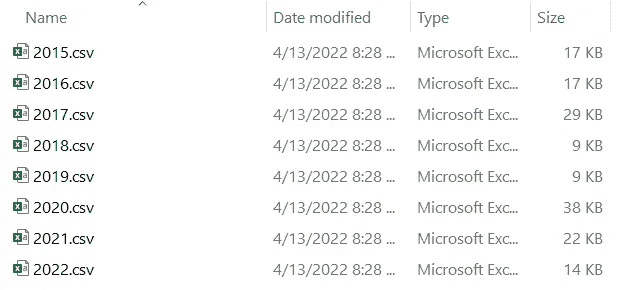
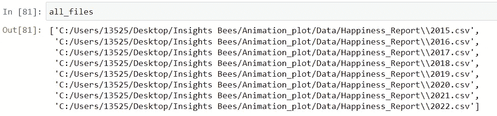
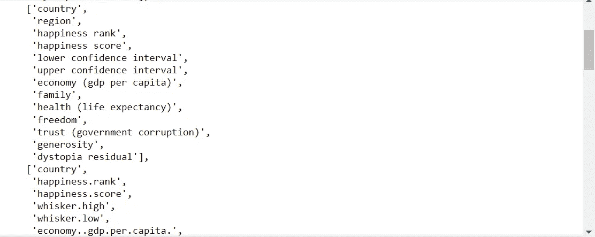
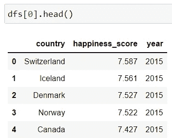
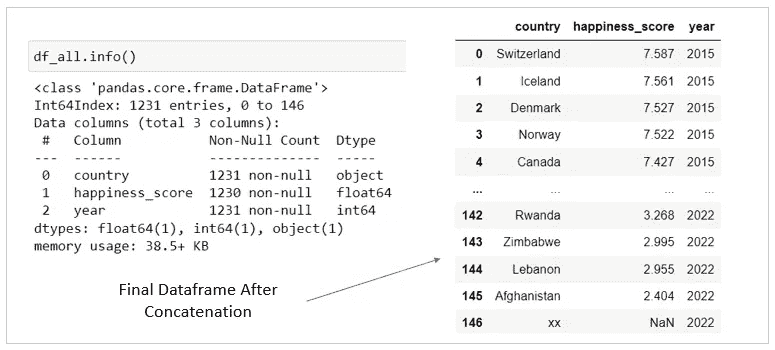
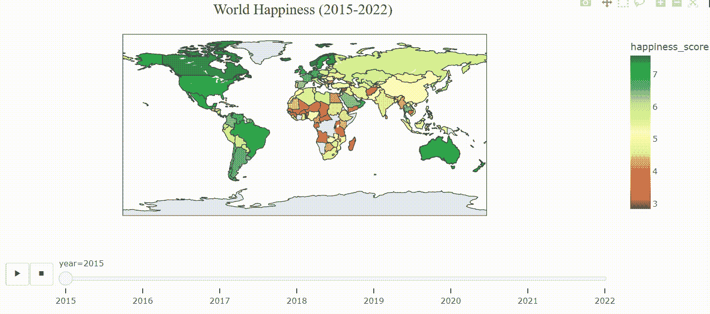

# 有效地连接多个(混乱的)数据帧

> 原文：<https://towardsdatascience.com/concatenate-multiple-and-messy-dataframes-efficiently-80847b4da12b>

## 如何批处理和连接带有杂乱数据的数据帧


图片由 [Pixabay](https://pixabay.com/photos/a-book-book-stack-stacked-books-3346785/) 提供(作者修改)

在数据世界中，连接数据集是一项非常常见的数据管理任务。根据您的需要，您可能需要通过垂直堆叠来连接多个数据帧(与 SQL 中的“union”操作相同)。或者，您可能需要通过基于一些公共键水平连接或合并它们来连接它们。

当垂直连接数据集时，假设数据帧具有相同的列名，并且列的顺序相同，我们可以简单地使用`pandas.concat()`方法来执行连接。我们只需要指定`axis=0`，它告诉`pandas`将第二个数据帧堆叠在第一个之下，将第三个堆叠在第二个之下，依此类推。

```
pd.concat([df1, df2, df3], axis=0)
```

如果您有相当多的数据集(比如 8 个或 10 个)要连接，并且这些数据集可能有不同的列名或者列的顺序不同，该怎么办？当然，您可以逐个导入和处理每个数据集，然后将它们连接起来。但是，有没有更优雅、更高效的方法呢？

在这篇文章中，我将带你看一个真实世界的例子，在这个例子中，我们可以使用`for loop`和一些`Pandas`技巧有效地批处理和连接多个混乱的数据帧。用于演示的数据文件可以从 [Kaggle](https://www.kaggle.com/datasets/mathurinache/world-happiness-report) 下载。总共有 8 个 csv 文件。从 2015 年到 2022 年的每一年，每个文件都包含了 153 个国家的幸福得分以及用于解释得分的因素。



作者图片

我们的目标是将这些文件连接成一个包含三列的数据框架——一个“年份”列、“国家”列和“幸福指数”列。稍后，我们可以创建一些有趣的数据可视化来显示幸福分数在不同国家之间的差异以及随时间的变化。让我们看看它是如何工作的。

## 第一步:

让我们首先使用 Python 的`glob`函数返回所有文件路径的列表。这将有助于我们使用`for loop`一次将所有文件读入 pandas 数据帧。



## 第二步:

接下来，让我们使用`for loop`将所有文件读入 pandas 数据帧。如果这些数据集都有相同的列名，并且列的顺序相同，我们可以使用`pd.concat()`轻松地将它们连接起来。让我们使用下面的代码来检查一下是否是这种情况(注意，在第 4 行中，为了方便检查，我将所有的列名都改成了小写)。



作者图片

这 8 个数据集有不同的列，它们有不同的列数、不同的列名和不同的列顺序。例如，如上面的屏幕截图所示，在一个数据帧中，幸福分数的列名为“幸福分数”，而在其他数据帧中，该列名为“幸福分数”、“分数”或“阶梯分数”。

鉴于数据的混乱，直接连接这 8 个数据帧是不可行的。在拼接之前我们需要做一些预处理，我们可以使用`for loop`来批量处理它们。

第 1 行:我们创建一个空列表`dfs`。稍后，我们将用`for loop`迭代将每个数据帧添加到这个列表中。

第 6–7 行:我们根据从列名中观察到的特定模式，从每个数据帧中迭代并提取“国家”列和“幸福指数”列。

第 9–11 行:我们创建了一个新的 dataframe `df1`，它只有我们需要的三列——country _ col、score_col 和 year_col。

第 13 行:我们使用`for loop`迭代将 8 个预处理数据帧中的每一个添加到列表`dfs`中。

第 14 行:我们将相同的列名分配给列表中的所有数据帧，以便在下一步中连接它们，这需要相同的列名。

通过参考 dfs[0]、dfs[1]、dfs[2]等，您可以快速查看我们刚刚创建的每个数据帧的外观。



图像

## 第三步:

最后，由于所有数据帧都有相同的列名和顺序，我们可以使用`pd.concat()`方法轻松地将它们连接起来。在第 1 行中，我们连接了列表`dfs,`中的所有数据帧，在第 2–3 行中，我们清理了“幸福分数”和“国家”列，以确保我们的数据为下一部分的可视化做好准备。



作者图片

## 额外收获:一张显示全球幸福水平的动画地图

在充分准备和清理了我们的数据后，让我们使用`plotly.express`创建一个动画 choropleth 地图，显示全球的幸福水平。

关于`Plotly`的一个好处是，它有自然地球数据集中定义的国家的内置几何图形，并且不需要外部 GeoJSON 文件来绘制 choropleth 地图。要使用内置的国家几何图形，我们只需提供`locations`作为[三个字母的 ISO 国家代码](https://en.wikipedia.org/wiki/ISO_3166-1_alpha-3)。

第 3–6 行:我们通过将 df_all 与 df_ISO 连接来添加三个字母的 ISO 国家代码，df _ ISO 具有 ISO 代码，可以在 [Kaggle](https://www.kaggle.com/datasets/andreshg/countries-iso-codes-continent-flags-url) 上下载。

第 9–14 行:我们使用`px.choropleth()`创建了一个动画的 choropleth 地图。`locations`参数接受数据集中表示 3 个字母的 ISO 代码的任何列。此外，我们可以通过在`animation_frame`参数中指定“年份”来轻松地将动画添加到 choropleth 地图中。

第 16–22 行:我们添加了一个地图标题，并调整了它的字体、大小、颜色和位置。



作者 GIF

这就对了。我们批量处理了多个原始的杂乱数据文件，并将它们连接起来，以创建一个数据帧，为分析和可视化做好准备。感谢阅读，我希望你喜欢这篇文章！

## **数据来源:**

1.  《2022 年世界幸福报告》于 [Kaggle](https://www.kaggle.com/datasets/mathurinache/world-happiness-report) 发布。许可证: [CC0:公共领域](https://creativecommons.org/publicdomain/zero/1.0/)。引文:Helliwell，John F .，Richard Layard，Jeffrey Sachs 和 Jan-Emmanuel 德·内维编辑。2020.2020 年世界幸福报告。纽约:可持续发展解决方案网络

2. [Kaggle](https://www.kaggle.com/datasets/andreshg/countries-iso-codes-continent-flags-url) 上的“国家 ISO 代码|洲|标志 URL”。许可证: [GPL 2](http://www.gnu.org/licenses/old-licenses/gpl-2.0.en.html)

你可以通过这个[推荐链接](https://medium.com/@insightsbees/membership)注册 Medium 会员(每月 5 美元)来获得我的作品和 Medium 的其他内容。通过这个链接注册，我将收到你的一部分会员费，不需要你额外付费。谢谢大家！