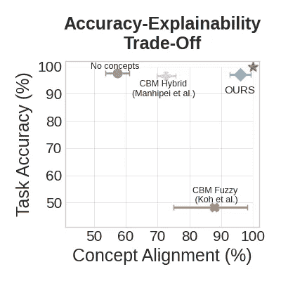
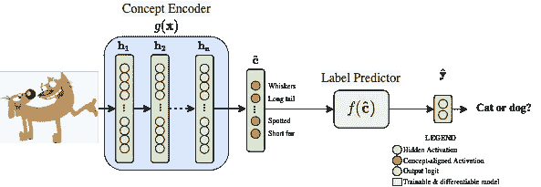
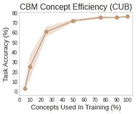
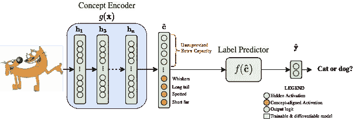
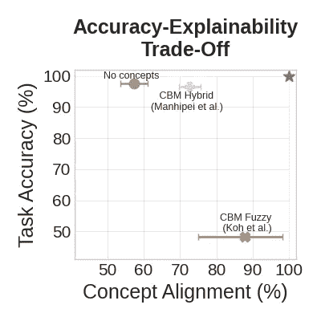
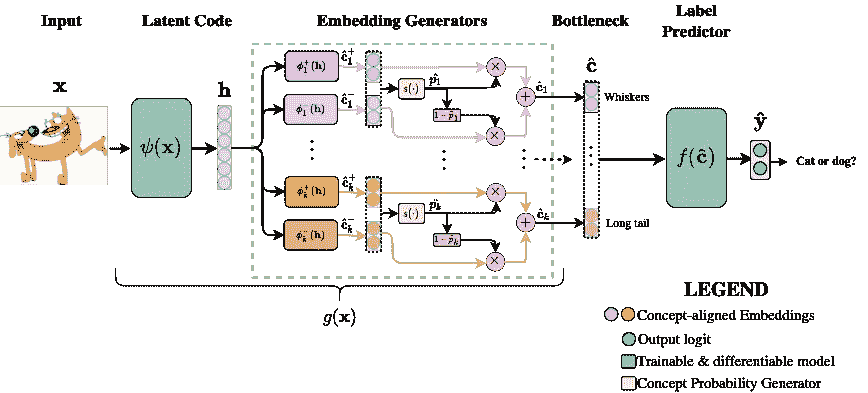
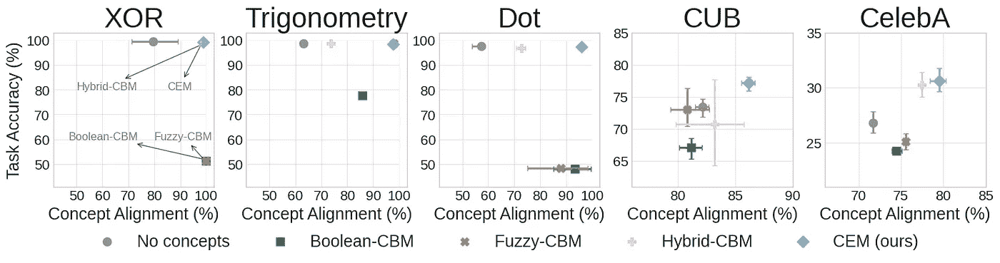
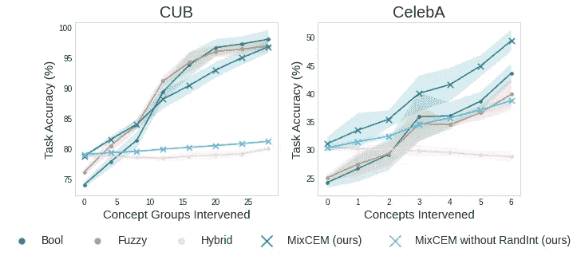
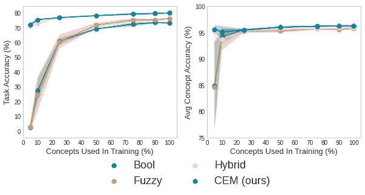
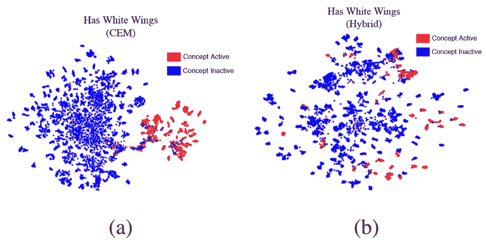

# 概念嵌入模型:超越精确性-可解释性的权衡

> 原文：<https://towardsdatascience.com/concept-embedding-models-beyond-the-accuracy-explainability-trade-off-f7ba02f28fad>

由马特奥·埃斯皮诺萨·扎伦加和[皮埃特罗·巴比洛](https://medium.com/u/c3b867b869ca?source=post_page-----f7ba02f28fad--------------------------------)主演。摘自 NeurIPS 论文“[概念嵌入模型](https://arxiv.org/abs/2209.09056)”([GitHub](https://github.com/mateoespinosa/cem))。

**TL；博士**

*   **问题—** 人类对深度神经网络的信任目前是一个公开的问题，因为它们的决策过程是不透明的。目前的方法，如概念瓶颈模型，以降低准确性为代价使模型更易解释(反之亦然)。
*   **关键创新—** 一个受监督的概念嵌入层，它学习语义上有意义的概念表示，并允许简单的人工测试时干预。
*   **解决方案——**[概念嵌入模型](https://arxiv.org/abs/2209.09056)增加人类对深度学习的信任，超越准确性-可解释性的权衡——既高度准确又可解释。

概念嵌入模型超越了概念瓶颈模型中的准确性-可解释性权衡，具有近乎最优的任务准确性和概念一致性。最佳权衡用红星表示(右上角)。任务是学习两个向量之间点积的符号(+/-)。图片由作者提供。

# 学习概念:可解释人工智能的新前沿

概念瓶颈模型(或 CBMs，[1])自 2020 年问世以来，已经成为可解释人工智能的一项重大成就。这些模型试图通过鼓励深度神经网络通过设计 变得更加可解释 ***来解决人类对人工智能缺乏信任的问题。为此，建立信任措施首先学习它们的输入(例如，猫和狗的图像)和一组" ***概念*** "之间的映射，这些概念对应于人类通常用来描述他们所看到的事物的高级信息单元(例如，"胡须"、"长尾"、"黑毛"等……)。这个映射函数，我们将称之为“概念编码器”，是通过——你猜对了:)——一个可微分和高度表达的模型(如深度神经网络)学习的！正是通过这个概念编码器，CBMs 然后通过将概念映射到输出标签来解决感兴趣的下游任务(例如，将图像分类为狗或猫):***

概念瓶颈模型将任务( **Y** )作为概念( **C** )的函数来学习。图片由作者提供。

用于将概念映射到任务标签的标签预测器可能是您最喜欢的可区分模型，尽管在实践中它往往是简单的，如单个完全连接的层。由于 CBM 能够在预测过程中学习中间概念，它们可以:

*   为他们的预测提供简单的 ***基于概念的解释*** 。这些是人类可以直观理解的解释，而不是需要用户高度脑力负荷的基于特征的解释(例如，显著性图)。例如，在图像分类中，基于概念的解释可能看起来像:“如果红色和圆形，那么它是苹果”，这比基于特征的解释更直观，例如:“如果 pixel-#7238 和 pixel-#129，那么它是苹果”。
*   允许 ***人类专家与模型*** 互动，在测试时改变预测错误的概念，通过专家互动显著提高任务准确性。

基于概念的解释和人类干预都极大地有助于**增加人类对建立信任措施的**信任。这是由于(I)它们的*设计可解释*架构，(ii)CBM 解释中使用的术语与专家使用的已知*人类类别*之间的明确一致性，以及(iii)它们对*人类交互*的本地支持，允许专家通过概念干预测试任务对所学概念的因果依赖性的强度。

> 概念瓶颈模型增加了人们的信任，提供了直观的基于概念的解释，并支持人们对概念的干预。

# 童话的结尾:CBMs 中准确性与可解释性的权衡

如同生活中的一切，建立信任措施也有不幸的阴暗面。在最初，概念瓶颈模型试图通过将分类任务限制在类似人类概念的中间水平上来“通过设计”提高可信度。然而，我们的爱情故事到这里就结束了，我们意识到，天下没有免费的午餐。虽然 CBM 在结构上比传统的深度神经网络更具可解释性，但这种新的可解释性可能会以任务准确性为代价！在训练模型所需的概念监督很少的现实情况下，这种情况尤其严重，从而质疑建立信任措施的实际效用。这可以从下图中看出，随着我们监督的概念数量的减少，我们观察到 CBM 的任务准确性急剧下降:

在缺乏概念监督的现实世界条件下，概念瓶颈模型的准确性迅速下降。CUB 数据集。图片由作者提供。

> 当概念监督不足或分类问题变得棘手时，普通概念瓶颈模型可能会在现实世界条件下崩溃。

为了解决这一限制，Manhipei 等人[2]探索了 CBMs 的混合版本，其中概念层增加了一组无监督的神经元，允许模型使用这一额外的学习能力来解决分类任务:

混合概念瓶颈模型在概念层的无监督神经元中编码额外的信息。图片由作者提供。

这个技巧使得混合 CBM 在任务准确性方面优于普通 CBM。然而，**这种性能的提高是以模型的可解释性和可信度为代价的**,因为:

*   额外的神经元通常**不符合**任何已知的人类概念

和

*   概念干预对输出标签**的影响急剧下降**，这表明模型正在使用额外的神经元而不是学习的概念来解决任务。

从经验上来说，我们可以在任务准确性和基本事实标签与通过下图中不同概念瓶颈模型(我们还包括一个没有概念层作为参考的端到端模型)学习的概念的一致性之间观察到这种折衷:

概念瓶颈模型中的准确性-可解释性权衡(点数据集[3])。最佳权衡用红星表示(右上角)。任务是学习两个向量之间点积的符号(+/-)。图片由作者提供。

> 普通和混合概念瓶颈模型在准确性和可解释性之间提供了不同的折衷，但是它们远非最佳！

这是所谓的“**准确性-可解释性权衡**”的一个简单例子:在许多重要的问题中，你可以得到:

*   一个**更简单**但**不太精确**的模型(例如 Koh 等人的 CBM)

运筹学

*   一个**更精确**但**更难解释的**模型(例如 Manhipei 等人的 CBM)。

可解释性较差的模型的问题在于，人类往往不信任自己的预测，因为他们不理解决策过程，也无法检查这个过程是否有意义——因此质疑部署此类模型的道德和法律影响。

出于这些原因，这种**准确性-可解释性权衡**是“诅咒”现代机器学习(尤其是基于概念的模型)的最具挑战性的公开问题之一。这就是为什么解决这个问题是这个领域中的“金块”之一！

> 准确性-可解释性的权衡“诅咒”现代机器学习，包括概念瓶颈模型！在解决重要问题时，很难同时最大限度地提高准确性和可解释性。

# 除了准确性和可解释性之间的权衡

为了解决基于概念的模型中的这种**准确性-可解释性权衡**，我们最近提出了 [***概念嵌入模型***](https://arxiv.org/abs/2209.09056) (CEMs，[3])，这是一类基于概念的模型，其中:

*   该架构将每个 ***概念*** 表示为一个 ***监督向量*** 。直观上，使用高维嵌入来表示每个概念允许**额外的*监督*学习能力**，这与混合 CBM 相反，在混合 CBM 中，流经其*非监督*瓶颈激活的信息是概念不可知的。
*   培训程序包括一个规范化策略( *RandInt* )，在培训 期间将 CEMs 暴露于 ***概念干预，以提高此类行动在测试时的有效性。***

概念嵌入模型将每个概念表示为一个监督向量。图片由作者提供。

我们在简单的玩具数据集和具有挑战性的真实数据集上的实验表明，CEMs:

*   **克服准确性与可解释性的权衡**在解决分类问题时与等效的黑盒模型一样准确(甚至可能更准确！)并且在以下方面与传统的 CBM 一样可解释:( a)学习的概念表示与概念基本事实一致的程度:

概念嵌入模型超越了概念瓶颈模型中准确性和可解释性的权衡。最佳权衡在每个图的右上角。图片由作者提供。

*   **支持有效的人类干预**允许人类专家与模型互动，通过在测试时修正预测错误的概念来提高预测准确性，这与混合 CBM 相反:

RandInt 的概念嵌入模型支持有效的人工干预(与混合概念瓶颈模型相反)。图片由作者提供。

*   **扩展到缺乏概念监督的真实环境**:

概念嵌入模型适用于缺乏概念监督的现实世界。图片由作者提供。

*   **使用每个概念的预测激活状态，提供基于概念的解释**作为普通的 CBMs(例如，“如果红色和圆形，而不是翅膀，那么它是一个苹果”)。

> 概念嵌入模型超越了概念瓶颈模型中准确性和可解释性的权衡——它们既准确又可解释！

最后，通过监督整个嵌入，CEMs 学习概念表示，与混合 CBMs 学习的无监督嵌入相比，概念的激活状态/真值之间的区别更明显，如下例所示:

CUB 数据集中概念的低维表示“有白色翅膀”,显示每个样本的概念激活状态。CEMs 嵌入显示在左侧(a)，混合 CBMs 嵌入显示在右侧(b)。图片由作者提供。

这表明 CEM 能够在每个概念向量中编码**显式符号信息**(即，概念是活动的还是非活动的)**子符号概念语义**(即，每个概念嵌入中的子集群)，这与混合 CBM 相反。

# 带回家的信息

CEMs 超越了当前的准确性和可解释性的权衡，显著增加了人类的信任度！

特别是 CEM:

*   作为 ***准确的*** 作为标准的端到端模型没有概念(而且往往更准确！);
*   作为 ***可解释的*** 作为标准概念瓶颈模型(而且往往更可解释！);
*   作为 ***响应*** 人为干预的标准概念瓶颈模型。

# 参考

[1]彭伟高，阮涛，邓耀祥，斯蒂芬·穆斯曼，，曾金，和佩西·梁。概念瓶颈模型。*在机器学习国际会议上，第 5338–5348 页。PMLR(2020)。*

[2]安妮塔·马欣佩、贾斯汀·克拉克、艾萨克·拉赫、终曲·多希-维勒兹和潘薇薇。黑盒概念学习模型的承诺和陷阱。arXiv 预印本 arXiv:2106.13314 (2021)。

[3] Mateo Espinosa Zarlenga、Pietro Barbiero、Gabriele Ciravegna、Giuseppe Marra、Francesco Giannini、Michelangelo Diligenti、Zohreh Shams、Frederic Precioso、Stefano Melacci、Adrian Weller、Pietro 莉雅和 Mateja Jamnik“概念嵌入模型”arXiv 预印本:2209.09056 (2022)。