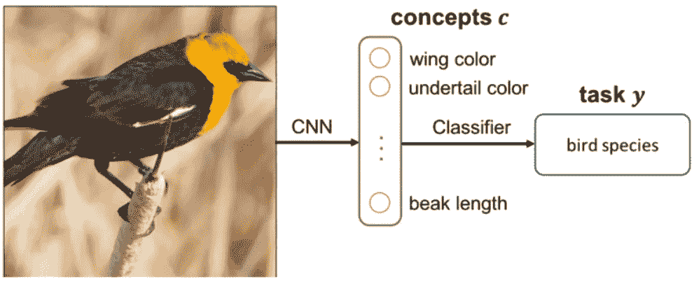
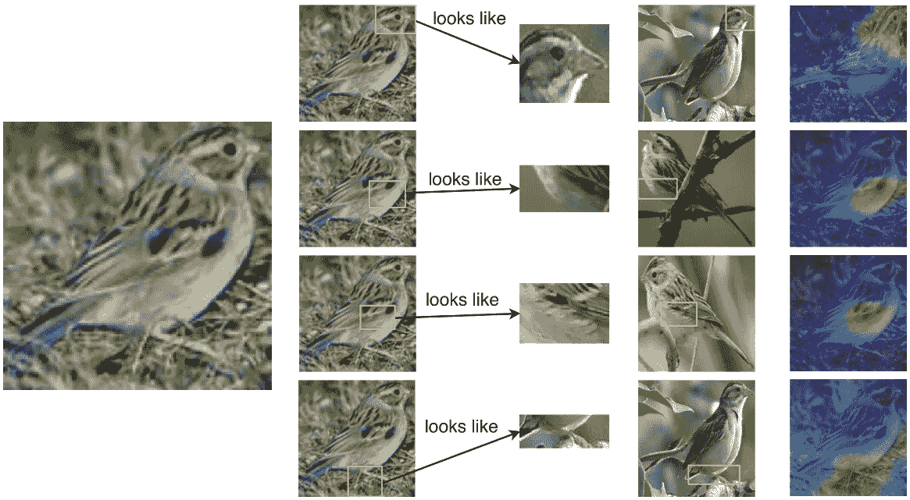

# 概念学习:让你的网络具有可解释性

> 原文：<https://towardsdatascience.com/concept-learning-making-your-network-interpretable-735a0698fc03>

eberhard grossgasteiger 在 [Unsplash](/t/nature?utm_source=unsplash&utm_medium=referral&utm_content=creditCopyText) 上的照片

O 在过去的十年里，神经网络在各种各样的数据集和问题上表现出了卓越的性能。虽然准确性和 F1 分数等指标通常适用于衡量模型学习数据底层结构的能力，但模型的表现仍然像一个黑盒。这一事实通常使得神经网络不能用于安全关键应用，在这些应用中，人们需要知道预测是基于哪些假设做出的。

想象一下，一个放射科医生使用一个带有神经网络主干的程序来帮助他在 x 光图像上找到疾病。使用传统方法，它只会输出疾病的名称，而没有任何置信度的测量(有关如何输出真实置信度得分的描述，请参见我的[上一篇关于神经网络校准的文章](/neural-network-calibration-using-pytorch-c44b7221a61))。这对医生几乎没有帮助，因为他不知道决定是如何做出的，也不知道图像的哪一部分影响了决定。他实际上想要接收的是图像中强烈指示预测疾病的异常列表(例如，指示肿瘤的肺部可见肿块)。

这就是**概念学习**派上用场的地方。它不是简单地预测给定输入的一组疾病，而是返回许多导致这一决定的概念。在这篇文章中，你了解了什么是概念学习，以及如何在你自己的项目中实现它。

# 概念学习

在介绍中，我已经使用了**概念**这个词。但是在这个上下文中它实际上是什么意思呢？为了理解这一点，想象一下你是如何区分不同的动物的。你可以使用他们的皮毛颜色，重量，速度，腿的数量和更多的属性来实现这一点。你有它！这些都是可以用来描述网络预测的概念。在文献中，**属性**一词经常与概念互换使用。显然，这些概念高度依赖于手头的任务。

可解释的概念可以用两种不同的方式加以利用。**训练方法**旨在建立一个内在可解释的模型，直接输出发现的概念。**另一方面，事后方法**不需要特殊的培训过程，而是解释一个已经存在的模型。我会带你穿过他们两个！

## 培训方法

这类方法集中于创建既可以由人类直接分析，也可以输出一组提取的图像概念的架构。因此，**这些方法只能在你想从零开始训练一个新模型的时候使用**。如果这听起来有点难以理解，请不要担心。我将带你浏览一篇最近发表的论文。

众所周知，标准卷积神经网络的行为类似于特征提取器。CNN 中早期的过滤器倾向于提取低级特征，如角和边，而后来的过滤器提取高级特征，如对象部分。理论上，这些过滤器能够解释全局的内部推理(即，不针对单个样本)。然而，所学习的过滤器可能不被人类理解，并且不能解释单个例子的内部推理。由神经网络的完全连接的层编码的潜在空间进一步根本不可解释。

## 概念瓶颈模型

图 1:概念瓶颈模型的架构[1]

这就是**概念瓶颈模型**【1】**派上用场的地方。他们使用标准的 CNN 模型(如 ResNet 或 VGG ),但对其中一个全连接层进行了整形，以匹配需要为给定数据集定义的多个预定义概念。这一层被称为模型的**瓶颈**。每个输入图像都需要用它的类标签和一组描述它的概念来标注。对于本文中使用的鸟类分类数据集，概念是二元的，并描述类似于 **wing_color:black** 或 **head_color:yellow** 的属性。为了训练模型，在类别标签上使用标准反向传播。此外，概念损失用于确保对应于概念的**节点仅在概念实际存在于输入图像中**时才被激活。如果概念节点的 Sigmoid 置信度超过 50%,则认为该概念节点被激活。**

**更精确地定义，该模型被分成两部分:概念提取器 *c = g(x)* ，它将输入 *x* 映射到由**瓶颈层**编码的一组预定义概念 *c* 。后面是小分类网络 *y = f(g(x))* 预测类标签。**

## **ProtoPNet**

****

**图 ProtoPNet 架构[5]**

**杜克大学研究人员提出的 ProtoPNet 是另一个有趣的架构。它通过剖析输入图像并将其与预测类的原型部分进行比较来推理其预测。**

****临时方法****

**如果您想要分析一个已经训练好的模型，或者受限于一个非常具体的架构，那么您可能需要使用事后方法，这种方法对要检查的底层模型几乎不做任何假设。**

**有关事后方法的深入介绍，请参阅概念学习系列的第二部分！**

**干杯！**

# **相关文献**

## **培训方法**

**[1]高秉文、阮廷文、唐永生、马士曼、皮尔逊、金炳良、梁(2020)。概念瓶颈模型。**

**[2]李，c .，齐亚，M. Z .，Tran，Q.-H .，于，x .，哈格，G. D .，& Chandraker，M. (2018)。具有中间概念的深度监管。**

**[3]威克拉马纳亚克，s .，徐，w .，，李，M. L. (2021)。通过引导概念学习的可理解卷积神经网络。**

**[5]陈，陈，李，陶，丁，巴内特，鲁丁，苏，郑继光(2019)。这看起来像这样:可解释图像识别的深度学习。**

**[6]m . Nauta，r . van Bree 和 c . Seifert(2021 年)。用于可解释的细粒度图像识别的神经原型树。**

## **事后方法**

**[7] Kim，b .，Wattenberg，m .，Gilmer，j .，Cai，c .，Wexler，j .，Viegas，f .，和 Sayres，R. (2018 年)。特征归因之外的可解释性:概念激活向量的定量测试(TCAV)。**

**[8]周，b .，孙，y .，鲍尔，d .，&托拉尔巴，A. (2018)。可视化解释的可解释基分解。**

**[9] Bau，d .，周，b .，科斯拉，a .，Oliva，a .，& Torralba，A. (2017)。网络剖析:量化深层视觉表征的可解释性。**

**[10] Fong，r .，& Vedaldi，A. (2018 年)。Net2Vec:量化和解释概念如何被深度神经网络中的过滤器编码。**

**[11] Ghorbani，a .，Wexler，j .，Zou，j .，和 Kim，B. (2019 年)。走向基于概念的自动解释。**

**[12]方，张，林，杨，吴，姚等(2020).基于概念的精细图像解释及其在感染性角膜炎分类中的应用。**