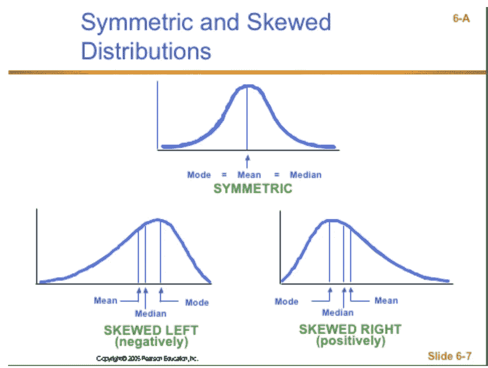
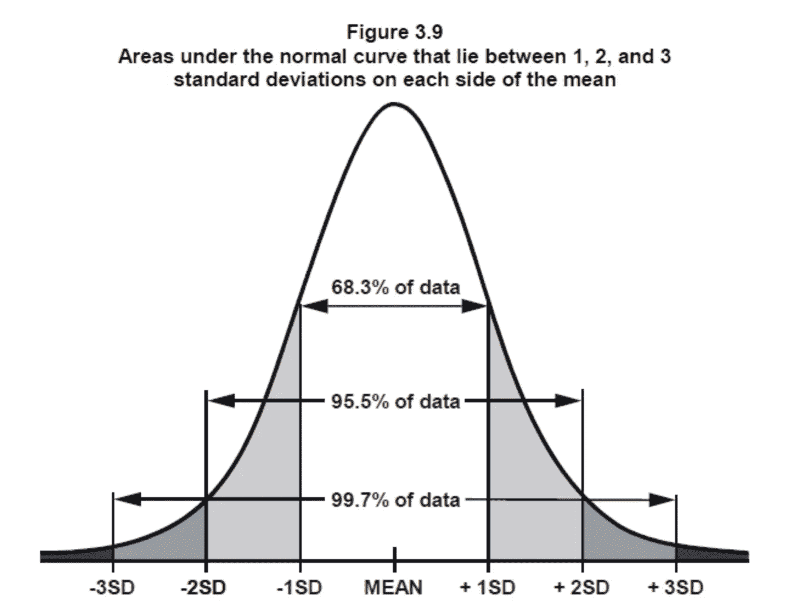
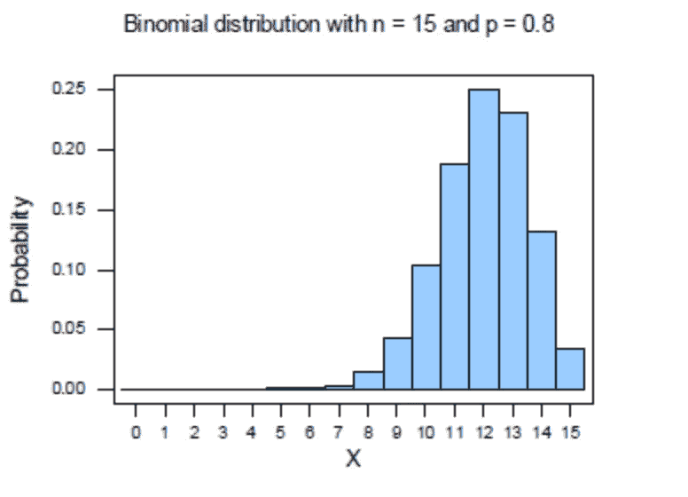
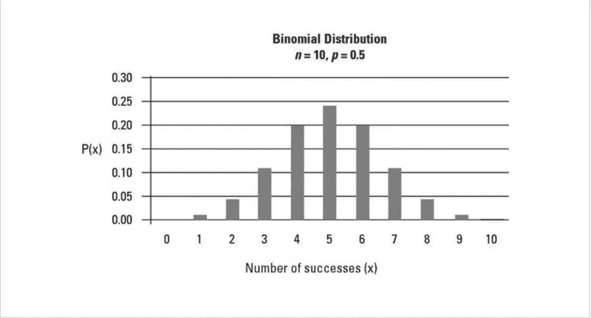

# 数据科学面试中你必须知道的概念——第一部分:分布

> 原文：<https://towardsdatascience.com/concepts-you-have-to-know-for-data-science-interviews-part-i-distribution-f4c28da3fc50>

由 [Unsplash](https://unsplash.com?utm_source=medium&utm_medium=referral) 上的 [Edge2Edge 媒体](https://unsplash.com/@edge2edgemedia?utm_source=medium&utm_medium=referral)拍摄

## 办公时间

## 数据科学家访谈中最常见的问题

这是一年的开始，许多人都在寻找新的机遇和新的挑战。我记得在我过去的多轮招聘中，我经常努力找到一个好的综合资源来准备我的数据科学面试，所以我决定自己整理一个。

如果您正在开始新一轮招聘，或者希望在新的一年提升您的数据科学知识技能，希望您会发现这份备忘单/速成课程作为起点很有帮助。这是数据科学访谈系列的第一篇文章，我想提到一些基本的分布和与分布相关的基本概念，它们在数据科学访谈中经常被问到。

我将在本系列中涉及的概念绝不是详尽的，它是数据科学访谈中最常被问到的问题的汇总列表，或者是优秀的数据科学家根据我的经验应该熟悉的概念。

**与分布相关的基本统计概念**

对于你们中的一些人来说，这似乎太基础了，但重要的是要确保你真正理解简单统计概念的定义、差异和用例，如均值、中值和众数。我在采访中反复看到的几个关键概念是:

1.  平均值不同于中值，因为平均值更容易受到异常值和分布偏斜度的影响。平均值将与对称分布的中值相同。对于左偏分布，平均值将小于中值，而对于右偏分布，平均值将大于中值。
2.  众数代表分布的“峰值”,它与对称分布的平均值和中值重叠。对于左偏分布，众数大于中位数和平均数；并且对于右偏分布，模式比两者都小。

图来自 [Stack Exchange](https://math.stackexchange.com/questions/969967/finding-the-most-likely-serve-speed-of-a-tennis-player) (注意:Stack Exchange 图像都是 CC 许可的，允许商业使用)

**分配**

分布是统计学中一个非常重要的概念，在面试中经常会被用到。有很多发行版，但有几个重要且常见的发行版会在访谈中被反复提及和使用:

1.  **正态分布**

这是要知道的最重要的分布，因为生活中的许多事情都遵循正态分布——成年人的身高、成年人的智商等等。重要的是要知道，正态分布的均值、中值和众数是相同的，因为它是**对称的**和**非偏斜的**。

正态分布在平均值附近有**对称变化**，定义为**标准差**。这意味着这些值同样有可能高于或低于平均值。但是，值与平均值相差较大幅度的可能性要小于较小幅度的可能性(无论方向如何)。事实上，对于正态分布，68.3%的值位于距平均值 1 个标准偏差以内；95.5%位于平均值的 2 个标准偏差内，99.7%位于平均值的 3 个标准偏差内。

正态分布仅由两个参数决定，即平均值和标准差。平均值决定了分布的中心，即峰值(平均值、中值和众数)所在的位置，而标准差决定了分布的形状/分布范围，标准差越小，分布越紧密。

[stats.stackexchange.com](https://stats.stackexchange.com/questions/476677/understanding-standard-deviation-in-normal-distribution)

**2。伯努利分布**

伯努利分布描述了一个只有两种结果的实验。为了简单起见，我们通常将这两种结果描述为成功-1 和失败-0。这种分布最常见的例子是像掷硬币一样，正面代表“成功”，反面代表“失败”；或者天气结果，比如是否会下雨，下雨就是“成功”，不下雨就是“失败”(或者反过来，如果你真的讨厌下雨)。

这个分布只有一个参数——成功概率 *p* 。在公平硬币的情况下， *p=* 50%。

**3。二项式分布**

二项式分布与伯努利分布密切相关，因为它模拟了重复伯努利实验中的成功次数。

二项式分布带两个参数——成功概率 *p* 和重复次数 *n.* 当 *p* 大于 0.5 时，分布是左偏的；当它小于 0.5 时，分布是右偏的，当 *p = 0.5 时，*你猜对了，分布是对称的。

左偏二项分布([栈交换](https://stats.stackexchange.com/questions/176425/why-is-a-binomial-distribution-bell-shaped))

[对称二项分布](https://www.dummies.com/article/business-careers-money/business/accounting/calculation-analysis/how-to-graph-the-binomial-distribution-145938)

如果你认为上面的对称二项分布很像正态分布，那你就对了。事实上，当实验次数足够大时，二项分布可以近似为正态分布(其中 *n* 为实验重复次数， *p* 为成功概率，经验法则是当 np 和 n(1-p)都大于 10 时，二项分布可以近似为正态分布)。

你可能会被问到的其他不太常见的分布是**泊松分布**(它描述了特定时间范围内的事件数量；最常见的例子是在固定时间范围内到达餐馆的顾客数量)，**指数分布**(它与泊松分布相关，因为它描述了事件之间的时间间隔；在客户示例中，它描述了在固定时间窗口内每个客户到达之间经过的时间)和**伽马分布**(它类似于指数分布，因为它描述了到达固定数量的事件的总时间；继续这个例子，它描述了在一定数量的顾客到达餐馆之前你需要等待的时间。

**如何进行测试**

这些概念通常不会以学校测试的形式单独测试，因为面试官希望看到你可以实际使用这些概念来解决现实世界的问题，而不是记住关于它们的维基百科页面。因此，常见的问题大致如下:

*   “XX 的分布情况如何(例如 Facebook Marketplace 页面访问时长等。)有吗？”
*   后续问题:“这个分布的平均值和中位数是什么关系？”或者“你认为这个分布的平均值会比中值大还是小？”

希望这个总结对你的招聘过程有所帮助。记住，仅仅通过阅读几篇关于统计的文章，你不会成为统计专家；掌握统计知识需要练习。因此，让自己熟悉这一点的最好方法是尽可能利用这些知识；例如，当你研究你感兴趣的公司时，问问自己对这家公司来说最重要的指标是什么，你认为他们的分布是什么样的。

不知道接下来要读什么？以下是一些建议:

     