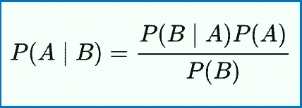
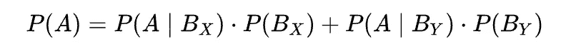

# 数据科学面试中你必须知道的概念——第二部分。可能性

> 原文：<https://towardsdatascience.com/concepts-you-have-to-know-for-data-science-interviews-part-ii-probability-5c8830f13fb5>

在 [Unsplash](https://unsplash.com?utm_source=medium&utm_medium=referral) 上拍摄的 [ThisisEngineering RAEng](https://unsplash.com/@thisisengineering?utm_source=medium&utm_medium=referral)

## 数据科学家访谈中最常见的问题

在[系列的最后一篇文章](/concepts-you-have-to-know-for-data-science-interviews-part-i-distribution-f4c28da3fc50)([数据科学面试你必须知道的概念——第一部分:分布](/concepts-you-have-to-know-for-data-science-interviews-part-i-distribution-f4c28da3fc50))中，我提到了分布的基础知识——最重要的分布及其可能在数据科学面试中出现的特征。在这篇文章中，我想用公司喜欢问 DS 候选人的常见概率问题来继续教程。

概率是一门复杂的学科，如果你真的想深入了解它，可能很难在短时间内掌握。其实是大学数学专业横跨一整个学期的必修课。因此，这篇文章肯定不会让你成为概率专家，而是会让你了解这个主题中最常见的测试领域。

**条件概率/贝叶斯定理**

条件概率是 DS 面试中测试最多的概率问题类型。这是一项有用的技能，因为在我们的日常工作中，我们遇到的许多分析问题都涉及到条件概率——例如，假设疾病测试结果为阳性，那么**患病的概率是多少。**条件概率通常用贝叶斯定理计算，公式如下:

[维基百科](https://en.wikipedia.org/wiki/Bayes%27_theorem)

**A、B →** 事件

**P(A|B)** →给定 B 为真的概率

**P(B|A) →** 概率 B 给定 A 为真

**P(A)，P(B)→**A 和 B 的独立概率

**独立性**在学习条件概率时是一个重要的概念。值得注意的是，如果 P(A|B) = P(A)，意思是“给定 B 的概率”与“A 的概率”相同，那么 A 和 B 两个事件是独立的。

独立事件的一个很好的例子是每次抛硬币的结果；为了公平起见:

**A:在第二次翻转中翻转一个头→ P(A) = 1/2**

**B:第一次翻转时翻转尾巴→ P(B) = 1/2**

**A|B:在第二次翻转中翻转一个尾巴，在第一次翻转中翻转一个头→ P(A|B) = 1/2**

知道你在第一次翻转中翻转了一个头，并不会改变下一次翻转尾巴的概率，所以这两个事件是独立的。

在面试中，你应该考虑使用贝叶斯定理的一个强有力的暗示是像“给定”或“条件”这样的关键短语。

**总概率**

全概率定律表述如下:

[维基百科](https://en.wikipedia.org/wiki/Law_of_total_probability)

***【Bx】***和*是不相交的事件，它们组合起来代表整个选择宇宙。假设一个小组由来自旧金山或西雅图人组成。我们知道这个团 40%来自 SF ( **P( *Bx* )** )，60%来自西雅图(**P(By)**)；西雅图今天下雨的概率是 70% ( **P(A|By *)*** )，SF 今天下雨的概率是 20% ( **P(A|Bx)** )。我们在组内随机叫一个人，他们所在的城市今天下雨的概率是多少( **P(A)** )？*

*利用上面的公式，我们很容易得到 P(A) = 0.4*0.2+0.6*0.7 = 0.5*

*全概率通常用于条件概率的计算，因为对于下面所示的条件概率，P(B)通常不是直接给出的，而是必须使用全概率法则来计算。*

**

*[维基百科](https://en.wikipedia.org/wiki/Bayes%27_theorem)*

***二项式概率***

*我们已经在我之前关于[分布](/concepts-you-have-to-know-for-data-science-interviews-part-i-distribution-f4c28da3fc50)的文章中讨论过二项分布。二项式概率是使用二项式分布来计算一个只有两种结果的实验的 Y 次试验中恰好有 n 次成功的概率(一个很好的例子是抛硬币)。*

**

*[维基百科](https://en.wikipedia.org/wiki/Binomial_distribution)*

*成功的试验次数*

***n:** 总试验次数*

*单次试验成功的概率*

***n！** : n 阶乘，其计算结果为 n*(n-1)*(n-2)… *3*2*1*

***k！** : k 阶乘，计算方法同上*

***(n-k)！你说到点子上了***

*认识到问题涉及只有两种结果的事件是决定何时使用二项式公式计算概率的关键。*

*一个很好的例子是:**在 10 次抛硬币中获得 4 个正面的概率(假设这是一个不公平的硬币，对于每次抛硬币，有 1/4 的概率获得正面，3/4 的概率获得反面)**。*

*在本例中:*

*n = 10，k=4，p=1/4*

*这个的计算结果应该是 10！/(4!*6!)*(1/4)⁴*(3/4)⁶ = 210*1/4⁴*(3/4)⁶= 0.15*

***这些考试是如何进行的，如何准备***

*这些测试有很多不同的方式。但是总的主题是，它们通常被组合起来测试，而不是孤立地测试。如上所述，当在面试中被问到时，全概率定律可以很容易地融入贝叶斯定理。*

*需要注意的是，仅仅记住这些公式对于面试来说是不够的。因为在面试中，没有人会告诉你什么时候用哪个公式。确定使用哪一个是正确的可能是最困难的部分。掌握它的最好方法是看大量的样题，试着不去看答案，而是试着自己解决。熟悉需要使用这些公式的问题类型是关键。对于样题，简单的谷歌搜索会给你很多结果。如果你想有一个更集中的概率问题“数据库”，我强烈推荐尼克·辛格和凯文·霍的 ***Ace《数据科学面试*** 书。*

***寻找更多面试指南？这里有一些文章可能会有帮助！***

*       *