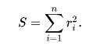
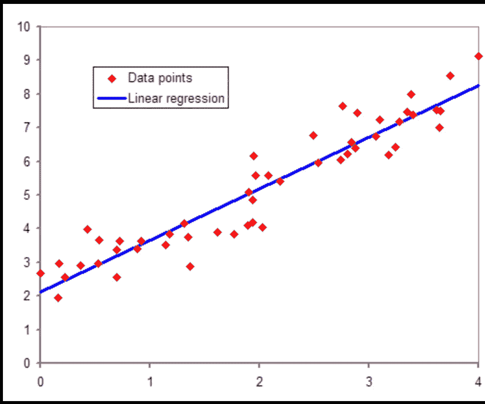
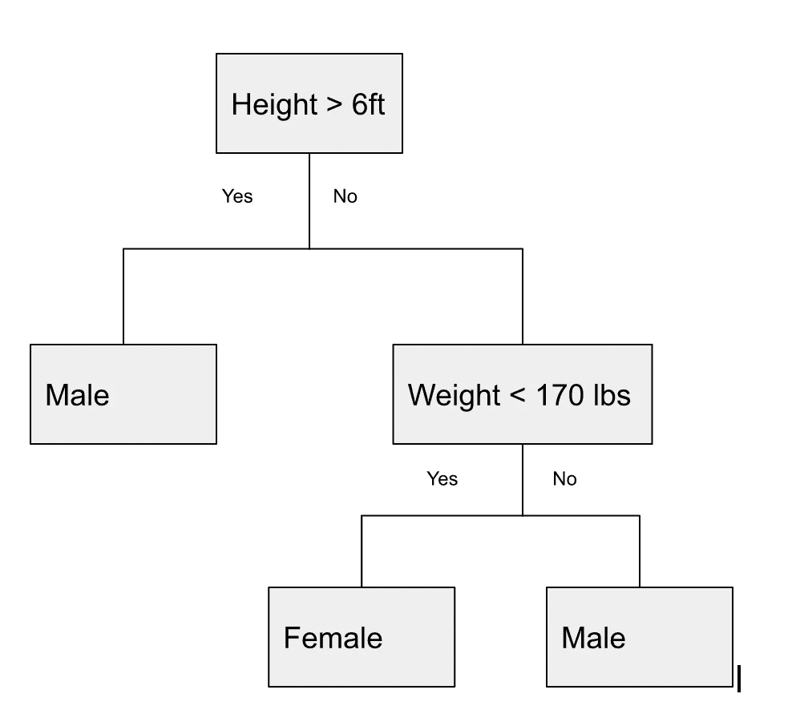

# 数据科学面试中你必须知道的概念——第三部分。基本监督学习模型

> 原文：<https://towardsdatascience.com/concepts-you-have-to-know-for-data-science-interviews-part-iii-basic-supervised-learning-models-5115673f57>

杰森·莱姆在 [Unsplash](https://unsplash.com?utm_source=medium&utm_medium=referral) 上的照片

## 数据科学家建模访谈中最常见的问题

这是我采访系列的第三篇文章。我希望这个系列可以作为有抱负的数据科学家准备面试的集中起点。如果你感兴趣，前两篇文章在这里:

1.  [数据科学面试中你必须知道的概念——第一部分:分布](/concepts-you-have-to-know-for-data-science-interviews-part-i-distribution-f4c28da3fc50)
2.  [数据科学面试中你必须知道的概念——第二部分。概率](/concepts-you-have-to-know-for-data-science-interviews-part-ii-probability-5c8830f13fb5)

在这篇文章中，我想谈一谈可能是许多有抱负的数据科学家最感兴趣的部分——ML。ML 是一个超级复杂的话题，所以我甚至不会试图在一篇文章中涵盖它的所有内容。事实上，我会将 ML 部分分成几个帖子，并在每个帖子中谈论 ML 的不同方面和不同类别的模型。在这篇文章中，我将只关注**基本监督学习模型**。

当谈到 ML 时，有无数类型的模型，从简单的模型如**线性和逻辑回归**一直到复杂的模型如**深度学习和强化学习**。我会一篇接一篇地介绍面试中会出现的重要问题。

首先，重要的是要知道，除非你的目标是超级建模密集型角色，如机器学习工程师(MLE)或研究科学家， **ML 通常不是面试的最大焦点**。面试官通常只想看到你对不同的模型和建模技术有基本的了解；你不会被要求在白板上证明或者为你建立的神经网络的层数辩护。

## **一般来说，ML 模型/技术可以分为两类——监督学习和非监督学习。**

有监督学习和无监督学习之间的区别是数据科学家应该熟悉的最基本的概念之一。**监督学习**是所有 ML 技术的总分类，**利用标记数据集，**而**非监督学习**技术使用**未标记数据集**。一个具体的例子:如果你想建立一个模型来区分狗和猫，你会使用监督学习，因为无论是狗还是猫(你想预测的类别)，每个数据点都应该有一个明确的正确答案。然而，如果你只是想把家养宠物聚集在一起，你可以使用无监督学习。每个数据点的标签都没有明确的“正确”答案——一只小狗可能会和其他小猫而不是大狗归为一组。本文将关注最常测试的监督学习技术；我将在下面的文章中深入探讨更多的**高级监督学习模型**和**非监督学习**。

## **线性回归**

这可以说是 ML 中使用的最基本的模型(如果你认为它“算作”ML 的话)。线性回归是**监督学习**中最常用的方法，最适合预测连续变量(相对于分类变量)。

线性回归本质上是试图拟合所有训练数据点的最佳直线。“最佳线”的定义根据损失函数的选择而变化。最常用的是“普通最小二乘法(OLS)”，它通过最小化误差平方和来寻找最佳直线。误差定义为 **rᵢ = yᵢ -y^** ，其中 **y^** 为模型预测值， **yᵢ** 为观测(真实)值。您希望最小化的值是上述误差项的总和

误差平方和项

来自[维基百科](https://en.wikipedia.org/wiki/Regression_analysis#/media/File:Normdist_regression.png)的线性回归图解

## 逻辑回归

逻辑回归和线性回归之间的最大区别在于，线性回归模拟连续变量，而逻辑回归模拟事件(具有二元结果的事件)的**概率，因此输出是介于 0 和 1** 之间的**。**

值得注意的是，即使通常用于分类，逻辑回归本身并不是一个分类器。但是当在顶部设置一个阈值(通常为 0.5)时，它可以变成一个分类器。确定了截止值后，概率可以转换为二进制输出。例如，如果您试图预测一封电子邮件是否是垃圾邮件，阈值为 0.5 的逻辑回归会将任何预测“成为垃圾邮件的概率”大于等于 50%的电子邮件归类为垃圾邮件。

了解分类器由两部分组成—阈值和逻辑回归—可以帮助您理解为什么选择适当的截止值是模型调整的一个重要但通常被忽略的部分，当涉及到由逻辑回归支持的分类器时。

## 手推车

CART 是分类树和回归树的缩写；顾名思义，这是一种**监督学习**技术，可用于预测分类或连续变量。CART 通常和**随机森林**一起讲，因为 CART 是更简单的版本；它是一棵树，而不是一片森林(我将在下一篇文章中介绍随机森林)。

与回归或随机森林相比，CART 的最大优势是其可解释性，因为它可以绘制用于构建树的特征分割。下图展示了一个超级简单的购物车模型。像这样的插图可以很容易地被你用来拟合模型的大多数购物车包绘制出来，它可以帮助你可视化模型是如何在后台构建的。另一个有趣的事情是，它向你展示了什么样的**特征首先被用来分割**模型；所以这也说明了特性的重要性。

作者插图

## **这些是如何测试的，需要注意什么**

一般来说，有两种方法来测试这些基本的 ML 建模概念——简历驱动或理论驱动。

*   **简历驱动**:面试问题会根据你的简历。所以确保你花几个小时去回忆一下，刷新你对简历中提到的模特经历的理解。根据面试官和他/她的机器学习背景，他们可能会就你提到的某些算法提出深入的问题。
*   **理论驱动**:如果你缺乏建模经验，或者建模出现在面试的案例研究部分，问题将是理论性和假设性的。面试官会问你在某种情况下你会怎么做。他们可能会通过在数据集上植入一些问题来扔给你一个曲线球，看看你是否知道如何处理建模中的困难数据问题(我们将在我即将发表的关于模型训练的文章中详细介绍)。
*   要记住的事情:在谈论你的建模经历时，确保你展示出你明白**可解释性**是建立模型时最重要的事情。对于几乎每一个常用的模型，都有无数种方法来可视化模型性能和特性重要性。请继续关注这方面的文章。另一件要记住的事情是**数据清理**和**特征工程**同样重要，如果不比建模本身更重要的话。否则，您的模型将遭受臭名昭著的“垃圾进垃圾出”症状。

**有兴趣阅读更多关于数据科学的职业建议吗？我可能有东西给你:**

 [## 麦肯锡教给我的 5 条经验将使你成为更好的数据科学家

towardsdatascience.com](/5-lessons-mckinsey-taught-me-that-will-make-you-a-better-data-scientist-66cd9cc16aba)  [## 我离开麦肯锡成为数据科学家的原因

### 开始成为数据科学顾问之前应该考虑的事情

towardsdatascience.com](/why-i-left-mckinsey-as-a-data-scientist-30eec01504e5)