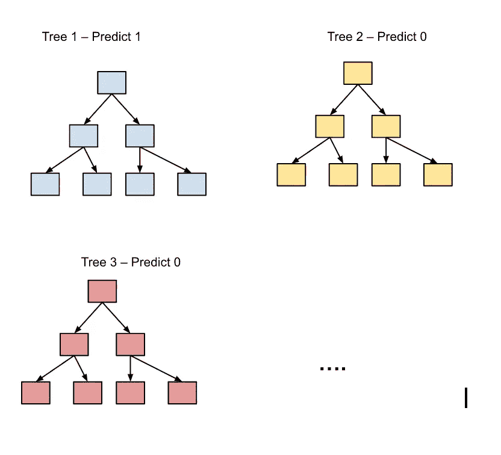

# 数据科学面试中你必须知道的概念——第四部分。随机森林

> 原文：<https://towardsdatascience.com/concepts-you-have-to-know-for-data-science-interviews-part-iv-random-forest-5c125e4b5777>

伊琳娜·伊里斯在 [Unsplash](https://unsplash.com?utm_source=medium&utm_medium=referral) 上的照片

## 数据科学家访谈中最常见的问题

这是采访系列的第四篇文章。我希望这个系列能够成为有抱负的数据科学家在面试准备方面的**集中起点。到目前为止，我们已经讨论了以下概念:**

1.  [第一部分:发行](/concepts-you-have-to-know-for-data-science-interviews-part-i-distribution-f4c28da3fc50)
2.  [第二部分。概率](/concepts-you-have-to-know-for-data-science-interviews-part-ii-probability-5c8830f13fb5)
3.  [第三部分。基本监督学习模型](/concepts-you-have-to-know-for-data-science-interviews-part-iii-basic-supervised-learning-models-5115673f57)

在这篇文章中，我想继续在 ML 领域的旅程，并谈论**高级监督学习模型**。更具体地说，我将把重点放在**随机森林**上，因为在更复杂/高级的 ML 模型中，它可能是 DS 访谈中最常用和最常被问到的。事实上，我作为一名数据科学家在麦肯锡的采访中被问及随机森林；如果你的面试中有建模部分，知道如何在高层次上直观地解释算法肯定会帮助你从其他面试者中脱颖而出。

## 什么是随机森林

我们在上一篇文章中谈到了[购物车模型](/concepts-you-have-to-know-for-data-science-interviews-part-iii-basic-supervised-learning-models-5115673f57?source=your_stories_page-------------------------------------)。提醒一下，CART 代表分类和回归树；随机森林是一片森林。描述性命名约定揭示了两者之间的明确关系——随机森林由多个决策树组成。

随机森林是一种集成方法(集成方法是一种结合多种学习算法以获得更好结果的 ML 方法，实现 1+1>2 的效果)，利用多棵树来避免过拟合(**决策树容易过拟合**)。想象森林中的每棵树都投下一票，对整个模型的最终决策有发言权；最终的决策/预测是通过森林获得多数票来实现的。

作者图片

为了避免过度拟合，树不应该相关。模型如何避免树被关联？你可能会问。Random Forest 通过做两件事来确保这一点——**在构建每棵树时，随机选择一个训练样本子集，以及随机选择一个特征子集**。这种“随机子集化”经常用于集合模型，通常被称为**【装袋】**，并且经常被用于**减少训练模型中的方差**。

既然说到“装袋”，这里就有点跑题了。“助推”是 ML 模型中常用的另一种方法；事实上，梯度推进决策树是决策树家族中一个高性能的表亲。我提这个是因为**“装袋”和“助推”经常被拿来比较**；我在不同的采访中被问及他们之间的**差异**。“提高”的特别之处在于它可以提高学习能力差的学生。与“bagging”并行和单独地构建树不同，“boosting”过程顺序地构建树；所以每棵树都可以从前一棵树的错误中“学习”并改进。

有很多关于在介质上“增强”的详细解释，所以我不会在这里进入任何技术细节。但值得注意的是，由于这种“顺序”的性质，“助推”算法训练更慢，与“装袋”算法相比，更容易过度拟合。

回到随机森林。如果你还记得我们在[上一篇文章](/concepts-you-have-to-know-for-data-science-interviews-part-iii-basic-supervised-learning-models-5115673f57)中谈到的，CART 最大的优势可以说是它的可解释性。尽管随机森林在性能方面通常是 CART 的一个改进(特别是在测试集上，因为它不容易过度拟合)，但在这个过程中，它在一定程度上牺牲了可解释性。随着树木数量的增长，将越来越难绘制每棵树并查看它们在分割数据时使用的特征；因此，要准确理解每棵树是如何建造的变得更加困难。但是仍然可以生成要素重要性图(跨越森林中的树木)。大多数随机森林包都带有这样一个易于访问的地块。

## 这些是如何测试的，需要注意什么

我已经在[之前的帖子](/concepts-you-have-to-know-for-data-science-interviews-part-iii-basic-supervised-learning-models-5115673f57)中讲述了如何测试 ML 概念，以及在回答 ML 建模问题时需要记住的最重要的事情。如果你想了解更多，请点击下面的链接。

</concepts-you-have-to-know-for-data-science-interviews-part-iii-basic-supervised-learning-models-5115673f57>  

关于随机森林或者任何复杂的最大似然算法，唯一要补充的是，能够用通俗的语言解释算法是很重要的。我的意思是，面试官通常感兴趣的是测试你对算法的理解，而不是 T2 寻找的维基百科页面的记忆版本。

最后的小提示，练习你对 ML 算法的直观解释的最好的观众是不在分析领域的朋友；你可以很快判断出你对算法的描述是否有意义。

**有兴趣阅读更多关于数据科学的职业建议吗？我可能有东西给你:**

</5-lessons-mckinsey-taught-me-that-will-make-you-a-better-data-scientist-66cd9cc16aba> [## 麦肯锡教给我的 5 条经验将使你成为更好的数据科学家

towardsdatascience.com](/5-lessons-mckinsey-taught-me-that-will-make-you-a-better-data-scientist-66cd9cc16aba) </why-i-left-mckinsey-as-a-data-scientist-30eec01504e5>  </the-ultimate-interview-prep-guide-for-data-scientists-and-data-analysts-18621db1da47> 