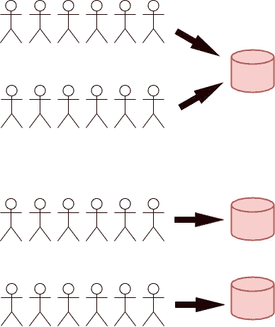

# 并发和并行:区别是什么？

> 原文：<https://towardsdatascience.com/concurrency-and-parallelism-what-is-the-difference-bdf01069b081>

## 理解这些复杂话题的一种全新的简单方法

我自己用[diagrams.net](https://app.diagrams.net/)制作的图像

在我目前的职位和许多文章中，我经常听到这些说法，然而，当我第一次开始时，我并没有真正理解它们的意思，自然我觉得这是不可接受的。

有了这种感觉后，我立即决定我不能忍受这种情况，并开始深入研究它们，以理解它们为什么对计算机科学如此重要，并发现如何使用简单的例子来学习它们。

在这篇文章中，我将从基本层面回顾这些概念，以及用 *Python* 实现的一些简单实现，这些实现帮助我更好地理解它们。

如果你想在读完这篇文章后努力理解它们，我建议你用一个简单的 for 循环同步地重新实现上面的例子，自己看看有什么不同。

# 什么是并发和并行？

当您开发具有大量任务的复杂系统时，您最终会发现同步执行所有这些操作对于您的需求来说不够高效。

并发性和并行性是实现来允许我们通过在多个任务之间交织或者通过并行执行它们来处理这种情况的机制。

从表面上看，这些机制似乎是相同的，然而，它们都有完全不同的目的。

## 并发

并发的目标是当一个任务被迫等待外部资源时，通过在它们之间切换来防止任务相互阻塞。一个常见的例子是处理多个网络请求。

一种方法是启动一个请求，等待响应，然后启动下面的请求，重复这个过程，直到处理完每个请求。这种方法的问题是速度很慢，效率很低。

更好的方法是同时启动每个请求，然后在收到响应时在它们之间切换。通过这样做，我们消除了等待响应所花费的时间。

## 平行

如果你有十个工人，你不会希望其中一个做所有的工作，而其他九个却无所事事。

相反，你可以把工作分给所有的工人，这样不仅工作会做得更快，而且工人会做得更少。

并行性采用相同的概念，并将其应用于手边的硬件资源。这是通过启动利用计算机拥有的所有 CPU 核心的进程或线程来最大限度地利用所述资源。

这两个概念对于同时处理多个任务都非常有用，尽管您需要为自己的特定需求选择正确的方法。

对于非常依赖外部资源的任务，并发性是惊人的，而对于许多 CPU 密集型任务，并行性是惊人的。

# 我们如何在 Python 中使用这些概念？

*Python* 为我们提供了实现并发和并行的机制，对于并发，我们有*线程*和*异步*，而对于并行，我们可以利用*多处理*。

这些经常被视为可怕的话题，在某些方面确实如此，但是我发现，在深入理论之前，从每个实现中选取一个相对简单的例子，并以多种方式进行处理是最好的方法。

我强烈建议你在读完这篇文章后，带着我在下面留下的概念和例子去玩，直到你觉得足够舒服，可以自己尝试用不同的方式实现它们。

## 穿线

已经说过在实践之前不要太担心理论，我们确实需要对什么是线程有一个基本的概念来开始线程化。

> 线程类似于顺序程序，因为它有一个开始、一个执行序列和一个结束。在线程运行期间的任何时候，都有一个单独的执行点。但是，线程不是程序，它不能独立运行。

本质上，一个线程是一个独立的执行流，在这里你可以独立于程序的其他部分来执行一个或多个函数。然后，您可以处理结果，通常是等待所有线程运行完成。

在 *Python* 中有两种处理线程的主要方式，要么使用线程库，要么使用作为上下文管理器创建的 *ThreadPoolExecutor* ，这是管理池的创建&销毁的最简单方式。

如果你看一下上面的例子，我们只是创建了一个在单独的线程中启动的函数，它只是启动线程，然后休眠，模拟一些外部等待时间。

在 main 函数中，您可以看到我是如何实现上述两个方法的，第一个在第 9-19 行，第二个在第 23 & 24 行。

虽然这两种方法都相当简单，但很明显哪种实现需要我们付出更少的努力。

这是一个相当简单的例子，但是，它有助于理解理论。下面的脚本可能是一个更现实的简单例子。

在这个代码片段中，我们通过执行 *thread_function()* 的多个实例，使用线程同时从多个 URL 读取数据，并将结果存储在一个列表中。

正如您所看到的，使用 *ThreadPoolExecutor* 可以轻松处理所需的线程。虽然这是一个小例子，但我们可以使用它提交更多的 URL，而不必等待每个响应。

从上面的例子中，我们可以看到线程是处理等待其他资源的任务的一种方便且容易理解的方式，我们还看到 *Python 的*标准库附带了高级实现，使它变得更加容易。

然而，我们还必须记住， *Python* 运行时将其注意力分散在线程之间，以便能够正确地管理它们，因此这不适合 CPU 密集型工作。

## 协程和异步

协程是通过特殊构造而不是系统线程来并发执行功能的一种不同方式。

请原谅我再次让你接触一些关于这个主题的基础理论知识，但是了解什么是协程对于理解我们在 *Python 中实现它时发生的事情是很重要的。*

> 协程是一种通用的控制结构，通过它，流控制在两个不同的例程之间协作传递而不返回，它不是线程化的，也不是多重处理的。它也不是建立在这两者之上的，它是一个使用协作多任务的单线程、单进程设计。

本质上，虽然线程化需要多个函数并在不同的线程上运行它们，但 asyncio 在单个线程上运行，并允许程序的事件循环与多个任务通信，以允许每个任务在最佳时间轮流运行。

我们通过使用 asyncio 在 *Python 中实现了这一点，asyncio*是一个 *Python* 包，它为运行和管理协同程序以及 *async* 和*wait*关键字提供了基础和 API。

与前面类似，您可以看到我们如何实现一个非常基本的示例:

我相信这是在 *Python 中实现并发性的一种更加干净和简单的方式。*然而，它对语言来说要新得多，因此比线程使用得少。

我可以再举一个与从多个 URL 读取数据完全相同的例子，并使用 *asyncio 实现它。*

起初，它可能看起来有点复杂，但我认为它比线程化更清晰、更明确、更容易理解。

这是因为协程在程序的语法中明确了哪些函数是并行运行的，而对于线程，任何函数都可以在一个线程中运行。

它们也不像线程那样受体系结构限制的约束，并且由于它在单个线程上运行，所以需要的内存更少。

唯一的缺点是，它们确实需要用自己的语法编写代码，并且它不能与同步代码很好地混合，以及它们不允许 CPU 密集型任务并行高效运行的事实。

## 多重处理

多重处理是一种机制，通过启动多个独立的 *Python* 解释器实例，允许你并行运行许多 CPU 密集型任务。

每个实例接收运行相关任务所需的代码和数据，并在自己的线程上独立运行。

虽然上面的例子对于您希望使用多重处理运行的任务类型来说并不令人惊奇，但是我们可以以类似的方式再次实现它们，这样我们就可以看到它们之间的不同之处。

上面是我们可以用多重处理复制的最基本的过程，下面重新实现了从多个 URL 同时读取数据的完全相同的功能。

在上面的代码片段中， *Pool()* 对象表示一组可重用的流程，我们映射了 iterable 以在函数的每个实例之间进行分配。

这提供的一个巨大优势是，每个操作都在一个单独的 *Python* 运行时和一个完整的 CPU 内核上运行，允许我们同时运行 CPU 密集型进程。

缺点之一是，每个子流程都需要一份主流程发送给它的数据副本，通常它们会将数据返回给主流程。

正如我前面说过的，我一直在处理一个极其简单的例子。

然而，我发现学习和适应一门语言中新的复杂概念的最好方法是，一开始让它变得非常简单，然后慢慢地但肯定地剥去简单性，暴露下面的复杂细节。

我希望这有助于你找到一种方法，以相对简单的方式处理这些庞大的主题。