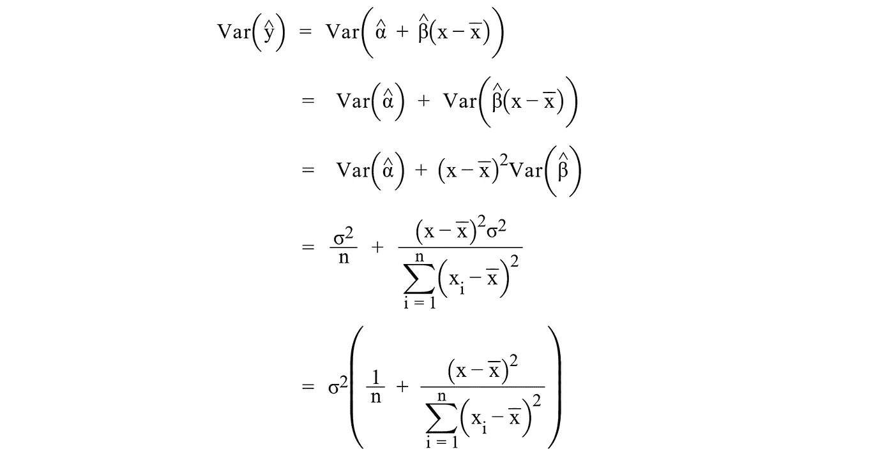
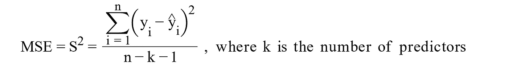
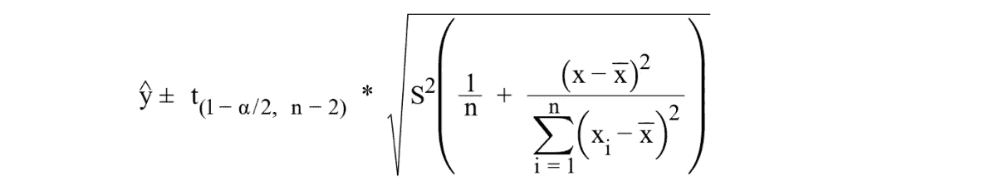
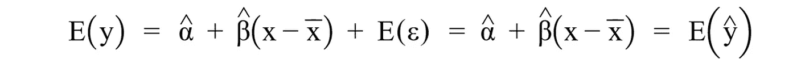
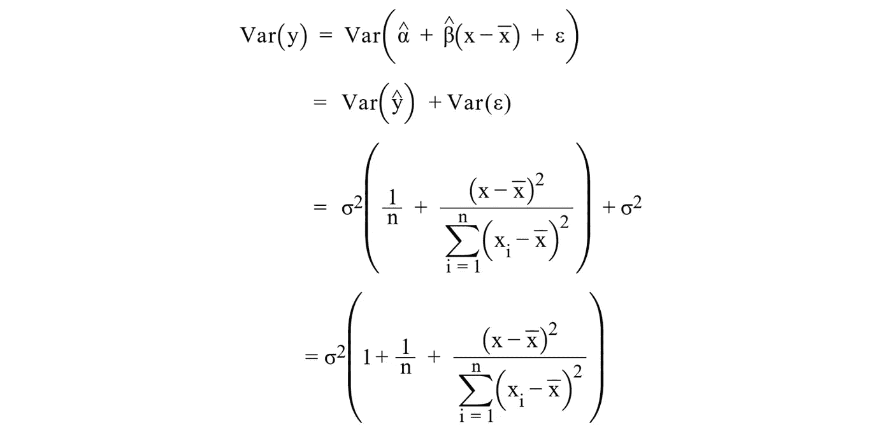
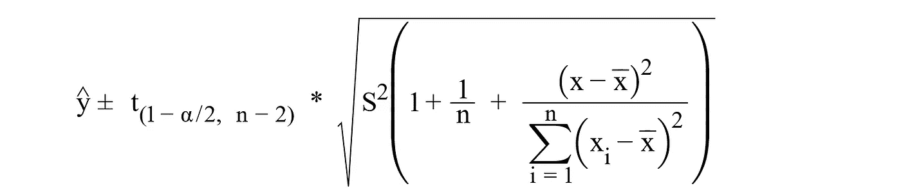
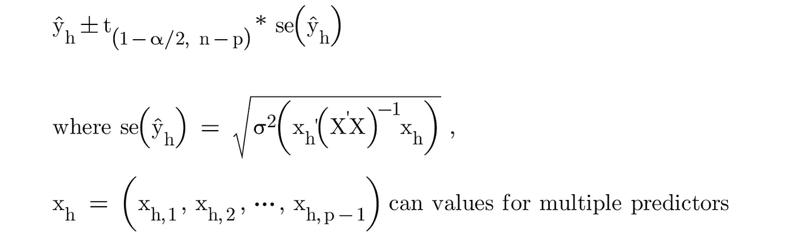
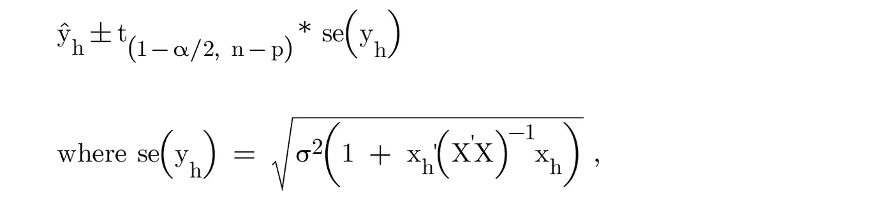

# 置信区间 vs 预测区间:有什么区别？

> 原文：<https://towardsdatascience.com/confidence-interval-vs-prediction-interval-what-is-the-difference-64c45146d47d>

## 为你的预测选择正确的区间估计

在 [Unsplash](https://unsplash.com?utm_source=medium&utm_medium=referral) 上由[J . Scott Rakozy](https://unsplash.com/@rockinrakozy?utm_source=medium&utm_medium=referral)拍摄的照片

**置信区间**和**预测区间**是两种区间估计，在统计分析中用于量化与给定估计相关的**不确定性**。两种类型的区间都提供了一个值的范围，参数的真实值可能位于该范围内，并具有指定的置信度。但是，置信区间和预测区间之间存在一些关键差异，了解这些差异对于为给定情况选择合适的区间非常重要。

让我们创建一个简单的线性回归模型的例子，通过这个模型，我们试图根据一所房子的平方英尺(即 X)来预测洛杉矶的房价(即 Y)。我们可以用下面的格式写这个线性回归。

等式 1

但对于这个话题，让我们通过**将**解释变量置于其平均值的中心来重写这个等式(即，用其平均值减去每个解释变量)。

等式 2

> 其效果是斜率(β)根本不会改变，因为居中只会通过减去一个常数(β*x_bar)来改变等式中的比例，但截距(α)的值会改变。

## 在线性回归模型中，我们为什么要将解释变量集中在其均值上？

当解释变量不居中时，模型中的截距项代表解释变量等于零时响应变量的预测值。这个值没有意义。

> 相反，如果解释变量以其均值为中心，截距项就变成了响应变量的**均值**，解释起来更直观。

## 平均响应的置信区间是多少？

> 置信区间是对给定的一组解释变量值预测平均响应值的区间估计。
> 
> 一个**置信区间**与来自 **OLS 估计量、** α^和β^.的**抽样不确定性**有关

**α** 和 **β** 是线性回归模型中的系数(或**参数**)。我们通常不了解它们，因为在很多情况下，不可能收集所有的人口数据来计算它们的价值。相反，我们只能依靠样本数据来计算 **OLS 估计量，α^** 和 **β^** 来估计α和β。如果我们收集一组不同的数据并再次拟合模型，我们可能会得到α^和β^.的不同值α^*β^的这种不确定性(又名**采样不确定性**)是预测响应值的不确定性来源之一。*

*在预测的背景下，对于给定的一组解释变量值，置信区间为我们提供了一系列的**平均**响应值。*

*例如，如果我们想估计洛杉矶 2000 平方英尺的平均房价，那么我们就在谈论置信区间。*

## *如何计算**平均响应值**的置信区间？*

*我们需要知道**平均响应值** (y^)的**期望值**和**方差**来计算置信区间。*

*我们知道方程 2 中线性回归模型的 OLS 估计值是(见证明[此处](https://online.stat.psu.edu/stat415/lesson/7/7.3))*

**

*作者图片*

*给定值解释变量(x)的平均响应值的期望值(又名**点估计值**)为*

**

*作者图片*

*为了计算平均响应值的方差，我们需要得到α^和β^的**抽样分布**，特别是它们的方差。它们是(参见此处的证明[和](https://online.stat.psu.edu/stat415/lesson/7/7.5))*

**

*作者图片*

*然后，我们可以计算平均响应值的方差:*

**

*作者图片*

*这里σ是误差项的方差，通常未知。我们可以用样本数据的均方差( **MSE** 或 S ) 来估计它的值。*

**

*作者图片*

*最后，我们可以计算平均响应的置信区间:*

**

*作者图片*

## *新响应的预测间隔是多少？*

> *预测区间是对给定的一组解释变量值预测**新响应值或未来观察值**的区间估计。*
> 
> *预测区间**比置信区间**宽。因为它不仅包括来自 OLS 估计量α^和β^的**抽样不确定性**，而且还考虑了来自线性回归模型无法解释的**不可约**误差、 **ε、**的不确定性。*

*在预测的上下文中，对于给定的一组解释变量值，预测区间为我们提供了**任何**可能响应值的值范围。*

*例如，如果我们想估计洛杉矶一座 2000 平方英尺的随机房屋的价值，那么我们就在谈论预测区间。*

## *如何计算新响应的预测间隔？*

*我们需要知道新响应变量(y)的**期望值**和**方差**。*

*我们知道这一点*

**

*作者图片*

*和*

**

*作者图片*

*因此，新响应变量的期望值是*

**

*作者图片*

*这与平均响应的预期值相同。新响应变量的方差为*

**

*作者图片*

*最后，我们可以计算新响应的预测区间:*

**

*作者图片*

## *为什么预测区间比置信区间宽？*

***数学上**，从公式中，我们可以看到预测区间包括额外项σ，以说明误差项的方差*

***直观地说**，在我们的例子中，房价可能会因回归模型中未包括的其他因素而变化，如位置、房屋状况、抵押贷款利率和其他未观察到的因素。这些被排除的变量将被包含在误差项ε中。预测区间需要考虑这些排除变量的不确定性。因此，对于相同的解释变量值，预测区间比置信区间具有更宽的范围。*

## *决定置信区间和预测区间宽度的因素是什么？*

*从公式中，我们可以看到*

*   *随着 MSE 的减小，区间的范围也减小。为了使线性回归模型中的 MSE 更小，我们需要确保模型的适当性，并包含相关的和有意义的预测因子。*
*   ***随着 t 乘数的降低，置信水平降低，则区间范围缩小。***
*   ***随着样本量的增加，则区间的范围减小。***
*   *预测值的方差越高，区间越窄。直观上，预测者能为模型提供的信息越多，区间估计就越精确。*
*   *预测值的输入越接近它们的平均值，区间就越窄。直观地说，当预测值在均值附近时，线性回归模型在预测方面更精确。因此，我们期望区间估计有一个“**沙漏**形状。*

## *如何计算多元线性回归(MLR)模型中的置信区间和预测区间*

*通常，我们会处理一个有多个预测因子的线性回归模型。MLR 的置信区间和预测区间与简单线性回归非常相似。*

*MLR 置信区间的一般公式为*

**

*作者图片*

*MLR 中预测区间的一般公式为*

**

*作者图片*

## *摘要*

*置信区间和预测区间都是区间估计，它们提供了一个值范围，在该范围内，真实值可能位于指定的置信水平。然而，置信区间用于估计总体参数，而预测区间用于预测未来观测值。置信区间通常比预测区间窄，因为它们仅包括与估计总体参数相关的不确定性，而预测区间包括与预测单个值相关的额外不确定性。根据具体的统计问题和被分析数据的类型选择合适的区间估计是很重要的。*

***来源:***

*[PennState Stat 415:数理统计简介](https://online.stat.psu.edu/stat415/)*

*[PennState STAT 501:回归方法](https://online.stat.psu.edu/stat501/)*

*如果你想探索更多与**统计**相关的帖子，请查看我的文章:*

*   *[**7 中心极限定理常见问题**](/7-most-asked-questions-on-central-limit-theorem-82e95eb7d964)*
*   *[**标准差 vs 标准误:有什么区别？**](/standard-deviation-vs-standard-error-whats-the-difference-ae969f48adef)*
*   *[**3 种最常见的曲解:假设检验、置信区间、P 值**](/the-most-common-misinterpretations-hypothesis-testing-confidence-interval-p-value-4548a10a5b72)*
*   *[**线性回归模型中误差项是否呈正态分布？**](/are-the-error-terms-normally-distributed-in-a-linear-regression-model-15e6882298a4)*
*   *线性回归模型中的 OLS 估计量是否正态分布？*
*   *[**什么是正则化:偏差-方差权衡**](/machine-learning-bias-variance-tradeoff-and-regularization-94846f945131)*
*   *[**方差 vs 协方差 vs 相关性:有什么区别？**](https://medium.com/geekculture/variance-vs-covariance-vs-correlation-what-is-the-difference-95adff96d542)*
*   *[**置信区间 vs 预测区间:有什么区别？**](/confidence-interval-vs-prediction-interval-what-is-the-difference-64c45146d47d)*
*   *I 型和 II 型错误哪个更糟糕？*

# *感谢您的阅读！！！*

*如果你喜欢这篇文章，并且想**请我喝杯咖啡，**请[点击这里](https://ko-fi.com/aaronzhu)。*

*您可以注册一个 [**会员**](https://aaron-zhu.medium.com/membership) 来解锁我的文章的全部访问权限，并且可以无限制访问介质上的所有内容。如果你想在我发表新文章时收到电子邮件通知，请订阅。*