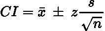

# 简单解释了置信区间

> 原文：<https://towardsdatascience.com/confidence-intervals-simply-explained-58b0b11e985f>

## 置信区间的简明解释。

由 [Unsplash](https://unsplash.com?utm_source=medium&utm_medium=referral) 上的 [Edge2Edge 媒体](https://unsplash.com/@edge2edgemedia?utm_source=medium&utm_medium=referral)拍摄

# 介绍

置信区间是统计学和数据科学中需要理解的一个基本概念。在本文中，我将简单明了地解释什么是置信区间以及如何计算它们。

# 直觉

简而言之，置信区间可以被认为是来自给定总体数据集的采样参数的相关**不确定性。**

区间是给定参数(通常是平均值)的一系列值，并附有**‘置信度’**来衡量**您对真实总体参数位于随机样本区间范围内的确信程度。**

置信水平是指当你抽取大量随机样本时，置信区间将包含真实总体参数的**确定性。最常见的概率极限有*和 ***99%*** 。这意味着用 *95%* 置信区间抽取的**随机样本中的*将包含真实参数****。这并不意味着给定的随机样本有*95%的机会在其区间范围内包含真参数。这是一个微小但重要的细微差别。*****

> ***注:置信区间是用正态置信区间公式计算的。非正态数据怎么办？大多数总体服从 [**中心极限定理**](https://en.wikipedia.org/wiki/Central_limit_theorem) ，因此我们可以计算大多数非正态数据的正态置信区间。***

# ***数学***

****(正常)置信区间的公式为:****

******

***LaTeX 中生成的方程。***

***其中*为样本**均值**， ***s*** 为样本**标准差**， ***n*** 为样本量，*为均值的**数。*******

***如果 ***z = 1.96*** ，这是指一个*95%的置信度，而 ***z = 2.576*** 是指一个*99%的置信度。这来自于有多少数据落在正态分布的不同标准偏差内。*****

***可以看到，随着 ***n*** 趋向于**无穷大**，**区间范围越来越小，最终将达到零。这意味着我们几乎 100%确定我们掌握了真实的意思。*****

# **例子**

**假设我们有学生的考试成绩:70，80，85，75，71，65，90，96，95，60。该群体的**均值**为 **78.7** 。**

**假设我们对第一个 **5 个结果进行采样:70、80、85、75、71，并且想要 95%的置信度:****

*   *****x̄ = 76.2*****
*   *****s ~ 6.3*****
*   *****n = 5*****
*   *****z = 1.96*****

**因此，我们发现我们的置信区间为:**

****

**LaTeX 中生成的方程。**

**事实上，在这种情况下，总体平均值位于我们的抽样平均值的置信区间内。**

# **结论**

**希望你喜欢这篇关于置信区间的简短而甜蜜的文章！如果你喜欢，记得留下掌声！**

# **和我联系！**

*   **要在媒体上阅读无限的故事，请务必在这里注册！T55*💜***
*   **[*当我在这里发布注册电子邮件通知时获得更新！*](/subscribe/@egorhowell) 😀**
*   **[*LinkedIn*](https://www.linkedin.com/in/egor-howell-092a721b3/)*👔***
*   ***[*碎碎念*](https://twitter.com/EgorHowell) 🖊***
*   **[*github*](https://github.com/egorhowell)*🖥***
*   ***<https://www.kaggle.com/egorphysics>**🏅*****

> ***(所有表情符号都是由 [OpenMoji](https://openmoji.org/) 设计的——开源的表情符号和图标项目。许可证: [CC BY-SA 4.0](https://creativecommons.org/licenses/by-sa/4.0/#)***