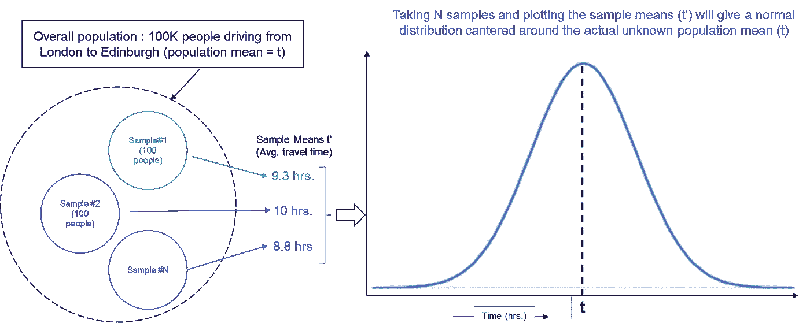
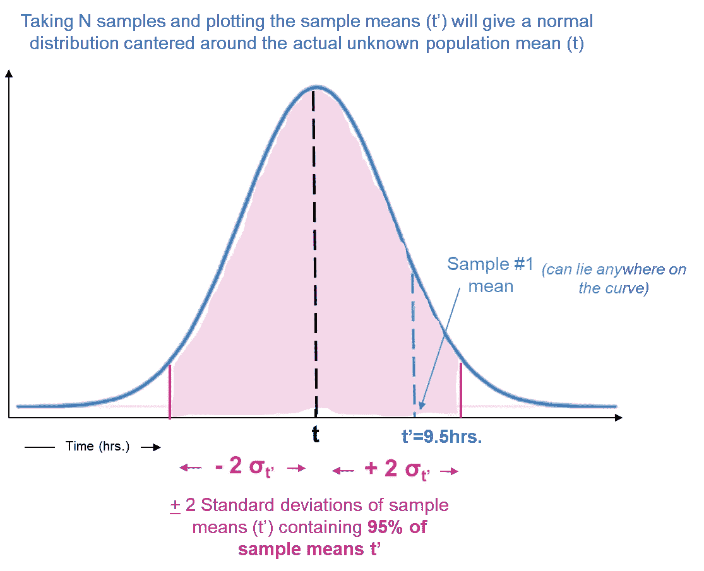
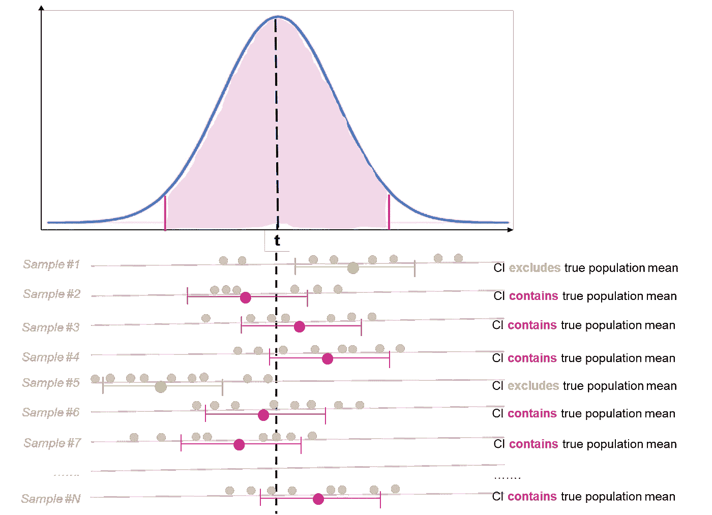

# 自信地理解置信区间

> 原文：<https://towardsdatascience.com/confidently-understanding-the-confidence-intervals-54142c56b081>

## *在 10 分钟内了解一个重要但被广泛误解的概念*

由[克里斯·利维拉尼](https://unsplash.com/@chrisliverani?utm_source=medium&utm_medium=referral)在 [Unsplash](https://unsplash.com?utm_source=medium&utm_medium=referral) 上拍摄

置信区间——我们都听说过！我们中的许多人认为我们理解他们，而我们中的一些人实际上理解他们。下面这篇文章致力于首先理解置信区间背后的直觉，然后继续讨论我们如何使用样本均值/标准误差/误差幅度等来创建置信区间。，捕捉他们周围的误解，触及影响他们的主要因素。让我们开始吧！！

# 置信区间背后的直觉

我们经常想知道**人口参数**，*比如每户一周的平均花费是多少，10 岁学生的平均身高是多少或者从伦敦开车到爱丁堡的平均时间是多少。虽然我们想了解人口数量，但实际情况是我们永远无法获得所有的人口数据。要知道一个国家内所有家庭的花费几乎是不可能的，我们不可能有所有 10 岁儿童的身高统计数据，要知道每个人从伦敦开车到爱丁堡所花的时间也是不切实际的。*

在这种情况下，统计学就可以派上用场了，因为我们想知道关于人口的一些事情，我们会(几乎！)从来没有接触过人口的数据。我们能得到的是来自一个群体中的一个样本的数据。通过统计学，我们可以根据样本数据中的**观察值**推断出总体参数**。**

> **推断**是指我们根据观察到的样本得出关于总体参数的结论或估计。

现在，我们使用样本数据的估计值来推断总体参数，总体参数可以有一个固定值，但我们永远不会知道它*(记住，总体参数是未知的！)，*所以**存在一个范围，这个范围可以从观察到的样本数据**中推断出来。因为这是一个范围，**范围越宽，我们就越有信心**，而**范围越窄，我们就越不有信心**总体参数将位于其中。
例如，*如果范围非常宽，比如从 0 到无穷大(或者从最小可能值到最大可能值)，我们可以 100%确定人口参数在它之内*(因为它还能在哪里！！)→ ***但是，这样极宽的范围一点帮助都没有！*** *(知道人口参数在 0 到无穷大之间你能做什么——什么都不做！)*

本质上，为了推断一个总体参数，我们需要以**观察样本为基础，并围绕它构建一个有一定置信度的范围(或区间)**。观察样本均值附近的这个区间(或范围)称为**置信区间**。

# 通过示例了解

我们来举个例子，假设你想**确定从伦敦到爱丁堡的开车时间**。让我们假设一年中有 10 万次从伦敦经由 ***【即人口=10 万次行程】*** 到爱丁堡的旅行。实际上不可能询问每个人的旅程并记下旅行时间。**这意味着不可能知道 10 万人口的平均出行时间**。
→人口平均出行时间是一个未知数，比如说‘t’。

显然，从整个人口中获取数据是不可行的；然而，你能做的是问一些经历过这一旅程的人(可能在你的邻居或工作场所附近)来得到一个估计。比方说，你从**人口**的样本中获得 100 次旅行的数据，平均旅行时间为 9.5 小时。这 100 次旅行是一个子集，是 100K 次旅行的样本，样本的平均旅行时间称为**样本均值**。让 t '表示这些样本平均值，对于样本#1，t ' = 9.5 小时

请注意，选择该样本有几种可能性。如果您选择不同的 100 次旅行(即不同的样本)，那么您将获得的平均旅行时间(即样本均值)可能会(*并且很可能*会)不同。正如你在下面的图片-1 中看到的，样本#2 的样本均值为 10 小时。类似地，样本#N 可以具有 8.8 小时样本平均值。**由于样本是总体的子集，样本均值永远不会是总体均值的完美代表**。此外，我们知道来自同一人群的不同样本可以有不同的样本均值。这叫做**采样误差**。

让 t '表示这些样本均值。由于所有这些样本都来自 100K 旅程的原始人群，因此可以说**所有样本均值** *(来自所有这 N 个样本)* **将遵循以“未知”人群均值**为中心的正态分布 *(假设 N 很大)* **。**

*   *也就是说，如果我们取 N 个样本，我们将有 N 个样本均值，分别用 t'(1)，t'(2)，…，t'(N)表示，并且 t '(即样本均值)的分布是以 t(总体均值)为中心的正态分布。* 请参考图片-1(下图)进行参考。

图片-1 |总体、样本、样本均值和样本均值分布(图片由作者提供)

让我们集中于样本#1，样本均值 t ' = 9.5 小时，这个值可以位于样本均值分布的任何位置。它可以位于 t 的左侧或右侧，可以靠近或远离总体均值 t。这种不确定性的原因是我们不知道真正的总体均值是什么。

*现在，考虑这个问题，*

**样本均值 t '在 t 的 2 个标准差以内的概率是多少？**
*请注意，这里的标准差是取多个样本均值后 t '值的偏差，即 t'(1)，t'(2)，…，t'(N)。*

> *从正态分布性质我们知道* ***95%的值*** *位于总体均值***的±2 个标准差之间**

**

*图片-2 |以未知总体均值为中心的样本均值分布(图片由作者提供)*

*→ **这意味着，95%的时间 t’将位于 t 的 2 个标准偏差内。** *这相当于说..(* b *在*的 c *内 a *与* a *在* b *的* c *内相同)。)* → **总体均值(t)在样本均值(t’)的 2 个标准差以内的概率为 95%。****

*为了推断 t，我们希望在 t '的任一侧构造一个区间，使得 t 有 95%的可能性位于该区间内。
——**我们必须在 t '附近建立一个 95%的置信区间(CI)。***

## *构建区间*

*为了定义 t '附近的这个区间，理想的是知道 t '的标准偏差。t '中的标准偏差来自于取多个样本并找出各种样本平均值的偏差。但是，我们不会那样做，对吧！
*(持续从总体中抽取无限样本是不可行的)**

*我们有什么东西可以帮助我们估计样本均值的偏差，从而给出 CI 的概念吗？ 嗯是的！！我们有来自总体的 100 个观察值中的样本#1，我们可以用它来估计偏差和区间。这叫做样本的*标准误差。**

> ***样本的标准误差** 标准误差(或样本均值的标准误差)是一种推断统计，简单地说就是**告诉我们样本数据代表总体的准确程度**。它描述了总体中多个样本的可变性，并且使用样本中收集的数据来计算**。***

*让我们看看也会影响置信区间(CI)的标准误差的一些属性:*

## *标准误差(以及 CI)应取决于两个因素:*

1.  ***感兴趣人群的变异**:*

*如果我们的总体值彼此非常接近，即所有 100K 行程的旅行时间变化非常小，那么我们从同一总体中选择的任何样本将彼此非常相似。这意味着，样本均值不会有很大的不同，观察到的样本均值可能接近总体均值。
→ **感兴趣的群体**的低变化意味着我们的**估计将非常接近真实的群体值**。
→我们将有一个**非常窄的置信区间**。*

*类似地，如果我们的总体值有很大的可变性，那么很可能来自同一总体的每个样本都互不相同，因此，样本均值也会有很大变化。我们不太确定我们观察到的样本均值是否接近总体均值。
→ **高人口变异**将意味着**我们的估计不会接近人口平均值。
→** 我们将有一个**宽的置信区间**。*

***2。样本大小***

***小样本量**意味着没有大量的观察值来进行推断，异常值会影响样本均值。这意味着小样本很可能彼此不同，因此样本均值也可能有很大变化。
→ **采样误差的影响很大**，我们对观察到的样本不太确定。
**→** 我们会有一个**宽的置信区间**。*

*另一方面，**高样本量**意味着在一个样本中有很多观察值，因此异常值的影响被抵消了。这意味着来自同一总体的不同样本(高样本量)彼此差异不大，因此，样本均值也将彼此接近。
→减少**采样误差的影响。**我们可以更加确定观察到的样本均值。
→我们将有一个**非常窄的置信区间**。*

**根据上述内容，样本的标准误差可定义为:**

> *标准误差=标准偏差(样本)/样本量*
> 
> ***低人口方差**，Std。戴夫。(样本)低→ **标准。错误—低
> 高总体方差**，标准差。戴夫。(样本)高→ **标准。错误—高电平***
> 
> *对于**较小的样本**，样本量较低→ **标准。错误-高** 对于**较大的样品**，样品尺寸高→ **标准。错误—低电平***

*将此应用于我们的虚拟数据，我们得到 0.25 小时的标准误差。*

*请记住，对于 95%的置信度，我们可以在样本均值的任意一侧取 2*SE 来构建我们的置信区间。这意味着，对于 95%的置信度，样本均值的两边都有一个误差范围(等于 2*SE)。*

> ***置信水平下的误差幅度**是在样本均值的任一侧，我们在推断总体均值时可以预期的最大偏差*
> 
> *误差范围= 2 *标准误差(置信度为 95%)*
> 
> *请注意，误差幅度是:
> 1 的函数。自信程度。
> 2。样本的标准误差*

*我们可以在 9.5 小时样本均值的两侧构建一个 2 * SE(= 2 * 0.25 = 0.5 小时)的区间，并得到人口平均出行时间的置信区间在 9 小时之间。(= 9.5 小时–0.5 小时)和 10 小时。(= 9.5 小时+0.5 小时)*

*→ **在 95%的置信度下，平均行程时间在 9-10 小时之间。***

**由于 CI 是一个区间，因此有一个下限和一个上限，如下:**

> *置信下限= **样本均值—误差幅度** 置信上限= **样本均值+误差幅度***
> 
> ***置信区间=样本均值+/-误差幅度=【LCL，UCL】***

*在我们的例子中，CI = [9.0，10.0]，LCL = 9.0 小时，UCL = 10.0 小时*

# ***词的解释:***

*如果我们取另一个样本，我们将有一个不同样本均值(t’)，一个不同的样本标准误差，一个不同的误差幅度，因此，一个完全不同的置信区间。**从这些随机样本中计算出的一些区间将包含真实总体均值，而一些则不包含。**请参见下面的图片-3。**95%的置信水平意味着从这些随机样本中计算出的 95%的置信区间将包含真实的总体均值**。换句话说，如果你进行 100 次研究，你会得到 100 个不同的置信区间。我们预计这 100 个置信区间中的 95 个将包含真实的总体均值。*

**

*图-3 |不同样本不同 CI；有些包含真实人口平均数，有些不包含。
95%的置信度意味着每 100 个样本中有 95 个这样的 CI 具有真实平均值(图片由作者提供)*

> ***置信度不在区间**内，因为它会从一个样本到另一个样本不断变化，**置信度在方法**内。*

*如果我们**一遍又一遍地使用相同的方法，它将产生区间** *(可能相同也可能不相同，取决于样本)*，该区间**将包含当时真实总体参数的 95%** 。*

*在上面的例子中，我们 95%确信从伦敦到爱丁堡的旅行时间在(9.0，10.0)小时的区间内。*

> ****常见误解***总体参数的值有 95%的机会或可能性或概率位于置信区间内。在本例中，我们 95%确定该值在 9-10 小时之间。*这是* ***错了！****
> 
> **相反，这意味着如果通过相同的方法获得更多的样本，那么很可能其中 95%的计算置信区间将包含真实的总体参数**——这就是具有 95%置信度的含义。**

# *影响置信区间的因素*

**以下是可能影响置信区间宽度的因素:**

1.  ***置信水平:**
    增加置信水平→增加误差幅度→增加 CI 宽度(更宽)*
2.  ***样本量:**
    增加样本量→减少 SE /误差范围→减少 CI 宽度(更窄)*
3.  ***样本可变性:** *(可能是我们无法控制的)* 样本可变性增加→SE/误差范围增加→CI 宽度增加(更宽)*

# *摘要*

*   ***人口参数**始终保持**未知**原样(几乎！)不可能有全部人口的数据。*
*   *我们可以从原始群体的样本中获得**数据，并且我们可以利用统计**来推断群体参数**。***
*   *来自同一总体的不同样本可能*(将)**具有不同的样本均值，即样本均值存在一定程度的可变性。**

> ***标准误差**给出了总体中多个样本间样本的**可变性的概念。***

*   *由于样本均值的可变性，我们永远无法估计总体参数*(未知)的设定值，*更确切地说**它很可能存在于可从样本中描述的值**的范围内。这个范围取决于我们想要的预先选择的置信度。*

> *低置信度→宽范围→我们不太精确
> 高置信度→窄范围→我们更精确*

*   *标准误差和置信水平产生**误差幅度**，用于说明样本均值的可变性。它用于构建样本均值两侧的**置信区间。***

> *置信区间是值的**范围，其**可能包含具有一定**置信度**的总体**参数。
> —围绕样本平均值构建，并考虑样本的可变性。***
> 
> *置信区间=样本均值+/-误差幅度= [LCL，UCL]*

*   *置信区间的宽度随着**置信水平**的不同而不同:
    - **直接**。
    - **间接**，考虑**样本量**。
    - **直接**随着**样本**的变化而变化(因此也是总体)*

> ***错误解读:** 95%置信区间**并不意味着**总体参数有 95%的可能会在这个区间内。*
> 
> ***正确解读:** 95%的信心指的是**对方法**的信心。如果使用相同的方法获取 100 个样本，**我们将有 100 个不同的 CI，其中 95 个将包括总体参数**。*

*对自己对置信区间的理解要有信心！*

## *保持联系..*

*如果你喜欢这篇文章并且对类似的文章感兴趣的话 [***在 Medium 上关注我***](https://medium.com/@deepakchopra2911)[***加入我的邮件列表***](https://medium.com/subscribe/@deepakchopra2911) 和*(..如果你已经不是了..)*跳上成为 [***中的一员***](https://medium.com/@deepakchopra2911/membership)*获取成千上万篇有用的文章。*(如果你使用以上链接，我将获得你 50%的会员费)***

*****..不断学习，不断成长！*****