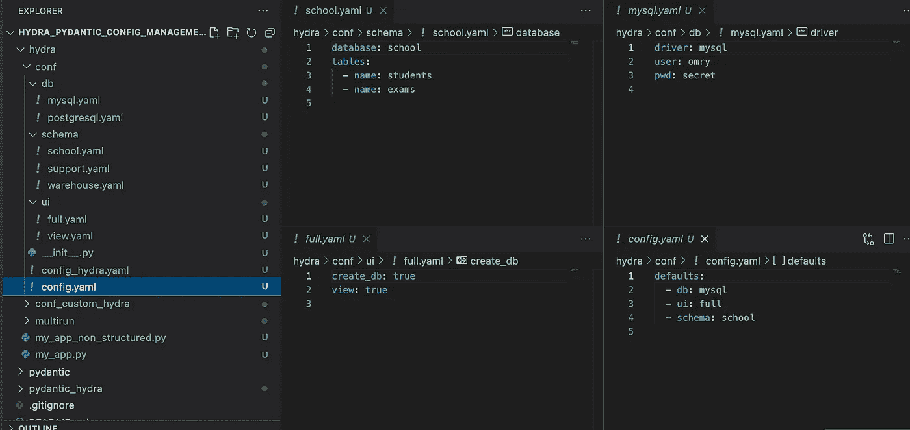
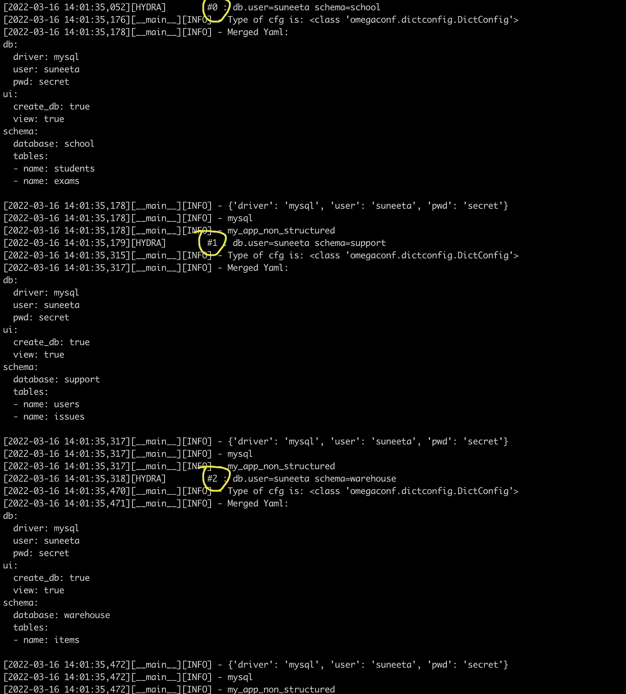
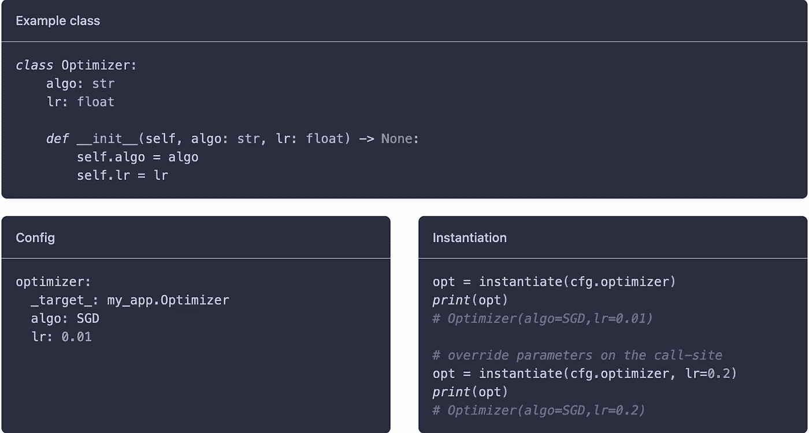
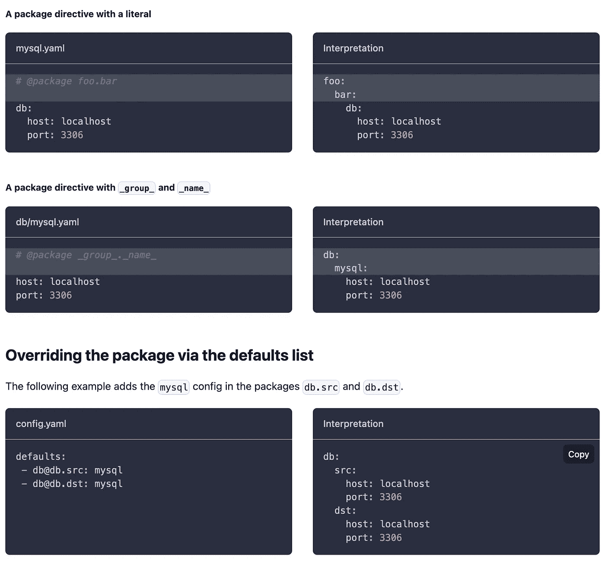
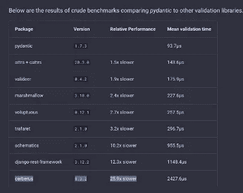

# 使用 Pydantic 和 Hydra 的模型训练实验的配置管理

> 原文：<https://towardsdatascience.com/configuration-management-for-model-training-experiments-using-pydantic-and-hydra-d14a6ae84c13>

## 软件评审、演示

## 你如何管理你的模型训练实验的配置？您觉得配置管理具有挑战性吗？你考虑过九头蛇吗？Pydantic 怎么样？这篇文章详细介绍了 Hydra 和 Pydantic，以及如何使用它们来简化配置管理。

H 您如何管理模型训练实验的配置？拥有良好的配置管理可以改善用户体验并简化实验管理。拥有一个好的配置解决方案的一些间接优势是干净、可靠和简单的应用程序代码。这对于任何软件应用程序都是如此，但是有些应用程序比其他应用程序需要更高的配置投资。这里的一个关键区别可能是一个有多少配置字段，以及这些字段之间的相互关系。对于深度学习实验来说，这可能会变得非常混乱，在深度学习实验中，配置和超参数的列表可能会在一个人脱离即席实验后迅速增长。

根据定义，模型训练配置是分层的。例如，实验配置可以分解为数据和模型规格。虽然这些是松散耦合的规范，但它们可能会对彼此施加某种程度的限制，例如，模型的输出规范需要与数据规范一致。如果数据源是 MNIST，分类器网络需要输出 10 长度的向量，如果是 PASCAL VOC，需要输出 20 长度的向量。

总的来说，训练实验的配置方案有以下要求:

1.  能够轻松地将训练实验的各种组件的配置模板化。
2.  能够以分级方式组织培训配置，承认参与组件的依赖性和层次结构。
3.  无需重复，通过插值、表达式等方式，在任何需要的地方跨模块重用配置。
4.  能够使用模板编写配置，并通过覆盖、环境等应用定制。
5.  能够存储和重用最终组装/编译的配置，并可靠地再现实验。
6.  支持结构化配置，由潜在的复杂、规范的 python 类型组成，除了类型提示之外还具有强大的验证支持。如果对动态特定领域验证不感兴趣，这可能是可选的——这在 yaml/json 等序列化形式中是无法实现的。
7.  能够对配置进行版本控制，并根据配置规范实施模式，以实现可靠性和健壮性。
8.  能够轻松集成到复杂的分布式启动器框架中，用于本地和远程启动。
9.  一种配置管理，它很好地集成到您的工具的回声系统中，并且不是非常命令式的。

考虑到这一点，我评估了一堆工具，其中一个组合 [Hydra](https://hydra.cc/) 和 [Pydantic](https://pydantic-docs.helpmanual.io/) 脱颖而出，成为一个不错的选择。在这篇文章中，我将回顾我对这两个工具的学习，并谈谈我仍然看到的差距。最后，针对这一差距提出了一个尝试性的解决方案。该员额的结构如下:

1.  [九头蛇](https://hydra.cc/)——它的优势，也是我认为它的弱点。
2.  如何用它来填补九头蛇的空缺
3.  Pydra 配置管理的缺失位，即[Hydra](https://hydra.cc/)&[Pydantic](https://pydantic-docs.helpmanual.io/)
4.  缩小差距的解决方案
5.  结论

*注:*本帖分享的样本和代码可在[这里](https://github.com/suneeta-mall/hydra_pydantic_config_management)获得。

# 水螅

[Hydra](https://hydra.cc/) 是一个动态分层配置管理工具，能够覆盖部分配置，也可以通过各种来源(如命令行参数、环境变量)来组合配置。它为模板化配置提供了一个很好的解决方案，可以根据您的目标动态地重新调整。除了重写规则、组合和插值以重新配置模板之外，它还提供了一种以普通的旧 python 对象风格表示配置的机制，并且可以自己处理序列化和反序列化。在一些值得注意的特性方面——使用 hydra，您可以在来自同一个模板源的多个配置实例上触发多进程工作负载。这对于包括并排比较或参数扫描在内的许多用例来说是一个非常方便的特性。

它也是可扩展的，人们可以编写插件来启动本地或远程工作负载。其他一些值得注意的特性是运行器配置和回调。总而言之，由 OmegaConf 提供支持，这是一个非常棒的配置管理工具。

# 一个简单的非结构化配置示例

让我们看一个简单的使用 hydra 进行基于 yaml 的配置，而不涉及 python 对象模型进行配置。这个例子是从[一个九头蛇样本](https://hydra.cc/docs/1.0/tutorials/basic/your_first_app/composition/)借用并扩展而来的。[本例](https://github.com/suneeta-mall/hydra_pydantic_config_management/blob/master/hydra/my_app_non_structured.py)展示了 3 个配置模块，即通过高层 [config.yaml](https://github.com/suneeta-mall/hydra_pydantic_config_management/blob/master/hydra/conf/config.yaml) 组装在一起的 db、schema 和 ui。



分层 hydra 配置示例。图片由作者提供。

```
import logging
from dataclasses import dataclass
from typing import List, Optionalimport hydra
from hydra.core.config_store import ConfigStore
from hydra.core.hydra_config import HydraConfig
from omegaconf import MISSING, DictConfig, OmegaConflog = logging.getLogger(__name__) @hydra.main(config_path="conf", config_name="config")
def my_app(cfg: DictConfig) -> None:
    log.info("Type of cfg is: %s", type(cfg))
    cfg_dict = OmegaConf.to_container(cfg, throw_on_missing=False, resolve=True) log.info("Merged Yaml:\n%s", OmegaConf.to_yaml(cfg)) log.info(cfg.db)
    log.info(cfg.db.driver) log.info(HydraConfig.get().job.name) if __name__ == "__main__":
    my_app()
```

示例代码可以在[这里](https://github.com/suneeta-mall/hydra_pydantic_config_management/blob/master/hydra/my_app_non_structured.py)找到

这个脚本中发生的一些事情是:

*   配置是如何加载的:上面的脚本告诉 hydra 在`conf`下寻找分层配置作为配置目录的基本位置，在`config.yaml`下寻找顶级配置规范。这个设置是由 python decorator `@hydra.main(config_path="conf", config_name="config")`默认的。用户可以覆盖这些设置并将配置位置指向另一个地方，方法是使用`--config-dir`作为基本目录，使用`--config-name`作为顶层 config.yaml，如下所示:

```
python my_app_non_structured.py --config-dir coni_custom_hydra python my_app_non_structured.py --config-name config_hydra
```

*   我可以访问什么格式的配置:一旦 hydra 加载了配置，它将作为 dict/dictionary 加载，并作为 [OmegaConf](https://github.com/omry/omegaconf) 的`DictConfig`出现。`DictConfig`的好处是你可以像变量访问器一样访问字段，比如上面代码中的`cfg.db.driver`代替了 dict str 键访问模式。
*   合成来自哪里:在`conf`目录中定义的是模板配置。有些值可能会丢失——这在 yaml 中可以表示为`???`。也可以在运行时覆盖模板配置中的一些值。例如:`python my_app_non_structured.py db.user=suneeta`这里，应用程序将看到的最终使用的配置是:

```
db:
  driver: mysql
  user: suneeta
  pwd: secret
ui:
  create_db: true
  view: true
schema:
  database: school
  tables:
  - name: students
  - name: exams
```

*   我的运行中使用的最终配置是什么:Hydra 将运行中使用的配置细节保存在其输出位置。默认情况下，输出位置为`outputs/YYYY-MM-DD/HH-MM-SS/.hydra/config.yaml`，可用于重新运行相同的运行以获得再现性。

```
python my_app_non_structured.py --config-dir=outputs/2022-03-16/13-45-29/.hydra
```

Hydra 还允许您配置作业和运行设置，这种配置的示例位于[这里](https://github.com/suneeta-mall/hydra_pydantic_config_management/tree/master/hydra/conf_custom_hydra/hydra)。或者，也可以在主 [config.yaml](https://github.com/suneeta-mall/hydra_pydantic_config_management/blob/master/hydra/conf/config_hydra.yaml) 文件中覆盖这些设置:

```
defaults:
  - _self_  # Note: to source default of hydra config 
  - db: mysql
  - ui: full
  - schema: schoolhydra:
  job:
    env_set: 
      HDF5_USE_FILE_LOCKING: "false"
      ## Useful for distributed train setup
      # RANK: ${hydra.job.num}
    env_copy: ## Local environment copy
      - API_KEY    job_logging:
    version: 1
    formatters:
      simple:
        format: "[%(levelname)s] - %(message)s"
    handlers:
      console:
        class: logging.StreamHandler
        formatter: simple
        stream: ext://sys.stdout
    root:
      handlers: [console] disable_existing_loggers: false run:
    dir: outputs/${hydra.job.name}/${now:%Y-%m-%d_%H-%M-%S}
```

*   Multi-run 和模板:Multi-run 允许用户在相同的配置模板上运行多进程工作负载，但是动态地改变它的一些值。实际上，用户将在不同的配置下运行相同代码的多个进程。参数扫描是一个很好的用例，它会派上用场。在接下来的运行中，`multirun`正在为学校、支持和仓库的模式触发 3 个不同的流程。

```
python my_app_non_structured.py db.user=suneeta schema=school,support,warehouse  --config-dir conf_custom_hydra --multirun
```

每个进程都有一个应用程序可以识别的 int id。索引从 0 开始，如下图所示。



多次运行的示例。图片由作者提供。

这在分布式培训运行中特别有用，在这种情况下，需要知道像过程的[等级](https://pytorch.org/tutorials/intermediate/dist_tuto.html)这样的事情。这可以使用 hydra 作为之后的[来轻松配置:](https://github.com/suneeta-mall/hydra_pydantic_config_management/blob/master/hydra/conf/config_hydra.yaml#L12)

```
hydra:
  job:
    env_set: 
      RANK: ${hydra.job.num}
```

# 使用结构化配置的扩展

如果你的应用程序配置稍微复杂一些，你可能想要配置的对象表示，那么 [Hydra](https://hydra.cc/) 提供了带有`ConfigStore`的结构化配置选项。这里的就是一个例子。

在这种情况下，您将配置对象模型定义如下:

```
@dataclass
class DBConfig:
    user: str = MISSING
    pwd: str = MISSING
    driver: str = MISSING
    timeout: int = 100 @dataclass
class MySQLConfig(DBConfig):
    driver: str = "mysql" @dataclass
class PostGreSQLConfig(DBConfig):
    driver: str = "postgresql" @dataclass
class View:
    create_db: bool = False
    view: bool = MISSING @dataclass
class Table:
    name: str = MISSING @dataclass
class Schema:
    database: str = "school"
    tables: List[Table] = MISSING @dataclass
class Config:
    # We can now annotate db as DBConfig which
    # improves both static and dynamic type safety.
    db: DBConfig
    ui: View
    schema: Schema
```

这里有一些值得注意的事情:

1.  `MISSING`是表示为`???`的 yaml 等价缺失的替换。
2.  Hydra 只能处理普通的旧 python 对象，最多只能处理[数据类](https://docs.python.org/3/library/dataclasses.html)或`dataclasses`的替代物。
3.  结构化配置不能处理 python 原语，也不能序列化(序列化和反序列化)规范或复杂的 python 对象。甚至没有像 python pathlib `Path`这样的东西。

一旦配置对象模型完成，应该定义`ConfigStore`并注册[配置对象](https://github.com/suneeta-mall/hydra_pydantic_config_management/blob/master/hydra/my_app.py#L57-L62):

```
cs = ConfigStore.instance()
cs.store(name="config", node=Config)
cs.store(group="db", name="mysql", node=MySQLConfig)
cs.store(group="db", name="postgresql", node=PostGreSQLConfig)
cs.store(name="ui", node=View)
cs.store(name="schema", node=Schema)
```

这里，配置注册表中的`group`键表示互斥的组。关于这些的更多信息可以在[这里](https://hydra.cc/docs/tutorials/structured_config/config_groups/)找到。

hydra injection 如何改变以支持配置存储？不会太多，如这个[示例](https://github.com/suneeta-mall/hydra_pydantic_config_management/blob/master/hydra/my_app.py#L75-L80)所示，在这种情况下，将`DictConfig`更改为您的高级配置对象`Config`就行了。然后，`OmegaConf.to_object(cfg)`在 python 对象模型中解包 dict config。

```
@hydra.main(config_path="conf", config_name="config")
def my_app(cfg: Config) -> None:    
    log.info("Type of cfg is: %s", type(cfg))
    cfg_dict = OmegaConf.to_container(cfg, throw_on_missing=False, resolve=True) cfg_obj = OmegaConf.to_object(cfg)
```

这是应用程序迁移到结构化配置所需做的全部工作，使用以下命令可以探索前面讨论的功能:

```
python my_app.py
python my_app.py db.user=suneeta    
python my_app.py db.user=suneeta --config-dir conf_custom_hydra
# python my_app.py db.user=suneeta --config-name config_hydra
# Multi-run
python my_app.py db.user=suneeta schema=school,support,warehouse  --config-dir conf_custom_hydra --multirun
```

代码位于[这里](https://github.com/suneeta-mall/hydra_pydantic_config_management/blob/master/hydra/my_app.py)

还有另一种方法 [Hydra](https://hydra.cc/) 提供给[通过配置实例化对象](https://hydra.cc/docs/advanced/instantiate_objects/overview/)。这种方法要求用户事先知道哪个配置是可对象的，因为将它们解包成对象需要显式调用`instantiate` API。这种用法的一个例子如下，请注意配置中的`__target__`字段中的全限定类名为`my_app.Optimizer`，这将导致实例化为`my_app.Optimizer(algo="SGD", lr=0.01)`:



实例化对象的示例。图片取自[九头蛇文档](https://hydra.cc/docs/advanced/instantiate_objects/overview/)

在我看来，这个特性应该谨慎使用，因为它将配置与特定于应用程序的对象紧密耦合在一起。这种混合配置处理方法很难维护和理解。

# 九头蛇的其他一些有趣的特征

## 插入文字

插值提供了一种引用现有配置而不是复制它的方法。它还允许用户使用通过配置中的字符串插值获得的派生值。插值示例如下所示:


插值的例子。图片取自九头蛇文档。

## 九头蛇指令

[Hydra](https://hydra.cc/) 允许使用指令覆盖包配置；这些的文档在[这里](https://hydra.cc/docs/1.0/advanced/overriding_packages/)。简而言之，它们提供了动态重写和重定位配置的方法。我认为这是邪恶的，为 yaml 工程提供了便利。如果您打算在标准接口之外使用 config，这也可能是一个调试噩梦。



重写配置规范的指令示例..图片取自九头蛇[文档](https://hydra.cc/docs/1.0/advanced/overriding_packages/)

谈到指令，`__global__`在管理配置覆盖方面非常方便。这里显示的一个例子是[九头蛇样本本身](https://hydra.cc/docs/patterns/configuring_experiments/)

# 九头蛇的不足之处。

总的来说， [OmegaConf](https://github.com/omry/omegaconf) 和 [Hydra](https://hydra.cc/) 是两个强大的配置管理工具，但是，我个人发现这些工具有以下缺点:

1.  不支持 serde(序列化和反序列化)规范或复杂的 python 对象真的很烦人，会给应用程序带来更多开销。退一步说，只有原始支持才是一个好的开始。
2.  [OmegaConf](https://github.com/omry/omegaconf) 和 [Hydra](https://hydra.cc/) 也不支持配置中的`Union`类型。
3.  对结构化配置类型的支持仅限于普通的旧 Python 对象或数据类(及其替代物)。
4.  验证框架是任何配置管理框架中的必备组件。用户提供的任何东西都必须在应用程序中进行验证，比如类型检查、特定于应用程序的验证、约束限制等。这一任务目前主要由应用程序来完成。留给应用程序的选择是使用结构化配置作为简单对象，并显式执行所有验证，包括类型检查等明显的事情。在我看来，这是有局限性的。
5.  插值是伟大的特性。扩展到这是能够运行基于表达式的插值，如项目列表中的总项目列表。然而，随着[问题](https://github.com/omry/omegaconf/issues/91)的提出，[九头蛇](https://hydra.cc/)缺乏这种支持。

# Pydantic

Pydantic 提供了一个运行时类型执行和验证，它本身是一个数据验证和设置管理工具。它使用纯规范的 python 数据模型，并为此提供了两种方法:

1.  [数据类替换下降](https://pydantic-docs.helpmanual.io/usage/dataclasses/)
2.  [基本模型抽象](https://pydantic-docs.helpmanual.io/usage/models/)

通过其验证框架和类型检查，pydantic 提供了模式实施，并可以序列化和反序列化各种格式的对象，包括但不限于 yaml/json、xml、ORM 等。它的字段类型支持特别是[约束类型](https://pydantic-docs.helpmanual.io/usage/types/#constrained-types)非常丰富，极大地简化了应用程序配置验证。例如图像大小可以小于 0 吗？验证这一点的最佳方法是什么？限制是在配置级别定义的，还是分散在使用配置的应用程序中？

总的来说，pydantic 是一个文档完备的库，其 dataclass 用法的一个示例如下图所示:

```
import logging
import sys
from pathlib import Path
from typing import Optional, Unionfrom pydantic import BaseModel, conint, validator
from pydantic.dataclasses import dataclass log = logging.getLogger(__name__) @dataclass
class Dataset:
    name: str
    path: str @validator("path")
    def validate_path(cls, path: str) -> Path:
        if Path(path).exists():
            print("exist")
        return Path(path) @dataclass
class Model:
    type: str
    num_layers: conint(ge=3)
    width: Optional[conint(ge=0)] @validator("type")
    def validate_supported_type(cls, type: str) -> str:
        if type not in ["alex", "le"]:
            raise ValueError(f"'type' canonly be [alex, le] got: {type}")
        return type @dataclass
class Config:
    dataset: Dataset
    model: Model
```

注意这里使用的验证器装饰器`@validator("type")`。这是一种验证特定应用逻辑的方法。

BaseModel 提供了更多的功能，因为它提供了`Config`内部类的语法糖，可以用来配置 base model 的具体实现的行为。细节可以在[这里](https://pydantic-docs.helpmanual.io/usage/model_config/)找到。像`anystr_lower`和`use_enum_values`这样的一些设置非常方便。谁不想使用不区分大小写的配置，但又不想让应用程序发生大小写转换呢？比如 bce 和 BCE 的意思和二元交叉熵有什么不同吗？BaseModel 实现如下所示:

```
class Dataset(BaseModel):
    name: str
    path: str @validator("path")
    def validate_path(cls, path: str) -> Path:
        if Path(path).exists():
            print("exist")
        return Path(path) class Config:
        title = "Dataset"
        max_anystr_length = 10
        allow_mutation = False
        validate_assignment = True
        anystr_lower = True
        validate_all = True
        use_enum_values = True
```

完整的示例代码位于[这里](https://github.com/suneeta-mall/hydra_pydantic_config_management/blob/master/pydantic/model.py)

BaseSettings 也是另一个很棒的特性，它试图抽象出来自环境变量、init 文件等其他来源的设置/配置。

```
class Secrets(BaseSettings):
    api_key: str = Field("", env="api_key")
    token: str class Config:
        # case_sensitive = True
        env_nested_delimiter = "_" @classmethod
        def customise_sources(
            cls,
            init_settings: SettingsSourceCallable,
            env_settings: SettingsSourceCallable,
            file_secret_settings: SettingsSourceCallable,
        ) -> Tuple[SettingsSourceCallable, ...]:
            return env_settings, init_settings, file_secret_settings
```

# 一些有趣的笔记

1.  有趣的是，pydantic 的验证器可以重新用于实现派生字段。这里的一个例子是:用例是，在另一个模块比如 data 中的 config 中已经提供了一个类列表。您想要在模型配置中由此“推断”类的总数。在这种情况下，您可以从数据模块中插入并复制一系列类到模型中，但是您实际上只关心总类的要求没有实现，因为您还不能进行基于表达式的插入。在这种情况下，`total_classes`可以被定义为 int 的列表，然后在验证时推导出总数，让您的 in config 对象始终表示总 int 值，并在验证时进行基于逻辑的推导。这方面的例子如下:

```
from typing import List, Union
from pydantic import BaseModel, conint, validatorclass Model(BaseModel):
    total_classes: Union[conint(ge=0), List[conint(ge=0)]] @validator("total_classes")
    def validate_classes(cls, total_classes: Union[conint(ge=0), List[conint(ge=0)]]) -> conint(ge=0):
        if isinstance(total_classes, List):
            return len(total_classes)
        return total_classes
```

我还没有看到像这样使用验证器的任何问题，但是不确定这是否是验证器支持的预期用途。此外，不确定为什么验证器在上述接口中返回。

1.  九头蛇的基准相当有利(见下图)。然而，他们没有对 OmegaConf 和其他一些相关工具进行基准测试，详情见这里的。



九头蛇的基准。图片取自 Pydantic 文档页面

# Pydantic 能填补九头蛇的缺口吗

Pydantic 提供了一个强大的验证框架，这是 hydra 所缺少的。虽然直接替换 pydantic 数据类可以与 hydra 一起工作，但人们仍然会错过模型配置的语法糖，仍然会局限于基本类型和非联合类型以及更有趣的 pydantic 约束类型。

公平地说，九头蛇和 pydantic 的直接整合是不存在的。接下来的问题应该是，我们能让它发挥作用吗？当然可以:)。

这里的[显示了一个示例，演示了](https://github.com/suneeta-mall/hydra_pydantic_config_management/blob/master/pydantic_hydra/example.py) [Hydra](https://hydra.cc/) 和 [Pydantic](https://pydantic-docs.helpmanual.io/) 如何结合使用。集成的秘诀在于以下几点:

1.  放弃使用九头蛇的`ConfigStore`
2.  将配置读取为`DictConfig`并通过 dict 解包到 Pydantic BaseModel 对象

简而言之，这是两行代码:

```
OmegaConf.resolve(cfg)
r_model = Config(**cfg)
```

其中`Config`是 [Pydantic](https://pydantic-docs.helpmanual.io/) 的 BaseModel 的具体实现。我们在这里做出的决定是，配置是以 yaml 格式指定的，我们让 Hydra 来管理模板、组合以及非结构化配置管理的所有优点。在解析和合并配置时，我们用 Pydantic 进行反序列化，并获得 Pydantic 验证、检查等所有好处。

# 这与其他生态系统工具集成得如何

鉴于 hydra 可以提供 dict 格式的最终配置，配置端可以很容易地与关心配置的 echo 系统工具集成。鉴于大多数实验管理和跟踪工具都支持将配置作为 dict 来管理，这不是一个挑战。来自[Weights and bias](https://wandb.ai/adrishd/hydra-example/reports/Configuring-W-B-Projects-with-Hydra--VmlldzoxNTA2MzQw)的帖子详细介绍了整合。

有趣的是，Hydra 的其他特性，如 multirun 和 sweeps，由于采用了多进程，可能会干扰其他采用 MP 技术的工具。

# 版本配置

如果一个人使用大型的、积极发展的代码库，版本控制是非常重要的实践。出于同样的原因，REST APIs 应该被版本化，docker 映像应该被版本化，库版本应该被版本化，等等，应用程序配置规范也应该被版本化。如果不是为了增量更新*，那么至少是为了突破性的改变*。Kubernetes 实际上做得很好，用户可以带来他们支持的版本的资源规范，它可以与那个版本一起为你创建资源。配置管理比 Kubernetes immplements 复杂得多，但在我看来，这里可以转移的是:

1.  创建运行时，始终使用最新版本的配置。
2.  准备好一个支持，您可以将旧配置迁移到最新版本的配置，这样您就可以在需要时使用更新的功能重现[而不是重复]您的实验。

[这个原型](https://github.com/suneeta-mall/hydra_pydantic_config_management/blob/master/pydantic_hydra/example.py#L83-L172)是一个玩具示例，探索如何处理配置中的版本控制，并在提供旧版本配置时提供一个迁移路径。这里所做的假设是，您的训练代码只能与最新版本的 config 一起工作，因此应用程序代码很简单，并且总是渐进的。每当引入重大变更时，就会创建一个新的浮点版本的 config，而先前版本的 config 会实现到下一版本的迁移路径。

下面显示的代码代表模型配置，它有 3 个版本`v`，即 1.0、2.0、3.0。每个版本都对前一个版本做出了突破性的改变，但是每个具体的实现都实现了一个“def to _ next(self)->Optional[base model]”方法，该方法在将配置迁移到新规范时会出现问题。

```
class VersionModel(BaseModel, abc.ABC):
    v: Literal["inf"] = Field(float("inf"), const=True) class Config:
        title = "Model"
        allow_mutation = False
        max_anystr_length = 10
        validate_assignment = True
        anystr_lower = True
        validate_all = True
        use_enum_values = True def version(self) -> float:
        return self.v def _next_version_model(self) -> float:
        versions = list(fake_registry.keys())
        versions.sort()
        idx = versions.index(self.v) + 1
        if idx == len(versions):
            return None
        return versions[idx] def next_version(self) -> BaseModel:
        next_class = fake_registry.get(self._next_version_model())
        return next_class @abc.abstractmethod
    def to_next(self) -> BaseModel:
        pass class Model1(VersionModel):
    # https://pydantic-docs.helpmanual.io/usage/types/#arguments-to-constr
    type: str  # constr(to_lower=True)
    num_layers: conint(ge=3)
    width: Optional[conint(ge=0)]
    # v: float = Field(1.0, const=True)
    zoom: conint(gt=18) = 19
    v: Literal[1.0] = Field(1.0, const=True) # @classmethod
    # def to_next(cls, instance: Type[VBT]) -> BaseModel:
    def to_next(self) -> Optional[BaseModel]:
        next_class = self.next_version()
        if next_class != Model2:
            raise Exception("WTH") d = self.dict()
        d.pop("v")
        return Model2(**d) class Model2(Model1):
    width: conint(ge=5)
    context: conint(ge=256) = 256
    # v: float = Field(2.0, const=True)
    v: Literal[2.0] = Field(2.0, const=True) def to_next(self) -> Optional[BaseModel]:
        next_class = self.next_version()
        if next_class != Model3:
            raise Exception("WTH") return Model3(
            new_context=self.context,
            num_layers=self.num_layers,
            type=self.type,
            width=self.width,
            zoom=self.zoom,
        )class Model3(Model1):
    new_context: conint(ge=512, le=1300) = 512
    v: Literal[3.0] = Field(3.0, const=True) def to_next(self) -> Optional[BaseModel]: return None
```

配置模板，如这里的[所示](https://github.com/suneeta-mall/hydra_pydantic_config_management/tree/master/pydantic_hydra/conf/model)也被版本化。

让我们来看一下各种场景:

1.  用户想要运行培训并使用最新配置，他们运行`python example.py model=resnet_v3`
2.  一个用户想运行一个培训，并使用最新的配置，但覆盖了一些值，他们运行`python example.py model=resnet_v3 +model.zoom=25`
3.  用户想要从旧配置重新运行培训，他们运行`python example.py`。他们使用 v2 版本的配置，迁移失败，因为 v3 中的字段`context`要求值大于或等于 512，但 v2 模板中使用的配置是 256。用户收到了关于需要更改配置以使其工作的反馈。
4.  #3 中的同一个用户想要从旧配置中重新运行一个培训，他们运行`python example.py model.context=512`。它们可以运行，应用程序执行迁移，而应用程序实际上只有模型 3 版本的对象配置。
5.  我想公开模型配置的模式，我该怎么做:

```
_Models = Annotated[Union[Model1, Model2, Model3], Field(discriminator="v")]      
_schema = schema_json_of(_Models, title="Model Schema", indent=2)
```

这将为模型配置生成以下模式:

```
{
  "title": "Model Schema",
  "discriminator": {
 "propertyName": "v",
 "mapping": {
   "1.0": "#/definitions/Model1",
   "2.0": "#/definitions/Model2",
   "3.0": "#/definitions/Model3"
 }
  },
  "anyOf": [
 {
   "$ref": "#/definitions/Model1"
 },
 {
   "$ref": "#/definitions/Model2"
 },
 {
   "$ref": "#/definitions/Model3"
 }
  ],
  "definitions": {
 "Model1": {
   "title": "Model",
   "type": "object",
   "properties": {
     "v": {
       "title": "V",
       "const": 1.0,
       "enum": [
         1.0
       ],
       "type": "number"
     },
     "type": {
       "title": "Type",
       "type": "string"
     },
     "num_layers": {
       "title": "Num Layers",
       "minimum": 3,
       "type": "integer"
     },
     "width": {
       "title": "Width",
       "minimum": 0,
       "type": "integer"
     },
     "zoom": {
       "title": "Zoom",
       "default": 19,
       "exclusiveMinimum": 18,
       "type": "integer"
     }
   },
   "required": [
     "type",
     "num_layers"
   ]
 },
 "Model2": {
   "title": "Model",
   "type": "object",
   "properties": {
     "v": {
       "title": "V",
       "const": 2.0,
       "enum": [
         2.0
       ],
       "type": "number"
     },
     "type": {
       "title": "Type",
       "type": "string"
     },
     "num_layers": {
       "title": "Num Layers",
       "minimum": 3,
       "type": "integer"
     },
     "width": {
       "title": "Width",
       "minimum": 5,
       "type": "integer"
     },
     "zoom": {
       "title": "Zoom",
       "default": 19,
       "exclusiveMinimum": 18,
       "type": "integer"
     },
     "context": {
       "title": "Context",
       "default": 256,
       "minimum": 256,
       "type": "integer"
     }
   },
   "required": [
     "type",
     "num_layers",
     "width"
   ]
 },
 "Model3": {
   "title": "Model",
   "type": "object",
   "properties": {
     "v": {
       "title": "V",
       "const": 3.0,
       "enum": [
         3.0
       ],
       "type": "number"
     },
     "type": {
       "title": "Type",
       "type": "string"
     },
     "num_layers": {
       "title": "Num Layers",
       "minimum": 3,
       "type": "integer"
     },
     "width": {
       "title": "Width",
       "minimum": 0,
       "type": "integer"
     },
     "zoom": {
       "title": "Zoom",
       "default": 19,
       "exclusiveMinimum": 18,
       "type": "integer"
     },
     "new_context": {
       "title": "New Context",
       "default": 512,
       "minimum": 512,
       "maximum": 1300,
       "type": "integer"
     }
   },
   "required": [
     "type",
     "num_layers"
   ]
 }
  }
}
```

# 结论

拥有像 [Hydra](https://hydra.cc/) 和 [Pydantic](https://pydantic-docs.helpmanual.io/) 这样的工具来简化配置管理和有效处理验证是很棒的。如果 [Hydra](https://hydra.cc/) 也能与 [Pydantic](https://pydantic-docs.helpmanual.io/) 很好地集成就更好了，但至少有一种方法可以一起使用这两种工具。我对版本化配置的想法，以及如何用 Pydra ie Pydantic 和 Hydra 实现它的想法仍在发展中。如果你考虑过替代方案，我会洗耳恭听。