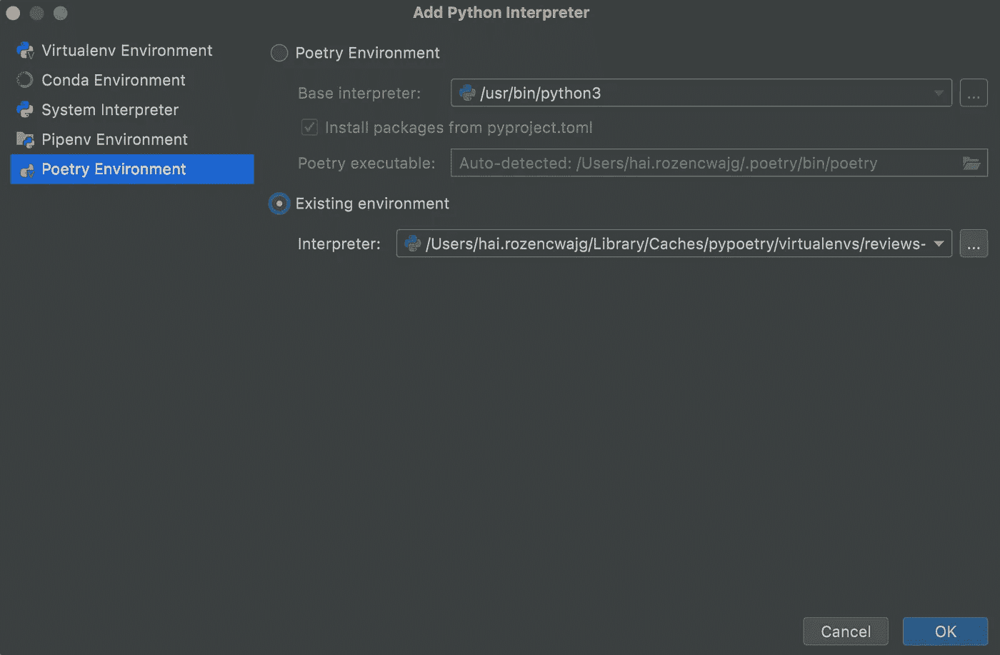

# 配置一个在 PyCharm 中运行的诗歌环境

> 原文：<https://towardsdatascience.com/configure-a-poetry-environment-that-runs-in-pycharm-eba47420f0b6>


由[Tru“Tru”kat sande](https://unsplash.com/@iamtru?utm_source=medium&utm_medium=referral)在 [Unsplash](https://unsplash.com?utm_source=medium&utm_medium=referral) 上拍摄的照片

## 诗歌结构

## Python 中依赖性管理和打包的快速简单指南

[poems](https://github.com/python-poetry/poetry)是一个很棒的开源工具，可以减轻设置环境和配置依赖项的痛苦。

在这篇博客中，我将向你略略展示诗歌的能力和其中蕴含的力量。我还将指导您完成在 PyCharm 中配置诗歌环境的技术过程。

与一些现有的依赖管理和打包工具相比，poem 有几个优点(更多细节请参考[poem 的介绍](https://github.com/python-poetry/poetry#introduction)和[一个诗意的道歉](/a-poetic-apology-71a41db4ecce))。也许诗歌越来越受欢迎的关键原因可以在下面的引言中找到:

> `poetry`是一个处理依赖项安装以及构建和打包 Python 包的工具。它只需要一个文件来完成所有这些:新的，[标准化的](https://www.python.org/dev/peps/pep-0518/) `pyproject.toml`。
> 
> 换句话说，诗歌用`pyproject.toml`来代替`setup.py`、`requirements.txt`、`setup.cfg`、`MANIFEST.in`、`Pipfile`。

使用诗歌管理 Python 打包和依赖项有许多不同的配置选项。我将在这篇博客中展示的是我认为最方便的配置，它满足了我的所有需求。

# 装置诗歌

按照 poems 的[文档](https://python-poetry.org/docs/master/#installing-with-the-official-installer)按照你的系统环境安装 poems。

# 为 PyCharm 安装诗歌插件

对于 PyCharm 版本> =2021.3，无需手动安装插件即可集成诗歌。

对于版本低于 2021.3 的 PyCharm，我们将安装 PyCharm 所需的插件。你可以在下面找到不同 JetBrains IDEs 的诗歌版本列表。

<https://plugins.jetbrains.com/plugin/14307-poetry/versions>  

单击上面的链接后，IDE 中将出现一个弹出窗口，显示如何安装插件的说明。

# 创建新的诗歌项目

我们现在准备创建我们的新的诗歌环境！在本例中，我将创建一个名为 *reviews* 的包，用于训练和服务我们的文本分类模型，该模型从租户评论中提取与住宅区生活质量相关的信息( [Haber 和 Waks，2021](https://aclanthology.org/2021.findings-emnlp.217/) )。

```
poetry new reviews
```

这一步的输出是`pyproject.toml`文件:

```
[tool.poetry]
name = "reviews"
version = "0.1.0"
description = ""
authors = ["hai.rozencwajg <EMAIL>"]

[tool.poetry.dependencies]
python = "^3.7"

[tool.poetry.dev-dependencies]
pytest = "^5.2"

[build-system]
requires = ["poetry-core>=1.0.0"]
build-backend = "poetry.core.masonry.api"
```

我安装的 Python 版本是`*3.7.9*`,`[tool.poetry.dependencies]`下的 Python 版本是`^3.7`，即等于或大于`3.7`小于`4`的 Python 版本。

要阅读更多关于诗歌的符号，如脱字符号(`^`)和其他版本约束，请参阅[诗歌的依赖规范](https://python-poetry.org/docs/dependency-specification/)指南。

# 创建一个诗歌虚拟环境

接下来，我们将通过运行以下命令为这个项目创建一个诗歌环境:

```
poetry install
```

这将创建一个本地虚拟环境，用于根据`pyproject.toml`文件中列出的配置运行项目。

本地环境是在诗歌本地环境`~/Library/Caches/pypoetry/virtualenvs`的默认路径中创建的。

# 添加虚拟环境作为解释器



在 PyCharm 中添加 Python 解释器。PyCharm 截图。

在 PyCharm 中点击*添加解释器*按钮后，自动找到已有的解释器，自动为该项目激活诗歌虚拟环境。

# 安装 Python 包

类似于著名的`pip install`命令，诗歌也支持使用诗歌*添加*命令轻松安装 Python 包。

```
poetry add google-cloud-storage
```

运行上面的代码后，一个新的行被添加到记录`google-cloud-storage`包版本的`pyproject.toml`文件中。

```
[tool.poetry]
name = "reviews"
version = "0.1.0"
description = ""
authors = ["hai.rozencwajg <EMAIL>"][tool.poetry.dependencies]
python = "^3.7"
**google-cloud-storage = "^2.4.0"** 
[tool.poetry.dev-dependencies]
pytest = "^5.2"

[build-system]
requires = ["poetry-core>=1.0.0"]
build-backend = "poetry.core.masonry.api"
```

此外，还创建了一个`poetry.lock`文件。该文件跟踪软件包的已安装版本及其依赖项，如下面的日志中所列:

```
Using version ^2.4.0 for google-cloud-storageUpdating dependencies
Resolving dependencies... (9.7s)Writing lock filePackage operations: 18 installs, 0 updates, 0 removals • Installing pyasn1 (0.4.8)
  • Installing cachetools (5.2.0)
  • Installing certifi (2022.6.15)
  • Installing charset-normalizer (2.1.0)
  • Installing idna (3.3)
  • Installing protobuf (4.21.2)
  • Installing pyasn1-modules (0.2.8)
  • Installing rsa (4.8)
  • Installing six (1.16.0)
  • Installing urllib3 (1.26.10)
  • Installing google-auth (2.9.0)
  • Installing googleapis-common-protos (1.56.3)
  • Installing requests (2.28.1)
  • Installing google-api-core (2.8.2)
  • Installing google-crc32c (1.3.0)
  • Installing google-cloud-core (2.3.1)
  • Installing google-resumable-media (2.3.3)
  • Installing google-cloud-storage (2.4.0)
```

# 利用诗歌的力量解决兼容性问题

接下来，我想将`google-cloud-bigquery`包添加到诗歌中，所以我运行了诗歌*添加*命令:

```
poetry add google-cloud-bigquery
```

但是这一次，我犯了一个错误，这个错误展示了诗歌的力量:

```
Using version ^3.2.0 for google-cloud-bigqueryUpdating dependencies
Resolving dependencies... (0.2s)SolverProblemErrorThe current project's Python requirement (>=3.7,<4.0) is not compatible with some of the required packages Python requirement:
    - google-cloud-bigquery requires Python >=3.6, <3.11, so it will not be satisfied for Python >=3.11,<4.0

  Because google-cloud-bigquery (3.2.0) requires Python >=3.6, <3.11
   and no versions of google-cloud-bigquery match >3.2.0,<4.0.0, google-cloud-bigquery is forbidden.
  So, because reviews depends on google-cloud-bigquery (^3.2.0), version solving failed.at ~/.poetry/lib/poetry/puzzle/solver.py:241 in _solve
      237│             packages = result.packages
      238│         except OverrideNeeded as e:
      239│             return self.solve_in_compatibility_mode(e.overrides, use_latest=use_latest)
      240│         except SolveFailure as e:
    → 241│             raise SolverProblemError(e)
      242│ 
      243│         results = dict(
      244│             depth_first_search(
      245│                 PackageNode(self._package, packages), aggregate_package_nodes• Check your dependencies Python requirement: The Python requirement can be specified via the `python` or `markers` properties

    For google-cloud-bigquery, a possible solution would be to set the `python` property to ">=3.7,<3.11"[https://python-poetry.org/docs/dependency-specification/#python-restricted-dependencies](https://python-poetry.org/docs/dependency-specification/#python-restricted-dependencies),
    [https://python-poetry.org/docs/dependency-specification/#using-environment-markers](https://python-poetry.org/docs/dependency-specification/#using-environment-markers)
```

原来在最新版本的`google-cloud-bigquery==3.2.0`和在`pyproject.toml`文件中列出的可能的 Python 版本之间有一个兼容性问题。

幸运的是，诗歌也为我们提供了一个可能的解决方案:

> 对于 google-cloud-bigquery，一个可能的解决方案是将“python”属性设置为“> =3.7，<3.11"

As we can see above, Poetry instructs us to be stricter about the Python version by limiting to 【 instead of the current setup 【 , so I changed the Python version in 【 file as suggested.

```
[tool.poetry]
name = "reviews"
version = "0.1.0"
description = ""
authors = ["hai.rozencwajg <EMAIL>"]

[tool.poetry.dependencies]
**python = ">=3.7,<3.11"** google-cloud-storage = "^2.4.0"

[tool.poetry.dev-dependencies]
pytest = "^5.2"

[build-system]
requires = ["poetry-core>=1.0.0"]
build-backend = "poetry.core.masonry.api"
```

Now, after re-running the Poetry *add* 命令用于`google-cloud-bigquery`包，安装成功结束。

```
Using version ^3.2.0 for google-cloud-bigqueryUpdating dependencies
Resolving dependencies... (91.8s)Writing lock filePackage operations: 8 installs, 1 update, 0 removals • Updating protobuf (4.21.2 -> 3.20.1)
  • Installing grpcio (1.47.0)
  • Installing grpcio-status (1.47.0)
  • Installing numpy (1.21.6)
  • Installing proto-plus (1.20.6)
  • Installing google-cloud-bigquery-storage (2.14.0)
  • Installing pyarrow (8.0.0)
  • Installing python-dateutil (2.8.2)
  • Installing google-cloud-bigquery (3.2.0)
```

我们还可以看到`protobuf`版本被降级(自动)以支持我们所有的版本兼容性约束。

新的`pyproject.toml`文件现在看起来像这样:

```
[tool.poetry]
name = "reviews"
version = "0.1.0"
description = ""
authors = ["hai.rozencwajg <EMAIL>"]

[tool.poetry.dependencies]
python = ">=3.7,<3.11"
google-cloud-storage = "^2.4.0"
**google-cloud-bigquery = "^3.2.0"** 
[tool.poetry.dev-dependencies]
pytest = "^5.2"

[build-system]
requires = ["poetry-core>=1.0.0"]
build-backend = "poetry.core.masonry.api"
```

# 其他好吃的

## 特定软件包版本的安装

与`pip`类似，poems 支持特定包版本的安装:

```
poetry add pandas~=1.3
```

## 仅为开发环境安装包

告别多个`requirements.txt`文件很好玩。poem 支持在一个文件下管理生产和开发环境。下面我安装了`pandas-profiling`,仅用于开发环境中的数据探索。

```
poetry add pandas-profiling --dev
```

`pandas-profiling`包将列在`[tool.poetry.dev-dependencies]`部分下，而不是`[tool.poetry.dependencies]`下。

## 卸载软件包

卸载就像添加软件包一样简单:

```
poetry remove google-cloud-bigquery
```

## 打开一个新的外壳，用一个诗歌环境激活它

```
poetry shell
```

# 结论

诗歌是一个伟大的工具，它有许多功能，使你作为一个开发人员能够以一种清晰、简单和透明的方式管理你的依赖关系。使用诗歌有助于环境设置，并有助于解决兼容性问题。

我肯定会在我未来的项目中继续使用诗歌，我希望你也这么想。

[*海*](https://medium.com/u/5921283ee0f1?source=post_page-----eba47420f0b6--------------------------------)【】是一名首席数据科学家在 [*天际线*](https://www.skyline.ai/) *，一家*<https://www.jll.co.il/>**公司和部分*[*【JLL】科技*](https://www.jllt.com/) *任职。我们使用大量多样的信息和尖端技术，为房地产专业人士提供产生独特商业价值的视角。**

# *参考*

 ** *</a-poetic-apology-71a41db4ecce>  <https://www.jetbrains.com/help/pycharm/poetry.html> *