# 围绕混淆矩阵的混淆指标

> 原文：<https://towardsdatascience.com/confusing-metrics-around-the-confusion-matrix-6ee54e4ed603>

## 理解从混淆矩阵导出的一些混淆分类度量的直观方法

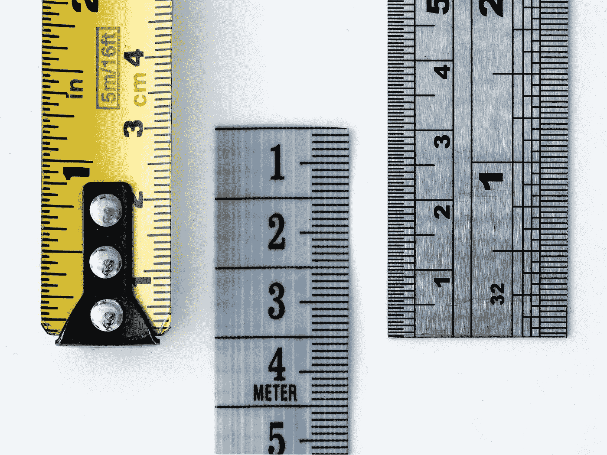

威廉·沃比在 [Unsplash](https://unsplash.com/collections/3497526/metrics-and-measures?utm_source=unsplash&utm_medium=referral&utm_content=creditCopyText) 上的照片

# 动机

> “如果你不能衡量它，你就不可能改进它”。

在机器学习和数据科学领域，特别是在统计分类中，“混淆矩阵”通常用于导出一组指标，可以对这些指标进行检查，以提高分类器模型的性能或比较多个模型的性能。

虽然混淆矩阵本身是不言自明的，但通常从它导出的指标很难理解，因为:

*   **指标在多个学科领域有不同的名称**。
*   **并非所有的指标都与问题的背景相关**。
*   没有**最佳*指标*指标**，它们每个都提供了不同但有价值的见解。

我们将尝试基于基本概念直观地推导公式，而不是从度量的数学公式开始。

# 关键假设

为了使我们的解释简单易行，我们假设:

*   一个*二元分类器*(有两个输出类)。
*   分类是*硬预测* —分类器的输出是预测它所属的类别，而不是概率和分数。

# 混淆矩阵是不言自明的

它可能被称为“混淆”,因为它描述了分类器在进行预测时有多混乱——一些类被正确分类，而一些没有。

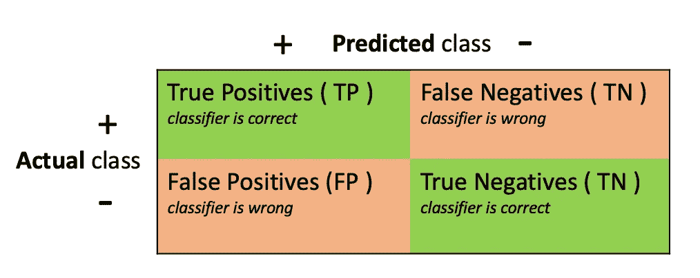

混乱矩阵——作者图片

# 定义一个“积极的”类

在从混淆矩阵中探索任何度量之前，要理解的最重要的概念是在给分类器的问题的上下文中“肯定”和“否定”类的真正含义。通常，词语*阳性*和*阴性*可能会让我们对它们的自然含义感到困惑，但这里重要的是要理解:

*阳性类是存在* ***我们试图检测或预测的*** 。

这里有一些例子。这里可以注意到，这些只是对问题的积极类的通常选择；它们可以根据问题的上下文根据需要进行交换。

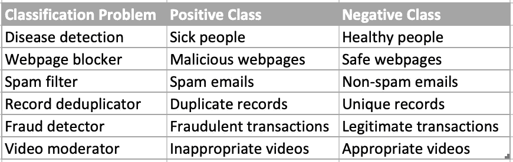

问题背景下的积极和消极类—作者图片

# 在问题的上下文中定义 TP/TN/FP/FN

给定对正类的理解，我们可以在问题的上下文中定义 TP，FP，TN 和 FN。这有助于我们清楚地理解从中得出的指标。以下是一些例子:

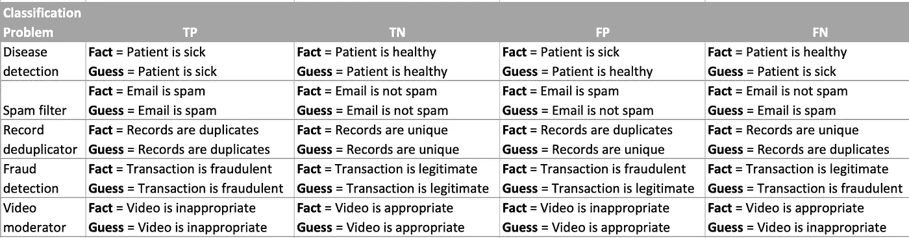

问题上下文中的预测类-作者图片

# 定义可以衡量绩效的指标

直观地说，我们希望找出并推导出一个度量标准的逻辑，该度量标准可以测量分类器预测*正确*类别的频率，或者换句话说，分类器在选择相关项目和消除不相关项目时的*准确度*有多高。我们问自己:

*在所有预测中，正确预测的比例是多少？*

数学上，我们可以将其定义为:

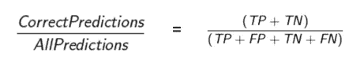

准确性公式—作者提供的图像

我们称之为**准确性。**

# 某些模型的“准确性”

让我们来看一些例子的准确性度量是如何工作的。我们将使用通过测试一些我们将要比较的模型而产生的混淆矩阵。

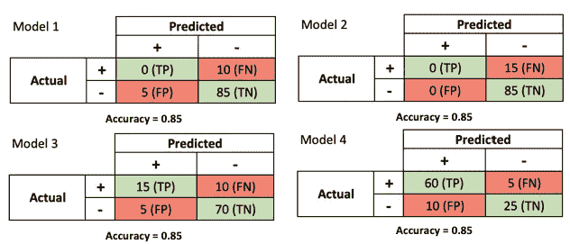

混淆矩阵中一些分类器的准确性—图片由作者提供

根据公式，所有这些模型都显示精度= 0.85。然而，这些模型似乎非常不同。模型 2 甚至没有预测任何积极的东西。模型 4 似乎是一个很好的模型，但具有与模型 2 相同的准确性。

很明显，出问题了。

让我们回顾一下准确性度量公式:

准确性公式—作者提供的图像

*   只要(TP + TN)在具有相同数量的数据点的模型中是相同的(因此分母的值是相同的)，精度将是相同的。*FP 和 FN 的影响被隐藏，我们失去了宝贵的洞察力*。
*   *对于数据集中的类别不平衡，计算会偏向较重类别的性能*。如果你看到模型 1 和模型 2 的阳性率只有 10%或 15%，那么准确率仍然很高，并且偏向于阴性类的表现。TP(在分子中)和(TP + FN)都很低，这是因为正例的数量很少，因此它们对度量的贡献不如 TN 和(TN + FP)大。

# “准确性”的替代方案

如上所述，**准确性**不能作为评估和比较模型的唯一标准。我们需要制定一些额外的指标，这些指标也可以*考虑各个预测类型*的贡献——预测积极因素的效果如何，或者预测消极因素的效果如何。因此，让我们在准确度指标之后再添加一些指标。从左至右阅读下表，并说服自己其中的逻辑。

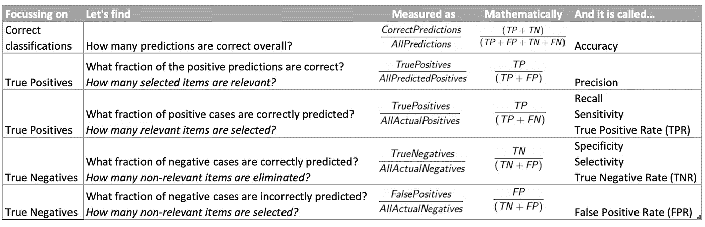

导出额外的度量标准，重点关注各个正面和负面类别

# 精准还是召回？哪个更好？

这里是我们讨论中最关键的部分——如果只有**准确性**是不够的，那么**我们应该检查哪些指标**？

*答案在分类问题的上下文中—*

*   什么是正课？
*   我们的重点领域或指标目标是什么？
*   FP 和 FN 哪个错误的预测代价更高(应该避免)？

为了说明，现在让我们专注于**精度**和**召回**。

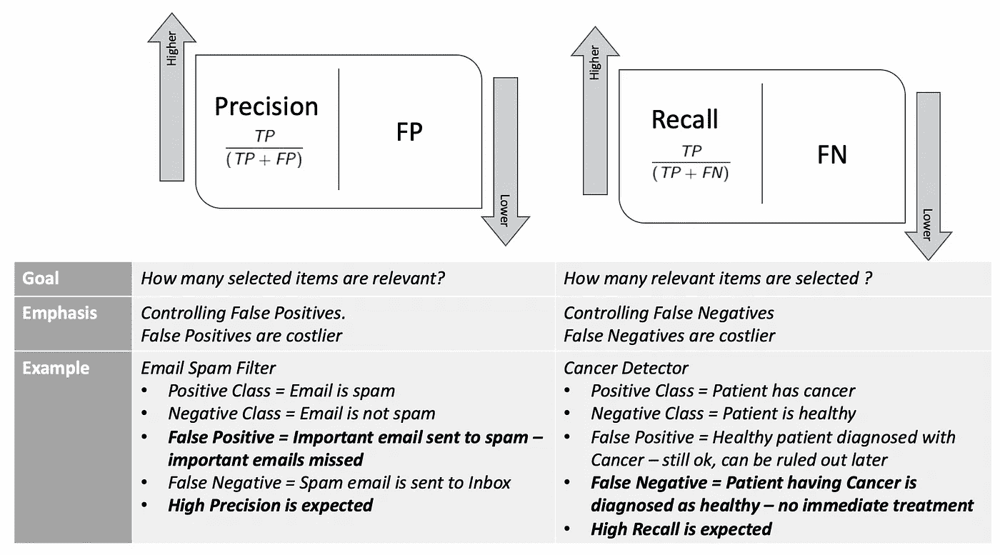

精确度/召回率及其使用——作者图片

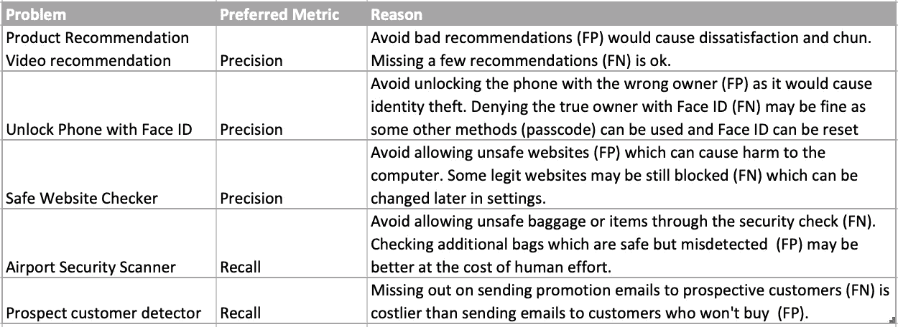

基于上下文的首选指标的几个示例

# 等等！精确度和召回率也会有异常

就像准确性一样，如果作为感兴趣的单一指标，即使是精确度和召回率也有一些限制—

*   该模型能够以非常高的召回率预测所有积极的事情。
*   该模型可以具有非常高的精度，即使它只正确地预测了一个正值，而将所有事物都错误地分类为负值。

下图显示了三个模型，一个是平衡的，一个是召回率高但精度和准确度低的，一个是精度高但召回率和准确度低的。

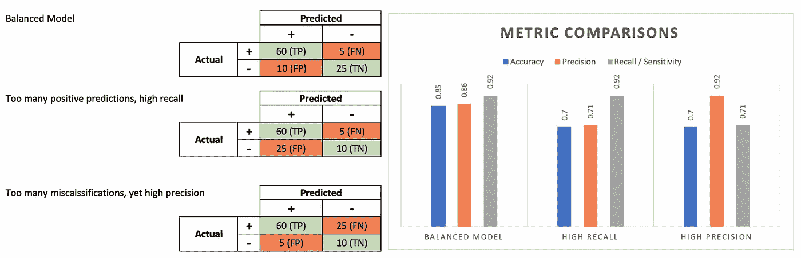

高精度和高召回率并不总是代表一个好的模型——作者的图像

# 两全其美——F1 得分

知道精度和召回率都不足以作为评估模型性能的独立指标(每一个都有其自身的局限性)，如果精度和召回率的效果都在单个指标中被捕获，那会怎么样呢？一些平均精度和召回。

这样的指标确实存在，并被称为 F1 得分，它被计算为*精确度和召回率的调和平均值*。

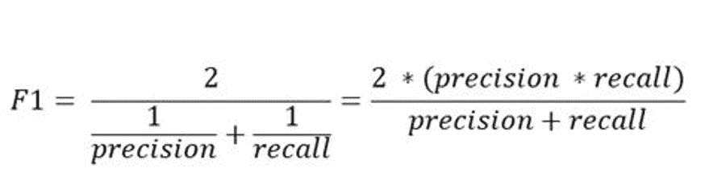

F1 分数—按作者分类的图片

但是为什么调和意味着什么呢？

Precision 和 recall 的分子中都有 TP，但分母不同。为了平均它们，平均它们的倒数是有意义的，也就是调和平均值。

由于 F1 分数是精确度和召回率的平均值，这意味着**F1 分数给予精确度和召回率同等的权重:**

*   如果精确度和召回率都高，模型将获得高 F1 分数
*   **如果精确度和召回率都低，模型将获得低 F1 分数**
*   ****如果精度和召回率中的一个较低而另一个较高，模型将获得中等 F1 分数****

******上面显示的精确度和召回率图表现在扩展到显示 F1 分数。观察与平衡模型相比，高召回率和高精度模型的 F1 值是如何降低的。******

******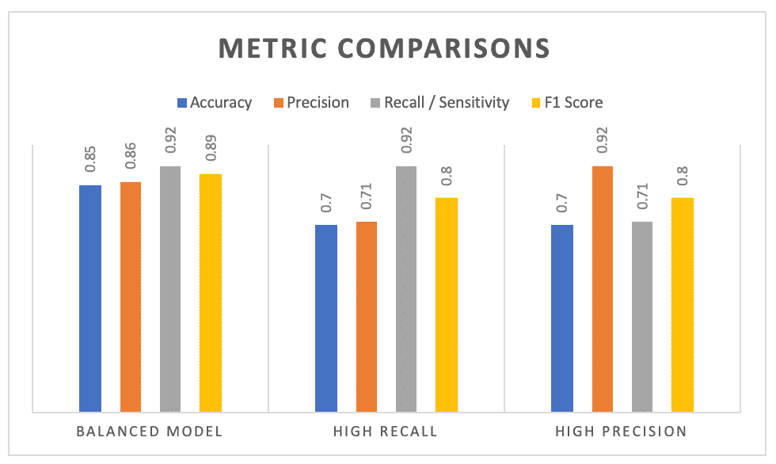******

******与 F1 分数的度量比较—按作者分类的图片******

# ******快速回顾一下******

*   ******需要从上下文中识别正面和负面类别，以解释和评估来自混淆矩阵的度量。******
*   ******TP/TN/FP/FN 需要根据上下文重新措辞。******
*   ******精度是衡量性能的一个明显但不充分的指标，因为它没有考虑 FP 和 FN 的影响。******
*   ******精确度和召回率集中于真阳性率；但是精度是基于预测的肯定，而召回是基于实际的肯定。******
*   ******模型的精度和召回率可能个别较高，但作为独立的指标，它们也不足以用于模型评估。******
*   ******根据问题的目标，精确和回忆与某些特定类型的问题有各自的相关性。******
*   ******精确度和召回率是有权衡的——要使用的度量标准取决于错误分类的成本。******
*   ******F1 分数考虑了精确度和召回率的影响。******
*   *******准确度和 F1 分数可以是最终评估分类器性能的良好指标*，尽管还有许多其他指标可以提供有价值的见解。******
*   ******召回率(TPR)和 FPR 用于评估另一个非常重要的指标——AUC ROC 得分，这对于评估软分类非常重要。但是我们在这里没有涉及软分类；感兴趣的读者可以阅读它了解什么是 TPR 和 FPR。******

# ******结束想法******

******统计世界有更多更微妙的指标。即使不常用于分类器评估，也绝对值得一看。******

******我希望这篇文章能最大程度地帮助初学者理解分类标准的真正含义，并帮助他们根据真正的直觉而不是填鸭式来决定最好的标准。******

******请随时建议编辑这个页面，我会很乐意遵守。******

******快乐学习。******

# ******参考资料:******

******在准备这篇文章的时候，我参考了下面提到的一些很棒的文章和博客。我感谢所有丰富了我知识的作者和投稿人。******

******[https://kiwi Damien . github . io/interview-practice-with-precision-and-recall . html](https://kiwidamien.github.io/interview-practice-with-precision-and-recall.html)******

******【https://en.wikipedia.org/wiki/Precision_and_recall ******

******[https://data science . stack exchange . com/questions/30881/when-is-precision-more-important-over-recall](https://datascience.stackexchange.com/questions/30881/when-is-precision-more-important-over-recall)******

******[https://tryo labs . com/blog/2013/03/25/why-accuracy-alone-bad-measure-class ification-tasks-and-what-we-can-do-about-it](https://tryolabs.com/blog/2013/03/25/why-accuracy-alone-bad-measure-classification-tasks-and-what-we-can-do-about-it)******

******<https://stats.stackexchange.com/questions/424737/is-there-a-name-for-this-metric-tn-tn-fn>  

[https://towardsdatascience.com/the-f1-score-bec2bbc38aa6](/the-f1-score-bec2bbc38aa6)******