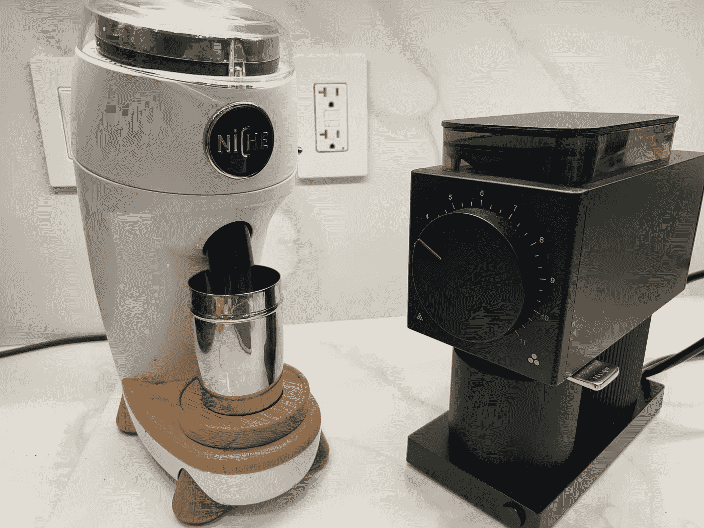
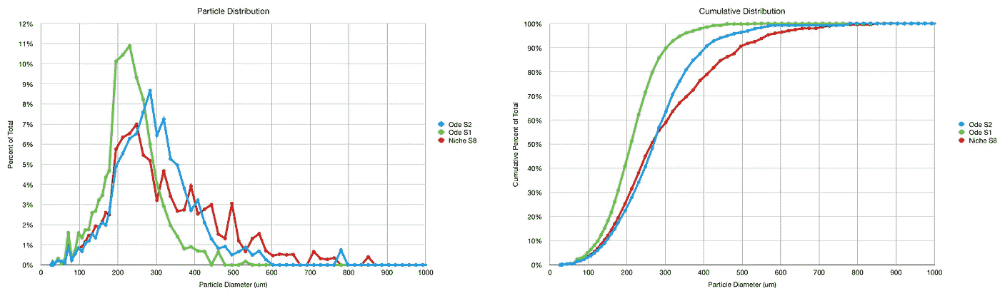
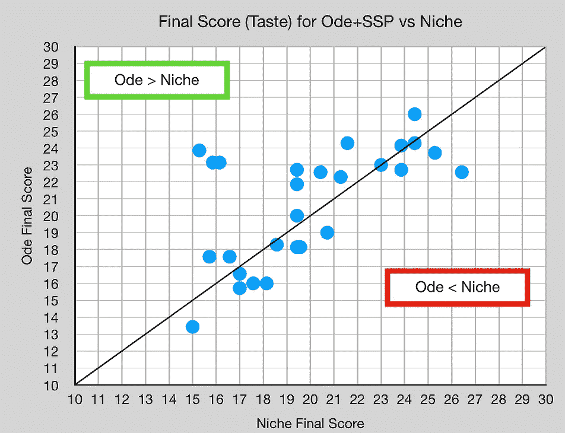
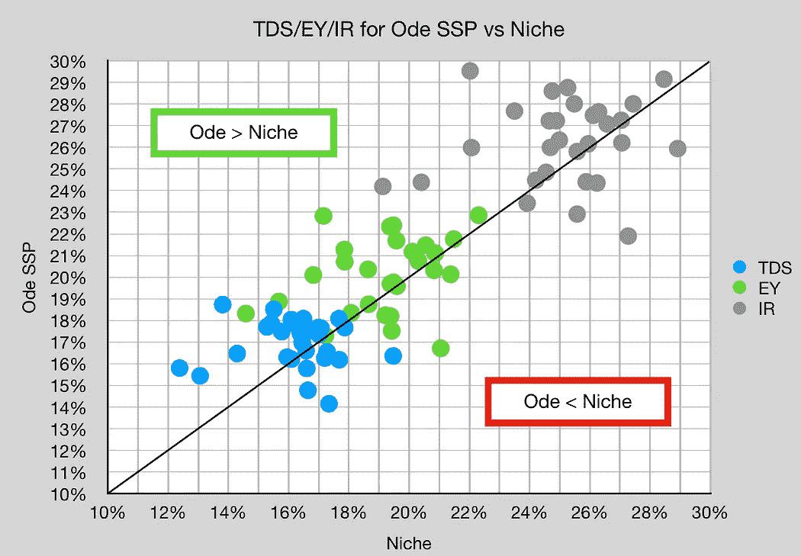
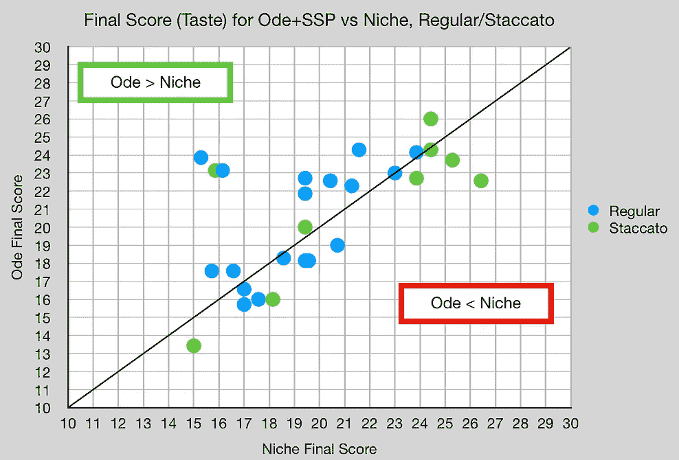
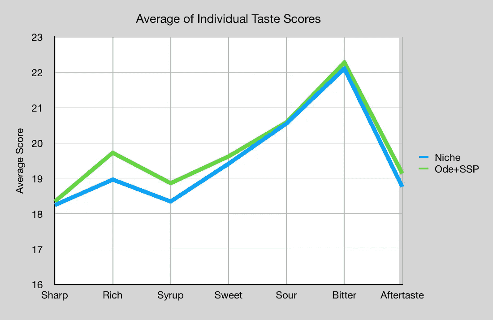
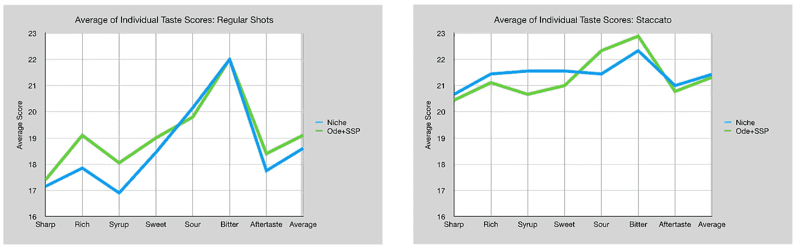
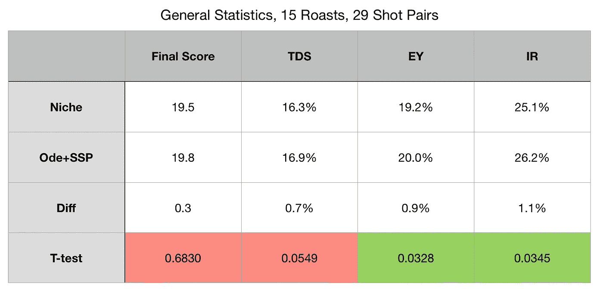

# 锥形与扁平毛刺咖啡研磨机

> 原文：<https://towardsdatascience.com/conical-vs-flat-burr-coffee-grinders-779539ab6328>

## 咖啡数据科学

## 零生态位 vs ODE+SSP

a 向朋友借了一首带 SSP 多用毛刺的颂歌，我拍了一系列对拍，对比小众。我对比较平面毛刺和锥形毛刺特别感兴趣。

我没有注意到味道上的巨大差异，而且很难说任何差异是由于研磨分布而不是扁平和圆锥形的一些其他性质的差异。

所有图片由作者提供

我开始比较两者的粒子分布，一旦我拨入颂歌，它或多或少地类似于小生境。它不像我想象的那样是单峰的，部分原因是因为毛刺没有[对齐](https://rmckeon.medium.com/aligning-flat-burrs-on-fellow-ode-2ab39a5264ea)，这是这个实验的主要警告。

# 设备/技术

[浓缩咖啡机](/taxonomy-of-lever-espresso-machines-f32d111688f1) : [像样的浓缩咖啡机](/developing-a-decent-profile-for-espresso-c2750bed053f)

[咖啡研磨机](/rok-beats-niche-zero-part-1-7957ec49840d) : [小生零](https://youtu.be/2F_0bPW7ZPw)和[同道码](https://fellowproducts.com/products/ode-brew-grinder)带 [SPP 毛刺](http://www.sspgrind.com/)

咖啡:[家庭烘焙咖啡](https://rmckeon.medium.com/coffee-roasting-splash-page-780b0c3242ea)，中杯(第一口+ 1 分钟)

镜头准备:[断奏夯实](/staccato-tamping-improving-espresso-without-a-sifter-b22de5db28f6)和[断奏](https://medium.com/overthinking-life/staccato-espresso-leveling-up-espresso-70b68144f94)

[预输注](/pre-infusion-for-espresso-visual-cues-for-better-espresso-c23b2542152e):长，约 25 秒

输液:[压力脉动](/pressure-pulsing-for-better-espresso-62f09362211d)

[过滤篮](https://rmckeon.medium.com/espresso-baskets-and-related-topics-splash-page-ff10f690a738) : 20g VST

其他设备: [Atago TDS 计](/affordable-coffee-solubility-tools-tds-for-espresso-brix-vs-atago-f8367efb5aa4)、 [Acaia Pyxis 秤](/data-review-acaia-scale-pyxis-for-espresso-457782bafa5d)

# 绩效指标

我使用两个[指标](/metrics-of-performance-espresso-1ef8af75ce9a)来评估技术之间的差异:最终得分和咖啡萃取。

[**最终得分**](https://towardsdatascience.com/@rmckeon/coffee-data-sheet-d95fd241e7f6) 是记分卡 7 个指标(尖锐、浓郁、糖浆、甜味、酸味、苦味和回味)的平均值。当然，这些分数是主观的，但它们符合我的口味，帮助我提高了我的拍摄水平。分数有一些变化。我的目标是保持每个指标的一致性，但有时粒度很难确定。

**用折射仪测量总溶解固体量(TDS)，这个数字结合咖啡的输出重量和输入重量用于确定提取到杯中的咖啡的百分比，称为**提取率(EY)** 。**

**[**【IR】**](/improving-coffee-extraction-metrics-intensity-radius-bb31e266ca2a)**强度半径定义为 TDS vs EY 控制图上原点的半径，所以 IR = sqrt( TDS + EY)。这一指标有助于标准化产量或酿造比的击球性能。****

# ****成对拍摄****

****我比较了 15 次烘烤中的 29 对照片，这些照片是在烘烤休息的几天里拍摄的。我没有注意到很大的味道差异，但就 EY 而言，平毛边似乎提取得稍微多一些。****

****************

****我通过常规(在这种情况下，断奏捣实，但不是筛过的咖啡)和断奏(三层筛过的)进一步细分。我有 20 个常规镜头对和 9 个断奏镜头对。****

****还是那句话，我没看出味道有很大区别。EY 似乎略高，但我在杯子里尝不出它的味道。****

****************

****我也看了个人的口味分数，看看颂歌是否有所不同。****

********

****我将这些结果按常规和断奏分开，结果似乎是混杂的。****

********

****Rich 和糖浆得分的差异在 20 对中没有统计学意义，在双尾对 t 检验中 p 值分别为 0.231 和 0.302，这远远超过了 0.050 的统计学意义。最初的味觉得分差异都不具有统计学意义。****

****我查看了总体统计数据，EY 刚好超过统计显著阈值。****

********

****我敢肯定有更好的平毛刺磨床和圆锥毛刺磨床来比较；这两者的表现非常相似。Ode 在提取率上略有优势，但就味道而言，它们似乎差不多。****

****如果你愿意，可以在推特、 [YouTube](https://m.youtube.com/channel/UClgcmAtBMTmVVGANjtntXTw?source=post_page---------------------------) 和 [Instagram](https://www.instagram.com/espressofun/) 上关注我，我会在那里发布不同机器上的浓缩咖啡照片和浓缩咖啡相关的视频。你也可以在 [LinkedIn](https://www.linkedin.com/in/dr-robert-mckeon-aloe-01581595) 上找到我。也可以关注我在[中](https://towardsdatascience.com/@rmckeon/follow)和[订阅](https://rmckeon.medium.com/subscribe)。****

# ****[我的进一步阅读](https://rmckeon.medium.com/story-collection-splash-page-e15025710347):****

****[我未来的书](https://www.kickstarter.com/projects/espressofun/engineering-better-espresso-data-driven-coffee)****

****[我的链接](https://rmckeon.medium.com/my-links-5de9eb69c26b?source=your_stories_page----------------------------------------)****

****[浓缩咖啡系列文章](https://rmckeon.medium.com/a-collection-of-espresso-articles-de8a3abf9917?postPublishedType=repub)****

****工作和学校故事集****