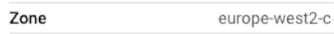

# 如何在 Cloud Composer 上连接到气流工作者

> 原文：<https://towardsdatascience.com/connect-airflow-worker-gcp-e79690f3ecea>

## 在谷歌云平台上连接气流工作者


照片由[克里斯蒂安·休姆](https://unsplash.com/@christinhumephoto?utm_source=unsplash&utm_medium=referral&utm_content=creditCopyText)在 [Unsplash](https://unsplash.com/s/photos/computer?utm_source=unsplash&utm_medium=referral&utm_content=creditCopyText) 上拍摄

## 介绍

Cloud Composer 是 Google 云平台上 Apache Airflow 的托管服务。换句话说，您可以在几秒钟内拥有一个高度可用的气流环境，然后您可以从 GCP 的用户界面进行管理。

显然，它需要连接到集群的气流工作者，以便执行某些任务，例如执行命令或检查工作者的各个方面。例如，如果您想要连接到 Airflow 数据库，那么一旦您连接到集群中的一个 workers，那么就很容易做到。

在今天的简短教程中，我们将详细介绍一个循序渐进的指南，你可以按照这个指南与谷歌云平台上的任何气流工作者建立联系。这非常简单，基本上可以通过四个简单的步骤来完成。

## 步骤 1:获取您的环境的项目路径和区域

*   从控制台上的 Cloud Composer 环境中，单击您想要连接的环境。
*   然后选择`ENVIRONMENT CONFIGURATION`选项卡
*   从屏幕上出现的部分，我们将需要项目路径和环境的区域。
*   前者可以在`GKE cluster`下找到(会是`projects/../../gke`的形式)


*   以及配置中`zone`条目下的区域



*   请记下它们，因为我们将在后续步骤中使用它们

## 步骤 2:获取 Kubernetes 集群的凭证

现在我们需要运行`[get-credentials](https://cloud.google.com/sdk/gcloud/reference/container/clusters/get-credentials)`来检索运行 Cloud Composer 的 Kubernetes 集群的凭证。

```
gcloud container clusters get-credentials \
    <project-path> \
    --zone <zone>
```

一旦您执行了上面的命令，一个带有适当凭证和端点信息的`kubeconfig`文件将会更新，该文件指向 Google Kubernetes 引擎中特定集群的`kubectl`。

## 步骤 3:获取正在运行的 Composer 和 Worker 的名称空间

现在，我们需要检索正在运行的 Cloud Composer 实例的名称空间以及我们希望连接到的 Airflow worker 的名称。为此，我们需要运行以下命令。

```
kubectl get pods --all-namespaces
```

该命令的输出将——很可能——包含大量用于气流调度器、气流工作器等的名称空间。

*   从输出中的`NAMESPACE`列，记下前缀为`composer-`的云组件实例的名称空间。
*   此外，请注意其中一个气流工作者的`NAME`(请注意，输出包含各种气流组件的大量条目，因此请确保选择其中一个气流工作者。名称应该有一个`airflow-worker-`前缀)。

## 第四步:连接到气流工作者

最后，现在我们已经有了 Cloud Composer 名称空间和 Airflow worker 的名称，我们只需运行以下命令就可以连接到它:

```
kubectl exec -itn <composer-namespace> <worker-name> -- /bin/bash
```

举个例子，

```
kubectl exec -itn \
    composer-1-10-0-airflow-1-10-15-5983e0fe \
    airflow-worker-8d8c49c87-9v7c4 \
    -- /bin/bash
```

瞧啊。现在，您已连接到气流工作者。您现在可以运行气流命令(如`airflow --version`)，甚至可以通过运行`airflow shell`连接到气流数据库。

## 最后的想法

Cloud Composer 是谷歌云平台上 Apache Airflow 的托管服务，是让数据工程师编写、执行和编排数据管道的最强大的服务之一。

在今天的短文中，我们探讨了连接到 Cloud Composer 集群上的 Airflow Workers 并执行某些命令甚至连接到 Airflow 数据库所需的步骤。

编码快乐！

[**成为会员**](https://gmyrianthous.medium.com/membership) **阅读介质上的每一个故事。你的会员费直接支持我和你看的其他作家。你也可以在媒体上看到所有的故事。**

<https://gmyrianthous.medium.com/membership>  

**相关文章您可能也喜欢**

</run-airflow-docker-1b83a57616fb>  </data-engineer-tools-c7e68eed28ad>  <https://levelup.gitconnected.com/ebs-vs-efs-aws-7b3e41c093f7> 