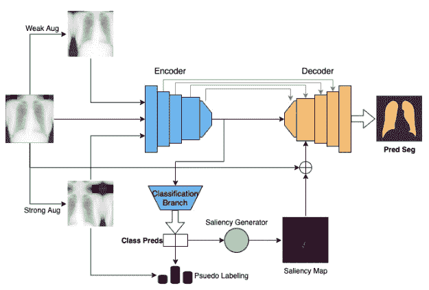
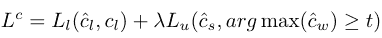
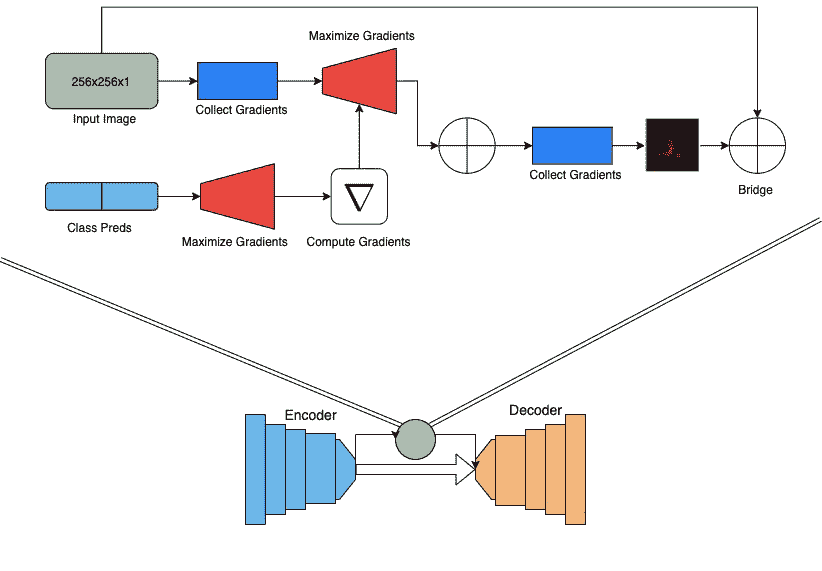
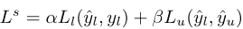
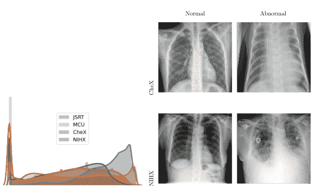
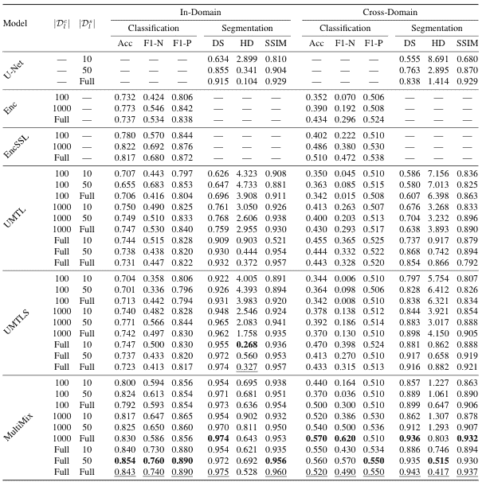
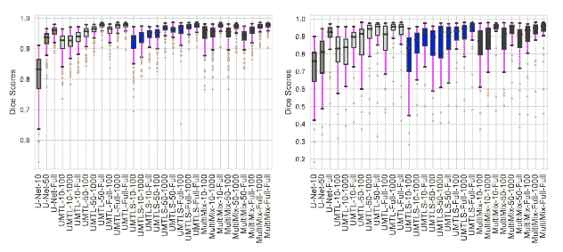
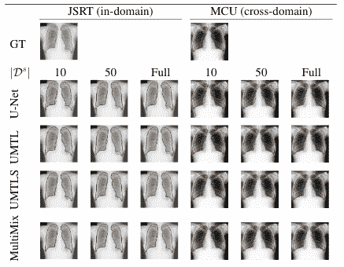

# 一致的半监督、可解释的医学成像多任务处理

> 原文：<https://towardsdatascience.com/consistent-semi-supervised-explainable-multi-tasking-for-medical-imaging-aa96abbb3b07>

## *MultiMix:从医学图像中进行少监督、极端多任务学习*



我们提出的模型的示意图:MultiMix(图片由作者提供)

在这篇文章中，我将讨论一种新的半监督、多任务医学成像方法，名为 [MultiMix](https://arxiv.org/abs/2010.14731) ，作者是 Ayaan Haque (me)、Abdullah-Al-Zubaer Imran、王一行和 Demetri Terzopoulos。我们的论文以全论文形式被 [ISBI 2021](https://biomedicalimaging.org/2021/) 接受，并在 4 月的大会上发表。我们论文的扩展和改进结果也发表在了 MELBA 期刊上。本文将包括对方法、结果的回顾，以及一个简短的代码回顾。代码可在[这里](https://github.com/ayaanzhaque/MultiMix)获得。

# **概述:**

MultiMix 通过采用基于置信度的增强策略和为联合任务提供可解释性的新型显著性桥模块来执行联合半监督分类和分割。当完全监督时，基于深度学习的模型可以有效地执行复杂的图像分析任务，但这种性能严重依赖于大型标记数据集的可用性。特别是在医学成像领域，标记昂贵、耗时，并且易于被观察者改变。因此，允许从有限数量的标记数据进行学习的半监督学习已经被研究作为监督学习的替代方法。

此外，在同一个模型中学习多个任务进一步提高了模型的泛化能力。此外，多任务处理允许任务之间的共享表示学习，同时需要更少的参数和更少的计算，使模型更有效，更不容易过度拟合。

我们对不同数量的标记数据和多源数据进行了大量实验，证明了我们方法的有效性。此外，我们还提出了跨任务的域内和跨域评估，以展示我们的模型适应具有挑战性的泛化场景的潜力，这对于医学成像方法来说是一项具有挑战性但重要的任务。

# **背景:**

**问题**

基于学习的医学成像近年来有所增长，主要是因为深度学习的增长。然而，深度学习的基本问题总是挥之不去，那就是它们需要大量的标记数据才能有效。不幸的是，这在医学成像领域是一个更大的问题，因为收集大型数据集和注释可能很困难，因为它们需要领域专业知识，昂贵，耗时，并且难以在集中式数据集中组织。此外，泛化是医学成像领域中的一个关键问题，因为来自不同来源的图像在质量和数量上可能有很大不同，如果我们想要在多个领域中实现强大的性能，这使得模型建立的过程很困难。我们希望用一些关键的方法来解决这些基本问题，这些方法都是围绕着半监督和多任务学习展开的。

**什么是半监督学习？**

为了解决有限标记数据问题，半监督学习(SSL)作为一种有前途的方法受到了广泛关注。在半监督学习中，未标记的示例与标记的示例结合使用，以最大化信息增益。在半监督学习方面已经有了很多研究，包括一般的和医学领域的。这些方法我就不详细讨论了，这里列出一些比较突出的方法，有兴趣的可以参考一下[ [1](https://www.researchgate.net/publication/280581078_Pseudo-Label_The_Simple_and_Efficient_Semi-Supervised_Learning_Method_for_Deep_Neural_Networks) 、 [2](https://papers.nips.cc/paper/2004/file/96f2b50b5d3613adf9c27049b2a888c7-Paper.pdf) 、 [3](https://arxiv.org/abs/1606.03498) 、 [4](https://arxiv.org/abs/2009.00520) ]。

解决有限样本学习的另一个解决方案是使用来自多个来源的数据，因为这增加了数据中样本的数量以及数据的多样性。然而，这样做是有挑战性的，需要特定的训练方法，但如果做得正确，它会非常有影响力。

什么是多任务学习？

多任务学习(MTL)已被研究用于提高许多模型的推广能力。多任务学习被定义为优化单个模型中的多个损失，从而通过共享表征学习来执行多个相关任务。在一个模型中联合训练多个任务可以提高模型的概化能力，因为每个任务都可以相互调整。此外，假设训练数据来自具有有限注释的不同任务的不同分布，多任务在这种情况下对于以几乎没有监督的方式进行学习可能是有用的。将多任务与半监督学习相结合可以提高性能，并在这两项任务中取得成功。同时完成这两项任务可能非常有益，因为不需要经过医学培训的专业人员，一个单一的深度学习模型就可以非常准确地完成这两项任务。

关于医疗领域的相关工作，方法我就不赘述了，这里列举一下:[ [1](https://link.springer.com/article/10.1007/s10916-018-1088-1) ， [2](https://arxiv.org/abs/1505.04597) ， [3](https://arxiv.org/abs/1810.11654) ， [4](https://arxiv.org/abs/2005.02523) ， [5](https://arxiv.org/abs/1903.02740) ， [6](https://arxiv.org/abs/1806.01313) ， [7](https://arxiv.org/abs/1906.01828) ， [8](https://arxiv.org/abs/1903.01330) ， [9](https://arxiv.org/abs/1908.03693) ， [10](https://openaccess.thecvf.com/content_CVPR_2019/papers/Zhou_Collaborative_Learning_of_Semi-Supervised_Segmentation_and_Classification_for_Medical_Images_CVPR_2019_paper.pdf) 。然而，这些工作的主要限制是它们没有使用来自多个来源的数据，这限制了它们的可推广性，以及大多数方法只是单任务方法。

因此，我们提出了一种新的、更通用的多任务模型，称为 *MultiMix* ，结合了基于置信度的增强和显著性桥模块，以从多源数据中联合学习诊断分类和解剖结构分割。显著图使得能够通过有意义的视觉特征的可视化来分析模型预测。显著图可以以几种方式产生，最显著的是通过从输入图像计算类别分数的梯度。虽然任何深度学习模型都可以通过显著图进行更好的解释，但据我们所知，尚未探索单个模型中两个共享任务之间的显著桥。

# **算法:**


我们提出的方法的示意图(图片由作者提供)

让我们从定义我们的问题开始。我们使用两个数据集进行训练，一个用于分段，一个用于分类。对于分割数据，我们可以使用符号 Xs 和 Y，它们分别是图像和分割遮罩。对于分类数据，我们可以使用符号 Xc 和 C，它们是图像和类标签。

关于我们的模型架构，我们使用基线 U-Net 架构，这是一种使用编码器-解码器框架的常用分段架构。编码器的功能类似于标准的 CNN。为了使用 U-Net 执行多任务处理，我们从具有池化和全连接层的编码器中分支出来，以获得最终的分类输出。


一个标准 U 型网络的示意图(图片来自 [Ronneberger](https://arxiv.org/abs/1505.04597)

**分类:**

对于我们提出的分类方法，我们利用数据增强和伪标记。受[1]的启发，我们采用一个未标记的图像，并执行两个独立的增强。首先，未标记的图像被弱增强，并且从该图像的弱增强版本，基于来自模型的当前状态的预测假定伪标记。这就是为什么该方法是半监督的，但我们稍后将更多地讨论伪标记过程。

其次，对相同的精确的未标记图像进行强增强，并且利用来自弱增强图像和强增强图像本身的伪标记来计算损失。本质上，我们教导模型将弱增强图像映射到强增强图像，并且这迫使模型学习诊断分类所需的基本底层特征。两次扩充图像也最大化了从单一图像获得的潜在知识。这也有助于提高泛化能力，就好像模型被迫学习图像中最重要的部分一样，它将能够克服图像中由于不同域而出现的差异。

关于增强，我们对弱增强图像使用传统的增强，例如水平翻转和轻微旋转。强增强策略要有趣得多。我们创建了一个非常规的强大增强池，并对任何给定的图像应用随机数量的增强。这些增强是相当失真的，例如包括裁剪、自动对比、亮度、对比度、均衡、同一性、旋转、锐度、剪切等等。通过应用任何数量的这些，我们创建了非常多种多样的图像，这在处理低样本数据集时尤其重要。我们最终发现，这种增强策略对于强大的性能非常重要。

现在我们回过头来讨论一下伪贴标签的过程。因此，一旦弱增强被转换成伪标签，我们仅在模型生成伪标签的置信度高于调谐阈值时才使用它们。注意，如果模型生成伪标签的置信度高于调谐阈值，这防止了模型从不正确和差的标签中学习。这导致了自由效果的课程，因为当预测在开始时不太自信时，模型主要从标记的数据中学习。随着对未标记图像的标记的生成，模型变得更有信心，结果，模型变得更有效。就提高性能而言，这也是一个非常重要的特性。

现在我们来看看损失函数。分类损失可由以下等式建模:



分类损失方程(图片由作者提供)

其中 L-sub-l 是监督损失，c-hat-l 是分类预测，c-l 是标签，λ是无监督分类权重，L-sub-u 是无监督损失，c-hat-s 是对强增强图像的预测，argmax(c-hat-w)是来自弱增强图像的伪标签，t 是伪标签阈值。

这基本上概括了分类方法，所以现在让我们继续细分方法。

**分段:**



提议的显著桥的示意图(图片由作者提供)

对于分割，预测是通过具有跳跃连接的编码器-解码器架构进行的，这是非常简单的。我们对分割的主要贡献是整合了一个显著性桥接模块来桥接两个任务，如上图所示。我们使用从编码器扩展到分类分支的梯度，基于模型预测的类别生成显著图。整个过程如上所示，但本质上是一个显著图突出显示了模型使用图像的哪些部分来对图像进行肺炎分类。当可视化时，它们最终看起来类似于分段图，使其成为分段桥的完美补充。

虽然我们不知道分割图像是否代表肺炎，但生成的图突出显示了肺部，以最终分割分辨率创建图像。因此，当用显著图产生和可视化图像的类别预测时，它有点类似于肺掩模。我们假设这些显著图可以用于在解码器阶段指导分割，在从有限的标记数据中学习的同时产生改进的分割。

在 MultiMix 中，所生成的显著图与输入图像连接，被下采样，并被添加到输入到第一解码器级的特征图中。与输入图像的连接允许两个任务之间更强的连接，并且由于它提供的上下文，提高了桥模块的效率。添加输入图像和显著图为解码器提供了更多的上下文和信息，这在处理低样本数据时非常重要。

现在我们来讨论训练和损耗。对于标记样本，我们通常使用参考肺掩模和预测分割之间的 dice 损失来计算分割损失。

由于我们没有未标记分割样本的分割模板，我们不能直接计算它们的分割损失。因此，为此，我们计算标记和未标记示例的分割预测之间的 KL 散度。这不利于模型做出与标记数据越来越不同的预测，而这有助于模型更适合未标记的数据。虽然这是一种计算损失的间接方法，但它仍然允许模型从未标记的分割数据中学习很多。

关于损失，我们的分割损失可以写成:



分割损失方程(图片由作者提供)

其中，α是与分类相比的分割损失权重，y-hat-l 是标记的分割预测，y-l 是相应的掩码，β是无监督的分割权重，y-hat-u 是未标记的分割预测。

我们的模型是在分类和分割损失的组合目标上训练的。既然我们已经讨论了损失，那么就结束了细分方法以及整个方法部分。

**数据集:**

这些模型被训练和测试用于分类和分割任务，每个任务的数据来自两个不同的来源:一个我们将称为 CheX [ [11](https://pubmed.ncbi.nlm.nih.gov/29474911/) ]的肺炎检测数据集，以及日本放射技术学会或 JSRT [ [12](https://pubmed.ncbi.nlm.nih.gov/10628457/) ]分别用于分类和分割。当我们提到域内数据集时，这是两个数据集。

重要的是，我们在两个外部数据集上验证了模型，每个任务一个数据集。我们使用了 Montgomery County 胸部 X 射线，或 MCU [ [13](https://www.ncbi.nlm.nih.gov/pmc/articles/PMC4256233/) ]，以及 NIH 胸部 X 射线数据集的一个子集，我们将称之为 NIHX [ [14](https://arxiv.org/abs/1705.02315) 。来源的多样性对我们的模型提出了重大挑战，因为图像质量、大小、正常和异常图像的比例以及四个数据集的强度分布的差异都非常不同。下图显示了强度分布的差异，以及每个数据集的图像示例。所有 4 个数据集都有 CC BY 4.0 许可证。



所有数据集的强度分布(左)和分类数据集的示例(右)(图片由作者提供)

# **成绩:**

我们在多个数据集上使用不同数量的标记数据进行了大量实验，包括域内和跨域。

为了说明结果，我们在测试中使用了多个基线，因为我们对模型的每个添加都有一个基线。我们从一个准系统 U-Net 和一个标准分类器(enc)开始，enc 是具有密集层的编码器特征提取器。然后，我们将这两者结合起来，形成我们的基线多任务模型(UMTL)。我们还使用了具有半监督方法的编码器(EncSSL)、具有显著性桥的多任务模型(UMTLS)以及具有显著性桥和所提出的半监督方法的多任务模型(UMTLS-SSL)，其基本上是多混合的，没有 KL 发散，用于半监督分割。当然，我们还有 MultiMix。

在训练方面，我们在多个级别的标记数据集上进行训练。对于分类，我们使用 100、1000 和所有标签，对于分段，我们使用 10、50 和所有标签。对于我们的结果，我们将使用符号:model-seglabels-classlabels(例如 MultiMix-10–100)。对于评估，我们使用准确性(Acc)和 F1 得分(F1-N 和 F1-P)进行分类，对于分割，我们使用骰子相似性(DS)、Jaccard 相似性得分(JS)、结构相似性指数度量(SSIM)、平均 Hausdorff 距离(HD)、精确度(P)和召回率(R)。

下图是 MultiMix 在多个基线下的性能表。最好的完全监督分数用下划线标出，最好的半监督分数用粗体标出。



多重混合和基线的定量评估表(图片由作者提供)

该表显示了模型性能如何随着每个新组件的加入而提高。对于分类任务，与基线模型相比，我们基于置信度的半监督学习增强方法显著提高了性能。即使每个任务的标记数据最少，我们的 MultiMix-10–100 在准确性方面也优于完全监督的基线编码器。对于分割，显著桥模块的包含产生了比基线 U-Net 和 UMTL 模型大的改进。即使使用最少的分段标签，我们也可以看到比其对应部分提高了 30%的性能，证明了我们提出的多混合模型的有效性。

我们非常重视泛化的重要性，我们的结果表明我们的模型能够很好地泛化。MultiMix 在两个任务中的泛化能力都有所提高，在领域中始终表现良好。如表中所示，MultiMix 的性能与域内的一样有前途。MultiMix 在分类任务中取得了优于所有基准模型的分数。由于前面讨论的 NIHX 和 CheX 数据集中的显著差异，分数不如域内结果好。然而，它确实比其他型号表现得更好。



显示分割性能分割的骰子分数的方框图(图片由作者提供)

下图是一个箱线图，显示了我们在域内和跨域评估中的分割结果的一致性。我们显示数据集中每个图像的模型的骰子得分。从图中，我们可以看到，与基线相比，MultiMix 是最强的模型。



对照基线的多混合边界可视化(图片由作者提供)

我们将讨论的最后一个数字是我们模型的细分预测的可视化。我们显示了一个预测的边界，为每一个提出的分割任务增加对地面真相在不同的标记数据，在域内和跨域。该图显示 MultiMix 的边界预测与地面真实边界非常一致，尤其是与基线相比时。特别是对于跨领域，MultiMix 是最好的，远远超过其他产品，显示了我们强大的概括能力。

# **代码审查:**

现在我们已经介绍了方法和结果，让我们进入代码。我将主要检查模型架构和训练循环，因为这些是主要的贡献领域。注意，代码是用 PyTorch 和 Python 写的。

让我们先来看看卷积模块。

每个块是一个双卷积块。我们从一个核大小为 3 的 2d 卷积层开始，然后我们使用一个实例归一化层和一个负斜率为 0.2 的 LeakyReLU 的激活函数。然后，我们再次重复这个序列，以完成卷积模块。

现在让我们来看看显著桥。

该代码仅用于生成显著图。我们首先传入输入、编码器和优化器。然后，我们创建图像的副本，以确保图像的梯度不被修改。然后，我们将输入 require_grad 设置为 true，并将编码器设置为 eval 模式。然后我们得到编码器的特征图和输出，这样我们就可以生成显著图。我们首先获得分类输出的最大索引，然后使用。backward()函数来收集渐变。然后，我们通过使用。abs()函数。重要的是，我们必须将优化器的梯度置零，因为使用逆向计算梯度，这在更新模型参数时会有问题。

既然我们已经介绍了体系结构的组件，让我们把它们放在一起，检查整个体系结构。

我们将模型分成独立的编码器和解码器模块，并将它们组合在 MultiMix 类中。对于编码器，我们使用双 conv 模块，每次放大 2 倍。查看正向函数，我们在每个卷积块后保存特征图，用于跳过编码器和解码器之间的连接，我们使用 max-pooling 层来解构图像。然后，我们使用平均池层和密集层为多任务添加分类分支，以获得最终的分类输出(outC)。我们返回所有的特征图以及分类预测供解码器使用。

然后在解码器中，我们使用卷积层来减少特征图，并使用上采样层来重建图像。forward 函数是所有奇迹发生的地方。我们首先将显著图与原始图像连接并堆叠在一起。然后，我们对输入进行下采样，以便它可以与跳过连接一起连接在第一个卷积块中。对于接下来的卷积模块，我们只需执行标准的反卷积，跳过连接即可获得最终输出(out)。

一旦我们建立了模型，我们就可以建立我们的训练循环。这是一段相当冗长且令人生畏的代码，所以不要担心，我们会分解它。

在我们讨论循环之前，注意我们已经省略了许多方法和训练循环来简化它。

如果我们从第 52 行开始，我们从组合所有训练数据集开始，包括监督分割训练集、未标记分割训练集、监督分类训练集、弱增强分类集和强增强分类集。后两者具有相同的精确图像，但只是在不同的级别上被增强。下一组行只是简单地对数据进行基本的拼接和组合，以便所有数据都统一地通过模型发送。

一旦我们将所有输入传递到模型中，我们就将它们全部传递给 calc_loss 函数。在 calc_loss 函数中，我们首先获得基本的监督分类和分割损失(dice 和 lossClassifier)。我们使用骰子损失进行分割，使用交叉熵进行分类。

对于半监督分类，我们首先通过 softmax 函数传递弱增强图像预测以获得概率，然后使用 torch.max 函数获得标签。然后我们使用。ge 函数只保留高于置信阈值的预测，这是方法中讨论的一个重要因素。然后我们计算无监督分类损失(lossUnlabeled)。

最后，我们使用标记的和未标记的分割预测(kl_seg)来计算 KL 散度。所有计算完成后，我们将所有损失乘以各自的权重(λ、α、β)后求和，从而将它们合并成一个损失计算。一旦这被传递回主训练循环，我们简单地用 loss.backward()计算梯度，并用 optimizer.step()更新模型的参数。

代码审查部分到此结束。我们没有过增强和数据处理部分，因为它是相当乏味的。如果你感兴趣，可以在下面的回购处查看完整代码:[https://github.com/ayaanzhaque/MultiMix](https://github.com/ayaanzhaque/MultiMix)

# **结论与思考:**

在这篇博文中，我们解释了 MultiMix，这是一种新颖的少监督多任务学习模型，用于联合学习分类和分割任务。通过整合一致性增强和新的显著性桥模块以实现更好的可解释性，MultiMix 即使在有限标记数据和多源数据上训练时，也能执行改进和一致的肺炎检测和肺部分割。我们使用四个不同的胸部 X 射线数据集进行的大量实验真实地证明了 MultiMix 在域内和跨域评估中的有效性。我们未来的工作将致力于进一步提高 MultiMix 的跨域性能，尤其是分类性能。我们目前正在准备一个完整的期刊提交，包括更多的结果和工作的扩展。

做这项工作对我来说真的很令人兴奋。作为一名高中生，我很感激有机会与合格和经验丰富的研究人员一起做前沿研究。整个过程对我来说相当具有挑战性，因为我在如何撰写正式的研究论文和进行适当而令人信服的实验方面几乎没有经验。甚至编码和构建实际的附加组件也花费了相当多的时间。我仍然在熟悉 PyTorch，但从事这个项目非常有趣和令人兴奋，我学到了很多关于深度学习和医学成像的知识。我对这次会议感到非常兴奋，有机会见到其他研究人员并了解该领域的新研究，我相信我们未来的工作也会像这个项目一样成功。感谢您的阅读。

如果您觉得本博客或论文的任何部分有趣，请考虑引用:

```
[@article](http://twitter.com/article){melba:2021:011:haque,
    title = "Generalized Multi-Task Learning from Substantially Unlabeled Multi-Source Medical Image Data",
    authors = "Haque, Ayaan and Imran, Abdullah-Al-Zubaer and Wang, Adam and Terzopoulos, Demetri",
    journal = "Machine Learning for Biomedical Imaging",
    volume = "1",
    issue = "October 2021 issue",
    year = "2021"
}
```