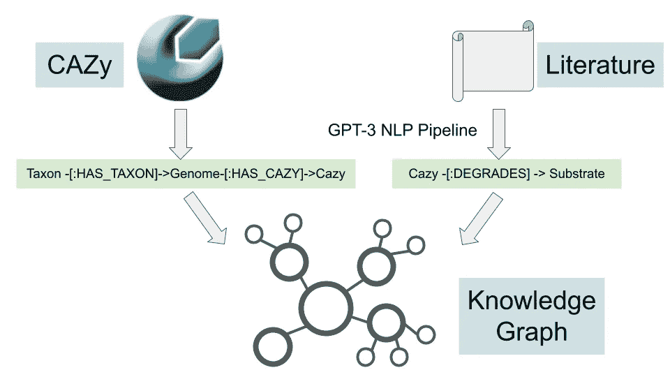
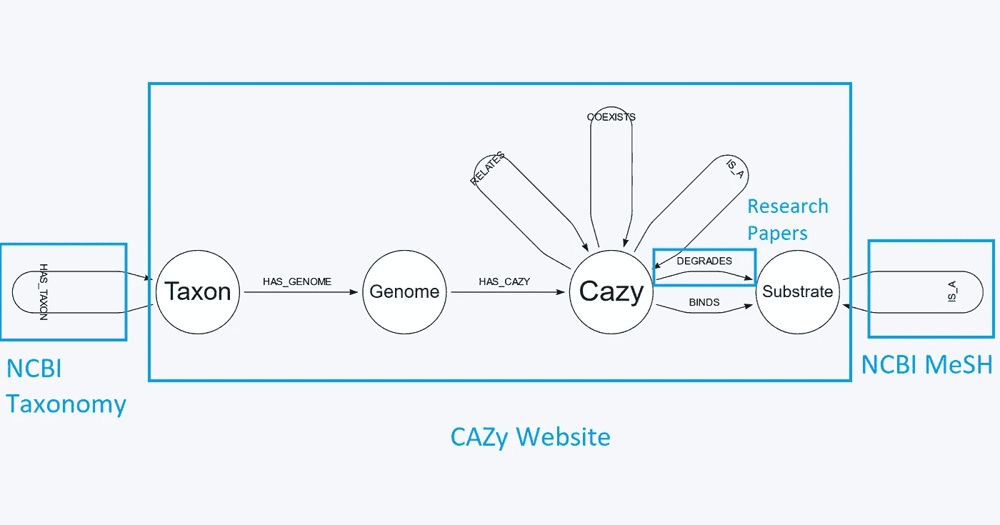
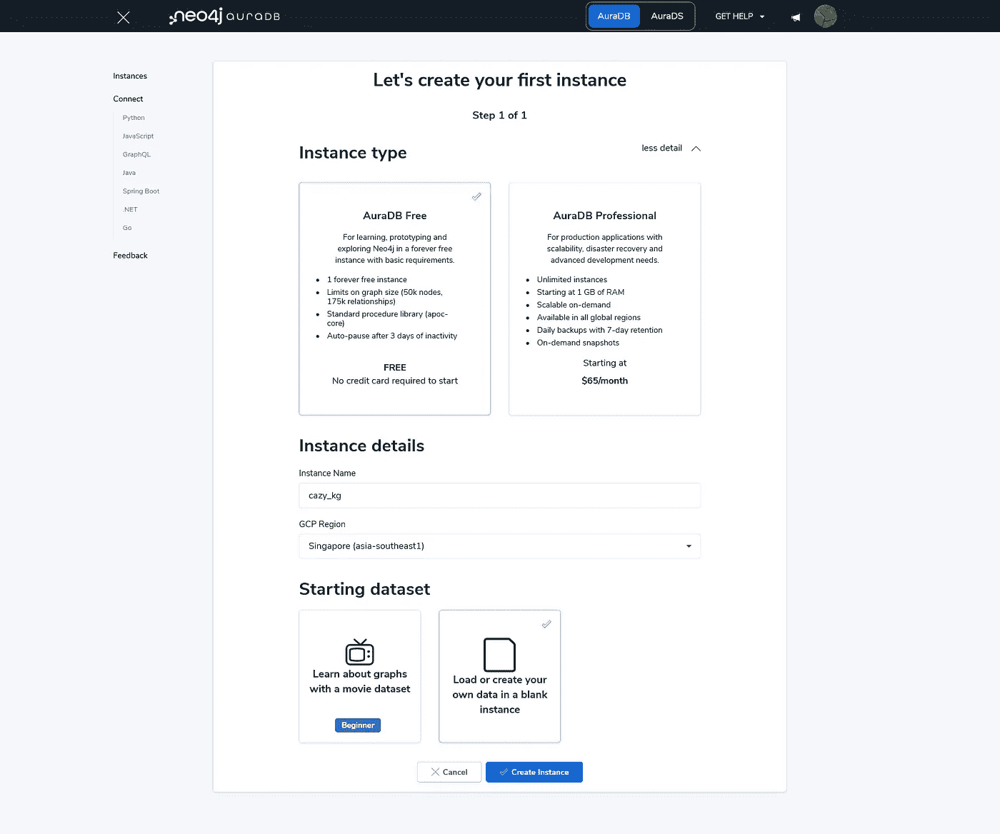
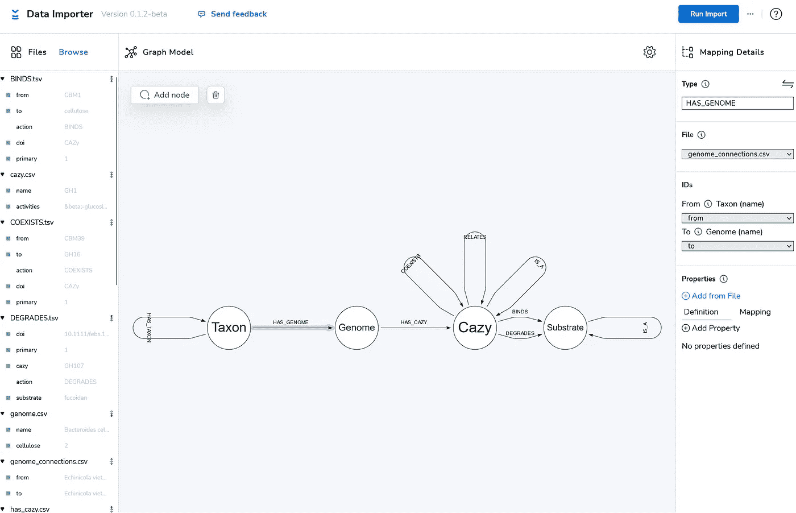
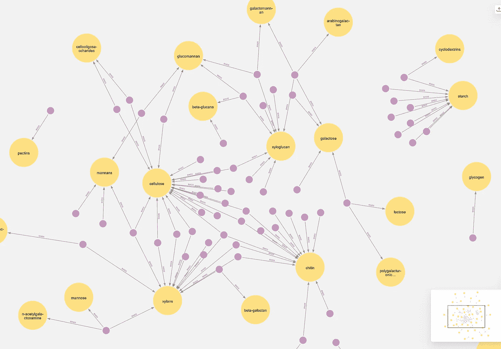
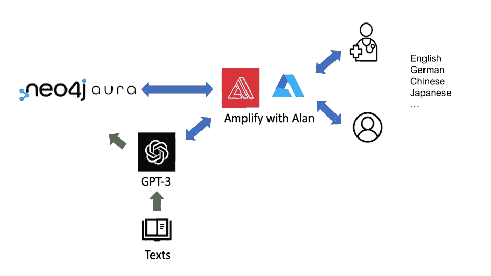
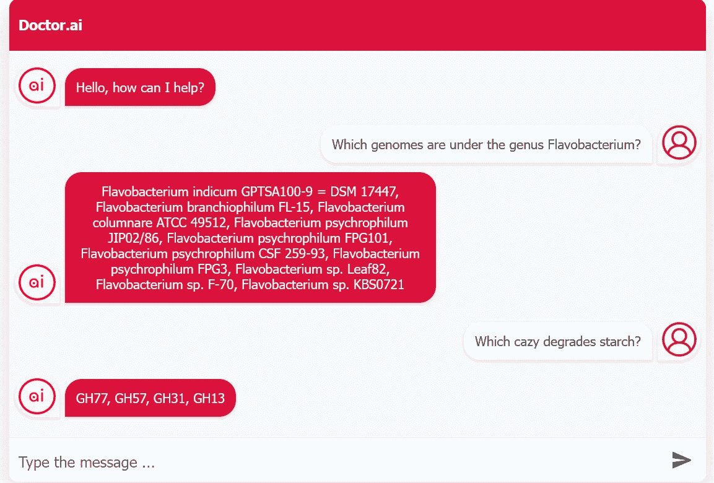

# 构建关于 Neo4j 云的知识图

> 原文：<https://towardsdatascience.com/construct-a-knowledge-graph-on-the-neo4j-cloud-f8094e7bdbec>

## 如何在 AuraDB 中存储你的 CAZy 知识

我们的世界充满了数据和信息。但是要将它们转化为知识并最终转化为智慧需要付出努力和时间。其中一个关键过程是数据的格式化。合适的格式有助于我们的理解和发现。知识图就是这样一种格式。

知识图是表示特定领域知识的网络。它也被称为[语义网络](https://www.ibm.com/cloud/learn/knowledge-graph),因为它通过语义关系将不同类型的节点(例如，对象、人或位置)连接成一个网络。即使知识图可以包含不同的东西，但它是直观的，因为它的组织方式类似于我们的思维方式。因此用户可以快速掌握它所代表的内容。此外，它是可视化和可搜索的。因此，用户可以通过交互式浏览网络或通过数据库查询了解具体情况来获得快速概览。

我们正在见证各行各业知识图表的爆炸式增长。它将内容放入谷歌结果页面的[信息框中。亚马逊在 Amazon.com、亚马逊音乐、Prime Video 和 Alexa 上使用知识图表。沃尔玛](https://www.frontiersin.org/research-topics/16200/knowledge-graphs-in-industry)也是如此。这些公司使用知识图表来发现新的见解，提出建议，并开发语义搜索。

在我之前的文章中，我已经写过如何[将三张公共医学知识图谱](https://medium.com/p/8c09af65aabb)转换成一个名为 [Doctor.ai](https://medium.com/p/8c09af65aabb) 的聊天机器人。后来，我做了一个 NLP 管道，使用 GPT-3 从原始文本中提取关系(这里的[和这里的](https://medium.com/p/bb019dcf41e5)和)。在本文中，我将使用该管道在 Neo4j 云上制作一个 CAZy 知识图— [AuraDB](https://neo4j.com/cloud/platform/aura-graph-database/) 。

CAZy 代表[Carbohydrate-**A**active en**ZY**mes(CAZy)](http://www.cazy.org/)。它是一个门户网站，提供合成、修饰或降解碳水化合物的酶(CAZymes)的信息(从酶的角度来看，这里的碳水化合物是底物)。一年前，我在 Neo4j 写过一篇关于分析其内容的文章[。在这里，我将扩展该项目。我将从公共研究文章中提取底物和酶相互作用，并将其添加到 CAZy 数据中，以形成新的知识图(图 1)。最后，我将创建一个语音聊天机器人前端，以便用户可以用简单的英语查询知识图。聊天机器人是基于我以前的项目](https://medium.com/p/dba8500b45cf) [Doctor.ai](https://medium.com/p/5f0b2f479cca) 。



图一。CAZy 知识图的构建流程。图片作者。

这个项目的 Python 代码存放在我的 GitHub 库中。

<https://github.com/dgg32/cazy_download_for_kg/tree/master>  

文本提取的 NLP 管道是基于我以前的项目。在这个项目中，我用 CAZy 关系的培训文件更新了存储库。

<https://github.com/dgg32/huggingface_gpt3>  

而聊天机器人前端作为一个名为“cazy_kg”的分支托管在我的 doctorai_eli5 资源库下。

<https://github.com/dgg32/doctorai_eli5/tree/cazy_kg>  

最后，Aura 的数据导入器的数据模型托管在这里。

[https://1drv.ms/u/s!Apl037WLngZ8hhB5Ay287gTrOzvh?e=JyYuPJ](https://1drv.ms/u/s!Apl037WLngZ8hhB5Ay287gTrOzvh?e=JyYuPJ)

# 1.数据



图二。此项目中的 Neo4j 架构。图片作者。

即使知识图很小，它也由许多小部分组成(图 2)。有四种节点和九种关系。我已经通过网站上的`DOWNLOAD CAZY`功能下载了最新的 CAZy 数据。请注意，平面文件有质量问题，其内容与 CAZy 网站不完全一致。在这些数据中，我们得到了基因组和 CAZy 节点，以及`Genome -[:HAS_CAZY]->Cazy`关系。此外，我们可以推断出几个关系:一些 CAZy 模块的共线性和同源性(`Cazy -[:COEXISTS]-> Cazy`和`Cazy -[:RELATES]-> Cazy`)，亚家族和家族对(`Cazy -[:IS_A]-> Cazy`，以及 CAZy-底物结合对(`Cazy -[:BINDS]-> Substrate`)。最后，我收集了四篇示例研究文章，并提取了`Cazy-[:DEGRADES]-> Substrate`与[我的 NLP 管道](https://medium.com/p/17a9f7f48b9a)的关系(第 2 节中的描述)。我包括了每个关系的每个信息源的数字对象标识符(DOI)。我还指出了信息来源是主要的(原始发现和想法的报告)还是次要的(基于主要来源的一般作品)。

下载包含 205，462 个基因组和更多的关系。因为自由层光环只允许 50，000 个节点和 175，000 个关系，所以我们需要稍微缩减我们的数据集。在这个项目中，我只保留了拟杆菌门*的 650 个基因组。*拟杆菌门*是一组细菌。它们是生物圈中重要的多糖降解者。他们的大量基因组致力于多糖的分解。像*普雷沃氏菌*这样的成员是牛、羊瘤胃以及人类口腔和大肠中的常驻生物。其他成员如*福尔摩沙*和 *Zobellia* 在海洋中被发现，它们在那里降解藻类多糖。*

除了 CAZy，我们还需要其他数据源来扩充知识图。例如，我从 NCBI 网下载了[多糖的本体用于`Substrate -[:IS_A]-> Substrate`关系。数据包含不同多糖的分组。值得注意的是，有不同的分组方法，每种多糖可以属于多个组。例如，海藻酸是一种](https://www.ncbi.nlm.nih.gov/mesh/68011134)[藻酸盐](https://www.ncbi.nlm.nih.gov/mesh/68000464)。但它也是己糖醛酸、[葡萄糖醛酸、](https://www.ncbi.nlm.nih.gov/mesh/68020723)等的一员。这里我只考虑 MeSH 中“多糖”的分组。

# 2.NLP 管道

我已经为这个项目调整了我的 [NLP 管道](https://medium.com/p/17a9f7f48b9a)。首先，我为 GPT 3 号提供了新的训练提示。至于引擎，我把`text-davinci-002`引擎换成了更便宜的`text-curie-001`，因为令我惊讶的是，后者产生的噪音更少，因此效果更好。我在这个项目中用了两次。首先，它被用来提取三个与 CBM 相关的关系:`BINDS`、`COEXISTS`和`RELATES`。然后我用它从示例研究文章中提取出`DEGRADES`关系。结果不错，但并不完美。所以最后需要少量的手工处理。

受 Tomaz Bratanic 的文章的启发，我还在我的 NLP 管道中添加了实体链接功能。它的任务是消除名词的歧义。例如，维生素 C 和抗坏血酸都会转化为抗坏血酸。在引擎盖下，它使用 NCBI 网格在互联网上进行转换，并缓存结果。该函数在转到 NCBI 之前将首先查询缓存。这带来了两个好处。一方面节省带宽。另一方面，用户可以检查实体链接并进行必要的更改。例如，根据 MeSH，与`xyloglucan`最相关的命中是`xyloglucan endotransglycosylase`而不是`xyloglucan`本身。但是我可以简单地在`cache.tsv`文件中纠正这个错误，管道将从现在开始返回正确的实体。

# 3.在 Aura 中创建一个 Neo4j 项目并导入数据

一旦所有文件都准备好了，我们就可以将它们导入到 Aura 中。首先，创建一个空的 Aura 实例(图 3)。在密码管理器中保护您的密码以备后用。



图 3。创建一个空的 Aura 实例。图片作者。

然后，选择`Data Importer`并将所有 CSV 和 TSV 文件拖到`Files`面板中。然后创建四类节点:`Taxon`、`Genome`、`Cazy`、`Substrate`和九类关系(图 4)。你可以在我的链接中找到带有数据的数据模型。



图 4。CAZy 知识图中的模式或数据模型。图片作者。

当一切设置好后，点击`Run Import`按钮，Aura 将在一分钟内导入所有数据。

# 4.探索 CAZy 知识图表

导入后，我们可以通过点击`Explore`按钮打开 Bloom。在 Bloom 中，我们可以自由地探索 CAZy 知识图。例如，我可以用下面的查询可视化所有的`BINDS`关系。



图 5。CAZy 知识图中的所有绑定关系。图片作者。

在所有六个 CAZy 类别中，只有 CBM 模块具有`BINDS`关系。这个问题立即清楚地表明，植物中的结构多糖和贮藏多糖形成两个独立的簇。较大的一种由结构多糖组成，如纤维素、木聚糖和葡甘露聚糖。它们在植物细胞壁内非常接近。纤维素、木聚糖和甘露聚糖都通过坚韧的β键连接在一起。因此，我们可以找到如此多的 CBM 来结合一种以上的多糖，这是有道理的。有趣的是，CBM1，2，3，37 和 54 甚至将几丁质连接到簇上。几丁质存在于节肢动物的外骨骼和真菌的细胞壁中。在这个群之外，starch 用 9 个 CBM 建立了自己的群。淀粉是植物中的储存化合物。与上面提到的结构多糖不同，淀粉是通过α键连接的。

我们还可以获得可能降解纤维素的拟杆菌门的列表，因为它们拥有纤维素降解 CAZy 家族，而这些家族又是从四篇研究论文中提取的。因为有 340 个，所以我只展示前 10 个。

第二栏显示是否已知该微生物是纤维素降解菌。“0”代表否定，“2”代表未知。因此，根据菌株描述，列表中的最后两个菌株【algicola 纤维素菌 DSM 14237 和*Chitinophaga pinensis*DSM 2588 不能降解纤维素。基于这一结果，CAZy 是预测多糖代谢的良好输入数据源吗？在我看来，因为 CAZy 是一个基于序列相似性的系统，它不是代谢功能的直接代理。因此，单一 CAZy 家族的出现是纤维素降解的微弱迹象。但是，如果一个基因组拥有多个家族可以做同样的事情，那么我们就可以更加确定这个预测。但是由于序列相似性很容易计算，这是创建纤维素降解候选列表的良好开端。之后，你可以做实验室测试或搜索文献来确认这些发现。

最后，我们可以计算有多少拟杆菌编码 GH16。这个家族中的许多酶降解海洋多糖，如海带多糖和琼脂。

答案是 71。这是一个令人惊讶的小数字，因为根据之前的研究，北海藻华期间的大部分 GH16 CAZymes 可以追溯到*拟杆菌门*。

# 5.添加聊天机器人前端

用 Cypher 导航知识图很有趣，但这只是少数会编程的人的特权。然而，我们可以建立一个基于 GPT 3 的聊天机器人(图 6 ),这样每个人都可以访问英语的知识图表。实质上，聊天机器人将自然语言翻译成密码，并从数据库中获得答案。



图 6。CAZy 知识图聊天机器人的体系结构。图片作者。

建立聊天机器人很容易。我们可以借用 Doctor.ai 的代码，只需修改 GPT-3 的提示。令人惊讶的是，通过下面的提示，GPT-3 可以生成正确的密码查询，即使不知道我们的数据模型。

前端托管在 AWS Amplify 上。可以看我之前文章[这里](/gpt-3-for-doctor-ai-1396d1cd6fa5)和[这里](https://javascript.plainenglish.io/integrate-alan-speech-to-text-to-doctor-ai-5f0b2f479cca)的说明。您需要填写六个环境变量。`REACT_APP_NEO4JURI`可能有点棘手。单击您的`Instances`页面上的实例，您可以在`Connection URI`旁边找到值。它应该是这样的:

```
neo4j+s://[random_string].databases.neo4j.io
```

一旦前端启动并运行，您就可以与聊天机器人进行对话，并通过它从知识图中获得一些答案。



图 7。借用 Doctor.ai 的前端。图片作者。

如图 7 所示，我查询了*黄杆菌*属的成员基因组。我还询问了能降解淀粉的 CAZy 家族和医生。ai 聊天机器人给了我从研究文章中提取的答案。

# 结论

绘制自己的知识图表是一种非常令人满意的体验。你基本上是在总结和数字化你特定领域的知识。它是你的个人知识库。当你把它托管在云上，你就可以随时在线查看它的信息。有了基于 GPT 3 的聊天机器人，你可以有效地语音导航知识图表。正如安妮·墨菲·保罗在她的书《扩展的思维*中指出的那样，通过卸载我们在外部媒体上的记忆和知识，我们可以释放更多的思维能力来进行创造性思维。因此，知识图表可以帮助我们发现旧数据的新见解。另外，它可以浏览、搜索和共享。您甚至可以设置 [GraphQL](https://medium.com/p/dba8500b45cf) 或 REST APIs 来向您的同事甚至全世界公开您的数据。*

*这个项目只是一个引子。我只将可用基因组的一小部分导入 Aura，因为它的自由层对图的大小有限制。你可以用它的专业版来托管一个更大的图。例如，您也可以将其他基因注释(如 MEROPS、KEGG 和 COG)合并到图表中。您还可以创建自己的其他领域的知识图表，如地理、政治和物流。*

*您还可以使用图形数据科学库(GDS)向现有图形添加更多值。为什么不用图机器学习来预测一些节点属性，比如[纤维素降解](https://medium.com/p/dba8500b45cf)？然后，您可以将预测结果添加到图表中。*

*最重要的是，从你的知识图表中获得乐趣。*

*<https://dgg32.medium.com/membership> *