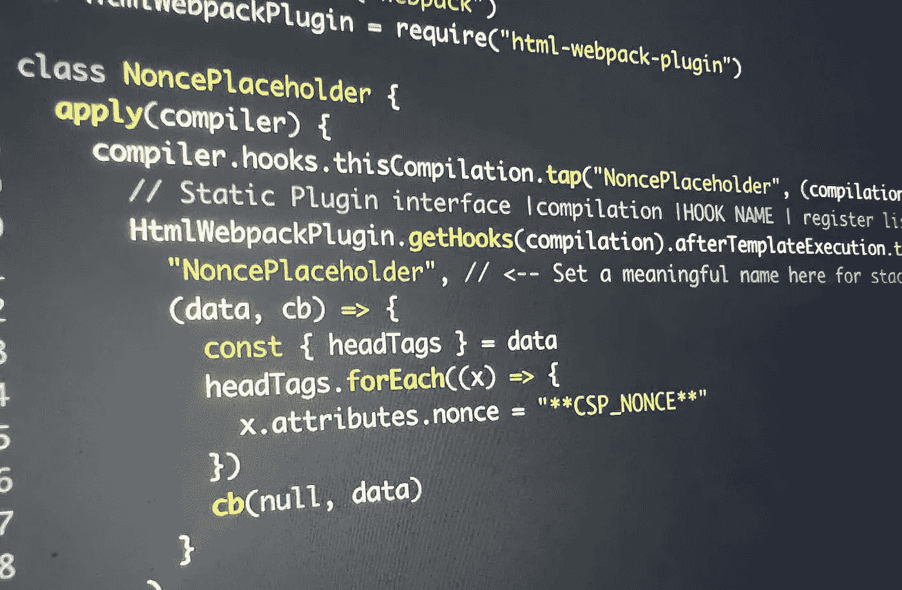

# 内容安全策略:如何用 Webpack 和 Nginx 创建基于 nonce 的安全策略

> 原文：<https://towardsdatascience.com/content-security-policy-how-to-create-an-iron-clad-nonce-based-csp3-policy-with-webpack-and-nginx-ce5a4605db90>



图片来源:Quest Henkart

[内容安全政策](https://content-security-policy.com/)通过限制不同来源和地点提供内容的方式，帮助防止 [XSS](https://en.wikipedia.org/wiki/Cross-site_scripting) (跨站点脚本)攻击。

在本文中，我将提供一个循序渐进的过程，介绍如何实现符合 CSP3 的严格动态 CSP 策略，并使用 Webpack 和 Nginx 正确地应用它来提供静态内容。无论您使用什么样的文件服务器，都可以遵循本指南。

本指南结束时，CSP 评估员会给你一个绿色的 CSP 勾号。

# 外面的情况有多糟？非常非常糟糕

内容安全政策已经存在很多年了，但是互联网上关于如何实际实施它的文档和指南少得惊人。事实上，要了解在线社区对 CSP 的理解有多差，只需在谷歌 Chrome 上下载[“CSP 评估器”扩展](https://chrome.google.com/webstore/detail/csp-evaluator/fjohamlofnakbnbfjkohkbdigoodcejf?hl=en)并四处浏览。

你会注意到什么？首先，在这个网站上，你会看到媒体有一个脚本 src 策略*‘unsafe-eval’‘unsafe-inline’关于:https:‘self’。*基本上这个政策和没有政策是一样的。它允许任何资源(只要是 https)通过 eval 将字符串作为代码注入该网站，从而将 medium.com 暴露给 XSS 攻击和其他攻击媒介。

# 白名单、白名单和更多白名单

CSP1 和 CSP2 规范提供了白名单的概念。这意味着在一个页面上提供或显示的每一个域都必须在 CSP 策略中列入白名单。最终结果是难以置信的长白名单，很难或者不可能管理和更新。

它们也不安全。[还有大量的 CSP 绕过和 JSONP](https://medium.com/r?url=https%3A%2F%2Fspeakerdeck.com%2Flweichselbaum%2Fcsp-is-dead-long-live-strict-csp-deepsec-2016%3Fslide%3D18) 的使用，JSONP 在 youtube 和 angular 库中很流行，可以用来注入来自看似可信来源的脚本。事实证明，正如这篇著名的研究论文中所表达的那样，这并不罕见，这篇论文激发了 CSP3 中严格动态的产生

# 严格动态:一种更简单更安全的方式

严格动态[由 W3C](https://www.w3.org/TR/CSP3/#strict-dynamic-usage) 提出，此后被除 Safari 之外的*所有浏览器采用，* Safari 可能会将它包含在下一个主要版本中，不幸的是，这个版本每年发布一次。它去掉了 script-src 白名单的要求，代之以一个[加密随机数](https://en.wikipedia.org/wiki/Cryptographic_nonce)。事实上，使用*严格动态，所有白名单项目都会被忽略*，只要浏览器接受严格动态，否则就会使用白名单项目。相反，严格动态将允许任何脚本，只要它匹配包含的[加密随机数](https://en.wikipedia.org/wiki/Cryptographic_nonce)或散列。

# Nonce 和现有 Webpack 模块的故障

为每个页面加载唯一生成 nonce 是至关重要的。这是不可猜测的。只要随机数是随机的，严格动态就会阻止 XSS 攻击。如果随机数是确定性的或静态的，那么它是无用的，并且违背了 CSP 策略的目的。[这就是为什么你应该 100%避免使用 Slack 的 Webpack 模块用于 CSP，它不起作用，也不会保护你的网站。避免它。他们可能会在某个时候更新它以创建随机随机数，但目前构建它的方式排除了这种可能性，因为它只能在构建时而不是运行时创建随机数。](https://github.com/slackhq/csp-html-webpack-plugin/issues/82)

[在这个问题上你也可能碰到谷歌的尝试](https://github.com/google/strict-csp/tree/main/strict-csp-html-webpack-plugin)。相反，它们在构建时自动散列源文件，并在 html 元策略中提供该散列。虽然这实际上是一种安全的方法，但当您仍然需要在应用程序中使用 webpack 不支持的其他脚本时，它将会失败。一旦你在你的网络服务器上添加了一个基于随机数的策略，它将与谷歌的策略相冲突，因为他们用来注入散列的脚本将被拒绝。

虽然 HTML 元页面中允许 CSP 策略，但是不可能在那里设置 report-uri。这意味着当用户遇到故障时，将没有日志记录系统，它将无声地失败。因此，通常建议使用来自 web 服务器的内容安全策略头。

# 游戏攻略

## 定义策略

```
default-src 'self';
script-src 'nonce-{random}' 'strict-dynamic' 'unsafe-inline' https:;
object-src 'none';
base-uri 'self';
report-uri https://example.com/csp
```

这应该是起点。严格动态*只适用于 script-src 条目。*这意味着你仍然需要将其他条目列入白名单。所有不存在的条目都将退回到 default-src，如果它们是从不同的域提供的，您将会看到一个错误。[点击这里查看所有可用条目](https://content-security-policy.com/)。您还可以考虑在 script-src 上添加回退白名单条目，以覆盖 Safari 用户，直到下一个版本(在这种情况下，任何域都将被允许提供内嵌内容，只要它们来自 Safari 上的 https 源，不是很安全，白名单会更好)。对于其他浏览器，只有 nonce-{random}和 strict-dynamic 是必需的，其余的将被忽略。

## 将随机数占位符添加到 html 模板中

现在我们需要在每次页面加载时设置一个新的 window.nonce，这样它就可以应用于所有 webpack 生成的脚本和包。为此，我们创建了一个任意格式的占位符，在本例中，我选择了**CSP_NONCE**。注意，围绕 window.nonce 的脚本*也需要占位符，否则它将被严格动态策略*拒绝

```
<!DOCTYPE html>
<html>
  <head>
    <title><%= htmlWebpackPlugin.options.title %></title>
    <script nonce="**CSP_NONCE**">
       window.nonce = "**CSP_NONCE**";
     </script>
  </head>
  <body>
    <div id="app"></div>
  </body>
</html>
```

## 应用 CSP 策略并填充随机数占位符

接下来我们跳到 Nginx，在这里我们创建一个变量并将其应用到头部。我使用了一个变量，因为它允许我按部分组织 CSP 头，它还允许我轻松地将开发 CSP 和生产 CSP 分开，由于 http/s 和 devtools 的原因，它们的需求略有不同。在我的真实项目中，它看起来像这样:

```
"'nonce-r@ndom' ${defaultsrc} ${imgsrc} ${connectsrc} ${stylesrc} ..."
```

然后，我们需要实际上把' nonce-random '变成一个密码随机字符串。幸运的是，nginx 提供了开箱即用的‘$ request _ id ’,这在 CSP 策略中是这样的

`'nonce-$request_id'`

```
server{
  set csp "script-src 'nonce-$request_id' 'strict-dynamic' 'unsafe-inline' https:; object-src 'none'; base-uri 'self'; default-src 'self'; report-uri https://example.com/csp"
..
..
location / {
  ..
  add_header Content-Security-Policy "${csp}"
  try_files /path/to/index.html =404;
}
```

服务内容呢？Nginx 不是一个支持模板的文件服务器，大多数信息都建议使用第三方节点服务器来处理模板。[但其实 nginx 支持这个就好](http://nginx.org/en/docs/http/ngx_http_sub_module.html)。它不是默认模块，所以您需要确保已经使用。" *—带-http_sub_module"* 配置。如果使用官方的 nginx docker 容器(或 openresty)，默认情况下会包含它。

既然我们已经启用了 sub_module，我们就可以添加 sub_filter 附加物了

```
add_header Content-Security-Policy "${csp}"
sub_filter_once off;
sub_filter ‘**CSP_NONCE**’ $request_id;
try_files /path/to/index.html =404;
```

sub _ filter _ once off 导致 nginx 替换占位符的多个实例。这是至关重要的，因为我们既需要将它应用于脚本标记，也需要将其设置为变量。另一个命令用 CSP 策略中列出的相同 request_id 替换**CSP_NONCE**的所有实例

## __webpack_nonce__ 隐藏功能

[__webpack_nonce__ 是 webpack 的一个神奇的、可怕的文档化功能，它实际上做得很好](https://webpack.js.org/guides/csp/)。只不过实际应用起来需要大量的黑客攻击。

它必须放在 Webpack 设置中指定的条目文件(通常是 index.js)的顶部。第一行应该是这样的:

```
__webpack_nonce__ = window.nonce
```

这个特定的方法神奇地打开了 Webpack 中的一个特性集，该特性集将随机数应用于运行时加载的所有脚本。它实际上工作得很好。将这个变量放在任何其他地方都会导致它不起作用。index.js 的第 1 行！

## 成功！开玩笑的。现在让我们修改 webpack

为什么不管用？如果您应用一个基于随机数的 CSP 策略，那么自动生成的、实际加载条目文件的脚本将永远无法运行，因为…您猜对了..它不是 nonced。Webpack 仅在加载条目文件后应用随机数，无法将其应用于加载条目文件的脚本。但是不要担心，我们有一个解决方案。

在这一点上，你应该使用 Nginx 提供一个可靠的 CSP3 策略，在应用到你的 index.html 文件的每个页面负载上创建一个新的随机随机数。如果您在浏览器的 devtools 中查看网页或源代码，您会注意到 index.html 页面已经用 CSP 报头中提供的相同 NONCE 替换了**CSP_NONCE**。太棒了。你也可以通过 window.nonce 在你的应用中的任何地方访问随机数。这不是一个安全问题，因为攻击向量需要黑客在提供随机数之前知道随机数*。*

*所以在这一点上，你可能会问为什么你看着一个白色的屏幕？*

正如我之前提到的，__webpack_nonce__ 只是部分完整的实现，这可能是 Slack 和 Google 试图创建他们自己的解决方案的原因。由于 __webpack_nonce__ 只能在入口文件中设置，而不能在 index.html 文件中设置，除非 nonce 应用于外部脚本，否则如何加载入口文件呢？如果使用包分割和/或块，情况会更复杂。不幸的是，html-webpack-plugin 没有这个功能，所以我们被困住了。

**自定义插件**

在您的 webpack.config.js 文件中，我们需要创建一个新的自定义插件，它从 html-webpack-plugin 获取一个钩子，并将**CSP_NONCE**占位符注入到每个脚本标记中。魔力来了

```
var HtmlWebpackPlugin = require("html-webpack-plugin")class NoncePlaceholder {
  apply(compiler) {
    compiler.hooks.thisCompilation.tap("NoncePlaceholder", (compilation) => {HtmlWebpackPlugin.getHooks(compilation).afterTemplateExecution.tapAsync(
        "NoncePlaceholder", 
        (data, cb) => {
          const { headTags } = data
          headTags.forEach((x) => {
            x.attributes.nonce = "**CSP_NONCE**"
          })
          cb(null, data)
        }
      )
    })
  }
}var html = new HtmlWebpackPlugin({
  title: "title",
  template: "index.ejs",
  filename: "index.html",
})const config = {
   ...
   ...
   plugins: [html, new NoncePlaceholder()]
}
```

这个非占位符自定义插件现在将向 index.html 文件中的每个脚本注入一个 nonce="**CSP_nonce** "，允许它被 nginx 子过滤器覆盖并转换为允许的 NONCE

**第三方脚本呢？**

由于 nonce 存在于 window.nonce 中，因此您可以将该 nonce 应用于应用程序中的任何脚本。例如，对于谷歌标签管理器，你可能有

```
googleTagManager.setAttribute(“src”,“[https://www.googletagmanager.com/gtag/js?id=](https://www.googletagmanager.com/gtag/js?id=)" + id)googleTagManager.setAttribute(“nonce”, window.nonce)
```

您需要将 window.nonce 作为 nonce 属性应用于任何导入的脚本或跟踪器。

# 其他指令

当您应用 nonces 来允许第三方脚本运行时，您会注意到大量的 CSP 错误。例如，Google Analytics 需要 img-src 和 connect-src 中的白名单条目。CSP3 中的严格动态没有涵盖这些内容。在 W3C 的下一个草案出台之前，我们仍然需要将所有其他指令列入白名单。[对于谷歌，你可以遵循他们的指南，了解哪些东西需要列入白名单](https://developers.google.com/tag-platform/tag-manager/web/csp)。对大多数人来说，他们完全没有文档，你只需要测试功能，看看什么需要被列入白名单。这也是 report-uri 如此重要的原因之一。

但是不要把你看到的所有错误都列入白名单！并不是所有的功能都是必要的，尤其是谷歌的服务，否则 Meta 会不断试图用追踪器入侵你的网站。您的 CSP 头将保护您的用户免受这种影响，只有白名单的最少领域，你可以实现你想要的功能。

# 最后的想法

为什么会这么复杂？[为什么 __webpack_nonce__ 不能被更好地记录](https://webpack.js.org/guides/csp/)？为什么不能在 index.html 文件中应用它，这样入口文件就可以加载，而不是自己失败？为什么大多数网站的 CSP 政策不完善？[为什么行业领导者创建的 webpack 插件会导致人们创建不安全的策略](https://github.com/slackhq/csp-html-webpack-plugin/issues/82)？为什么 html-webpack-plugin 不允许我们设置 nonce 属性？这里有很多开源的机会。但是在花了一个多星期在本应该花几个小时的事情上之后，我希望这篇博客文章能帮助人们走上正确的道路，并实施一个坚实的 CSP3 政策