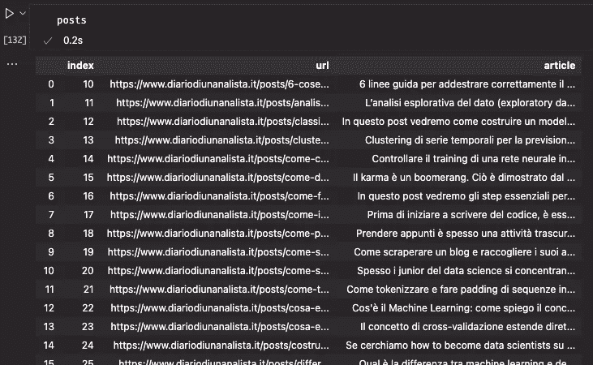
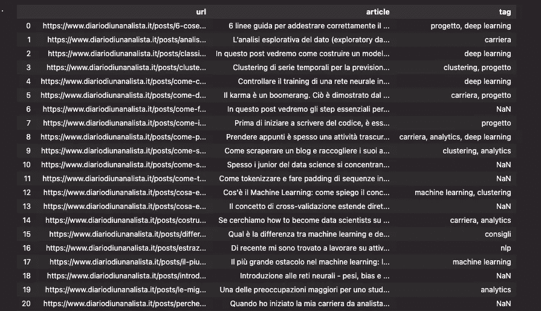

# Python 中基于模糊逻辑的内容标注

> 原文：<https://towardsdatascience.com/content-tagging-with-fuzzy-logic-in-python-d9041c572cac>

## *学习如何使用一个简单的脚本用模糊逻辑标记文本内容*

图片作者。

术语模糊逻辑指的是所有那些应用基于**真理近似值的启发式规则和功能。**

在计算机科学中，模糊逻辑是为了帮助提供一个**真实度**，而不是真实的真实度。这种方法允许我们不准确地回答同样不精确问题。

# 模糊逻辑的一个例子

假设我们被问及年龄，但是在形式上

> 你年纪大吗？

让我们从逻辑的角度来看这个问题:

*   如果我们是 5 岁，我们可能不算老
*   如果我们 70 岁了，我们可能会被认为是老了
*   ……但如果我们 50 岁了，我们该怎么回答？

模糊逻辑这样回答:

> 是也不是。

虽然传统逻辑只以两种状态来表达自己，即**真和假**，**模糊逻辑想要填充**之间的内容，提供*真度*而不是布尔表达式。

回到上面的例子，按逻辑类型分解问题，我们会得到问题*的答案:你是老年人吗？*

假设我们实际上可以活到 75 岁，

> 传统逻辑:年龄> 75 岁为真；否则为假
> 模糊逻辑:年龄/ 75%资深。因此，如果我们 70 岁，那么根据模糊逻辑，我们将有 93%的年龄。

对于我们的分析师来说，模糊逻辑成为一种工具，用于关联、区分或分组由测量定义的元素。

# 使用模糊逻辑进行标记/分类

在本文中，我将介绍使用 Python 中的模糊逻辑对文本内容进行标记或分类。我将使用来自我的意大利语个人博客(diariodiunanalista.it)的内容。

使用 [*Levenshtein 距离*](https://en.wikipedia.org/wiki/Levenshtein_distance) 作为评估系统，我们将使用模糊逻辑将一篇文章与一个或多个预定义的标签相关联。

Levenshtein 距离是一种常用于评估两个字符串之间差异的度量。它计算字符串 A 变成字符串 b 需要多少个字符。

一个例子:
-字符串 A: *foo* |字符串 B:*fii*
**Levenshtein 距离:2**

事实上，需要对 A 进行两次编辑才能将其转换为 B (oo -> ii)。

如果读者对字符串操作及其主要应用感兴趣，即自动校正，我建议阅读这篇文章，它解释了[自动校正模型如何工作](https://medium.com/mlearning-ai/nlp-how-does-an-autocorrect-model-work-2951774f86c9)。

我们的模糊逻辑系统将基于一个名为[Fuzz](https://github.com/seatgeek/thefuzz)的库，它涵盖了我们的用例。

# 我们要做什么？

经常阅读我的内容的读者会知道**我使用一段时间前创建的脚本从在线博客**创建语料库。我将使用它来从 Diario 安迪 Analista.it 检索文章，并尝试用我们的模糊逻辑系统来标记它们。

> 通过这个小项目，我想让读者能够根据预定义的标签标记任何文本内容。

由于这种方法不是基于预测模型，我们需要为软件提供我们希望应用于文档的标签。

这种方法比基于预测模型的方法更有优势。一个模型可能会推断出不准确的标签，这可能不符合我们心目中的标准。

通过预先定义标签，我们可以确保标签与我们的意图一致。当然，我们可以也一定会看到错误，但它们会更容易管理。

# 要求

只有两个要求:熊猫和绒毛。

`pip install pandas thefuzz`

# 标签创建

我们将要应用的函数需要一个参考才能工作。为此，我们将创建一个名为`tags`的列表，其中包含我们希望应用于文档的标签。

## 导入数据集

使用上面链接的 blog scraper，让我们创建一个包含两列的数据集:url 和文章。

文章数据框架示例。图片作者。

这是我们的语料库。在写这篇文章的时候，大约有 30 篇文章——因此它是一个非常小的语料库。对于我们的例子来说，它仍然是好的。

# 标签功能

我们现在将编写代码来使用模糊逻辑应用标记。算法是这样工作的:

*   在标签间循环
*   对于每个标签，使用 Fuzz 的 process.extract 提取一组代表该标签的文章，按分数排序
*   对于前面输出的每个元素，在 Python 字典中构建数据，并创建一个 Pandas 数据帧
*   收集完所有的数据帧后，用连接将它们连接起来

让我们写函数

# 应用标记功能

让我们通过运行编写的代码来查看标记结果

标记数据集。图片作者。

正如我们所见，标记并不完美**，但大多数结果实际上是一致的。**

当一个页面属于多个类别时，如 Python 中的第 3 行[时序聚类用于股市预测](https://pub.towardsai.net/time-series-clustering-for-stock-market-prediction-in-python-part-1-738ab6462f0e)即属于*聚类*和 *progetti* 标签。

也有男的。这很正常。一篇文章可能不与大于为某个标签建立的阈值(在我们的例子中是 55)的阈值相关联。在这种情况下，没有标签与内容相关联，因此分配 NaN。改变置信度阈值将有助于产生或多或少的结果。

# 结论

我们已经看到了如何使用模糊逻辑和 Pandas 数据框架在 Python 中标记内容。

这是一个小项目，但它可以在工作场所产生重要的影响。在数据集上手动应用标签可能需要几个小时。这是自动化这些任务的一种简单而有效的方法。

## 下一步

在这个例子中，我使用了文章的正文。这是一个任意的选择，但是举例来说，你可以对文章的标题或者元描述做同样的事情。如果这些文本是主题的代表，我们的系统可以工作得更好！自己试试:)

**如果你想支持我的内容创作活动，欢迎点击我下面的推荐链接，加入 Medium 的会员计划**。我将收到你投资的一部分，你将能够以无缝的方式访问 Medium 的大量数据科学文章。

  

下次见！👋