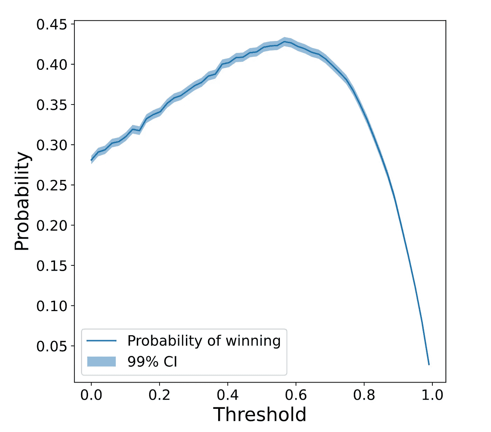
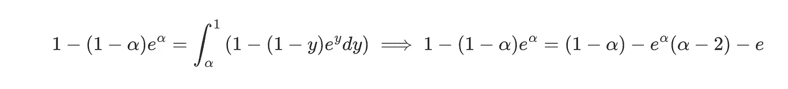
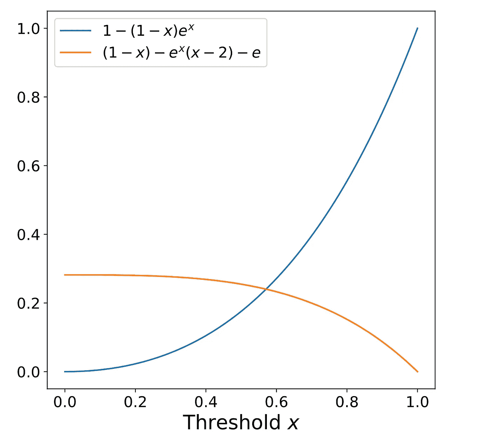

# 连续 21 点(一):介绍和初步结果

> 原文：<https://towardsdatascience.com/continuous-blackjack-i-introduction-and-first-results-be70c5da426f>

## 连续二十一点问题的解析和数值观点

埃里克·麦克林在 [Unsplash](https://unsplash.com?utm_source=medium&utm_medium=referral) 上的照片

# 介绍

这是我们将分析连续玩 21 点问题的几篇文章中的第一篇。特别是，我们希望将[亨利·查尔斯沃斯](http://myblog.henrycharlesworth.com/continuous-blackjack)和[穆昭](https://arxiv.org/pdf/2011.10315.pdf)的工作扩展到其他发行版。在这第一篇文章中，我们将复制现有的结果，并提出一种将它们扩展到其他发行版的方法。然后，我们将分析均匀分布的情况，并展示一些有趣的情节。

# 问题陈述

考虑 21 点游戏的连续版本，它有以下规则:

1.  每个玩家 *i* 从一个空筹码 *S_i=[]* 开始。这个堆栈的值定义为 *V_i=∑|S_i|S_ji。*
2.  庄家从分布 *P(x)* 中抽取随机值。
3.  玩家轮流玩游戏。每个玩家的回合开始于从庄家处收到一个数字，并将其加入其筹码 *S_i* 。然后，玩家有两个选择:
4.  决定停止游戏，用当前筹码结束游戏。然后该玩家的回合结束，轮到下一个玩家。
5.  获取另一个数字，将其添加到堆栈中，然后返回步骤 3。玩家可以在 *V < 1* 的时候随时这样做。如果 *V > 1* 玩家自动输了，下一个玩家的回合开始。
6.  V 值最高的玩家赢得游戏。

问题是，赢得这场游戏的最佳策略是什么？

# 预赛

首先让我们定义一下 F(t；a，b) 是在区间 *R=(a，b)* 中着陆的概率，假设我们实际上在 t，如果 t < a，我们将继续玩下去。这个概率可以分为两部分，(1)我们在下一个回合中在 *R* 着陆的概率，以及(2)我们在下一个回合中不是在 R 上着陆而是在下面的一个回合中着陆的概率。

用数学术语来说，这是

# 均匀分布

在 *P=U[0，1]* 的特殊情况下

对两边的 t 求导，我们得到

常数 K 可以使用*F(a；a，b)= b a*，所以 *K=(b−a)e^a.*

请注意，这个等式并不依赖于 a、b 和 t 的特定值，而是依赖于它们之间的距离。因此，可以将值*W = ba*定义为范围的宽度，将*D = ta*定义为从当前位置到下限的距离。那么，这个等式可以写成

# 战略

在本节中，我们将分析如何使用上一节中得出的结果来寻找不同场景中的最佳策略。

# 1 对 1

让我们从最简单的情况开始:你只和另外一个人比赛。如果第二个玩家破产，第一个玩家就得一分。如果第一个玩家的得分是 s，那么第二个玩家的概率是*1f(0；s，1)* 破产，这意味着如果我们留在 s，我们获胜的概率是*1 F(0；*s，1)。当然，如果我们可以选择我们的 s，我们会选择 *s=1* ，但是由于这是一个随机过程，我们不能选择 s，我们唯一可以选择的是在哪个 *α* 停止抽取数字。这个 *α* 是由以下几点定义的:假设我们坚持在 *α* 的情况下获胜的概率与假设我们多抽一个号码的情况下获胜的概率相同。

# 具体情况:均匀分布

对于这一部分，让我们假设 *P=U[0，1]* 并且所有玩家都从 *x=0* 开始。在这种情况下，上述推理所描述的条件被写成

注意左边在增加，而右边在减少。

# 模拟结果

在得出理论结果之前，让我们通过模拟来寻找最佳阈值。为此，我们将尝试每个可能的阈值，并模拟 50000 个游戏。然后，我们将检查作为所选阈值的函数的第一个玩家获胜的概率。结果绘制在下图中:

第一个玩家获胜的概率与停止阈值

可以看到，最大获胜概率是在*t∫= 0.6*左右实现的，更具体的是*t∫=(0.565±0.035)*。为了计算最佳阈值及其偏差，我们进行了蒙特卡罗模拟。也就是说，我们已经使用预期的获胜概率及其 99%的置信区间生成了 1000 个阈值-概率曲线样本。然后，我们计算了每个样本的最佳阈值，从这组最佳阈值中，我们计算了平均值和标准偏差。

知道了最佳值所在的范围，让我们重复上面的模拟，但是阈值在 0.5 和 0.65 之间。使用这个较小的范围，我们得到最佳阈值*t∫=(0.568±0.021)*。最后，最优阈值下的期望获胜概率为*p _ win(t∫)=(0.4278 0.0011)。现在让我们看看分析结果是否与模拟相符。*

# 分析结果

使用截面均匀分布和 *P=U[0，1]* 的结果，最佳 *α* 的等式为

曲线的绘制 1−(1−α)e^α和(1−α)−e^α(α−2)−e.

这是一个没有封闭形式的非线性方程，但可以用数值方法近似求解，解为*α≈0.5706*。这意味着当我们筹码的累计值大于 0.5706 时，我们应该结束这一轮。这个结果与我们在模拟中发现的范围是一致的。

# 结论

在这第一篇文章中，我们已经推导出了落在区间 *(a，b)* 内的概率的一般方程，假设我们目前处于 *t* 。我们还导出了最佳阈值必须满足的条件。最后，我们研究了均匀分布的特殊情况——在数值上和分析上——并研究了它的性质。

在下面的帖子中，我们将研究当分布 *P* 变化时，所有这些结果是如何变化的。我们还将研究与 N 个玩家而不是一个玩家对战的情况。

这个故事最初发表在[这里](https://www.amolas.dev/posts/continuous-blackjack-i/)。