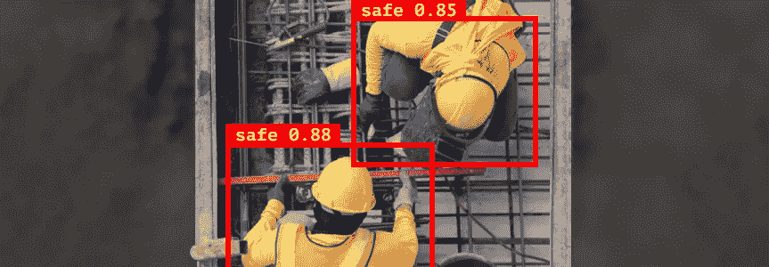
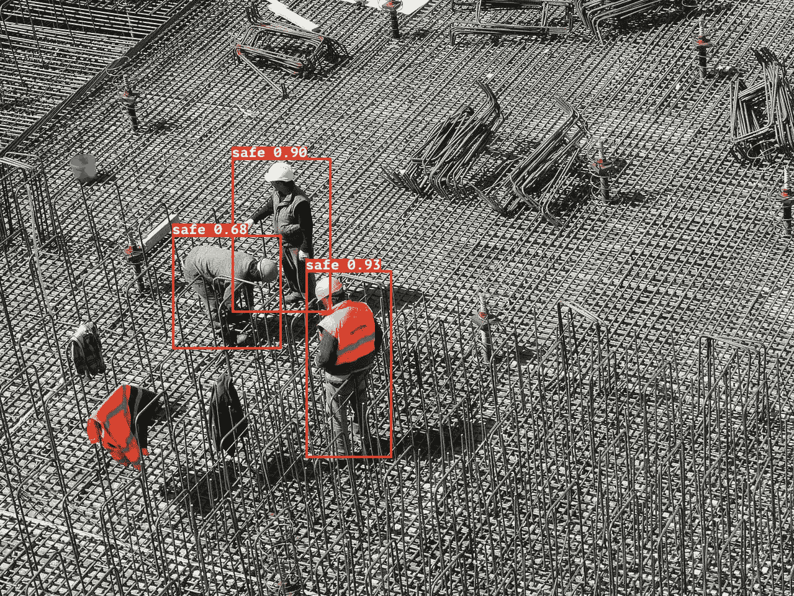
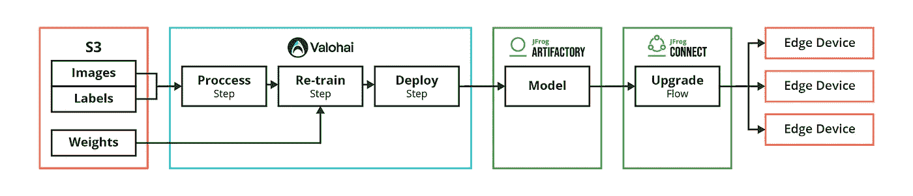
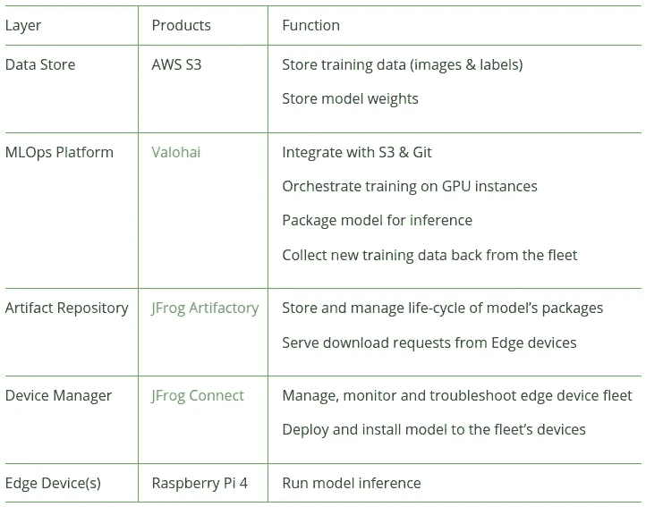
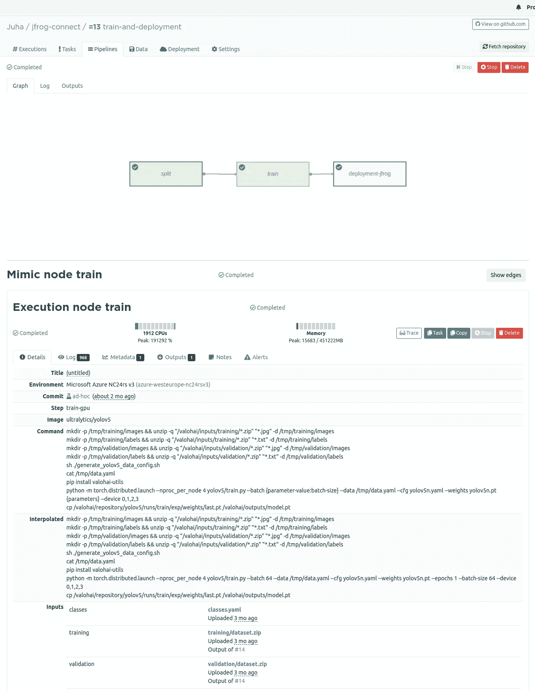
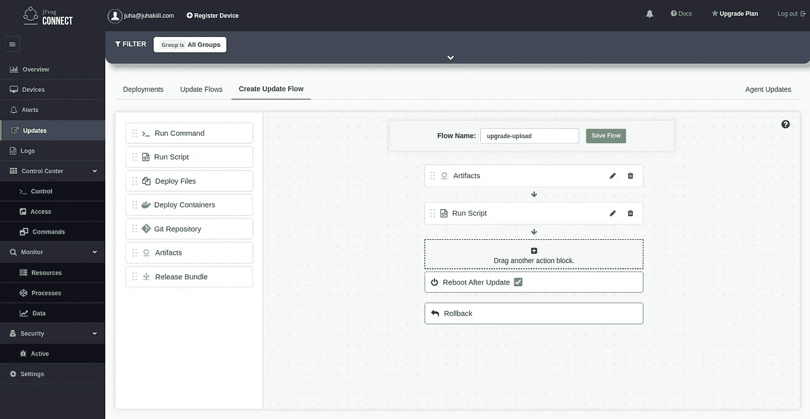
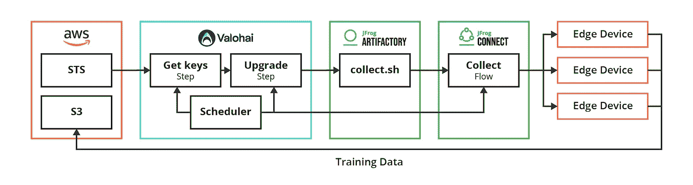

# 将 ML 模型持续部署到边缘

> 原文：<https://towardsdatascience.com/continuous-deployment-of-ml-models-to-the-edge-909a01d6352>

## 真实的例子:工地安全监控



作者图片

与在云中远程运行推理相比，在靠近数据生成位置的边缘设备中运行机器学习(ML)推理具有几个重要优势。这些优势包括实时处理、更低的成本、无需连接即可工作的能力以及更高的隐私性。然而，今天，在分布式边缘设备中实现用于边缘推断和模型连续部署的端到端 ML 系统可能很麻烦，并且比集中式环境困难得多。

与任何现实生活中的生产 ML 系统一样，最终目标是一个重复迭代和部署模型的连续循环。

这篇博客文章描述并展示了一个真实的例子，说明我们如何使用 [Valohai MLOps 平台](https://valohai.com/)、 [JFrog Artifactory](https://jfrog.com/artifactory/) 仓库管理器和 [JFrog Connect](https://jfrog.com/connect-overview/) 物联网边缘设备管理平台创建一个完整的 ML 系统，并不断改进自己。

# 真实用例:建筑工地安全应用

对于我们的用例示例，我们选择了一个突出边缘推理优势的实际应用:工地安全监控。

大多数法规要求建筑工地上的每个人都使用必要的安全设备，如安全帽。这对工地管理者来说很重要，因为不遵守安全规定可能会导致更多的伤害、更高的保险费率，甚至是处罚和罚款。



作者图片

为了监控这些网站，我们基于运行对象检测 ML 模型的 Raspberry Pi 4 设备设置了智能摄像机，该模型可以识别被捕获的人是否戴着安全帽。

在这样的用例中，边缘推理的好处是显而易见的。建筑工地经常有不可靠的连接，检测必须接近实时。在现场的智能摄像机上运行该模型，而不是在云中运行，确保正常运行时间，最大限度地减少连接问题或要求，同时解决可能的隐私和合规性问题。

下面描述了我们如何实现该解决方案的细节。

# 解决方案概述:持续 ML 培训渠道

我们针对边缘设备的持续培训管道设置包括两个主要部分:

1.  负责培训和再培训模型的 Valohai MLOps 平台，以及
2.  JFrog Artifactory 和 JFrog Connect 负责将模型部署到建筑工地的智能摄像机上。



培训和部署渠道(图片由作者提供)



解决方案组件(图片由作者提供)

# 培训和部署模型

在 Valohai MLOps 平台中，我们定义了一个典型的深度培训管道，分为三个步骤:

预处理和训练步骤是你从深度学习机器视觉管道中所期望的。我们主要是在预处理中调整图像大小，训练步骤使用强大的 GPU 云实例重新训练一个 YOLOv5s 模型。

**代码片段:valohai.yaml**

更有趣的步骤是部署步骤，我们将 Valohai 平台与 [JFrog DevOps 平台](https://jfrog.com/)集成在一起。 [valohai.yaml](https://docs.valohai.com/topic-guides/core-concepts/configuration-file/) 是一个配置文件，它定义了各个步骤以及连接这些步骤的管道。下面是我们在 YAML 定义的示例`deployment-jfrog`步骤。

```
- step:
    name: deployment-jfrog
    image: python:3.9
    command:
    - cp /valohai/inputs/model/weights.pt /valohai/repository/w.pt  
    - zip -r /tmp/model.zip /valohai/repository/model
    - curl >
       -H "X-JFrog-Art-Api:$JFROG_API_KEY" >
       -T /tmp/model.zip "$JFROG_REPOSITORY/model.zip"
    - python jfrog-connect.py >
       --flow_id=f-c4e4-0733 >
       --app_name=default_app >
       --project=valohaitest >
       --group=Production
    inputs:
    - name: model
      default: datum://017f799a-dc58-ea83-bd7f-c977798f3b26
      optional: **false**
    environment-variables:
    - name: JFROG_REPOSITORY
      optional: **true**
    - name: JFROG_API_KEY
      optional: **true**
```

让我们看看部署步骤是如何工作的。

首先，部署步骤构建一个包含模型+权重的 zip 存档，然后将其上传到 JFrog Artifactory。Valohai 将前一训练步骤的权重作为输入文件提供给该步骤，并将所需的`JFROG_API_KEY`和`JFROG_REPOSITORY`秘密作为环境变量提供给该步骤。

下一步是启动一个更新流程，通过调用 [JFrog Connect API](https://docs.connect.jfrog.io/rest-api/overview) 在智能摄像机群中发布新模型。



瓦罗海的训练管道(图片由作者提供)

我们已经建立了一个 Valohai 管道，该管道将模型上传到 JFrog Artifactory，并在 [JFrog Connect](https://jfrog.com/connect-overview/) 服务中触发模型的部署，该服务在整个智能相机车队中交付新模型。

模型部署过程被表示为一个 JFrog Connect 更新流。更新流是需要在边缘设备中发生的一系列动作。使用 [JFrog Connect](https://jfrog.com/connect-overview/) 的拖放接口，我们创建了一个更新流程，其中包括更新智能摄像机中的模型所需的步骤。这些步骤是:



用 Jfrog 创建更新流(图片由作者提供)

1.  从 JFrog Artifactory 下载模型，
2.  运行脚本来安装模型，以及
3.  重启设备。

如果其中一个步骤失败， [JFrog Connect](https://jfrog.com/connect-overview/) 会将设备回滚到之前的状态，因此设备总是以已知状态结束。进一步了解 [JFrog 连接更新流程](https://jfrog.com/connect/embedded-linux-ota-software-updates/)。



Ddata 收集管道(图片由作者提供)

# 持续培训

一旦模型部署到整个边缘设备群，我们的工作就没有完成。摄像机全天候收集潜在的训练数据，并遇到有趣的边缘情况。

在这个阶段，我们需要创建一个管道，每周从智能相机群中收集标记的图像，并将它们上传到 S3 桶中进行手动重新标记，并最终用于重新训练模型。

计划管道的工作方式:

1.  使用对 S3 存储桶具有只写访问权限的 AWS STS 创建临时凭据
2.  使用内置的临时密钥升级 JFrog Artifactory 中的上传脚本
3.  触发 JFrog 连接更新流以在设备群中运行上传脚本
4.  每个设备上传一批新的图像到 S3 桶

设备群上传的新训练数据由人类使用 Sama 或 Labelbox 等平台手动标记，一旦数据被标记，这些平台使用我们的上传 S3 桶作为其源，另一个 S3 桶作为目标。

注意:庞大的车队会产生太多数据，无法进行手动标记，设备本身可能会很快耗尽空间。幸运的是，像 YOLOv5 这样的机器视觉模型通常有一个置信度和预测标签。我们使用置信度阈值过滤设备上存储的训练数据，该阈值优先考虑边缘情况。

# 结论

总之，我们展示了如何创建一个连续的循环，在生产中跨一系列边缘设备重复迭代和部署 ML 模型。Valohai MLOps 平台与 [JFrog DevOps 平台](https://jfrog.com/)的 Artifactory 和 Connect 相结合，使我们能够实现这一目标，并创建一个不断自我改进的 ML 系统。

*原载于 2022 年 7 月 13 日*[*【https://jfrog.com】*](https://jfrog.com/blog/continuous-training-and-deployment-for-machine-learning-ml-at-the-edge/)*。*