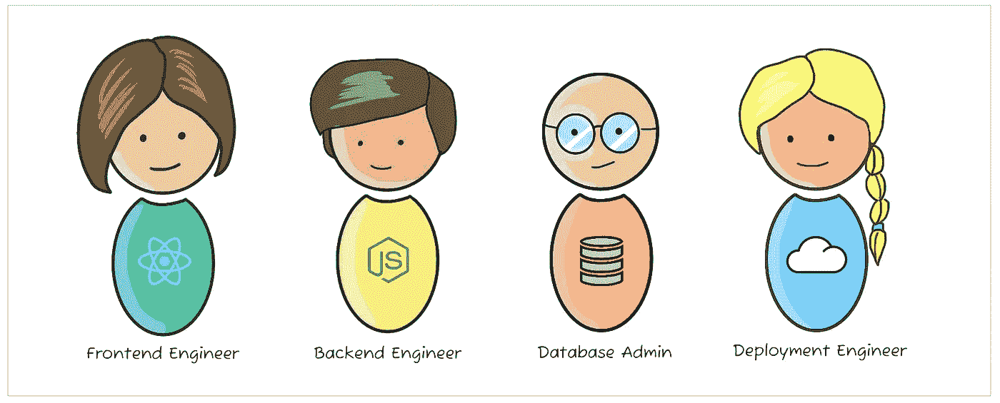
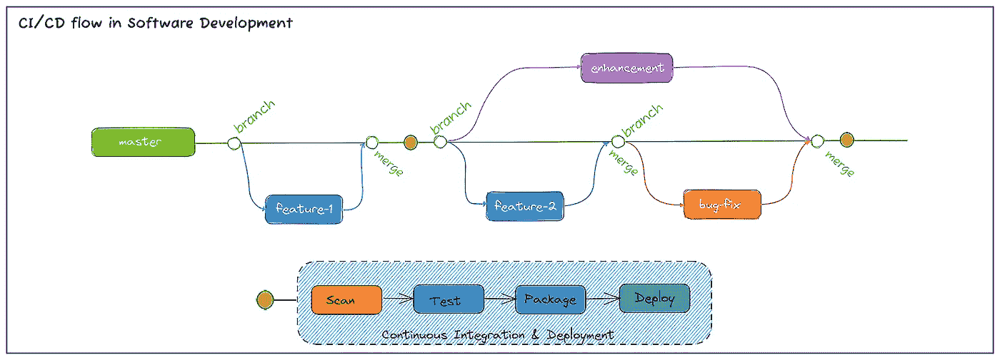
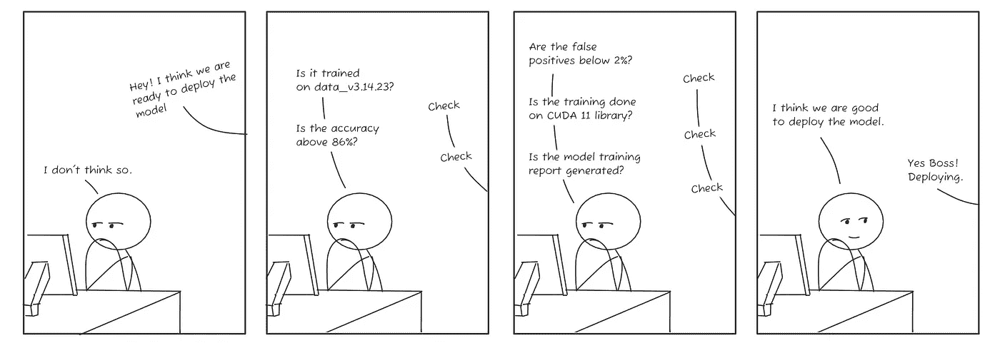
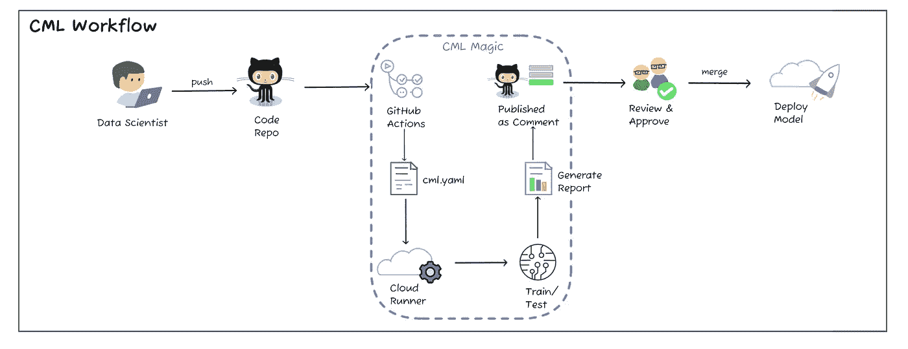
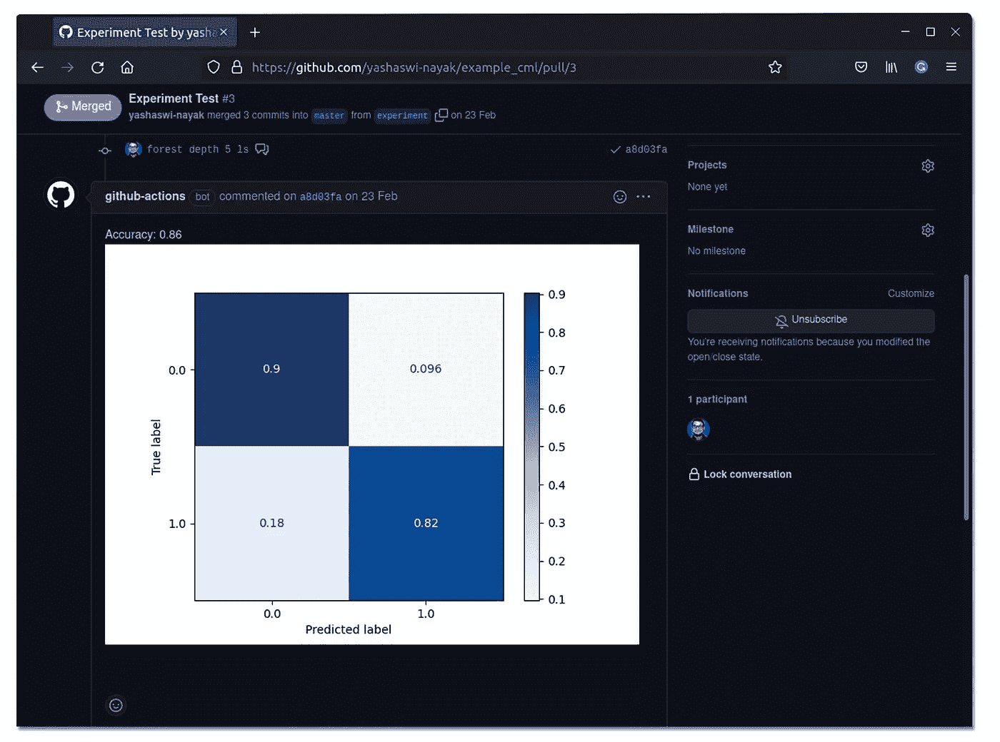
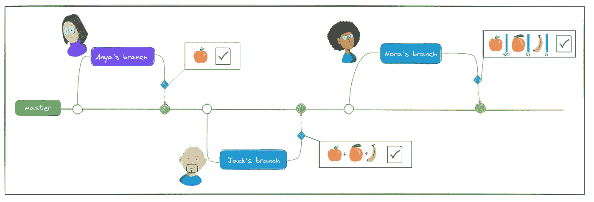

# 连续机器学习

> 原文：<https://towardsdatascience.com/continuous-machine-learning-e1ffb847b8da>

持续学习(图片由作者提供)

## CML (Iterative.ai)简介

这篇文章是为寻找理解连续机器学习的简要指南的数据科学家和工程师写的，它是什么？它是如何工作的？以及如何将它集成到您的日常模型开发过程中？

让我们开始吧！

您可能听说过 CI/CD(持续集成/持续部署),其中软件工程团队开发一个应用程序，无缝集成新的变更、错误修复和增强，并部署最新的应用程序。这在软件场景中是可行的，因为有工具和技术可以做到这一点。

让我们以构建一个简单的 web 应用程序为例。构建 web 应用程序的最小团队由前端工程师、后端工程师、数据库管理员和部署工程师组成。

网络应用开发团队(图片由作者提供)

团队将在 GitHub 或一些存储库托管服务中拥有他们的代码存储库。随着新代码的更改和错误修复的修补，开发人员将开始把代码推送到存储库的特性和修复分支。一旦代码通过验证，就会产生一个 pull 请求，将变更与主分支合并；在合并最新代码之后，触发管道来扫描和测试代码，一旦通过，就可以打包和部署代码。

软件开发中的 CI/CD 流程(图片由作者提供)

现在想象一个机器学习(ML)和数据科学家团队试图实现同样的目标，但使用 ML 模型。这涉及到一些复杂的问题-

*   开发 ML 模型不同于开发软件。大部分代码本质上是一个黑盒，很难找出 ML 代码中的问题。
*   验证 ML 代码本身就是一门艺术，在软件代码中使用静态代码检查和代码质量检查是不够的，我们需要数据检查、健全性检查和偏差验证。
*   ML 模型的性能取决于用于训练和测试的数据。
*   软件开发有标准化的架构和设计模式，ML 没有广泛采用的设计模式，每个团队可能遵循他们自己的风格。
*   多个分类器和算法可以用来解决同一个问题。

所有这些复杂性提出了一个重要的问题——**ML 能以持续集成的方式进行吗？**

这就是 CML 的用武之地。 [**CML**](https://cml.dev) 是由 [**Iterative.ai**](https://iterative.ai/) 开发的一款优秀开源工具，它允许数据科学家和机器学习团队使用现有的网站如 **GitHub、GitLab、**和工具如 **Docker** 和 **DVC** 来执行模型的持续训练和集成。不需要额外的技术堆栈。

现在你可能会说——“但是我很高兴在我的笔记本上开发并运行我的 ML 模型，我可以随时改变参数，随心所欲地调整代码。我为什么需要 CML？”

# 我们为什么需要慢粒？

考虑将 ML 模型投入生产的过程——一群数据科学家致力于解决问题，获取数据，建立模型，根据数据训练模型，测试和评估模型。如果足够好，他们会部署它。在这个过程中，我们需要确保某些制衡措施到位-

*   一个数据科学家创建的模型可以被其他人在不同的系统和环境中复制吗？
*   用于培训的数据版本是否正确？
*   模型的性能指标是可验证的吗？
*   我们如何跟踪并确保模型得到改进？
*   大多数团队会使用云 GPU 实例来训练模型——这可能是一个按需实例，以降低成本(仅在训练期间需要)。我们如何确保为培训建立适当的环境？
*   一旦培训完成，是否有一份报告给我们提供培训课程的详细信息，以便以后进行比较？
*   在模型的再训练过程中会发生同样的检查吗？

这些步骤对于确保模型随着时间的推移而改进是必要的。随着团队越来越大，或者随着模型变得越来越复杂，保持跟踪变得非常乏味。

[***CML***](https://cml.dev)***提高了&简化了这个过程；引入一个连续的工作流，用于供应云实例、在其上训练模型、收集指标、评估模型性能和发布摘要报告。它允许开发人员引入一系列检查点，这些检查点在不同的场景中更容易跟踪和重现。***

CML 工作流使这一切成为可能，不需要额外的技术堆栈，几行代码就可以无缝集成到大多数开发人员熟悉的现有开发流程中。

这增加了开发流程的可见性，数据科学家现在可以访问多个培训报告和指标来比较和评估模型。这有助于团队更快地开发模型并将其投入生产，减少了大量的手工工作以及在性能下降时修复模型所涉及的返工。

让我们部署(图片由作者提供)

让我们看看它是如何工作的。

# CML 是如何工作的？

CML 将 CI/CD 风格的自动化注入到工作流中。大多数配置是在存储库中保存的一个`cml.yaml`配置文件中定义的。在下面的示例中，该文件指定了当特征分支准备与主分支合并时应该执行的操作。当发出一个 pull 请求时，GitHub 动作利用这个工作流并执行配置文件中指定的活动——比如运行`train.py`文件或生成一个准确性报告。

CML 使用一组叫做**的函数。这些是帮助我们工作流的预定义代码，比如允许这些报告作为评论发布，甚至启动云运行器来执行工作流的其余部分。你可以在下面的工作流程中看到所有这些步骤是如何被压缩成一个步骤的**

CML 工作流程(图片由作者提供)

让我们用一个例子来理解这一点

# 例子

假设 3 名数据科学家— **Anya、Jack 和 Nora 正在构建一个分类器来识别和分类不同的水果。** Anya 从一个基本的二进制分类器开始，它识别一个水果，并将其分类为苹果或非苹果。然后，杰克继续添加识别桔子和香蕉的能力。

杰克要做的就是

1.  创建他的特征分支
2.  编写他的代码，在以前的模型上运行他的训练和测试
3.  将他的代码推送到特性分支
4.  提交一个 pull 请求，将他的代码合并到主分支

当发出“拉”请求时，CML 跳进去，并运行在`cml.yaml`配置文件中给出的动作。生成一个报告，然后团队可以决定是否合并 Jack 的代码。没有重复的文件，没有同一笔记本的多个副本，只是一个简化的工作流程。

那么在这个配置文件中到底发生了什么样的奇迹呢？让我们来看看

这个`cml.yaml`文件是一个 GitHub 动作脚本。如果你一开始感到困惑，不要担心，我会为你简化它。

这个文件告诉 GitHub 以下几点

*   **行动流程** —模型培训的名称是什么
*   **该工作流应在何时执行**——根据对 main 的拉取请求
*   **它应该做什么工作** —火车模型
*   **它应该在哪里执行**——在装有最新 Ubuntu 操作系统的 GitHub runner 上(我们在这里没有使用云 GPU runner)
*   **需要执行哪些步骤** —列车模型
*   **执行这一步需要什么** — checkout，setup-python，setup-cml。这些是 GitHub 及其市场中可用的操作。动作是某人已经编写的执行任务的代码片段，您可以在脚本中轻松重用。所以你的最新代码会在临时的 Ubuntu 虚拟机上签出，python 和 cml 会安装在那台机器上。
*   **应该使用什么环境变量**—REPO _ TOKEN 由 GitHub 给出，所以虚拟机知道只有授权的 GitHub repo 才被允许执行这个任务。
*   **在此步骤中应该执行哪些命令** —安装 python 包，运行 *train.py* 文件，将评估报告发布到名为`report.md`的文件中。这将显示报告数据，如准确性、评估指标和误差指标，无论您希望将哪一项指定为模型评估过程的一部分。
*   **CML-Functions** —您会注意到脚本最后两行中的`*cml publish*`和`*cml send-comment*`命令，它们是 [**CML Functions**](https://cml.dev/doc/usage#cml-commands) 。这些函数简化了您在 pull 请求中创建模型训练的详细报告的任务。您可以创建一个很酷的可视化报告来概述模型的性能。这有助于数据科学家确定最终合并可以批准哪个拉请求。

简而言之，Jack 所做的就是编写他的代码，测试他的模型，将他的更改推送到他的分支，然后提出一个 pull 请求。模型评估、比较和结果列表的其余步骤由 CML 负责。CML 操作完成后，一个很酷的培训会议报告可供其他数据科学家验证和评估——在同一个报告中，如下所示。

CML 报告(图片由作者提供)

假设 Nora 想要使用最新的代码，用她的数据进行训练，想要增加按百分比分类的能力。因此，她的模型将水果图像分类为 96%的苹果或 60%的香蕉，她有大量的图像数据集要训练，GPU 将为她节省大量精力。 ***但是 Nora 不知道设置基于 CUDA GPU 的实例所需的所有系统设置和配置。***

在这里，CML 也来帮忙了。她可以使用定制的云运行器，连接到 AWS GPU 实例并训练她的模型，而不必学习额外的技术或系统设置知识。她所要做的就是配置`cml.yaml`文件来使用 AWS 和 GPU 设置。然后，工作流将使用自定义的基于 GPU 的容器来训练模型并发布她的结果。

CML Magic(图片由作者提供)

现在，每当有人创建一个特性、模型增强、性能改进或错误修复时，评估报告将在合并过程中随时可用。多个数据科学家可以同时研究一个模型的并行版本，比如不同的分类器算法，使用 CML 他们可以查看模型是否经过适当的训练、可部署和比较指标；都在同一个存储库工作流中。

# 太棒了。接下来呢？

如果你是数据科学家或机器学习团队，首先在 GitHub、GitLab 或 Bitbucket 上创建你的知识库。前往[https://github.com/iterative/cml](https://github.com/iterative/cml)按照那里给出的步骤开始你的 CML 之旅。

您可以尝试以下用例

*   查看您的模型培训的模型准确性和性能指标报告
*   使用 **CML** 使用 **DVC** 在不同版本的数据上运行您的培训，提取新数据，培训您的模型，发布您的报告并将您的最新模型推送到您的存储中。
*   如果您有一个 **TensorFlow** 模型，您可以连接到 [tensorboard.dev](http://tensorboard.dev) 并使用 CML 工作流定期发布您的报告
*   为你的项目使用定制的 CML runner，并在你的 **AWS EC2、Azure、GCP** 云实例或你的本地机器上训练你的模型
*   使用基于 AWS GPU 的实例，无需额外设置，一旦完成培训，就可以删除该实例。有助于降低培训和实例成本。
*   由于工作流在基础级别使用 GitHub 操作，所以您也可以将脚本扩展到其他工作流操作——例如创建一个模型 pickle 文件，并在每次推送特定分支时将其存储在远程存储中。
*   在 GitHub Actions 工作流之上添加 CML，很容易将其与现有工作流集成—假设您希望跟踪数据的主要版本和模型更改，您可以使用 CML 来训练模型，在主要版本的 pull 请求期间生成报告，并添加一个简单的 GitHub 操作来邮寄该报告。——CML+github 操作的可能性是♾️。

目前就这些。快乐的慢粒冒险🙂

## 链接和参考

*   **CML**——[https://cml.dev/](https://cml.dev/)
*   **Github 回购**——[https://github.com/iterative/cml](https://github.com/iterative/cml)
*   **CML Youtube 系列【https://www.youtube.com/playlist? ——[list = pl 7 WG 7 yrwycncndbuckfcyjnzqrdsfsbz](https://www.youtube.com/playlist?list=PL7WG7YrwYcnDBDuCkFbcyjnZQrdskFsBz)**