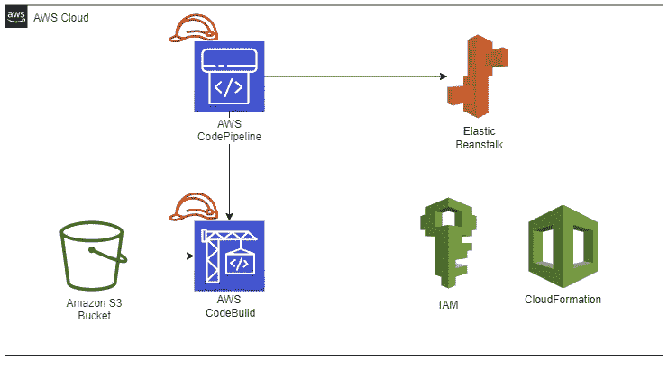
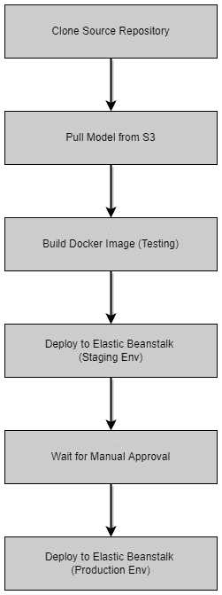
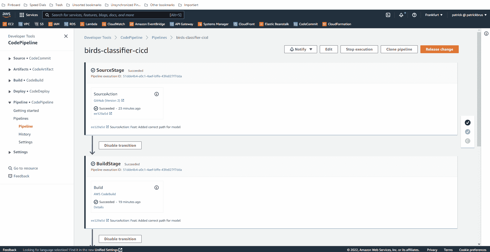
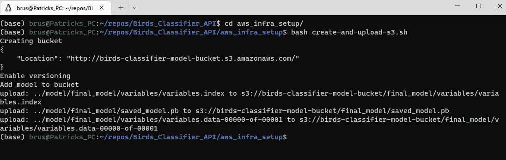
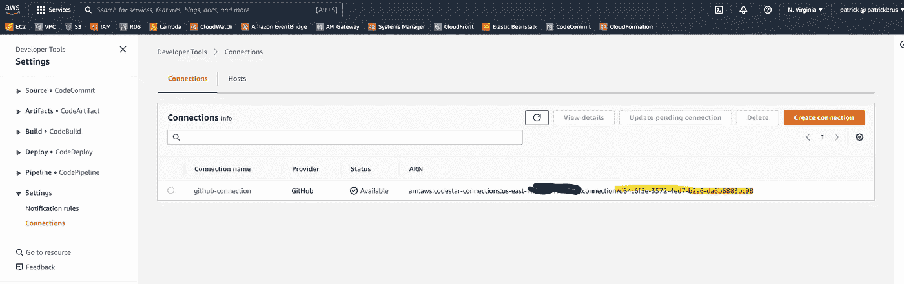
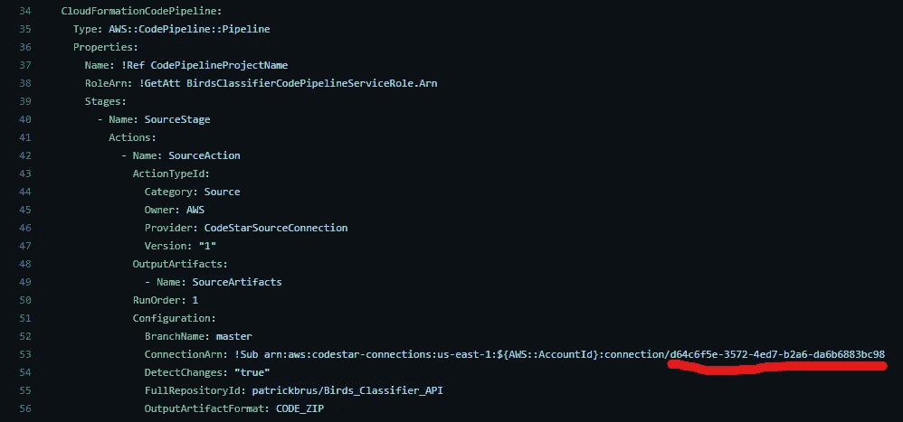
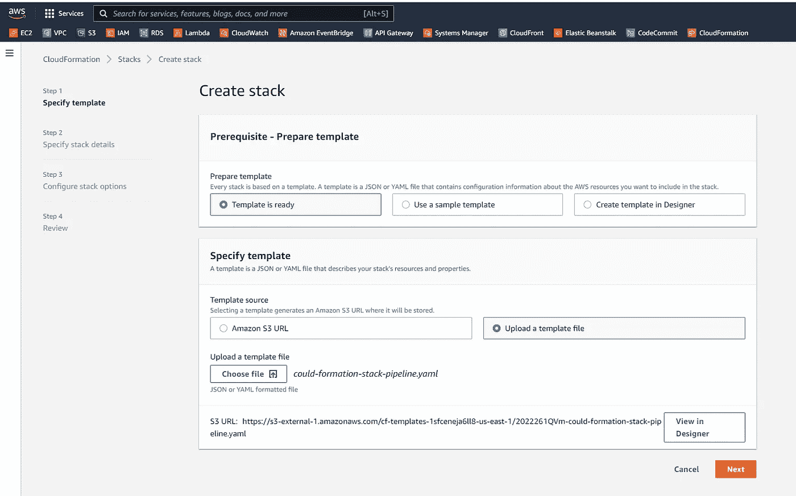

# MLOps:使用云将您的模型投入生产

> 原文：<https://towardsdatascience.com/continuous-model-deployment-using-aws-68d89c5448f1>

## 使用 AWS、S3 和 CloudFormation 将您的深度学习模型持续部署到云

照片由 [Fotis Fotopoulos](https://unsplash.com/@ffstop?utm_source=medium&utm_medium=referral) 在 [Unsplash](https://unsplash.com?utm_source=medium&utm_medium=referral) 上拍摄

# 介绍

MLOps 变得越来越重要。根据像[这样的文章，“87%的数据科学项目从未进入生产”。这令人担忧。这意味着，平均来说，100 个模型中只有 13 个能投入生产。剩下的 87 个只是丢失了。它们被卡在 Jupyter 笔记本的 Git 库的某个地方。那是一场灾难！然而另一方面，这也是一个机会。对于拥有将模型投入生产的必要技能的开发人员来说，这是一个机会，因为公司需要将模型投入生产的人来使用它们。因此，如果你对如何将模型投入生产感兴趣，请继续阅读！此外，您可以派生出我的](https://venturebeat.com/ai/why-do-87-of-data-science-projects-never-make-it-into-production/) [Github 库](https://github.com/patrickbrus/Birds_Classifier_API)并按照本文中的指南在您自己的 AWS 帐户中复制所有内容。这有助于更好地理解主题。

在我的[上一篇文章](/continuous-deployment-pipeline-using-github-actions-docker-and-aws-185bb3bf41b)中，我使用 Github Actions 和 Docker 开发了一个持续部署管道，将一个经过训练的模型部署到 AWS Elastic Beanstalk。在那篇文章中，我还使用 Git LFS(大文件存储)对我的模型和源代码进行了版本化。阅读本文，了解 Docker 容器是如何创建的，以及如何在 AWS 中创建一个弹性 Beanstalk 应用程序并将 Docker 容器部署到其中。

在本文中，我想向您展示一个更优化的设置，它只利用 AWS 服务。该模型现在被版本化并存储在 AWS S3 桶中，而不再存储在代码中。我为部署模型而创建的管道是使用 AWS CodePipeline 创建的。该模型最终仍然部署在 Elastic Beanstalk 上，但是这一次它首先部署在一个临时环境中，以便您或团队成员能够首先测试它。如果您或您的团队成员对新模型感到满意，可以给予批准，新模型将被部署到生产环境中。

在上一篇文章中，我还在 AWS 中手动创建了完整的基础设施，但这次我使用了 CloudFormation。CloudFormation 是 AWS 提供的一种以代码形式创建基础设施的服务。这样做的好处是，您的基础设施和您的代码都是版本化的，并且您总是可以通过一次点击来创建或删除所有服务，而不是手动创建或删除所有资源。你可以在这里阅读更多关于云形成的信息。

图 1:使用的 AWS 服务的概述(图片由作者提供)。

# 管道概述

让我们首先更深入地了解我创建的管道。图 2 显示了完整管道和所有单个步骤的概述。现在，我想更详细地解释这个流程中的每一步。

图 2:管道步骤概述(图片由作者提供)。

Gif 1:部署到暂存环境和手动批准步骤的演示(Gif 由作者提供)。

代码 AWS CodePipeline 的 YAML 代码(作者代码)。

## 克隆源存储库

克隆源存储库是管道中的第一步。这里的[源代码库](https://github.com/patrickbrus/Birds_Classifier_API)被克隆并打包成一个 zip 文件。然后，这个 zip 文件作为输入提供给管道的下一步。我还将这个阶段配置为在链接的源代码库中检测到更改时总是运行。通过这种方式，只要代码中发生了变化，管道就会立即运行，并且新的应用程序会始终部署到登台环境中。

克隆源代码库步骤利用了 AWS CodeStar 连接。这是 AWS 中配置从 AWS 到 Github 库的连接的一种新方法。我已经使用 AWS 控制台手动创建了这样一个连接。你可以按照[这个](https://docs.aws.amazon.com/dtconsole/latest/userguide/connections-create-github.html)指南来创建这样一个到你的 Github 库的连接。

## 借鉴 S3 模式，打造码头工人形象

既然我们已经将代码放在一个 zip 包中，那么是时候为应用程序的部署做准备了。第一步是从相应的 s3 存储桶中提取模型的当前最新版本。我创建了一个版本化的 s3 bucket，并将我的模型上传到其中。您可以在我的存储库[这里](https://github.com/patrickbrus/Birds_Classifier_API/blob/master/aws_infra_setup/create-and-upload-s3.sh)(代码 2)找到该步骤的 bash 脚本。您可以在已经设置好与 AWS 一起使用的 Linux 控制台中执行这个 bash 脚本。你可以按照[这个](https://docs.aws.amazon.com/cli/latest/userguide/getting-started-install.html)指南来配置你的控制台，以便能够连接到你的 AWS 账户。

代码 2: Bash 脚本，用于创建一个版本化的 S3 存储桶，然后将我训练好的模型上传到该存储桶(由作者编写代码)。

在我从 s3 中取出模型后，我想构建 Docker 映像，稍后也将在 AWS Elastic Beanstalk 上构建。这有助于确保仍然可以创建容器，并且最新的源代码版本可以正常工作，至少从基础设施的角度来看是这样。

这两个步骤(从 s3 提取和构建 Docker 映像)都在 AWS 代码构建步骤中执行。CodeBuild 是“一个全面管理的持续集成服务，它编译源代码，运行测试，并生成准备部署的软件包”([来源](https://aws.amazon.com/codebuild/))。CodeBuild 步骤也在存储在源代码存储库中的 yaml 文件中定义。您可以在[我的存储库](https://github.com/patrickbrus/Birds_Classifier_API/blob/master/aws_build_specs/buildspec_zip.yaml)中找到它，也可以在下面的代码片段中看到它(代码 3)。

代码 3:定义代码构建步骤的 YAML 代码(由作者编写代码)。

在 CodeBuild 步骤中，我首先从 s3 下载最新的模型( *pre_build 步骤*)，构建 Docker 映像以查看应用程序是否仍然可以创建( *build 步骤*)，最后，将所有内容打包到一个 zip 包中，以便这个 zip 包可以直接部署到 Elastic Beanstalk(*artifacts 部分*)。

然后，CodeBuild 步骤会引用创建的 buildspec。您可以在下面的 CloudFormation 模板中看到相应的 yaml 代码(代码 4)。

代码 4:代码构建步骤的 YAML 片段。这个 YAML 片段是 CloudFormation 模板的一部分(由作者编写代码)。

## 部署到弹性豆茎

既然我们现在仍然可以构建应用程序，并且我们已经有了所需的 zip 包，那么是时候将该应用程序部署到试运行环境中了。首先部署到一个临时环境是很重要的，这样在将一个损坏的应用程序部署到客户与您的应用程序交互的生产环境之前，可以首先测试新的应用程序。此外，不总是创建新的产品版本也是有意义的。也许您希望每月向生产环境发布一次新版本，但是您仍然希望总是在您的试运行环境中测试新创建的特性。

因此，我在部署到试运行环境之后和部署到生产环境之前添加了一个手动批准步骤。您或团队成员现在可以首先检查在试运行环境中启动并运行的应用程序，如果一切正常，他或她可以批准它开始部署到生产环境。当然，如果你有具体的发布时间表，也可以只在你的发布日期批准。我个人总是倾向于在将应用程序部署到生产环境之前进行手动操作，这样只有在需要部署的时候才会进行部署。这增加了一层额外的安全性，因为批准者确实知道在批准后现在部署到生产中(至少他或她应该知道)。

代码 5:Elastic Beanstalk staging and production environment 的 YAML 片段。它还包含每个环境的配置，如 EC2 实例类型。这个 YAML 片段是 CloudFormation 模板的一部分(由作者编写代码)。

# 在 AWS 中安装管道

好吧。现在您已经看到了管道的作用。现在让我们在 AWS 中安装这个管道。正如我之前提到的，我使用 CloudFormation 创建了管道，使所有东西都可以作为代码使用。这有助于将管道和我的源代码一起版本化，并方便地安装或卸载所有需要的服务。否则，用户必须自己安装所有的服务，这可能会占用大量时间，并且也是一个容易出错的过程。你可以在我的源代码库[这里](https://github.com/patrickbrus/Birds_Classifier_API/blob/master/aws_cloud_formation/could-formation-stack-pipeline.yaml)找到 CloudFormation yaml 文件。

我真的建议您按照下面的步骤来更好地了解管道。只需将 my source 存储库分支并克隆到您的本地机器上。然后，您可以运行接下来的步骤，首先创建一个 s3 bucket 并将模型上传到该 s3 bucket，然后使用相应的 yaml 文件安装 CloudFormation 堆栈。

让我们现在开始吧！

**步骤 1:将存储库克隆到您的本地机器上**

首先将存储库克隆到您的本地机器上。您还必须运行 git lfs pull 来获取训练好的模型，因为这是使用 git lfs 上传的。

**步骤 2:创建 s3 存储桶并上传模型**

打开命令行运行 create-and-upload-s3.sh bash 文件。如果你在 Windows 机器上运行它，你可以安装 [Git Bash](https://git-scm.com/downloads) 来在你的 Windows 机器上运行 Bash 文件。

在打开的命令行中，导航到 *aws_infra_setup* 文件夹并运行 bash create-and-upload-s3.sh 来创建 s3 bucket 并将模型从 Git 存储库上传到创建的 bucket。

图 3:运行 bash 脚本来创建 s3 bucket 并将训练好的模型上传到其中(图片由作者提供)。

**步骤 3:创建到 Github 的连接，并修改 CloudFormation 模板来使用这个连接**

为了在管道中克隆源存储库，需要有一个被授权克隆源存储库的连接。为此，你可以遵循[这个](https://docs.aws.amazon.com/dtconsole/latest/userguide/connections-create-github.html)指南来创建这样的连接。

然后，您可以导航到这个连接并复制该连接的 UID(图 4 ),并用您的 UID 替换我的 UID (CloudFormation 模板 yaml 第 53 行)。

图 4:查找 Github 连接的 UID，然后可以将其添加到 CloudFormation 模板 yaml 文件中(图片由作者提供)。

图 5:需要添加 Github 连接 UID 的 CloudFormation 的代码片段(图片由作者提供)。

**步骤 4:创建云形成堆栈**

转到您的 AWS web 控制台。在搜索栏中，搜索“ *CloudFormation* ”。然后点击“*创建堆栈*”。应该会打开一个新 UI，让您配置您的 CloudFormation 堆栈。在“*模板准备好了*处保留第一个选项，并在“*指定模板*部分下选择“*上传模板文件*”。然后，您可以点击“*选择文件*，并选择位于“ *aws_cloud_formation* ”文件夹中的 CloudFormation 模板文件(cloud-formation-stack-pipeline . YAML)。

图 6:在 AWS web 控制台中创建 CloudFormation 堆栈的配置截图(图片由作者提供)。

然后你可以点击*下一个*。为您的堆栈输入一个名称(即 birds-classifier-cicd-stack)，然后再次点击“*Next”*。您可以将下一页中的所有设置保留为默认值。再次点击*下一个*。在最后一页，您必须向下滚动到底部并勾选复选框，以确认 AWS CloudFormation 可能会创建 IAM 资源。这是必需的，因为 Pipeline、CodeBuild 和 Elastic Beanstalk 都有自己的 IAM 角色。

最后你可以点击*创建堆栈*。CloudFormation 现在应该为您创建所有的资源和服务。一切创建完成后，您可以在搜索栏中搜索“ *CodePipeline* ，点击名为“ *birds-classifier-cicd* 的管道。该管道应该已经运行。第一次运行时会失败，因为弹性 Beanstalk 环境在启动并运行之前需要更多的时间。但是一旦弹性 Beanstalk 环境准备就绪，就应该重试部署阶段。然后，您可以转到试运行环境，检查应用程序并批准部署到生产环境(参见上面的 c.f. Gif 1)。

# 结论

我们现在已经为您训练的 ML 模型创建了一个专业的自动化部署。现在发布新的型号真的很容易，你的型号现在是 13%的产品中的一部分，而不是 87%的产品中的一部分。恭喜你！

谢谢你把我的文章看完！我希望你喜欢这篇文章和我参与的项目。如果你想在未来阅读更多类似的文章，请关注我，保持更新。

# 接触

[**LinkedIn**](https://www.linkedin.com/in/patrick-brus/)|**[**Github**](https://github.com/patrickbrus)**