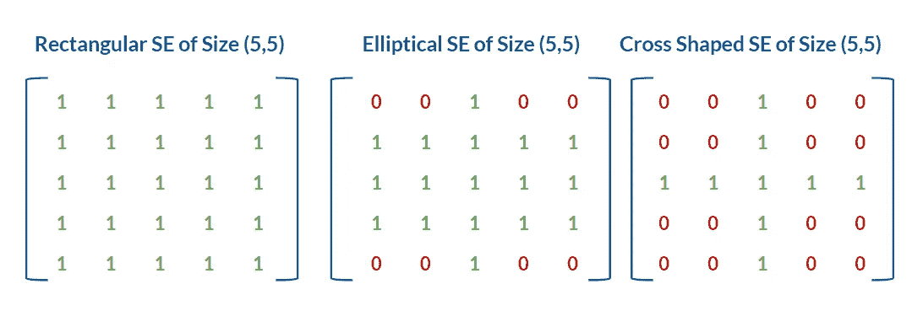
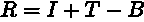
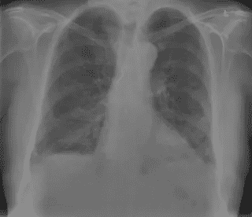
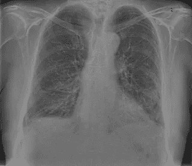
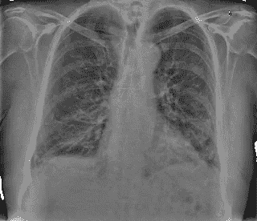
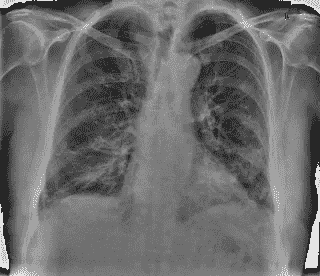

# 基于形态学算子的灰度图像对比度增强

> 原文：<https://towardsdatascience.com/contrast-enhancement-of-grayscale-images-using-morphological-operators-de6d483545a1>

# 基于形态学算子的灰度图像对比度增强

## 利用 OpenCV 中的形态学算子增强灰度图像对比度的简单方法


米拉德·穆阿菲在 [Unsplash](https://unsplash.com?utm_source=medium&utm_medium=referral) 上的照片

# 介绍

对比度增强是一种非常常见的图像处理技术，用于增强低对比度图像中的特征。几种方法如*对比度拉伸*、*直方图均衡*、*自适应直方图均衡*、*对比度受限自适应直方图均衡*或 *CLAHE* 等。已经被用于增强图像的对比度。在本文中，我们将研究另一种对比度增强的方法，这种方法是使用形态学变换的组合来实现的。

# 什么是形态变换或运算符？

形态变换或形态运算符是简单的图像变换，通常应用于二值图像，但也可以应用于灰度图像。形态变换有各种类型，如*侵蚀*、*扩张*、*张开*、*闭合*、*渐变*、*礼帽*和*黑帽*。这些变换的两个主要部分是输入图像和被称为**结构化元素(SE)** 的内核。在我们详细讨论不同类型的形态变换之前，让我们先了解一下结构元素。

## 什么是结构元素？

**结构元素(SE)** 是在执行形态学操作时检查的每个像素周围的邻域。结构化元素可以有不同的形状和大小，改变它会显著影响转换的性能。

OpenCV 提供的结构化元素有三种形状——*长方形*、*椭圆形*和*十字形*。下图显示了这三种形状。



大小为 5 x 5 的结构元素的不同形状(图片由作者提供)

## 形态运算符的类型

不同类型的形态运算符有:

1.  ***侵蚀—*** 根据 OpenCV 文档，侵蚀算子的工作原理类似于土壤侵蚀。它“侵蚀”，或者更简单地说，去除图像中前景对象的边界。前景对象边界处的像素被移除。它会缩小图像中对象的大小。
2.  ***膨胀—*** 膨胀的作用与侵蚀完全相反。它“扩大”或扩展前景对象的边界，从而增加图像中对象的大小。如果我们想要连接前景物体的破碎部分，这是很有用的。
3.  ***开启—*** 开启操作用于去噪。首先应用腐蚀操作，然后是膨胀操作。腐蚀操作首先从图像中移除所有小的噪声区域，然后应用膨胀来恢复对象的原始大小。
4.  ***关闭—*** 关闭是打开的反义词，意思是先膨胀后腐蚀。这对于连接或填充前景对象中出现的小点很有用，同时保持对象的大小。
5.  ***梯度—*** 形态学从膨胀结果中减去腐蚀结果，得到图像的梯度。渐变操作的结果是图像中前景对象的轮廓。
6.  ***高帽/白帽—*** 高帽变换，也称为*白帽变换*，是通过从原始图像中去除或减去图像的开口得到的。这个操作符给出了图像中比结构元素小的明亮特征。
7.  ***黑帽/底帽—*** 黑帽变换，也称为*底帽变换*，是通过从原始图像中去除或减去图像的闭合而得到的。这个操作符给出了图像中比结构元素小的暗特征。

> **注意:**礼帽和黑帽变换更适合灰度图像。

## 形态变换如何帮助对比度增强？

简而言之，对比度增强需要做到以下几点:

1.  使得图像中的亮区域更亮。
2.  使得图像中的暗区域更暗。

如前所述，顶帽变换的结果是由输入图像中所有亮特征组成的图像，黑帽变换的结果是由输入图像中所有暗特征组成的图像。因此，为了增强对比度，我们需要输入图像的 Top 和 Black Hat 变换。

在获得输入图像的顶帽和黑帽变换之后，我们将**向输入图像添加**顶帽变换，以使其亮区域更亮，并且**从输入图像中减去**黑帽变换，以使其暗区域更暗。

上述步骤可以表示为如下所示的等式:



对比度增强方程

其中 *R* 为结果图像， *I* 为输入图像， *T* 和 *B* 分别为顶帽和黑帽变换。

下面的流程图描述了增强对比度的步骤。


使用形态学变换增强对比度的步骤(图片由作者提供)

# 密码

我们将使用 Python 和 OpenCV 实现这种对比度增强技术。我们需要首先使用 pip 安装`opencv-python`。

```
pip install opencv-python
```

安装 OpenCV 后，我们将在代码中导入库。

```
import cv2 as cv
```

我们将使用下面的图片作为我们的代码，它来自 GitHub 上的[新冠肺炎图片库。](https://github.com/ml-workgroup/covid-19-image-repository)

> 本库中的图像数据收集自德国汉诺威汉诺威医学院诊断和介入放射学研究所，并根据知识共享署名 3.0 未经许可获得许可。



输入图像

我将图像缩小了 50%,以减小图像的尺寸。

为了读取这个图像，我们将使用 OpenCV 的`imread`函数。

```
filename = # path to the image file
img = cv.imread(filename,0)
```

现在我们有了我们的图像，我们将获得这个图像的顶部和黑帽变换。在此之前，我们需要构建我们的结构化元素或内核。为此，我们可以使用 OpenCV 提供的`getStructuringElement`函数。

```
kernel = cv.getStructuringElement(cv.MORPH_ELLIPSE,(5,5))
```

在上面的代码片段中，我们构建了一个大小为(5，5)的椭圆结构元素。您可以通过更改这些参数进行实验，并观察对输出的影响。

下一步是使用我们在上一步中构建的内核来获得输入图像的变换。

```
# Top Hat Transform
topHat = cv.morphologyEx(img, cv.MORPH_TOPHAT, kernel)# Black Hat Transform
blackHat = cv.morphologyEx(img, cv.MORPH_BLACKHAT, kernel)
```

一旦我们有了变换，我们将应用之前看到的方程。

```
res = img + topHat - blackHat
```



大小为(5，5)的椭圆形内核的输出图像

我们可以看到输入图像的对比度有所提高。一些在输入图像中不突出的微小特征现在是可见的。然而，如果没有仔细选择结构化元素，这种技术也会给图像增加一些噪声。

例如，下图显示了选择大小为(15，15)的椭圆形结构元素时的输出。肺部和骨骼边缘的微小特征现在比早期输出更加突出和清晰，但我们可以在输出图像中看到一些靠近身体边界的噪声区域，即背景中的白色斑块。



输出图像，用于大小为(15，15)的椭圆形内核

随着你继续增加结构元素的尺寸，前景特征将变得更加突出，但是背景将开始变得越来越嘈杂。具有大小为(35，35)的结构化元素的输出在背景中有更多的噪声区域。



输出图像，用于大小为(35，35)的椭圆形内核

# 结论

因此，我们看到了如何使用礼帽和黑帽形态学操作的组合来增强灰度图像的对比度。如上所示，一些微小的特征得到了极大的增强，在我们的输出图像中变得更加突出。

## 要记住的要点

1.  这种方法可能不如原始的对比度拉伸方法有效，因为它在图像中引入了噪声，因为我们继续增加结构元素的大小。
2.  因为结构化元素基本上是应用变换时要考虑的邻域的大小，所以输出也将取决于输入图像的大小。例如，与 250×250 图像的(35，35)核相比，1000×1000 大小的图像的(35，35)核将形成更小的区域。因此，调整图像大小也会影响此方法的输出。
3.  由于 Top 和 Black Hat 变换分别为我们提供了比结构化元素小的更亮和更暗的特征，**，**如果要增强的特征的大小小于我们选择的结构化元素的大小，这种对比度增强方法将会很好地工作。因此，精确地增强较大特征的对比度变得困难，因为我们的内核的较大尺寸将在我们的图像背景中引入较大的噪声区域。

感谢您的阅读！:)如果你有任何问题，可以在 [LinkedIn](https://www.linkedin.com/in/shivaneej/) 上联系我。

# 参考

1.  OpenCV:形态学变换[https://docs . OpenCV . org/3.4/d9/d61/tutorial _ py _ morphology _ ops . html](https://docs.opencv.org/3.4/d9/d61/tutorial_py_morphological_ops.html)
2.  Kushol R，Nishat R. M .，Rahman A. B. M. A .，Salekin M. M .，“使用具有最佳结构元素形态学算子的医学 X 射线图像的对比度增强”，arXiv:1905.08545v1 [cs .2019 年 5 月 27 日
3.  辛瑞希·b·温瑟，汉斯·拉塞尔，斯维特拉娜·格贝尔，萨宾·k·马斯克，简·b·辛瑞希斯，延斯·沃格尔-克劳森，弗兰克·k·瓦克，马里乌斯·m·霍普，伯恩哈德·c·迈耶，“新冠肺炎图像储存库”，DOI:10.6084/M9 . fig share . 12676786