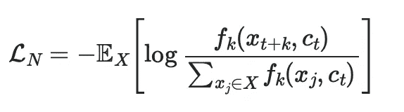
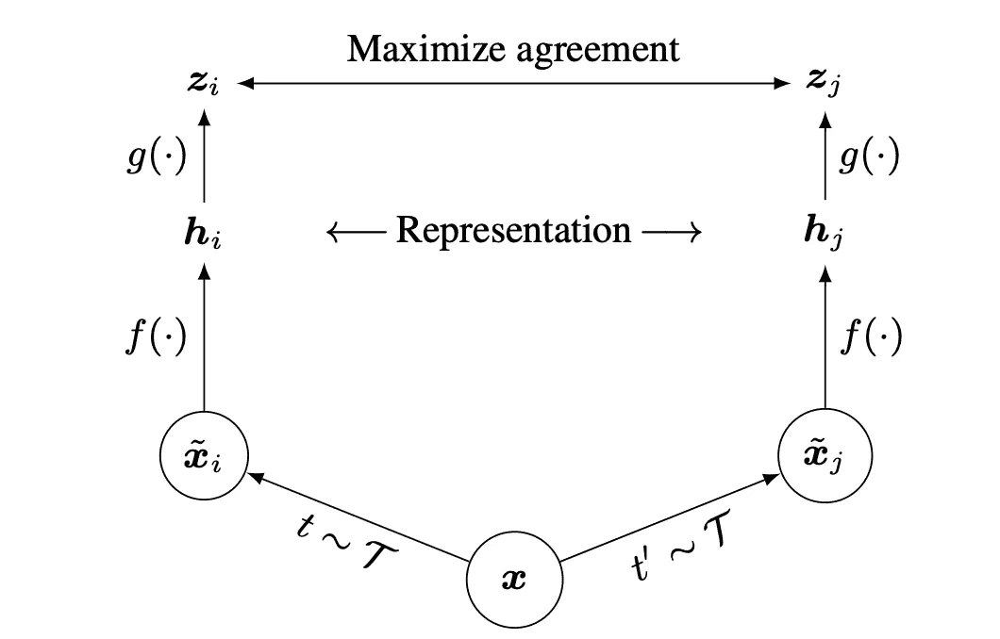
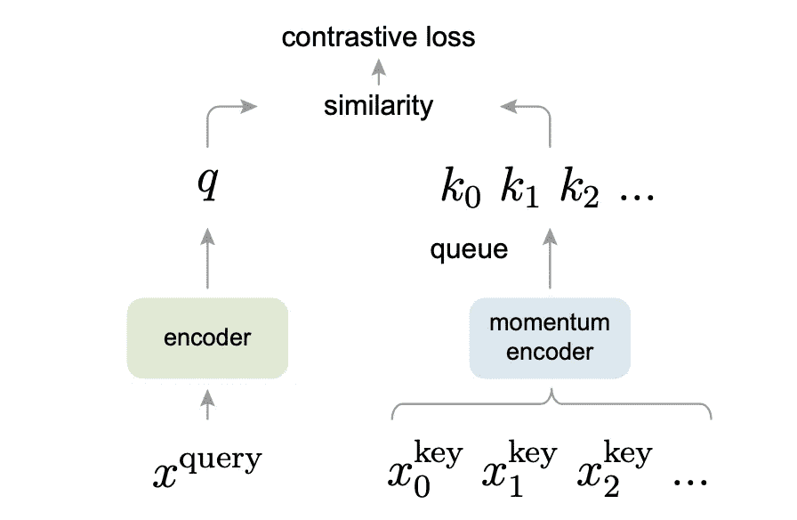
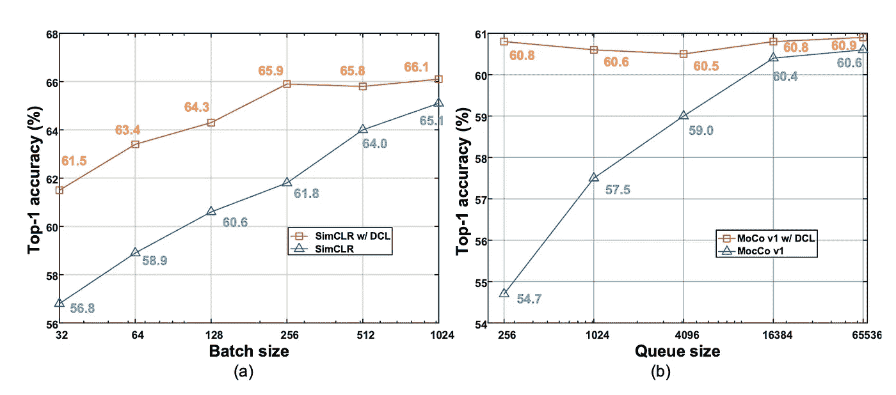

# 3 分钟对比学习

> 原文：<https://towardsdatascience.com/contrastive-learning-in-3-minutes-89d9a7db5a28>

## 自我监督任务中对比学习的指数级进展

深度学习研究已经转向图像识别任务的监督领域，许多人现在已经转向一个更未探索的领域:通过[自我监督学习](/supervised-semi-supervised-unsupervised-and-self-supervised-learning-7fa79aa9247c)的方式执行相同的任务。导致这项看似不可能的任务取得巨大进步的基石之一是对比学习损失的引入。这篇文章深入探讨了最近提出的一些对比损失，这些损失将无监督学习的结果推到了与监督学习类似的高度。

# 信息损失

Oord 等人提出的最早的对比学习损失之一是信息损失。他们在论文[中提出了以下损失:](https://paperswithcode.com/paper/representation-learning-with-contrastive)

其中分子实质上是正对的输出，分母是正对和负对的所有值之和。最终，这种简单的损失迫使正对具有更大的值(将对数项推至 1，从而小于 0 ),负对相距更远。

# SimCLR

图一。SimCLR 概述。从[https://arxiv.org/abs/2002.05709](https://arxiv.org/abs/2002.05709)检索的图像。

SimCLR 是第一篇建议通过图像增强将对比损失用于自监督图像识别学习的论文。

通过对同一幅图像进行数据扩充来生成正对，反之亦然，我们可以允许模型学习特征来区分图像，而无需明确提供任何基本事实。

# 动量对比(MoCo)

图二。MoCo 概述。从 https://arxiv.org/abs/1911.05722[取回的图片](https://arxiv.org/abs/1911.05722)。

先前的信息损失是基于一个正的和一些负的小批量提出的。何等人扩展了这一概念，将对比学习描述为类似于将最佳键与给定队列匹配的学习。直觉导致了动量对比(MoCo)的基础，它本质上是一个键和值的字典/内存网络，键存储在多个批次中，并以类似队列的方式慢慢地消除最老的批次。这允许训练更加稳定，因为它类似于音调变化不太剧烈的动量。

# 去耦对比学习

图 3。用 DCL 交换信息对的改进。图片来自 https://arxiv.org/abs/2110.06848。

以前的对比学习论文要么需要大批量，要么需要动量机制。最近的论文去耦对比学习(DCL)希望通过对原始信息损失进行简单的改变来改变这一点:简单地从分母中去除正对。

虽然看起来简单，但 DCL 实际上允许更好的收敛，并最终形成了比以前的论文 SimCLR 和 MoCo 更好的基线。

# 测试每个概念

上述论文的代码已由作者提供。为了测试这些概念，人们可以简单地下载不同的数据集，看看无监督学习方法的效果如何。

需要注意的是，这些任务通常需要您自己的数据加载器，而不是使用 PyTorch 提供的数据加载器。一个可以检索 ImageNet、CIFAR100 和其他著名图像数据集的地方是这里的。

# 结束注释

现在你知道了！一篇关于对比学习论文在图像识别的无监督学习中的最新进展的短文。本文仅涵盖了这一范围内的部分工作。许多伟大的论文如 [NNCLR](https://arxiv.org/abs/2104.14548) 和 [MoCo v2](https://arxiv.org/abs/2003.04297) 也值得一读。希望你在理解这些优雅而有效的概念时感到有趣！

*感谢你坚持到现在*🙏*！* *我会在计算机视觉/深度学习的不同领域发布更多内容，所以* [*加入并订阅*](https://taying-cheng.medium.com/membership) *如果你有兴趣了解更多！*