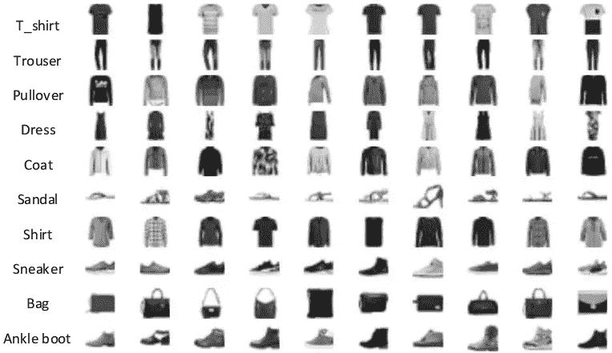
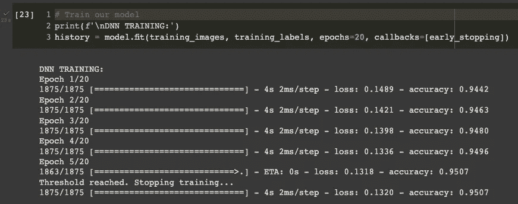

# TensorFlow 中的早期停止-防止神经网络的过度拟合

> 原文：<https://towardsdatascience.com/control-the-training-of-your-neural-network-in-tensorflow-with-callbacks-ba2cc0c2fbe8>

## *如何使用回拨在适当的表现下停止训练*

[尔万·赫斯里](https://unsplash.com/@erwanhesry?utm_source=unsplash&utm_medium=referral&utm_content=creditCopyText)在 [Unsplash](https://unsplash.com/s/visual/4194f627-27ac-44d3-85cd-3e347fc2e5c9?utm_source=unsplash&utm_medium=referral&utm_content=creditCopyText) 上拍照

在本文中，我将解释如何通过使用回调来控制 Tensorflow 中神经网络的训练。**回调是在过程**中反复调用的功能(例如神经网络的训练)，通常用于验证或纠正某些行为。

在机器学习中，我们可以使用回调来定义在训练时期之前、期间或结束时发生的事情。这对于记录性能或在我们的性能指标达到某个阈值时停止训练特别有用。这种机制称为**提前停止**。

例如，如果您设置了 1000 个历元，并且在 200 个历元时已经达到了期望的精度，那么训练将自动停止，**避免您可能过度拟合您的模型。**让我们看看这是如何在 Tensorflow 和 Python 中实现的。

让我们通过从 Tensorflow 导入 *fashion_mnist* 数据集来打好基础。我们将使用这个数据集来解释回调是如何工作的。

这是我们的数据集的样子

来源:[https://www . research gate . net/figure/Sample-images-from-Fashion-MNIST-dataset _ fig 8 _ 356111457](https://www.researchgate.net/figure/Sample-images-from-Fashion-MNIST-dataset_fig8_356111457)

# 早期停课班

第二步是创建专门用于提前停止的类。我们将创建一个继承自`tf.keras.callbacks.Callback`的类，并允许我们在达到 95%的准确率时停止训练。如果通过查看 Tensorflow 模型提供的日志来满足条件，回调将使用 *on_epoch_end* 函数来停止训练。

这里，我们访问继承自`tf.keras.callbacks.Callback`的 *on_epoch_end* 方法，并通过对导致训练停止的条件进行编码来覆盖其行为。

让我们继续实现我们的张量流模型。

# 深度神经网络分类任务

我们将使用一个多层神经网络来对数据集中的衣物进行分类。最好的方法是使用卷积神经网络，但是对于这个例子，深度神经网络也可以。

我们现在准备训练模型。要使用回调，只需将对象放入要提供给模型的`fit()` 方法中的回调参数的列表中。

训练停止，因为我们已经达到 95%的准确率。图片作者。

下面是如何设置回调来控制一个神经网络的训练！希望你今天学到了新东西👍

保持坚强，度过艰难时刻。这是值得的。干杯！

# 代码模板