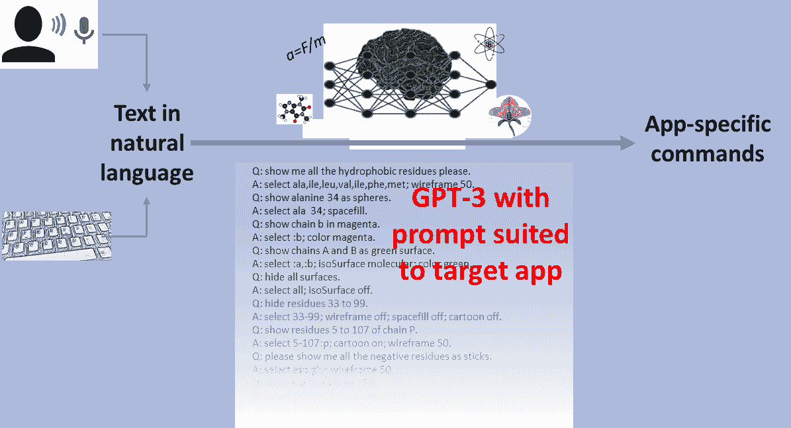
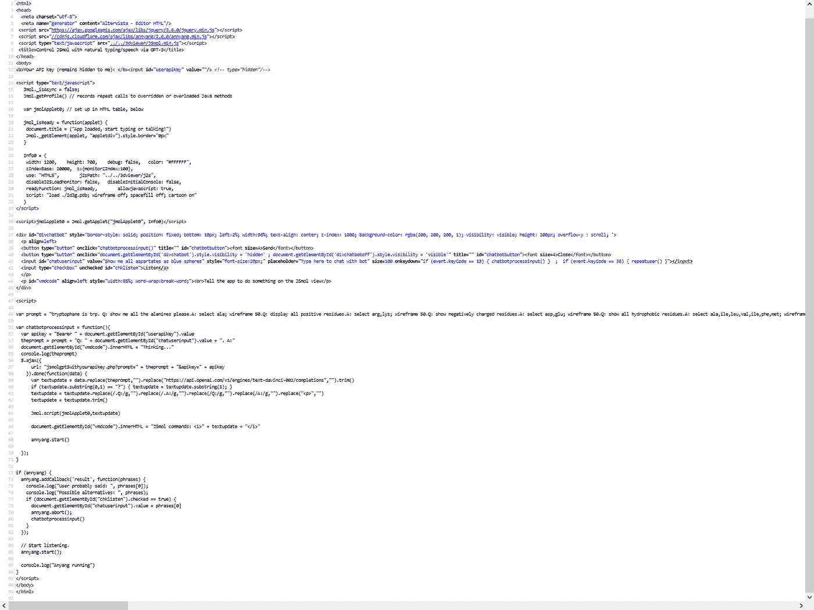

# 通过自然语言控制网络应用程序，使用 GPT 3 将语音转换为命令

> 原文：<https://towardsdatascience.com/control-web-apps-via-natural-language-by-casting-speech-to-commands-with-gpt-3-113177f4eab1>

## 最后一篇文章展示了 GPT3 的实际应用，对工作流程和源代码细节进行了完整的解释。

自从 OpenAI 发布了 GPT3 并给出了一些 [**免费积分**](https://medium.com/geekculture/as-of-september-2022-using-openais-gpt-3-will-be-2-3-times-cheaper-6282387041) **进行试用以来，我一直在发表文章:( I)探索它的潜力和局限性，强调它实际上“知道”多少，以及(ii)展示如何实际制作使用它的应用程序，尤其是侧重于客户端 web 应用程序。我评价了 GPT3 关于自然** [**科学**](/devising-tests-to-measure-gpt-3s-knowledge-of-the-basic-sciences-4bbfcde8286b) **与一些** [**积极**](/gpt-3-like-models-with-extended-training-could-be-the-future-24-7-tutors-for-biology-students-904d2ae7986a) [**与**](/a-note-on-gpt-3-and-its-obviously-null-thinking-capabilities-de84a26ac0f3) [**消极的发现**](/testing-gpt-3-on-elementary-physics-unveils-some-important-problems-9d2a2e120280) **，我展示了如何做出一个** [**非常聪明的聊天机器人出来**](/custom-informed-gpt-3-models-for-your-website-with-very-simple-code-47134b25620b) **我展示了** [**如何将它与语音识别和合成**](/coupling-gpt-3-with-speech-recognition-and-synthesis-to-achieve-a-fully-talking-chatbot-that-runs-abfcb7bf580) **结合起来，以制作一个非常智能的机器人，你可以** [**自然地与之对话**](https://medium.com/geekculture/naturally-talking-with-a-chatbot-that-you-can-try-out-online-too-2dc1e48f415c) **。 这些和其他例子证明了 GPT3 所提供的巨大能力，也强调了将它集成到 web 应用程序中是多么容易。我认为这将是该系列的最后一篇文章，至少就目前而言，演示最后一个应用:使用 GPT-3 将自然语言中的命令转换为特定于应用程序的命令，然后您可以使用这些命令来控制这些应用程序。**

# 从自然语言到定义的命令

你可能听说过 GitHub Copilot 和类似的人工智能工具，它们根据人类的提示创建代码。这些工具基于神经网络，如 GPT-3 本身，即训练输出与输入一致的文本。例如，GitHub Copilot 本身由 [OpenAI Codex](https://en.wikipedia.org/wiki/OpenAI_Codex) 驱动，这是 GPT-3 本身的修改版本。

在自动代码编写工具中，用户以注释的形式编写提示，然后由 AI 模块处理，输出一段有希望执行所需任务的代码([示例](https://github.com/features/copilot))。该工具可以做到这一点，因为它是在数十亿行包含注释的代码上训练出来的。

如果我们想要控制一个有命令行的应用程序，我们在这里需要的基本上是一样的:我们必须阅读(或听到和语音识别)自然语言中的命令，然后生成可以发送到应用程序命令行的代码:

总体布局:自然语言的文本通过键盘输入或从语音中识别，然后通过 GPT-3 进行处理，预先提示一系列自然语言命令对，调整到一个人想要控制的目标应用程序。输出很可能由可以直接应用于目标应用程序的命令组成。作者根据自己的图画和照片组成的图形。

在这里，我将向您展示如何实际实现这个方案，作为控制一个非常特殊的应用程序的方法:JSmol，一个用于网页内分子可视化的 JavaScript 库。您可以在此视频和 twit 中看到运行的示例，其中以自然语言输入或说出的请求被转换为 JSmol 命令并应用于可视化:

如果您现在想亲自尝试一下这个例子，请点击这里:

  

【T4**http://lucianoabriata . alter vista . org/tests/GPT-3/jsmol-gp T3-speech rec-speech synth . html**

(你需要一把 GPT-3 的开启钥匙，见[这里](https://beta.openai.com/account/api-keys)。)

# 除了酷之外还有什么用？

我认为这种技术至少有三个明显的好处:

*   最重要的是，它允许用户像 JSmol 的脚本语言允许的那样精细地控制应用程序，但不需要了解它。事实上，在我实验室一位同事的要求下，我写了这个例子。他曾经指出(我也同意),有太多的程序在做类似的事情，都有自己的命令和脚本语言，很难记住它们。
*   即使你知道这些命令，但没有正确输入，或者如果语音识别引擎失败，GPT-3 会纠正错误，因为它试图产生 JSmol 一致的命令。
*   正如我在视频中举例说明的那样，你甚至不需要输入英语的自然语言命令，因为 GPT-3 会“内部翻译”你的输入，将它从任何语言直接转换成 JSmol 的语言。

另外，特别是这个例子是基于网络的，正如我一直强调的，通过完全在网页内工作，你可以在你的笔记本电脑、平板电脑或电脑上运行这个相同的工具，只需将你的网络浏览器指向网页的 URL。(顺便说一句，我再次向你推荐这个免费的托管服务，它包括 JS 和 PHP 支持，因为你需要在 web 应用中使用 GPT-3)。

# 从开发人员的角度看三个关键点，并深入研究代码

在我们了解这个应用程序如何工作之前，关于 JSmol 作为我们要控制的示例目标应用程序，有三个要点，对于其他应用程序，您必须考虑:

*   JSmol 支持通过脚本语言传递命令，这是简化由 GPT3 产生的命令的执行的关键。
*   互联网上充斥着关于 JSmol 脚本语言的教程和例子，所以 GPT-3 很可能在培训中见过很多。
*   即使考虑到上述情况，我们也必须为 GPT-3 提供一个清晰的提示，包括少量学习，以便它“理解”我们希望它的输出中包含类似 JSmol 的命令。

## 通用工作流程+将自然语言转换为命令

如第一个图中所总结的，工作流的核心是将键入的或从语音中识别的自然语言文本输入到 GPT-3 提示符中，该提示符包含一系列针对用户想要控制的目标应用而调整的自然语言命令对。更详细地说，开始提示包括反映完成自然语言请求(问题)中指示的任务需要什么命令(答案)的成对“问题-答案”句子，并且用户要求的实际请求以问题的形式被附加到提示上。

我上面所说的“问题”和“答案”也可以被认为是自动化代码编写者精神中的“注释”和“代码”。GPT-3 并不在乎我们叫它们什么，甚至不在乎我们如何编码它们，只要我们尊重它们的格式。对于 JSmol 示例，正如您在视频中看到的那样，我使用“Q:”作为自然语言输入，使用“A:”作为 app 命令输出。

因此，给定这段简短的提示(实际的提示更长):

> 请给我看所有的疏水残基。
> A:选择 ala、ile、leu、val、ile、phe、met 线框 50。
> 问:显示丙氨酸 34 为球体。
> 答:选择 ala 34 空格填充。
> 问:用洋红色显示链 b。
> A:选择:b；洋红色。
> 问:将链 A 和 B 显示为绿色表面。
> A:选择:A，:b；等值面分子；颜色绿色。隐藏所有的表面。
> 答:全选；等值面关闭。
> 问:隐藏残基 33 至 99。
> 答:选择 33–99；线框关闭；空格填充关闭；卡通关闭。
> 问:显示 p 链的 5-107 位残基
> A:选择 5–107:p；卡通开启；线框 50。
> 问:请把所有的阴性残基当棒子给我看。
> 答:选择 asp、glu 线框 50。
> 问:给我看看谷氨酰胺 154。
> A:选择 gln 和 154；线框 50。

当用户发出请求时，如“*请将所有阳性残基显示为蓝色棒*”，这将添加到提示的末尾，如下所示:

> 问:请用蓝棒显示所有阳性残留物
> A:

然后，GPT-3 将得到一个 JSmol-consistent 命令，它必须从最后一个“A:”开始扩展文本。通过删除“A:”之前的输入，剩下的命令必须发送给 JSmol。

一个看似显而易见但鉴于我得到的一些评论值得澄清的注意事项。当然，GPT 3 号什么都不懂；这只是一个基于数十亿训练令牌连接的统计模型，由我们的提示调整，这(希望)导致它产生正确的命令。上面段落中的“希望”是指不能完全保证输出就是您需要 JSmol 执行的命令。甚至可能不是命令，会让 JSmol 失败。也就是说，产生的命令的质量和准确性取决于 GPT-3 的训练，我们可以通过微调程序来提高，特别是在提示符中提供的少量学习。你可以在[http://Lucia noabriata . alter vista . org/tests/GPT-3/jsmol-gp T3-speech rec-speech synth . html](http://lucianoabriata.altervista.org/tests/gpt-3/jsmol-gpt3-speechrec-speechsynth.html)查看这个完全相同的示例网页的源代码来查看完整的提示

## 完整的源代码，从语音识别到 GPT-3 处理和命令执行

我的示例页面的源代码(上面的链接，您可以在大多数浏览器中使用 CTRL+U 看到它)是不模糊的，并在关键行进行了注释，准备好供您全面检查。但是让我在这里补充一些解释:

此处讨论的应用程序的源代码，可从[http://lucianabriata . alter vista . org/tests/GPT-3/jsmol-gp T3-speech rec-speech synth . html](http://lucianoabriata.altervista.org/tests/gpt-3/jsmol-gpt3-speechrec-speechsynth.html)获得

**库、基本 HTML 和控件布局**

第一组代码加载了三个库:Jquery，用于简化对 GPT-3 API 的异步调用，正如我在前面的例子中所展示的 Annyang，用于简化语音识别，也如前面所展示的 JSmol，它是用于分子可视化的 JavaScript 库。

从第 14 行开始的*脚本*标记只配置 JSmol 可视化，然后在第 35 行插入 HTML。

第 37 到 45 行设置了一个 *div* ，其中包含一系列按钮、复选框和段落，用户可以在其中与机器人进行交互(我说“机器人”是因为我喜欢把这个应用程序想象成“操作 JSmol 的机器人”)。在这些控件中，文本框允许用户键入文本，复选框控制语音识别是否激活(当激活时，识别的文本被发送到文本框)，第 44 行的段落将显示由 GPT-3 转换并发送到 JSmol 应用程序的命令。

**GPT-3 的 JavaScript 代码**

从第 51 行开始，我们定义了用 GPT-3 处理自然语言输入文本的函数。在获得用户提供的 API 键之后，应用程序将其输入附加到核心提示中(第 53 行，注意我们添加了“Q:”和“A:”两个词)。通过对 GPT-3 的异步调用(第 56 行),我们最终获得了一大块**数据**(第 58 行),其中包括我们的完整提示(即核心提示加上新问题),这些提示是用 GPT-3 提出的 JSmol 命令扩展的。

第 59 行到第 63 行清理了 GPT-3 在**数据**中返回的文本，删除了 URL、Qs 和 as，以及开始提示符，以便在我称为 **textupdate** 的变量中，以干净的形式为 JSmol 准备好生成的命令。

第 64 行将命令发送给 JSmol，第 66 行将它们显示在屏幕上。

在这个函数的最后，第 68 行启动了 Annyang 的语音识别，正如我们接下来将看到的，当 GPT-3 处理命令时，它是关闭的。

**用于语音识别的 JavaScript 代码**

第 73 行打开了一个在页面加载时只调用一次的函数。这个函数在 Annyang ( **resul** t)中设置了一个回调函数，告诉它在听到并识别出一个短语时该做什么。在记录它听到的内容(第 75 行和第 76 行)之后，如果应用语音命令的复选框打开(第 77 行)，该函数显示识别的文本(第 78 行)并调用(第 80 行)在输入上应用 GPT-3 的函数，所有这些都在上面解释过(并在代码的第 51 行中定义)。请注意，在调用 GPT 函数之前，我们也关闭了 Annyang(第 79 行)，这样它将停止识别语音，直到它再次被激活(第 68 行)。

# 一些你可能会喜欢的关于 GPT-3 的文章

        

www.lucianoabriata.com*[***我写作并拍摄我广泛兴趣范围内的一切事物:自然、科学、技术、编程等等。***](https://www.lucianoabriata.com/) **[***成为媒介会员***](https://lucianosphere.medium.com/membership) *访问其所有故事(我免费获得小额收入的平台的附属链接)和* [***订阅获取我的新故事***](https://lucianosphere.medium.com/subscribe) ***通过电子邮件*** *。到* ***咨询关于小职位*** *查看我的* [***服务页面这里***](https://lucianoabriata.altervista.org/services/index.html) *。你可以* [***这里联系我***](https://lucianoabriata.altervista.org/office/contact.html) ***。******