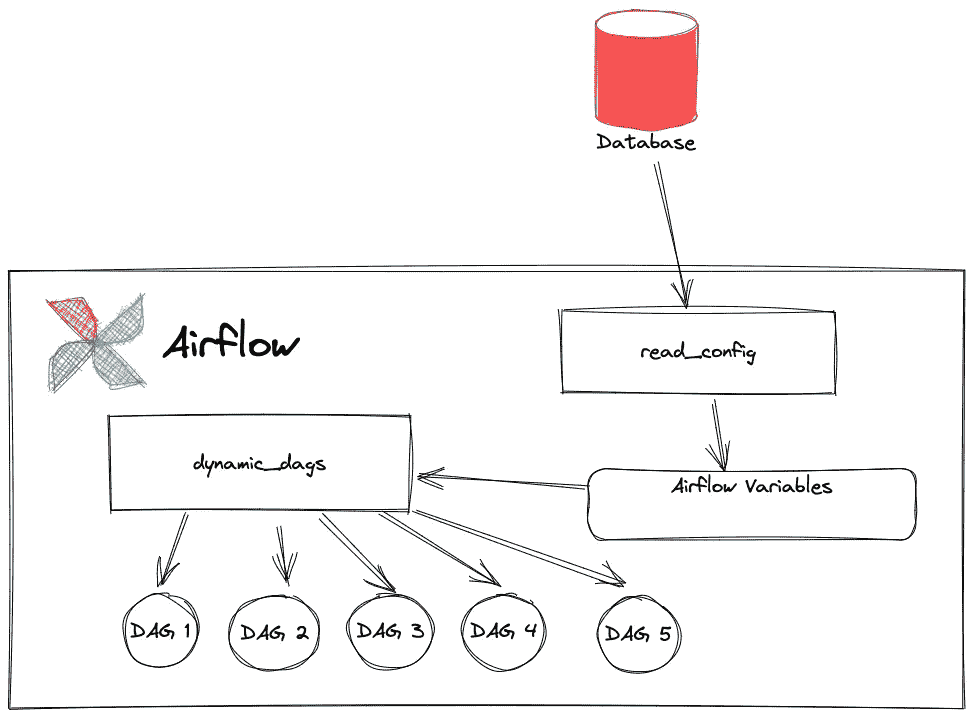
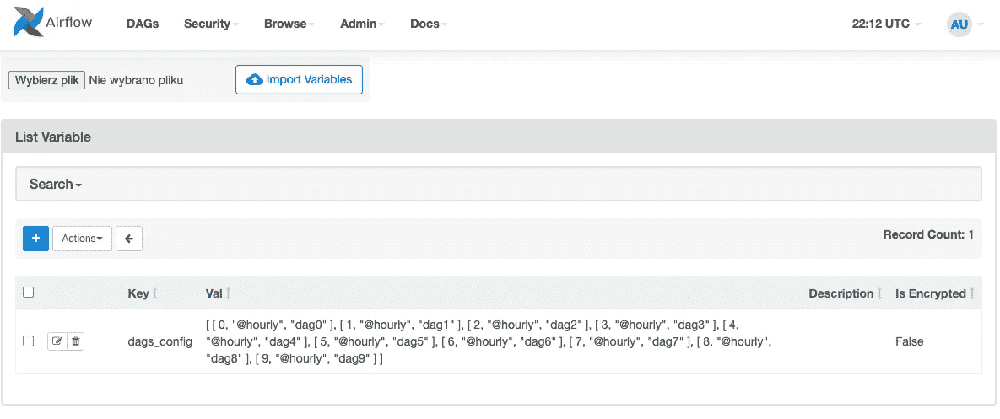
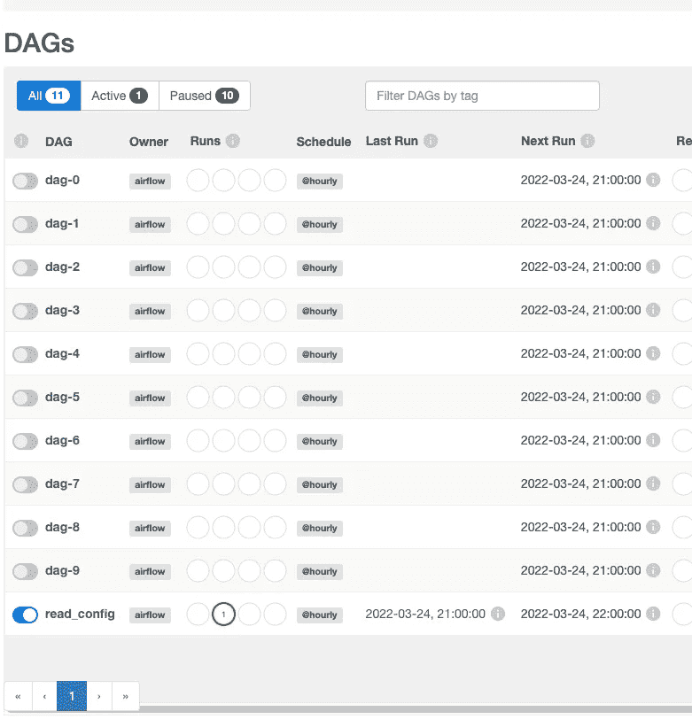

# 从外部数据库控制您的气流 Dag

> 原文：<https://towardsdatascience.com/control-your-airflow-dag-from-an-external-database-f56d88f7df29>


荷兰 Zaandam 的 Zaanse Schans(作者)

Apache Airflow 是一个非常流行的框架，用于调度、运行和监控任务，这些任务被分组到 DAG(有向无环图)中。每个 DAG 都有几个描述 DAG 将如何以及何时执行的参数。DAG 本身由安排在流中的任务组成。DAG 参数被定义为 [DAG 类](https://github.com/apache/airflow/blob/main/airflow/models/dag.py#L184)的属性，并存储在代码中。这种解决方案在许多情况下是足够的。

然而，dag 的配置可以被委托并存储在别处——在与外部用户的 GUI 链接的一些数据库中。

由此，dag 的一些参数可以在不接触代码源的情况下被定义，例如由非开发者定义。例如，想象一个化学实验室，其中自动化过程由气流控制，化学家可以使用 web 界面改变一些参数。

在这个简短的故事中，我将展示如何使用外部配置源来动态创建和配置 Dag。这里的一个假设是，所有 Dag 在任务和关系方面都是相似的。因此，只有几个参数可以通过数据库进行配置:

*   调度时间
*   执行参数



动态配置的 Dag 流(按作者)

该解决方案由两个 Dag 组成:

*   **read_config** 负责从数据库获取配置
*   **dynamic_dags** 负责根据配置创建 Dag

# 读取配置

有人可能会问，为什么我们需要两个 DAG，为什么不将所有内容都放在一个 DAG 中。这是因为 Airflow 处理 Python 文件的方式。调度程序每隔 n 秒扫描一次`dags/`文件夹中的文件，并使用 Python 解释器对其进行评估。扫描频率由`dag_dir_list_interval`参数控制。
因此，在评估部分，我们不应该做任何昂贵的动作——显然连接到数据库和读取表是其中之一。

相反，数据库读取部分应该转移到由操作符运行的代码中(比如 [PythonOperator](https://airflow.apache.org/docs/apache-airflow/stable/howto/operator/python.html) )。这正是发生在`read_config`达格的事情。

在 DAG 中，有一个由 [PythonOperator](https://airflow.apache.org/docs/apache-airflow/stable/howto/operator/python.html) 运行的任务

*   从数据库中读取配置(即`config.dags`
*   将配置放入气流变量中

就是这样。气流变量存储用于保存配置(使用 JSON 格式)。下面是 DAG 的定义:

```
import logging
from datetime import timedelta

import airflow
import mysql.connector
from airflow import DAG
from airflow.models.connection import Connection
from airflow.models.variable import Variable
from airflow.operators.python import PythonOperator

logger = logging.getLogger("airflow.task")

default_args = {
    "owner": "airflow",
    "depends_on_past": False,
    "retries": 0,
    "retry_delay": timedelta(minutes=5),
}

mysql_connection = Connection.get_connection_from_secrets("mysql")

def read_dags_config():
    db_conn = mysql.connector.connect(host=mysql_connection.host, user=mysql_connection.login,
                                      password=mysql_connection.password, database='config')
    cursor = db_conn.cursor()
    cursor.execute("select id, enabled, schedule, description from config.dags")

    rows = cursor.fetchall()

    if rows is None:
        rows = []

    logger.info(f"Config rows: {rows}")
    if len(rows) > 0:
        Variable.set("dags_config", rows, serialize_json=True)

with DAG(
        "read_config",
        default_args=default_args,
        schedule_interval="@hourly",
        start_date=airflow.utils.dates.days_ago(0),
        catchup=False) as dag:
    PythonOperator(task_id="read-config", python_callable=read_dags_config, dag=dag)
```

来自数据库的配置每小时准备就绪。这些行被序列化为 JSON 并保存在 Airflow 变量中:



气流中的变量列表(按作者)

# 动态 DAG

第二个 dag(动态 DAG)负责创建 DAG。该解决方案使用了 Airflow 处理 Python 文件的方式。基本上，在扫描`dags/`中的文件时，Airflow 会寻找类型为 [DAG](https://github.com/apache/airflow/blob/main/airflow/models/dag.py#L185) 的对象。在内部，py 文件由 Python 解释器评估，然后扫描`globals()`字典。

程序很简单。首先，我们从包含要创建的 Dag 列表的变量中获取配置。接下来，我们遍历列表并运行返回`DAG`对象的函数。以及作为变量放入 global()字典中的`DAG`对象。

```
from datetime import timedelta

import airflow
from airflow import DAG
from airflow.models.variable import Variable
from airflow.operators.python import PythonOperator

default_args = {
    "owner": "airflow",
    "depends_on_past": False,
    "start_date": airflow.utils.dates.days_ago(0),
    "retries": 2,
    "retry_delay": timedelta(minutes=5),
}

def create_dag(dag_id: str, schedule: str = None, description: str = None):
    dag = DAG(
        dag_id,
        default_args=default_args,
        schedule_interval=schedule,
        dagrun_timeout=timedelta(hours=1),
        catchup=False,
        description=description)

    task_1 = PythonOperator(task_id="task_1", python_callable=lambda: x+1, dag=dag)
    task_2 = PythonOperator(task_id="task_2", python_callable=lambda: 1, dag=dag)

    task_1 >> task_2

    return dag

dags_config = Variable.get("dags_config", deserialize_json=True)

for dag_id, schedule, description in dags_config:
    globals()[f"dag-{dag_id}"] = create_dag(f"dag-{dag_id}", schedule, description)
```

这里，应该强调两个重要部分。一个功能`create_dag`负责定义任务和它们之间关系的整个过程。最后一部分，迭代 DB 中的配置。注意内置方法`globals()`的用法，它返回一个字典。



创建的动态 Dag 列表(按作者)

综上所述，气流还是无非是一个常规的 Python 代码。因此，使用语言和生态系统的所有特性没有任何障碍。

我希望你喜欢这个故事，它会对你的日常工作有所帮助。如果您有任何问题或建议，请随时通过 [Twitter](https://twitter.com/MrTheodor) 联系我。