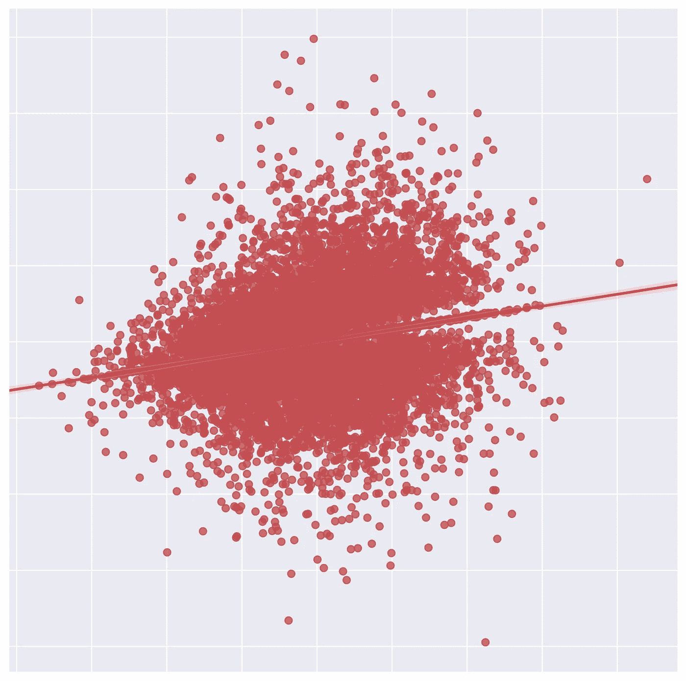
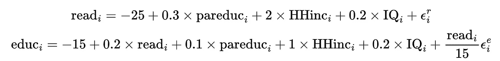
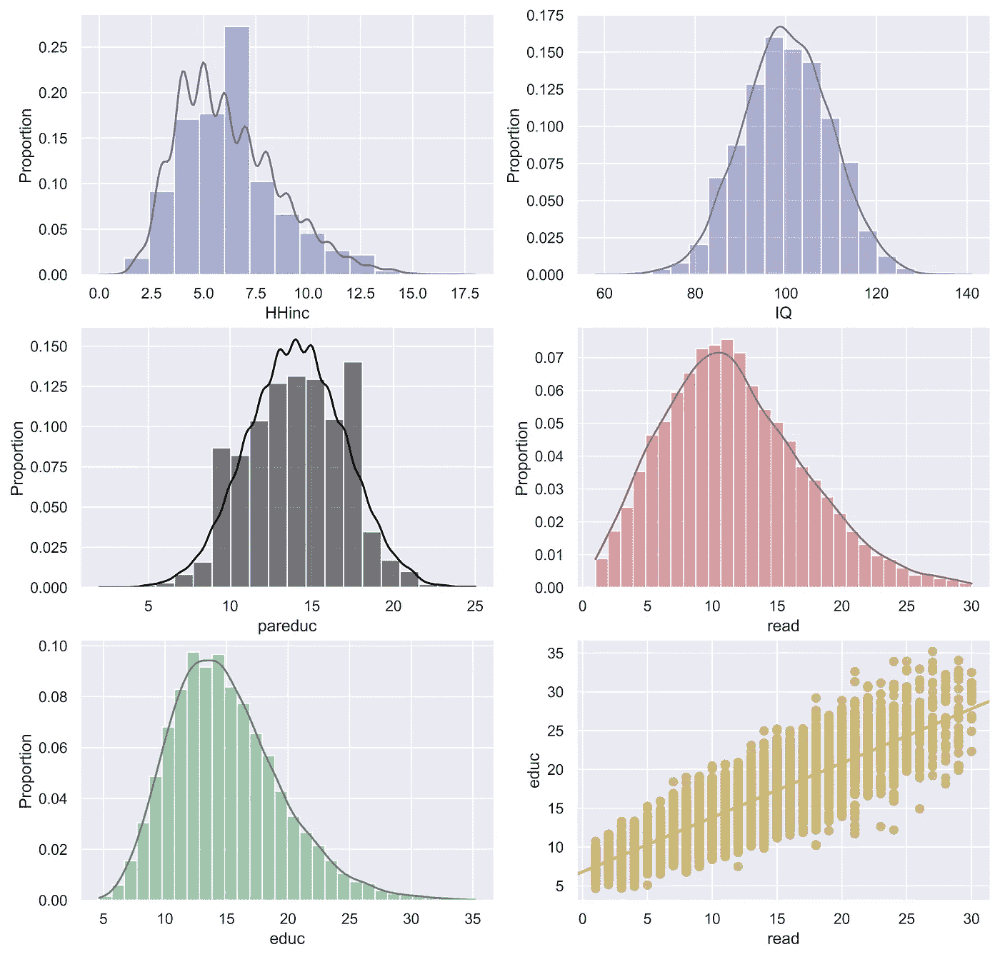
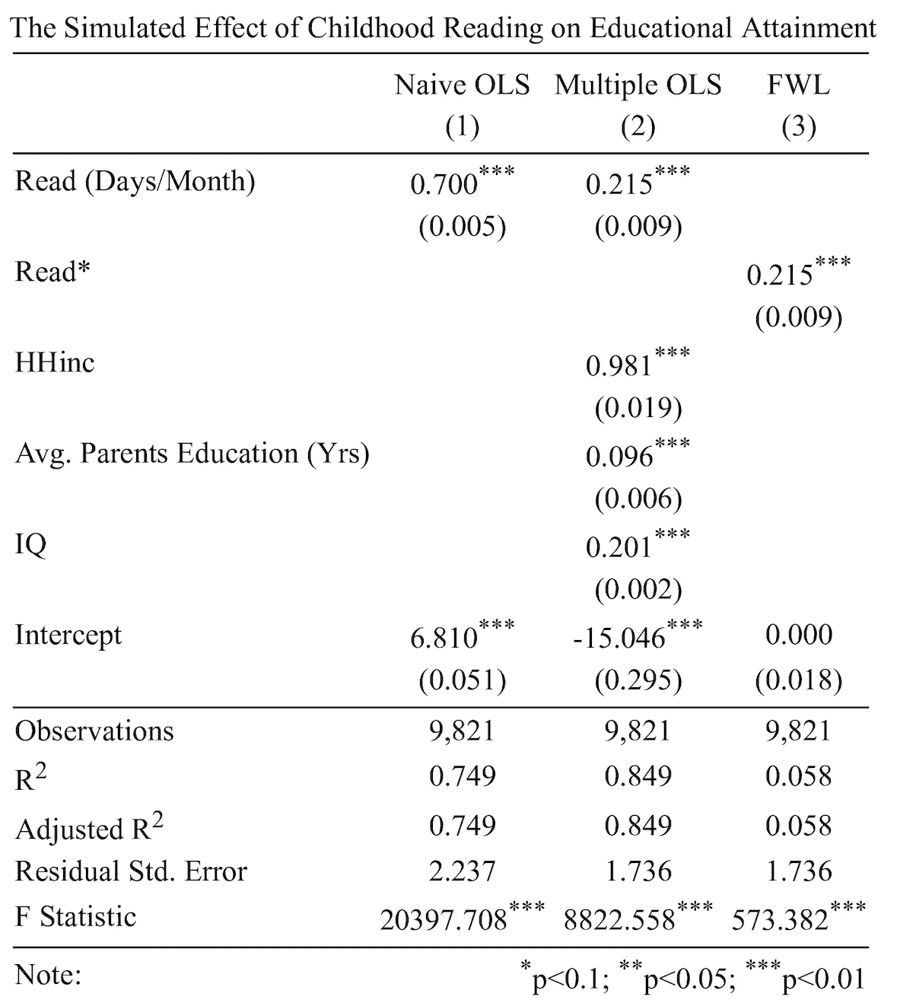
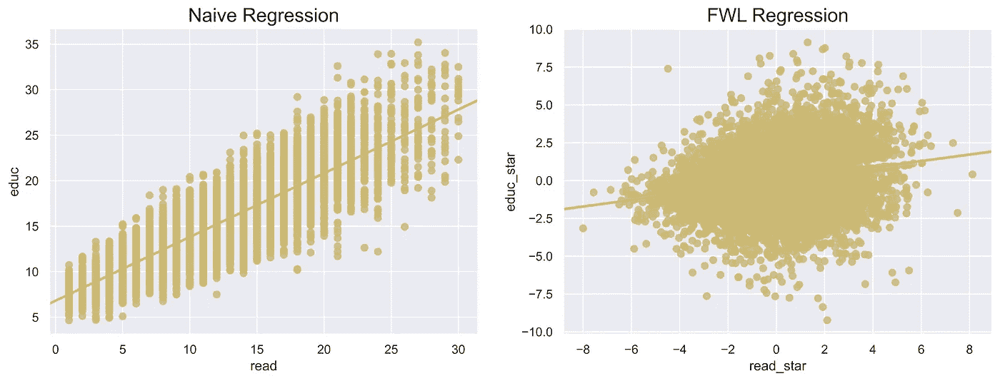

# 控制 X 吗？

> 原文：<https://towardsdatascience.com/controlling-for-x-9cb51652f7ad>



## 通过弗里希-沃-洛弗尔定理理解线性回归力学

# **简介**

应用计量经济学通常对建立因果关系感兴趣。即 *T* 对某个结果 y *的“治疗”效果是什么。*在一个简单的双变量案例中，我们可以想象*随机*将治疗 *T* =1 分配给一些个体，将 *T=0* 分配给其他个体。这可以用下面的线性回归模型来表示:


(1)

如果我们假设处理是真正随机分配的，那么 T 与误差项正交，或者用经济学家的行话来说，*外生*。因此，我们可以估算 eq。(1)使用普通最小二乘法(OLS)并用因果解释解释 *T* 上的系数估计值——平均治疗效果(ate):


(2)

然而，当我们处理非实验性数据时，几乎总是这样，对感兴趣项的处理*不*与误差项正交，或者，用经济学家的行话来说，*内生*。例如，假设我们感兴趣的是确定小时候读书时间对个人未来教育成就的治疗效果。没有任何随机分配的时间花在阅读作为一个孩子，估计一个简单的线性回归，如方程。(1)将无法捕捉可能驱动个人花费在阅读书籍上的时间*和*教育程度(即，社会经济地位、父母教育、潜在能力、其他爱好等)的大量附加因素。).因此，在处理非实验性数据时，我们必须依赖于对额外协变量的控制，然后论证治疗现在“与随机分配一样好”，以建立因果关系。这就是所谓的条件独立性假设(CIA)。在上面的教育例子中，我们可以重新定义情商。(1)作为:


(3)

我们现在控制一组观察到的协变量 *X* 。当且仅当中央情报局成立时，对*读数*的关键兴趣估计采用因果解释*。也就是说，花费在读取上的时间与误差项*正交，条件*在 *X* 上。相当于，*


(4)

没有中央情报局，我们的系数估计是有偏差的，我们在因果关系方面的话是有限的。现实地说，为中央情报局辩护通常是相当困难的，而且不幸的是，这种假设是不可直接检验的。事实上，我上面所讨论的是整个计量经济学领域的基本动力，该领域致力于建立、发展和实施准实验研究设计，以建立因果关系，包括但绝对不限于差异中的差异、综合控制和工具变量设计。这些准实验设计旨在利用感兴趣的治疗中的外源性(“几乎是随机的”)变异源 *T* 来研究 *T* 对某些结果 y 的因果影响。有一些优秀的计量经济学文本可供那些几乎没有或根本没有计量经济学背景的人阅读，包括尼克·亨廷顿-克莱因的《[效应](https://www.theeffectbook.net/)》、斯科特·坎宁安的《[因果推理:混音带](https://mixtape.scunning.com/)》或《[勇敢而真实的因果推理](https://matheusfacure.github.io/python-causality-handbook/landing-page.html)[1][2][3]约书亚·安格里斯特(Joshua Angrist)和约恩·斯特芬·皮施克(jrn-Steffen Pischke)为感兴趣的人提供了“基本无害的计量经济学”的更深入探讨。[4]

尽管通过单独控制协变量来建立 CIA 特别困难，但计量经济学中有一个重要的定理，它为“控制”额外协变量的真正含义提供了一些非常强大的直觉。最终，这不仅提供了对线性回归潜在机制的更深入理解，还提供了如何概念化关键利益关系(即 *T* 对 *Y* 的影响)。

# **弗里希-沃-洛弗尔定理**

在 19 世纪，计量经济学家拉格纳·弗里希和弗雷德里克·v·沃发展了一个超级酷的定理(FWL 定理)，该定理允许估计线性回归中的任何关键参数，其中首先“部分消除”附加协变量的影响，该定理后来被迈克尔·c·洛弗尔推广。[5][6]首先，快速复习一下线性回归会有所帮助。

给定一组独立变量X，线性回归求解结果 y 的最佳线性预测值，其中 y 的拟合值被投影到由*X 跨越的空间上。在矩阵符号中，我们感兴趣的线性回归模型的特征在于:*

**

*(5)*

*线性回归的目标是最小化残差平方和(RSS)，因此可以通过以下优化问题来解决:*

**

*(8)*

*取导数并设等于零， **(6)** 的最优解为:*

**

*(9)*

*这是普通的最小二乘(OLS)估计器，当我们运行线性回归以获得参数估计时，它是幕后的主力。现在，让我们回顾一下是什么让 FWL 如此伟大。*

*让我们回到我们估算儿童时期阅读的教育回报的例子。假设我们只想获得方程中感兴趣的关键参数。(3);也就是说，儿童时期每月阅读天数对受教育程度的影响。回想一下，为了对我们的估计做出一个因果陈述，我们必须让 CIA 满意。因此，我们可以控制一组额外的协变量 X，然后使用在 **(7)** 中导出的 OLS 估计器直接估计 **(3)** 。然而，FWL 定理允许我们在以下 3 步程序中，在*读取*时获得完全相同的关键参数估计值:*

1.  *回归*将*读为仅协变量集 *X* ，同样，将*教育*读为仅协变量集 *X**

**

*(8)+(9)*

*2.存储估计(8)+(9)后的残差，表示为*读作** 和*教育***

**

*(10)+(11)*

*3.将*教育** 倒退到*改为***

**

*(12)*

*就是这样！*

*直观地说，FWL 定理分离出由附加协变量解释的*阅读(*治疗/利益变量)和*教育(*利益结果 *)* 中的变异，然后使用剩余的变异来解释利益的关键关系。这一过程可以推广到任何数量的感兴趣的关键变量。关于这个定理的更正式的证明，参考文献[7]。FWL 定理最近作为去偏置/正交机器学习的理论基础而备受关注，其中步骤 1 和 2 使用机器学习算法而不是 OLS 来进行。有一些非常酷的发展正在弥合计量经济学和机器学习之间的差距，我希望将来有一些关于这些新方法的酷应用的帖子。然而，Matheus Facure Alves 的第 2 部分“[勇敢和真实的因果推理](https://matheusfacure.github.io/python-causality-handbook/landing-page.html)”是一个很好的起点。*

*现在你可能想知道为什么你要经历这个过程来获得完全相同的关键估计值。首先，它为线性回归的机制提供了大量的直觉。第二，它允许你想象你治疗中的剩余变化(*读作*)，这被用来解释你结果中的剩余变化(*教育*)。让我们来看看实际情况！*

# ***FWL 定理应用***

*在本节中，我们将模拟一个高度程式化的数据集，以提供一个应用 FWL 定理的简化数值示例，来回答我们关于儿童阅读教育回报的经验问题。*

*假设我们假设了一组人口统计学变量，我们确定这些变量是满足等式 1 中 CIA 所必需的相关混杂因素。(3)，从而让我们获得对童年阅读教育回报的因果解释。也就是说，假设我们将关键混杂因素确定为父母双方的平均教育水平(年)( *pareduc* )、以数万美元计的家庭收入( *HHinc* )和智商得分( *IQ* )。我们将为混杂因素人工生成数据集和以下数据生成过程(DGP ),如下所示:*

**

*(13)*

*此外，估计方程。(3)我们必须有关键治疗的措施，他们小时候一个月的平均阅读天数(*读作*)，以及主要结果，他们多年的总教育程度( *educ* )。我们用高斯误差项和教育误差项中的异方差人工生成这些关键变量，如下所示:*

**

*(14)*

*因为我们知道真实的 DGP，所以感兴趣的参数的真实值是 0.2。让我们把这个 DGP 拿到 Python 上模拟数据:*

> *请注意，通常情况下，DGP 中的所有值都是任意选择的，因此数据很适合用于演示目的。然而，在这个模拟的范围内，我们可以将“阅读”的系数解释如下:平均而言，一个人小时候每月多读一天书，其受教育程度就增加 0.2 年。*

```
 *## Import Relevant Packages
import pandas as pd
import numpy as np
from scipy.stats import skewnorm
import seaborn as sns
import matplotlib.pyplot as plt

## Data Generating Process
df = pd.DataFrame()
n = 10000

# Covariates
df['pareduc'] = np.random.normal(loc=14,scale=3,size=n).round()
df['HHinc'] = skewnorm.rvs(5,loc=3,scale=4,size=n).round()
df['IQ'] = np.random.normal(loc=100,scale=10,size=n).round()

# Childhood Monthly Reading
df['read'] = (-25+
              0.3*df['pareduc']+
              2*df['HHinc']+
              0.2*df['IQ']+
              np.random.normal(0,2,size=n)).round()

df = df[(df['read']>0) & (df['read']<31)] # Drop unrealistic outliers

# Education Attainment
df['educ'] = (-15+
              0.2*df['read']+
              0.1*df['pareduc']+
              1*df['HHinc']+
              0.2*df['IQ']+
              df['read']/15*np.random.normal(0,2,size=len(df)).round())

## Plot Simulated Data
fig, ax = plt.subplots(3,2,figsize=(12,12))
sns.histplot(df.HHinc,color='b',ax=ax[0,0],bins=15,stat='proportion',kde=True)
sns.histplot(df.IQ,color='m',ax=ax[0,1],bins=20,stat='proportion',kde=True)
sns.histplot(df.pareduc,color='black',ax=ax[1,0],bins=20,stat='proportion',kde=True)
sns.histplot(df.read,color='r',ax=ax[1,1],bins=30,stat='proportion',kde=True)
sns.histplot(df.educ,color='g',ax=ax[2,0],bins=30,stat='proportion',kde=True)
sns.regplot(data=df,x='read',y='educ',color='y',truncate=False,ax=ax[2,1])
plt.show()*
```

*数据看起来有点像:*

**

***图 1***

*右下角的图表提供了 *educ* 对 *read* 的散点图和原始回归线。从表面上看，这种关系表明，小时候每月阅读的天数和教育程度之间存在非常强的正相关关系。然而，我们知道，通过构造，这并不是 *educ* 和 *read* 之间的真实关系，因为存在共同的混杂协变量。我们可以通过回归分析更正式地量化这个结果和偏差。现在，让我们继续估计简单的回归(例如，等式)。(3)减去 *X* )，所有相关协变量的多元回归(即等式。(3))和 FWL 三步过程(即，方程。(8)-(12)):*

```
*import statsmodels.formula.api as sm

## Regression Analysis

# Naive Regression
naive = sm.ols('educ~read',data=df).fit(cov_type="HC3")

# Multiple Regression
multiple = sm.ols('educ~read+pareduc+HHinc+IQ',data=df).fit(cov_type='HC3')

# FWL Theorem
read = sm.ols('read~pareduc+HHinc+IQ',data=df).fit(cov_type='HC3')
df['read_star']=read.resid

educ = sm.ols('educ~pareduc+HHinc+IQ',data=df).fit(cov_type='HC3')
df['educ_star']=educ.resid

FWL = sm.ols("educ_star ~ read_star",data=df).fit(cov_type='HC3')

## Save Nice Looking Table
from stargazer.stargazer import Stargazer

file = open('table.html','w')

order = ['read','read_star','HHinc','pareduc','IQ','Intercept']
columns = ['Naive OLS','Multiple OLS','FWL']
rename = {'read':'Read (Days/Month)','read_star':'Read*','hhincome':'HH Income',
          'pareduc':"Avg. Parents Education (Yrs)"}

regtable = Stargazer([naive, multiple, FWL])
regtable.covariate_order(order)
regtable.custom_columns(columns,[1,1,1])
regtable.rename_covariates(rename)
regtable.show_degrees_of_freedom(False)
regtable.title('The Simulated Effect of Childhood Reading on Educational Attainment')

file.write(regtable.render_html())
file.close()*
```

*回归结果是:*

**

***表 1***

*上面的表 1 给出了回归输出结果。我们可以立即观察到，由于与教育程度和童年阅读呈正相关的混杂变量，对*阅读*的简单回归估计值是向上偏的。当我们包括列(2)中的额外协变量时，我们得到的估计值接近 DGP 中构建的真实值 0.2。正如所料，FWL 三步法得出了完全相同的估计值！*

> *回归中符号偏差的一般经验法则是 cov(结果，X)的符号乘以 cov(治疗，X)的符号。通过构造，我们得到 cov(educ，X)>0 和 cov(read，X)>0，因此是正偏置。*

*因此，我们现在已经展示了 FWL 被用于获得相同的估计，但是 FWL 的真正力量在于绘制真实关系的能力。下图 2 显示了未考虑协变量的原始回归的初始关系，以及 FWL 过程的残差关系，其中噪声来自 DGP 的随机误差项。在这种情况下，FWL 坡才是真正的关系！我们可以看到斜率的估计是多么的不同。这就是 FWL 定理的真正力量所在！它允许我们在剔除已经被额外协变量解释的变异后，可视化治疗和结果之间的关系。*

**

***图 2***

# ***讨论***

*我们已经深入讨论了弗里希-沃-洛弗尔定理，并提供了一种直观的方法来理解当人们对治疗参数感兴趣时，对回归模型中的协变量进行“控制”意味着什么。这是一个强有力的定理，并为多年来发展的许多计量经济学结果提供了强有力的基础。*

*FWL 提供了一个强有力的机制，通过这个机制，在剔除了额外协变量的影响后，可以可视化结果和治疗之间的关系。事实上，FWL 可以用来研究任何两个变量之间的关系，以及协变量在解释它们之间的潜在关系时所起的作用。我建议在您对两个变量之间的关系以及附加协变量在混淆这种关系中的作用感兴趣的数据集上进行尝试！*

*希望你从这篇帖子中获得了一些新的知识！*

## *参考*

*[1] N .亨廷顿-克莱因，[效果:研究设计和因果关系介绍](https://theeffectbook.net/) (2022)。*

*[2] S .坎宁安，[《因果推断:大杂烩》](https://mixtape.scunning.com/) (2021)。*

*[3] M. F .阿尔维斯，(2021)勇敢而真实的因果推论。*

*[4] J. Angrist & J.S. Pischke，[大部分无害的计量经济学:一个经验主义者的伴侣](https://www.mostlyharmlesseconometrics.com/) (2009)。普林斯顿大学出版社。*

*[5]弗里希，拉格纳和沃。与个体趋势相比的部分时间回归(1933)。计量经济学:计量经济学学会杂志，387–401 页。*

*[6]洛弗尔。经济时间序列的季节调整和多元回归分析(1963)。*美国统计协会杂志*58(304):993–1010。*

*[7]洛弗尔。FWL 定理的一个简单证明(2008)。*经济教育杂志*。39 (1): 88–91.*

*感谢您阅读我的帖子！我在 Medium 上的帖子试图利用 ***计量经济学*** *和* ***统计/机器学习*** *技术来探索现实世界和理论应用。此外，我试图通过理论和模拟提供某些方法论的理论基础。最重要的是，我写作是为了学习！我希望把复杂的话题变得更容易理解。如果你喜欢这个帖子，请考虑* [***跟随我上中***](https://medium.com/@jakepenzak) *！**