# Dag 和控制变量

> 原文：<https://towardsdatascience.com/controls-b63dc69e3d8c>

## [因果数据科学](https://towardsdatascience.com/tagged/causal-data-science)

## 如何使用有向无环图选择因果推理的控制变量

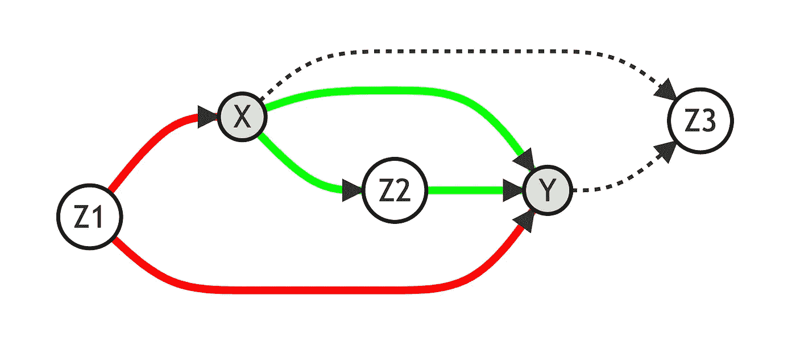

所有图片由作者提供，由[美人鱼-js](https://mermaid-js.github.io/) 生成

在分析因果关系时，很难理解哪些变量是**在**进行分析的条件，即如何“分割”数据，以便我们在**比较苹果和苹果**。例如，如果你想了解拥有一台平板电脑对学生成绩的影响，比较学生社会经济背景相似的学校是有意义的。否则，风险在于只有更富裕的学生才能买得起平板电脑，如果不加以控制，我们可能会将这种影响归因于平板电脑，而不是社会经济背景。

当感兴趣的治疗来自适当的随机实验时，我们不需要担心其他变量的条件作用。如果平板电脑在学校之间随机分配，并且我们在实验中有足够多的学校，我们就不必担心学生的社会经济背景。以一些所谓的“控制变量”为条件进行分析的唯一好处可能是功率的增加。然而，这是一个不同的故事。

在这篇文章中，我们将简要介绍有向无环图，以及它们如何有助于选择变量来进行因果分析。Dag 不仅为我们在分析中需要*包括*哪些变量提供了直观的视觉感受，还提供了我们不应该*包括*哪些变量以及为什么。

# 有向无环图

## 定义

**有向无环图** ( **DAG** s)提供了数据生成过程的可视化表示。随机变量用字母表示(如 ***X*** )，因果关系用箭头表示(如→)。例如，我们解读


作为 ***X*** (可能)原因 ***Y*** 。我们称一条**路径为**两个变量*和**之间的任意连接，独立于箭头*的方向。如果所有的箭头都指向前方，我们称之为**因果路径**，否则我们称之为**寄生路径**。**

**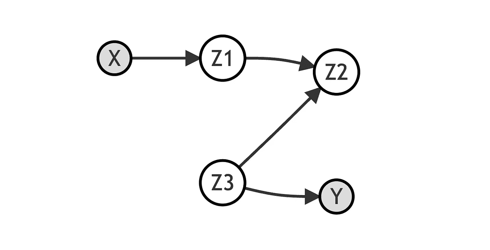**

**作者图片**

**在上面的例子中，我们在 ***X*** 和 ***Y*** 之间有一条路径，通过变量***【z₁】***、***【z₂】***和***【z₃】***。既然不是所有的箭头都指向前方，那么路径就是*乱真*和 ***X*** 对 ***Y*** 没有因果关系。实际上，变量***【z₂】***是由*和***【z₃】***共同造成的，因此**阻断了**路径。***

*****Z₂*** 被称为**对撞机**。**

**我们分析的目的是评估两个变量 ***X*** 和 ***Y*** 之间的**因果关系。有向无环图是有用的，因为它们为我们提供了关于哪些其他变量 ***Z*** 的指示，我们需要在这些变量上**条件**我们的分析。以一个变量为分析条件意味着我们保持它不变，并得出我们的结论*其他条件不变*。例如，在线性回归框架中，插入另一个回归变量 ***Z*** 意味着我们在给定**X******条件*Z*的观测值上，计算 ***Y*** 的条件期望函数的最佳线性逼近。****

## **因果关系**

**为了评估因果关系，我们要**关闭 ***X*** 和 ***Y*** 之间的所有伪路径**。现在的问题是:**

*   **一个路径**什么时候打开**？如果不包含*对撞机。*否则为*关闭*。**
*   **如何**关闭一个打开的路径**？您在*上设定至少一个*中间变量。**
*   **你如何**打开一个封闭的路径**？你的条件是*沿途所有的*碰撞器。**

**假设我们再次对 ***X*** 对 ***Y*** 的因果关系感兴趣。让我们考虑下图:**

**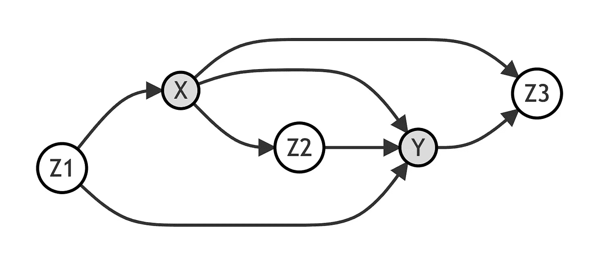**

**作者图片**

**在这种情况下，除了直接路径之外，通过变量***【z₁】******【z₂】***和 ***Z₃*** ，在 ***X*** 和 ***Y*** 之间还有**三条非直接路径**。**

**让我们考虑这样的情况，我们分析 ***X*** 和 ***Y*** 之间的关系，忽略所有其他变量。**

1.  **通过 ***Z₁*** 的路径是**开放的**但是它是**虚假的****
2.  **通过**t39】z₂t41】的路径是**开**和**因果******
3.  **通过 ***Z₃*** 的路径是**闭合的**既然 ***Z₃*** 是*碰撞器*而且是**乱真的****

**让我们画同样的图，用灰色的*变量表示我们正在调节的变量，用*虚线表示*闭合路径，用*红线表示*虚假开路，用*绿线表示*因果开路。***

*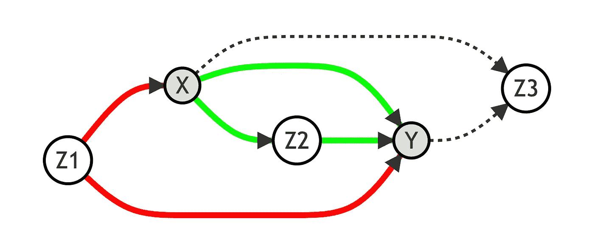*

*作者图片*

*在这种情况下，要评估*和*之间的**因果关系，我们需要通过**关闭*****【z₁】***的路径。我们可以通过对 Z₁的*进行条件分析来做到这一点。******

***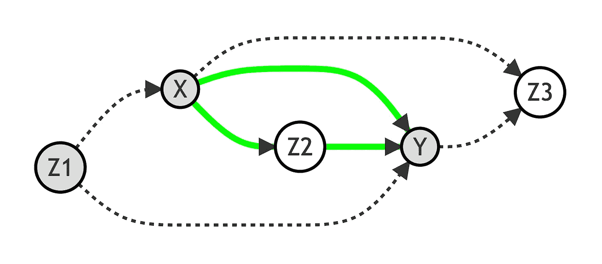***

***作者图片***

***现在我们能够通过对***【z₁】***的条件作用来恢复**x 与*y 之间的因果关系。******

*****如果我们也在**调节 *Z₂* 和**会发生什么？在这种情况下，我们将**关闭**通过*的路径，只留下 ***X*** 和 ***Y*** 之间的*直接*路径打开。然后我们将只恢复 ***X*** 对 ***Y*** 的**直接效果**，而不是*间接*效果。******

****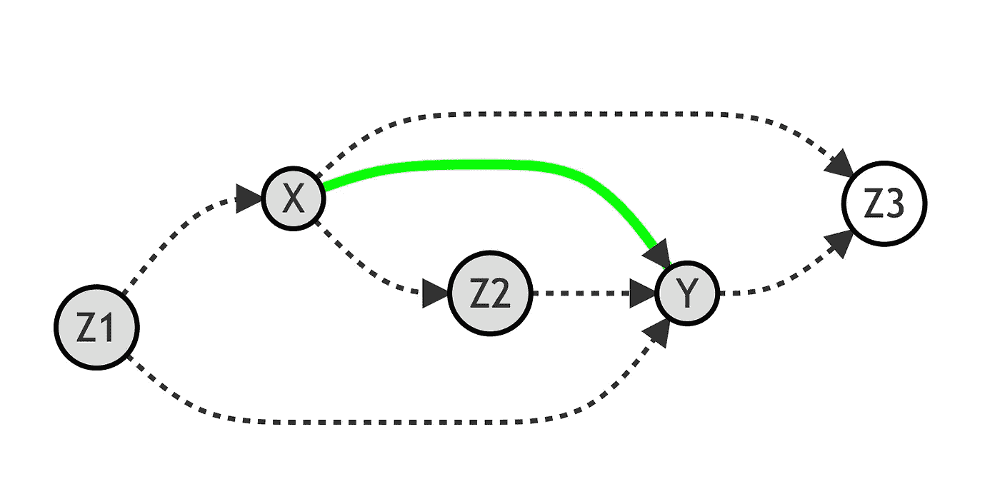****

****作者图片****

****如果我们也在**条件作用于 *Z₃*** 会发生什么？在这种情况下，我们将**打开**通过 ***Z₃*** 的路径，这是一条**虚假**路径。然后我们将**而不是**能够恢复 ***X*** 对 ***Y*** 的因果关系。****

****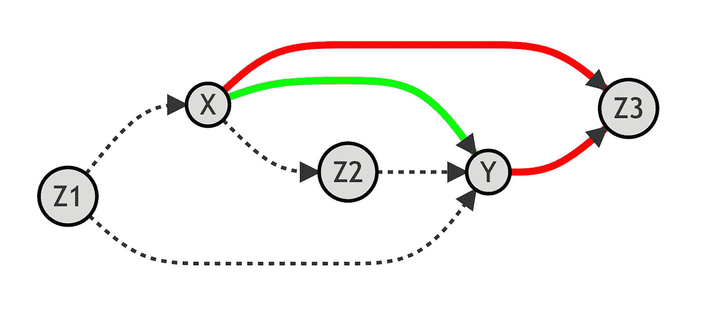****

****作者图片****

# ****例如:班级人数和数学成绩****

****假设你对班级规模对数学成绩的影响感兴趣。大班对学生的表现是好是坏？****

****假设数据生成过程可以用下面的 **DAG** 来表示。****

****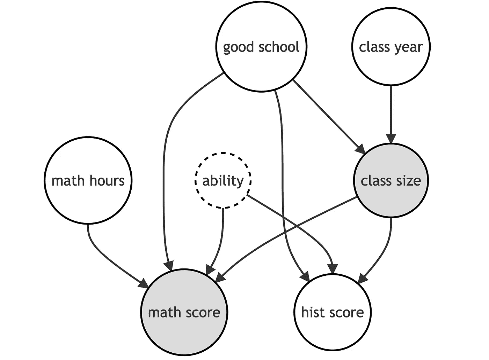****

****作者图片****

****感兴趣的变量被突出显示。而且，`ability`周围的虚线表示这是一个我们在数据中没有观察到的变量。****

****我们现在可以加载数据并检查它看起来像什么。数据是模拟的，你可以在这里找到原始数据生成过程[。](https://github.com/matteocourthoud/Blog-Posts/blob/main/notebooks/src/dgp.py)****

```
**from src.dgp import dgp_schooldf = dgp_school().generate_data()
df.head()**
```

****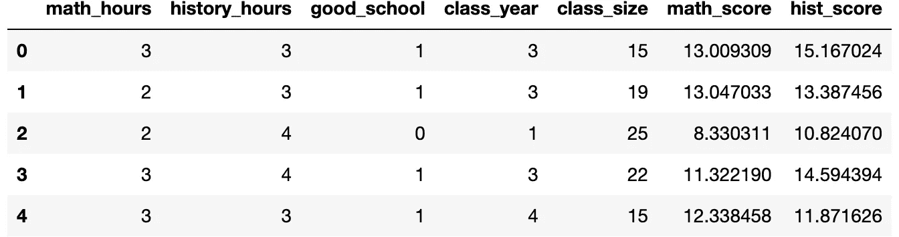****

****为了估计`class size`对`math scores`的因果影响，我们应该以哪些变量作为回归的条件？****

****首先，让我们看看，如果我们不以任何变量为条件进行分析，而只是对`class size`进行`math score`回归，会发生什么。我们使用 [statsmodels](https://www.statsmodels.org/) 软件包进行统计分析。****

```
**import statsmodels.formula.api as smfsmf.ols('math_score ~ class_size', df).fit().summary().tables[1]**
```

****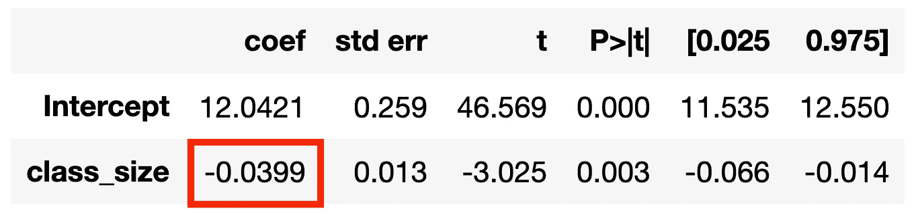****

****在表格的第二行，我们可以看到**估计的感兴趣系数**(`class size)`的`coef`及其估计的标准误差(`std err`)。`class_size`的影响是负的，在统计上不同于零(具有非常低的 p 值，`P>|t|=0.003`)。****

****但是我们应该相信这个估计的效果吗？没有任何控制，这是我们正在捕捉的效果的 **DAG 表示。******

****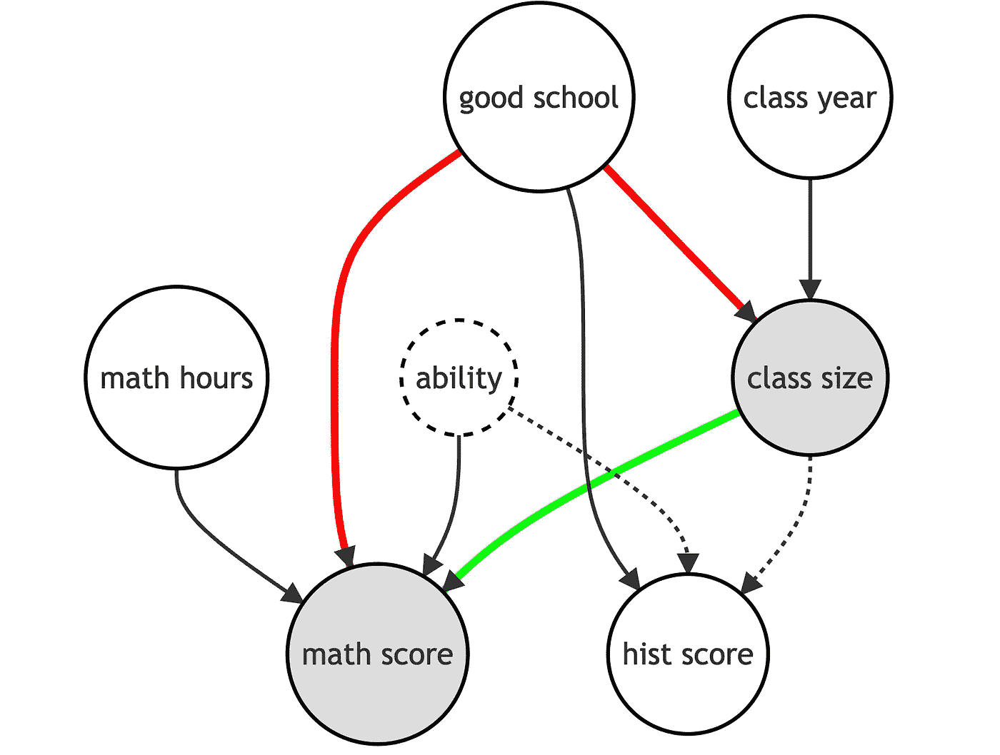****

****作者图片****

****有一个通过`good school`的**寄生**路径，该路径使**偏向**我们估计的系数。直觉上，被更好的学校录取会提高学生的数学成绩，更好的学校可能会有更小的班级规模。我们需要控制学校的质量。****

```
**smf.ols('math_score ~ class_size + good_school', df).fit().summary().tables[1]**
```

****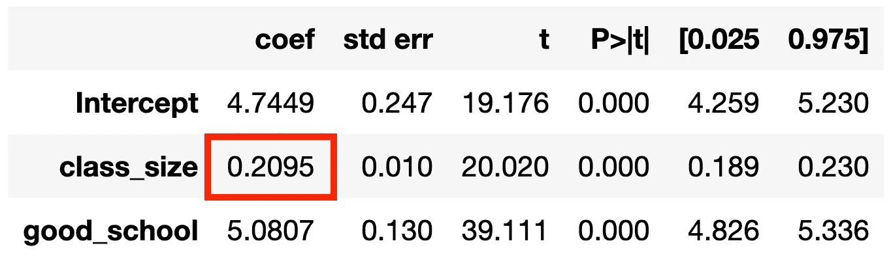****

****现在估计`class size`对`math score`的影响是**无偏**！的确，数据生成过程中的真实系数是 *0.2* 。****

****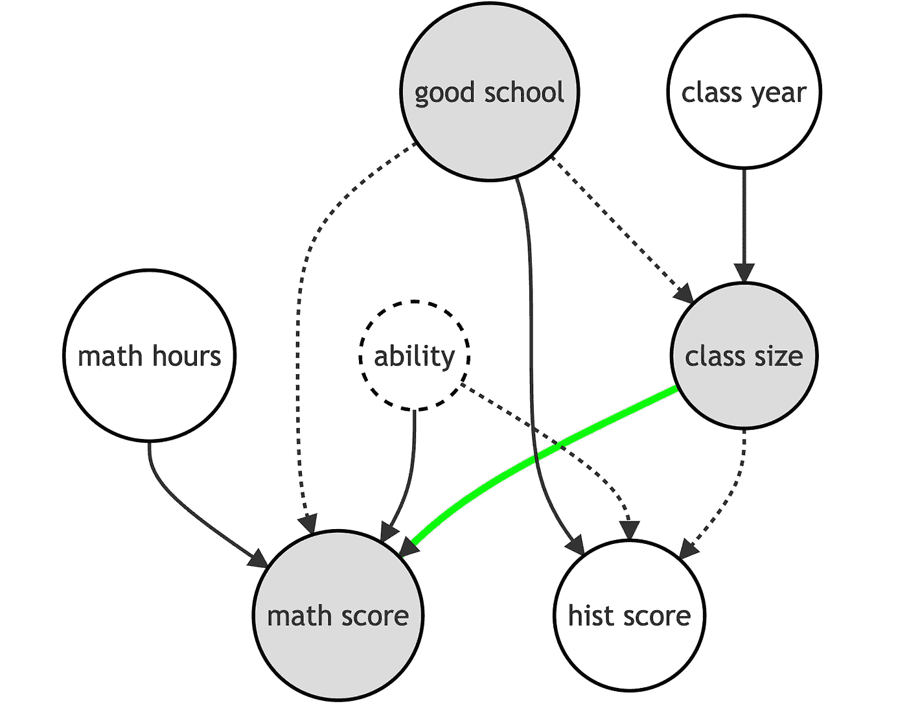****

****作者图片****

****如果我们用**控制所有变量**会发生什么？****

```
**smf.ols('math_score ~ class_size + good_school + math_hours + class_year + hist_score', df).fit().summary().tables[1]**
```

****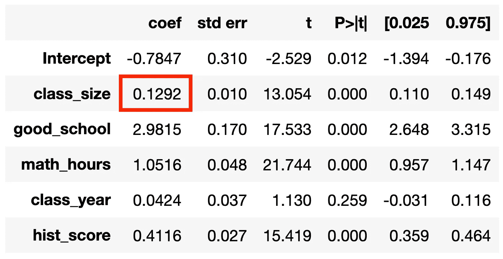****

****系数再次被**偏置**。为什么？****

****我们通过控制`hist score`打开了一条新的伪路径。事实上，`hist score`是一个**对撞机**，对它的控制打开了一条通过`hist score`和`ability`的路径，否则这条路径是关闭的。****

****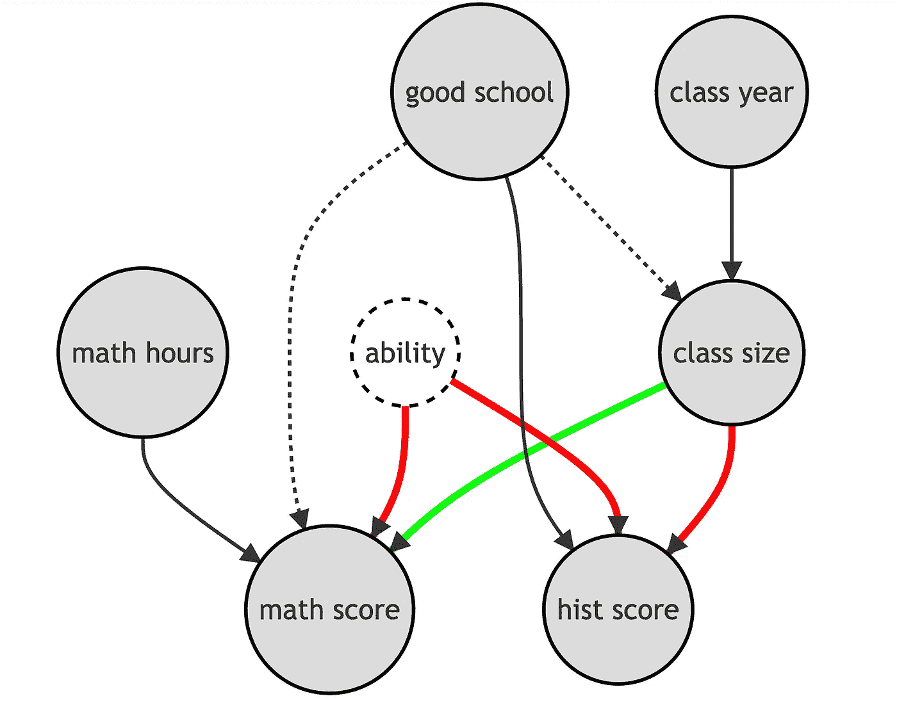****

****作者图片****

****这个例子的灵感来自下面的推文。****

# ****结论****

****在这篇文章中，我们看到了如何使用有向无环图来选择因果分析中的控制变量。Dag 是非常有用的工具，因为它们提供了随机变量之间因果关系的直观图形表示。与“信息越多越好”的普遍直觉相反，有时包括额外的变量可能会使分析产生偏差，妨碍对结果的因果解释。特别是，我们必须注意不要包括打开原本会关闭的虚假路径的碰撞器。****

## ****参考****

****[1] C .西内利，A .福尼，j .珀尔，[好与坏控制的速成班](https://papers.ssrn.com/sol3/papers.cfm?abstract_id=3689437) (2018)，*工作论文*。****

****[2] J. Pearl，[因果关系](http://bayes.cs.ucla.edu/BOOK-2K/) (2009)，*剑桥大学出版社*。****

****[3] S .坎宁安，《因果推论》第三章(2021)，耶鲁大学出版社*。*****

## *****密码*****

*****你可以在这里找到 Jupyter 的原始笔记本:*****

*****<https://github.com/matteocourthoud/Blog-Posts/blob/main/notebooks/controls.ipynb> ***** 

## *****感谢您的阅读！*****

*****真的很感谢！🤗*如果你喜欢这个帖子并且想看更多，可以考虑* [***关注我***](https://medium.com/@matteo.courthoud) *。我每周发布一次与因果推断和数据分析相关的主题。我尽量让我的帖子简单而精确，总是提供代码、例子和模拟。******

*****还有，一个小小的* ***免责声明*** *:我写作是为了学习所以错误是家常便饭，尽管我尽力了。当你发现他们的时候，请告诉我。也很欣赏新话题的建议！*****