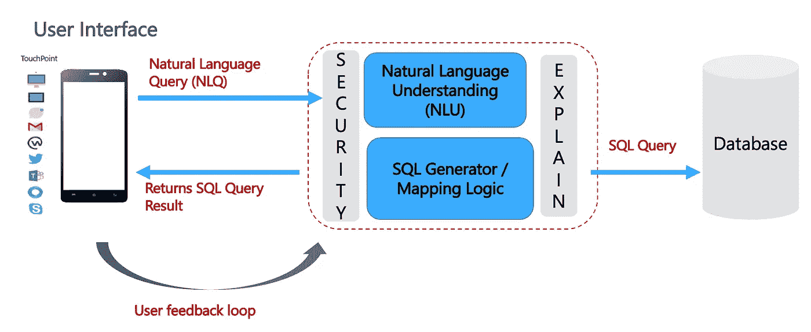
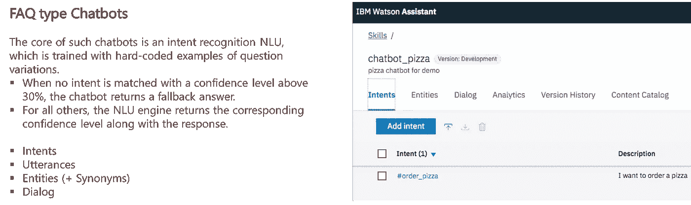
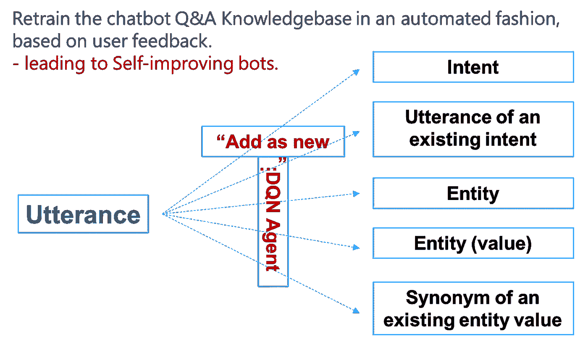
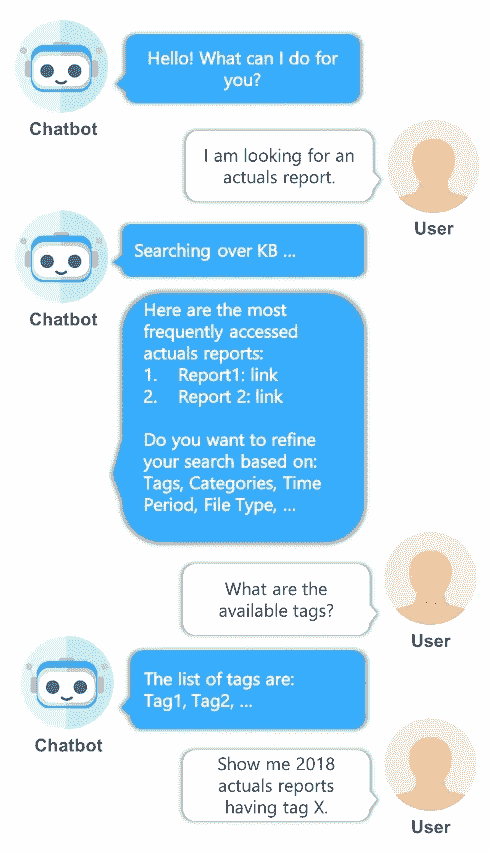

# 对话式 BI:文本到 SQL

> 原文：<https://towardsdatascience.com/conversational-bi-text-to-sql-c9f52a89acc5>

## 用自然语言查询 SQL 数据库的艺术

Pic 鸣谢:探索未知，作者 Soma Biswas (Flickr: [链接](https://flic.kr/p/2neEnwZ)，经允许转载)

# 介绍

“商务智能的未来是对话式的”——这是 Gartner 和其他分析师在过去几年中一直告诉我们的。

让我们关注结构化数据，更准确地说是关系数据。这形成了大多数商业智能(BI)世界的底层存储格式，无论您是交互查询数据库还是在 Tableau、Power BI、Qlik Sense 等中构建报告。与这种存储平台交互的主要语言是 SQL。我们已经看到了这一领域的一些产品，例如 Power BI [Q & A](https://docs.microsoft.com/en-us/power-bi/natural-language/q-and-a-intro) ，Salesforce [Photon](https://www.infoq.com/news/2020/09/salesforce-natural-language/) 。

> 在本文中，我们讨论的是将自然语言查询(NLQ)翻译成 SQL，也称为数据库自然语言接口(NLIDB)。

例如，让我们考虑一个包含语言和人口详细信息的*国家*表——说明如下:

**国家表**:国家 ID |名称|语言|人口数
NLQ1: *哪个国家的人口数最多？* SQL1: *Select Name，max([人口数])from Country；*

大多数自然语言问答系统的核心[1]是一个自然语言理解单元(NLU)模块，它试图通过提取和分类“话语”来理解 NLQ 的意图。简而言之，人们可以将话语视为句子中的关键短语，例如*国家、最大值、人口、计数*。

图:文本到 SQL 参考架构(图片由作者提供)

下一步是根据这些信息生成相应的 SQL 查询。因此，我们需要一个转换/映射逻辑来将*‘Country’映射到‘Country’表(要查询的表)，将‘maximum’映射到 MAX SQL 函数，将‘Population Count’映射到‘Population Count’列。这就是事情开始变得具有挑战性的地方。*

> 将 NLQ 语句映射到正确的 SQL 操作符。首先，在确定一个话语是否对应于表、列、主/外键、SQL 操作符时，这是非常重要的。

例如，在没有数据库模式的任何固有知识的情况下，映射逻辑很难确定这种情况下的“计数”是指列“人口计数”，而不是 SQL 函数计数。对于复杂的查询，这个问题变得更加严重，例如，

哪种语言被最多的国家使用？

其 SQL 翻译将涉及两个 SQL 函数:MAX & COUNT。复杂查询的其他例子包括我们需要连接多个表的场景。

# NLQ — SQL 翻译深度探讨

在这一节中，我们确实深入问题领域，反思现有的文献/方法，以理解所涉及的技术挑战。

该领域主要引用了两个基准数据集:

*   WikiSQL :是一个用于开发自然语言接口的大型带注释语料库，随论文一起介绍[2]。
*   [Spider](https://yale-lily.github.io/spider) 是一个大规模带注释的语义解析和文本转 SQL 数据集。 [SParC](https://yale-lily.github.io/sparc) 是 Spider 的上下文相关/多回合版本， [CoSQL](https://yale-lily.github.io/cosql) 是 Spider 和 SParC 数据集的对话版本。有关详细讨论，请参考随附的论文[3]。

正如 Spider 在其介绍性文本中所强调的，任何 NLIDB 解决方案不仅需要理解底层数据库模式，而且还应该*推广到新的模式*。泛化的挑战在于:( a)为语义解析器编码数据库模式,( b)在给定的 NLQ 中对数据库列、键及其提及之间的对齐进行建模[4]。

在这种背景下，让我们看看一些试图将(缺失的)数据库模式知识编码到神经网络中的工作。*有向图是一种编码数据库模式关系的流行形式。* [4]提出了一个统一的框架来解决文本到 SQL 编码器中的模式编码、链接和特征表示。[5]用图形神经网络对数据库模式进行编码，这种表示在编码器-解码器语义解析器中的编码和解码时都使用。[6]提出了一种数据库模式交互图编码器，以利用数据库模式项的历史信息。在解码阶段，使用 gate 机制来衡量不同词汇的重要性，然后预测 SQL 标记。

作为文本到 SQL 生成器的预先训练的大型语言模型[7]在一定程度上有所帮助，特别是。，通过利用注意机制对表名和列名进行编码[8]。但是，对于复杂的 SQL 操作，他们仍然需要处理模式关系。

> 论文显示了在嵌入数据库模式方面的重大进展，然而，它们仍然是特定于所考虑的数据集的；并且不能很好地推广到新的领域/模式。

# 解决方案指针

在这一节中，我们将考虑如何最好地将这种缺失的领域知识/数据库模式关系添加到文本到 SQL 生成器中。

## 手操纵进场着陆

今天，大多数问答系统都由一个自然语言理解(NLU)单元组成，该单元被训练成以受监督的方式识别用户的查询。这包括目前市场上可用的 Q & A 系统，例如谷歌 [DialogFlow](https://cloud.google.com/dialogflow/) ，亚马逊 [Lex](http://The core of such chatbots is an intent recognition NLU, which is trained with hard-coded examples of question variations.) ，微软 [LUIS](https://www.luis.ai/) ， [RASA](https://rasa.com/open-source/) 。

> 因此，首先需要通过提供一组 nlq、问题变体及其相应的答案来训练他们——在本例中是相应的 SQL 查询。

除了“意图”和“话语”，定制问答系统的一个重要部分是提供“实体”[9]。实体是指领域特定的词汇，例如，在 HR 应用程序的上下文中，它们可以指组织的办公室位置。

图 3:(说明性的)IBM Watson Assistant 中的手动配置

这里的要点是，类似于配置/训练聊天机器人，我们也可以手动地以数据库模式的形式输入领域知识，以改进 NLIDB 系统中文本到 SQL 的生成。

为了澄清，SQL 解析器可以提取表、列名、键关系等。，来自基础数据定义语言(DDL)规范文件。

> 因此，在这种情况下，需要手动输入的知识是表、列及其关系的自然语言描述——这是大多数数据库文档所缺少的。

虽然手动浓缩有效，并且通常是最可靠的方法；重要的是要记住，NLIDB 系统主要面向业务用户，即报告/仪表板的消费者；他们可能不太熟悉技术数据输入。此外，这不是一次性的数据输入，每次底层数据库模式发生变化时，都需要对编码的领域知识进行调整。

## 基于主动/强化学习的自动化方法

*引导文本到 SQL 生成器的一个好方法是从现有的 SQL 查询日志和 BI 报告中学习*。公平地说，大多数 NLIDB 系统将补充现有的 BI 平台。因此，利用历史 SQL 日志和现有报告/仪表板来了解最常见的 SQL 查询，从而了解可用于初始培训的 nlq 是有意义的。

可以通过引入辅助任务来提高该初始模型的泛化能力，该辅助任务可以明确地学习 NLQ 中的实体与模式中的表、列、键名之间的映射[10]。最近的工作已经将其扩展到少数镜头学习任务，例如[11]提出了一种有效的元学习策略，该策略利用两步梯度更新来迫使模型学习对零镜头表的泛化能力。

强化学习(RL)方法在这种情况下也很有趣，其中可以训练一个*深度 Q-网络(DQN)代理*来“评分”新的(看不见的)查询，以便可以有效地添加它们来扩充(离线)训练数据集。例如，[12]提出了一种基于 RL 的自我改进的企业聊天机器人，它显示出在 20-30 个训练周期内，性能从最初的 50%成功率增加到 75%。

图:基于强化学习的问答训练数据集的扩充(图片由作者提供)

# 未来的工作

最后，我们对未来进行了一些思考。对于 text-to-SQL，主要目标是重新创建 SQL 查询到数据库的范例，使用自然语言查询(NLQs)。

> 我们相信，对话式 BI 将更具颠覆性，能够以新的方式与数据库(或一般的数据存储)进行交互。

例如:

*   *元数据机器人*:鉴于企业数据库的复杂性，以及随之而来的对它们进行编码的困难；也许我们开始着手解决这个问题的方式是错误的。如果我们能为用户提供一个能够回答查询的 Q & A 系统(姑且称之为元机器人——元数据查询中的元，与元/脸书无关)。数据库架构，例如，“哪个表包含瑞士的销售数据？”以及针对 SQL 操作符的某种自动完成功能，例如，“我们在一个表中有德国和西班牙的销售数据吗？”，由相应表上的连接/过滤器回答；用户将能够高效地编写他们的 SQL 查询，而不需要任何高级的 SQL 知识。
*   *增量查询*:前一点已经暗示过了。今天的查询大多是一次性的。另一方面，我们的谈话有一个流程——我们继续以前说过的话——基于历史背景[13]。是的，存储过程按顺序执行 SQL 查询，但是，它是预定义的逻辑。对话式 BI 将能够实时地逐步细化查询结果，直到用户找到他/她正在实时寻找的数据。

图:增量查询(作者图片)

# 参考

1.  D.比斯瓦斯。*聊天机器人&自然语言搜索*。走向数据科学，[https://towardsdatascience . com/chatbots-natural-language-search-cc 097 f 671 B2B](/chatbots-natural-language-search-cc097f671b2b)
2.  钟，熊和理查德索契。2017. *Seq2SQL:使用强化学习从自然语言生成结构化查询*。https://arxiv.org/abs/1709.00103
3.  陶宇等 2018。 *Spider:用于复杂和跨领域语义解析以及文本到 Sql 任务的大规模人工标注数据集*。[https://arxiv.org/abs/1809.08887](https://arxiv.org/abs/1809.08887)
4.  王柏林等人。艾尔。2020. *RAT-SQL:文本到 SQL 解析器的关系感知模式编码和链接*。进行中。计算语言学协会第 58 届年会。https://doi.org/10.18653/v1/2020 . ACL-main . 677
5.  本·博金，马特·加德纳，乔纳森·贝兰特(2019)。*用图形神经网络表示模式结构，用于文本到 SQL 解析*。ACL，[https://arxiv.org/pdf/1905.06241.pdf](https://arxiv.org/pdf/1905.06241.pdf)
6.  蔡和万晓军。2020. *IGSQL:基于数据库模式交互图的神经模型，用于依赖上下文的文本到 SQL* *生成*。进行中。2020 年自然语言处理经验方法会议(EMNLP)，[https://aclanthology.org/2020.emnlp-main.560.pdf](https://aclanthology.org/2020.emnlp-main.560.pdf)
7.  林，谢文伟，索彻，r .，，熊，C. (2020)。*为跨域文本到 SQL 语义解析桥接文本和表格数据*。*调查结果*。[https://arxiv.org/abs/2012.12627](https://arxiv.org/abs/2012.12627)
8.  Bahdanau、Dzmitry、Kyunghyun Cho 和 Yoshua Bengio。*通过联合学习对齐和翻译的神经机器翻译*。[https://arxiv.org/pdf/1409.0473.pdf](https://arxiv.org/pdf/1409.0473.pdf)
9.  W.沙拉比、a .阿兰特斯、T. G .迪亚兹和 c .古普塔。*从大规模特定领域知识库构建聊天机器人:挑战与机遇，* 2020，[https://arxiv.org/pdf/2001.00100.pdf](https://arxiv.org/pdf/2001.00100.pdf)
10.  常，刘，汤，黄，何，周，等(2020)。*带辅助任务的零触发文本到 SQL 学习*。https://arxiv.org/pdf/1908.11052.pdf[AAAI](https://arxiv.org/pdf/1908.11052.pdf)
11.  陈，杨，郭，徐，王，邱，齐，王，李，洪(2021)。*利用表格内容，通过元学习实现文本到 SQL 的零转换*。*https://arxiv.org/pdf/2109.05395.pdf*AAAI
12.  E.里恰尔代利·比斯瓦斯。*基于强化学习的自我改进聊天机器人*。RLDM 2019，[https://towards data science . com/self-improving-chatbots-based-on-reinforcement-learning-75 CCA 62 debce](/self-improving-chatbots-based-on-reinforcement-learning-75cca62debce)
13.  南雷迪，陈，曼宁。 *CoQA:会话式问答挑战*。计算语言学协会汇刊 2019，[https://doi.org/10.1162/tacl_a_00266](https://doi.org/10.1162/tacl_a_00266)