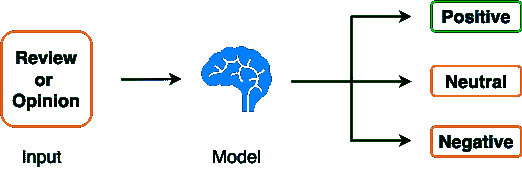
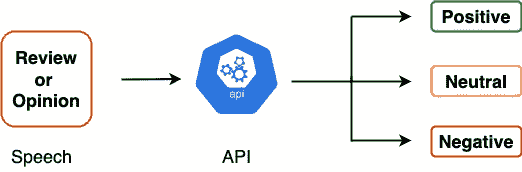
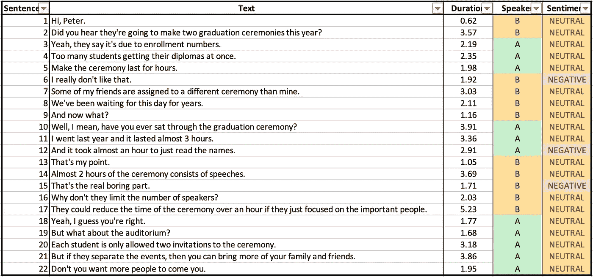

# 音频数据的会话情感分析

> 原文：<https://towardsdatascience.com/conversational-sentiment-analysis-on-audio-data-cd5b9a8e990b>

## 分析言语中的情感


[图为](https://unsplash.com/@towfiqu999999?utm_source=medium&utm_medium=referral) [Unsplash](https://unsplash.com?utm_source=medium&utm_medium=referral) 上的

情感分析，也称为观点挖掘，由于其不同的工业应用，是自然语言处理(NLP)中的一个热门任务。在将 NLP 技术专门应用于文本数据的情况下，主要目标是训练一个模型，该模型可以在不同的情感类别之间对给定的文本片段进行分类。下图显示了情感分类器的高级概述。



情感分析模型概述(图片由作者提供)

例如，三类分类问题的类可以是`Positive`、`Negative`和`Neutral`。三类情感分析问题的一个例子是流行的 [Twitter 情感分析](https://www.kaggle.com/datasets/jp797498e/twitter-entity-sentiment-analysis)数据集，这是一个实体级的情感分析任务，针对 Twitter 上各种用户发布的多语言推文。

虽然 NLP 中的大多数先前的研究和开发主要集中在对文本应用情感分析，但是最近，我们已经看到基于语音的交互工具在用户中的大规模采用和流行，使得研究人员和组织在语音空间中构建情感分类器。

因此，这篇文章将展示如何使用 **AssemblyAI API** 和 **Python** 构建一个基于对话数据的情感分析系统。端到端系统在涉及严格的客户支持和反馈评估的领域具有广泛的适用性——这使得它成为一个需要解决的重要且有价值的问题，尤其是在语音领域。最后，我还将展示一个广泛的分析，以增强所获得结果的可解释性，并从数据中得出适当的见解。

你可以在这里找到这篇文章[的代码](https://deepnote.com/workspace/avi-chawla-695b-aee6f4ef-2d50-4fb6-9ef2-20ee1022995a/project/Conversational-Sentiment-Analysis-6853cafe-37da-4641-aab4-f39fe0f09172/%2Fsentiment%20analysis.ipynb)。此外，文章的亮点如下:

[**对对话音频数据的情感分析**](#3f04)[**情感分析结果**](#7ea6)[**情感分析见解**](#802b)

# 会话音频数据的情感分析

在这一节中，我将演示如何使用 AssemblyAI API 将给定的一段预先录制的语音对话中的各个句子分为三个情感类别:`Positive`、`Negative`和`Neutral`。



通过 API 概述情感分析模型(图片由作者提供)

## 步骤 1:安装需求

构建情感分类器的要求很少。就 python 库而言，我们只需要 Python 中的`[requests](https://pypi.org/project/requests/)`包。这可以通过以下方式完成:

```
pip install requests
```

## 步骤 2:生成 API 令牌

下一步是在 AssemblyAI 网站上创建一个账户，这是免费的。一旦完成，您将获得您的私有 API 访问密钥，我们将使用它来访问语音到文本模型。

## 步骤 3:上传音频文件

出于本教程的目的，我将使用两个人之间预先录制的音频对话来对进行情感分析。一旦您获得了 API 密钥，您就可以继续对预先录制的音频文件执行情感分类任务。

但是，在此之前，您需要上传音频文件，以便可以通过 URL 访问它。选项包括上传到 AWS S3 桶，音频托管服务，如 SoundCloud 或 AssemblyAI 的自托管服务等。我已经将音频文件上传到 SoundCloud，可以在下面访问。

如果你想把音频文件直接上传到 AssemblyAI 的主机服务，你也可以这样做。我已经在下面的代码块中演示了这个循序渐进的过程。

## 步骤 3.1:进口要求

我们从导入项目的需求开始。

## 步骤 3.2:指定文件位置和 API_Key

接下来，我们需要指定音频文件在本地机器上的位置以及注册后获得的 API 密钥。

## 步骤 3.3:指定上传端点

*   `endpoint`:这指定了要调用的服务，在本例中是“上传”服务。
*   `headers`:保存 API 密钥和内容类型。

## 步骤 3.4:定义上传功能

音频文件一次最多只能上传 5 MBs (5，242，880 字节)。因此，我们需要分块上传数据。这些然后在服务端点上被合并回来。因此，您不需要担心处理大量的 URL。

## 第 3.5 步:上传

最后一步是调用 POST 请求。post 请求的响应是一个保存音频文件的`upload_url`的 JSON。我将使用这个 URL 来执行音频情感分类的后续步骤。

## 第四步:情感分析

在这一步，我们已经满足了对音频文件执行情感分析任务的所有必要的先决条件。现在，我们可以继续调用 API 来获取期望的结果。这是一个两步过程，将在下面的小节中演示。

## 步骤 4.1:提交文件进行转录

第一步是调用 HTTP Post 请求。这实质上是将你的音频文件发送给在后台运行的人工智能模型进行转录，并指示它们对转录的文本进行情感分析。

传递给 **POST** 请求的参数有:

1.  `endpoint`:指定要调用的转录服务。
2.  `json`:这个包含了你的音频文件的 URL 作为`audio_url`键。由于我们希望对会话数据进行情感分析，所以`sentiment_analysis`标志和`speaker_labels`被设置为`True`。
3.  `headers`:此处装有`authorization`键和`content-type`。

JSON 响应中收到的 post 请求的当前状态是`queued`。这表明音频当前正在被转录。

而且，JSON 响应中的`sentiment_analysis`标志也是`True`。然而，由于当前状态为`queued`，对应于`sentiment_analysis_results`键的值为**无**。

## 步骤 4.2:获取转录结果

为了检查 POST 请求的状态，我们需要使用上面收到的 JSON 响应中的`id`键发出 GET 请求。

接下来，我们可以继续处理 GET 请求，如下面的代码块所示。

传递给 **GET** 请求的参数是:

1.  `endpoint`:指定调用的服务和使用`id`键确定的 API 调用标识符。
2.  `headers`:这个保存了你唯一的 API 密匙。

这里你要知道转录结果要等到`status`键变成`completed`才准备好。转录所需的时间取决于输入音频文件的长度。因此，您必须定期发出重复的 GET 请求来检查转录状态。下面实现了一种简单的方法:

# 情感分析结果

一旦`status`变为`completed`，您将会收到类似下面提到的响应。

1.  JSON 响应中的`status`标记为`completed`。这表明在转录音频时没有错误。
2.  `text`键包含输入音频对话的完整转录，共 22 个句子。
3.  由于音频文件由多个扬声器组成，我们将`words`键中的所有`speaker`键视为**不为空**。`speaker`键是“A”或“b”
4.  我们可以看到所有单个单词和整个转录文本的置信度得分。分数范围从 0 到 1，0 为最低，1 为最高。
5.  使用 JSON 响应的`sentiment_analysis_results`键可以访问音频中 22 个单独句子的情感分析结果。
6.  对应每个句子，我们得到一个类似于上面第 4 点的`confidence`分数。
7.  使用句子词典的`sentiment`键可以检索每个句子的情感。第二句的情感分析结果如下所示:

# 情感分析洞察

JSONs 通常很难阅读和解释。因此，为了使数据在视觉上更具吸引力，并进行进一步的分析，让我们将上面的情感分析结果转换成一个数据框架。我们将存储句子的`text`、句子的`duration`、句子的`speaker`和句子的`sentiment`。这在下面实现:

用上面的代码片段生成的 DataFrame 如下图所示。这里，我们有在对话期间说出的 22 个句子，以及相应的说话者标签(“A”和“B”)，它们的持续时间(以秒计)，以及由模型预测的句子的情绪。



音频文件中的句子(图片由作者提供)

## 排名第一的扬声器分布

可以使用如下所示的`value_counts()`方法计算每个说话者说出的句子数量:

要查看发言者的百分比分布，我们可以将`normalize = True`传递给`value_counts()`方法，如下所示:

就句子数量而言，说话者“A”和“B”对对话的贡献是相等的。

## #2 发言者持续时间分布

接下来，让我们计算对话中每个发言者的个人贡献。如下所示:

我们使用`groupby()`方法计算他们演讲的总时长。就持续时间而言，说话者 A 是占优势的说话者。

## #3 情感分布

在对话中说出的 22 个句子中，只有 3 个被标记为`negative`情绪。此外，没有一个句子被预测为`positive`情绪。

归一化分布可以计算如下:

## #4 演讲者层面的情感分布

最后，让我们计算一下各个说话者的情绪分布。这里，为了更好的可视化，我们将使用`crosstab()`，而不是使用`groupby()`方法。下面演示了这一点:

说话者“A”所说的否定句比说话者“B”所说的多。

## 情感层面的平均句子时长排名第五

最后，我们将计算属于各个情感类别的句子的平均持续时间。这通过使用`groupby()`方法实现如下:

`negative`句的平均持续时间小于`neutral`句。

最后，在这篇文章中，我们讨论了 AssemblyAI API 的一个特定的 NLP 用例。具体来说，我们看到了如何在包含多个说话者的预先录制的音频文件上构建情感分类模块。最后，我们对情感分析结果进行了广泛的分析。从 API 获得的结果突出了输入音频文件中 22 个单独句子的情感。

你可以在这里找到这篇文章的代码。

在接下来的文章中，我将从技术和实践的角度讨论 AssemblyAI API 的更多用例，比如实体检测、内容审核等等。

下次见。感谢阅读。