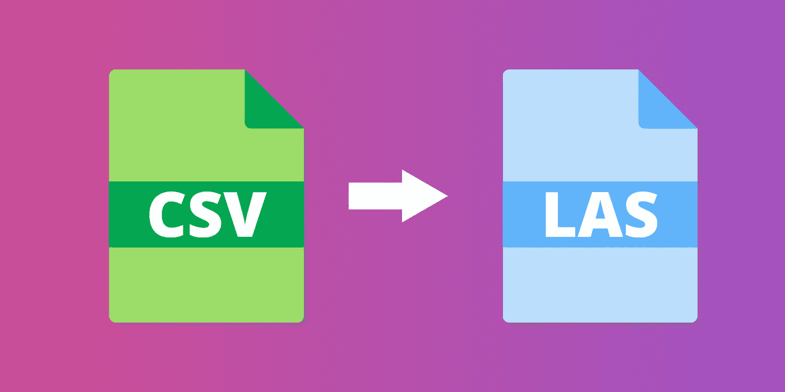
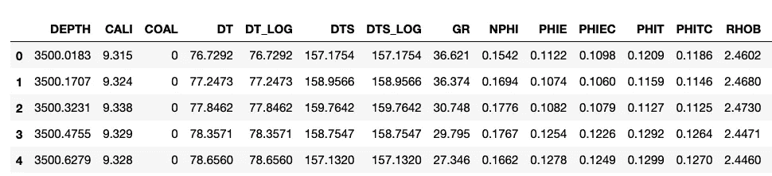
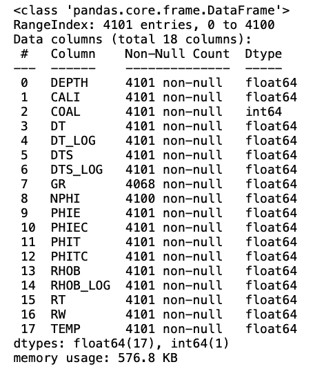
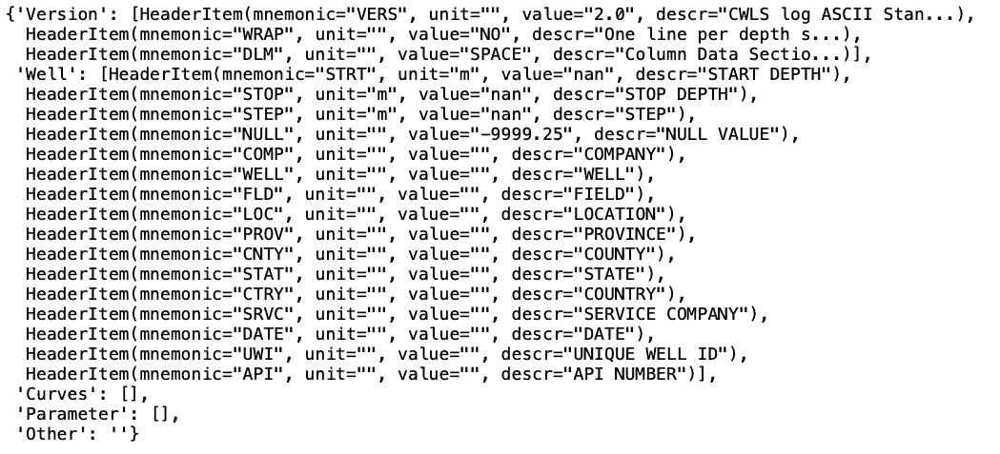
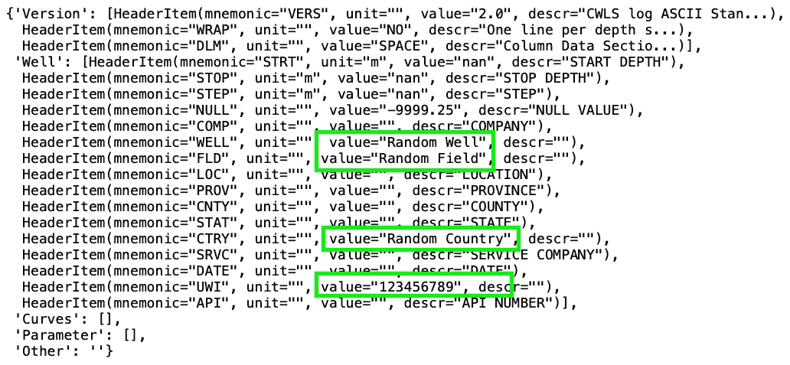
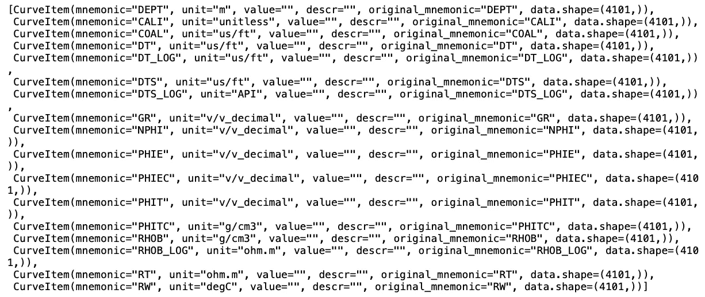

# 使用 Python 将 CSV 文件转换为 LAS 文件

> 原文：<https://towardsdatascience.com/convert-csv-files-to-las-files-with-python-7de4a47fc996>

## 快速简单的转换过程，使用 LASIO 和 CSV 数据从头开始创建 LAS 文件



使用 LASIO 从 CSV 到 LAS。作者创建的图像。

[测井数据](https://en.wikipedia.org/wiki/Well_logging)可以多种格式交付(、 [LAS](https://www.cwls.org/products/#products-las) 、CSV、ASC 等)。).如果你有一个包含测井数据的 CSV 文件，并且你想把它转换成 LAS 格式，你可以使用 [LASIO](https://lasio.readthedocs.io/en/latest/) 库

LAS 文件是一种简单的格式。它们是简单的文本文件，包含油井元数据、参数信息和测井数据测量值。这些文件很容易在任何文本编辑器中打开，您可以快速轻松地阅读内容。

但是，有时您可能会得到一个包含测井测量值的 CSV 文件，并希望将其转换为 LAS 文件。在这篇文章中，我们将涵盖这一点。

我们将看到如何使用优秀的 LASIO 库将一个简单的 CSV 文件转换成这样的 LAS 文件。

如果你愿意，你可以在我的 YouTube 频道下面观看这个版本。

# 笔记本和数据

你可以从我的 Github 仓库下载笔记本和数据，这里:[https://github.com/andymcdgeo/Petrophysics-Python-Series](https://github.com/andymcdgeo/Petrophysics-Python-Series)

# 加载所需的库

首先，我们将加载所需的 python 库。在本教程中，我们将使用[拉西奥](https://lasio.readthedocs.io/)和[熊猫](https://pandas.pydata.org/)。

```
import lasio
import pandas as pd
```

有关使用 lasio 的更多信息，请点击此处查看本文:

[](https://andymcdonaldgeo.medium.com/loading-and-displaying-well-log-data-b9568efd1d8)  

# 使用熊猫载入 CSV 文件

接下来，我们需要加载我们的 CSV 文件。

这是使用 pandas 的`read_csv()`函数并传入文件位置和文件名来完成的。

```
data = pd.read_csv('Data/Notebook 22/Notebook 22 - VOLVE - 15_9-19.csv')
```

一旦文件被读取，我们就可以通过调用 pandas `data.head()`函数来检查文件的内容。

```
data.head()
```

它返回一个包含数据统计信息的表格。



测井数据的数据帧头。图片由作者提供。

我们现在可以看到，在我们的[数据框架](https://pandas.pydata.org/docs/reference/api/pandas.DataFrame.html)中有 18 列，以及测井记录测量的混合。

为了确保数据都是数字，并了解数据中有多少个空值，我们可以调用 pandas 函数`[.info()](https://pandas.pydata.org/docs/reference/api/pandas.DataFrame.info.html?highlight=info#pandas-dataframe-info)`。这不是一个必要的步骤，但是它允许我们检查列是否是数字的(float64 或 int64)。

```
data.info()
```



dataframe.info()方法应用于测井数据，指示数据类型和空计数。图片由作者提供。

# 用 LASIO 创建一个空的 LAS 对象

在将数据从 CSV 传输到 LAS 之前，我们首先需要创建一个空白的 LAS 文件。这是通过调用`lasio.LASFile()`并将其赋给一个变量来实现的。在这个例子中，这个变量叫做`las_file`。

```
las_file = lasio.LASFile()
```

当我们尝试查看新创建的 LAS 文件的内容时，我们可以看到标题信息为空。

```
las_file.header
```



我们还可以通过调用`las_file.curves`来确认文件中没有数据，这将返回一个空列表。

# 设置 LAS 文件元数据

现在我们有了一个空白的 las 对象，我们需要向 LAS 头添加信息。

第一步是创建一些我们想要填充的变量。这样做，而不是直接将它们传递到 HeaderItem 函数中，使得将来更改它们更容易，也使得可读性更好。

例如，如果我们创建了一个函数，我们希望根据不同的文件更新头文件中的特定参数，我们可以很容易地将这些变量传递到函数中，而不必更新函数中的代码。

```
well_name = 'Random Well'
field_name = 'Random Field'
uwi = '123456789'
country = 'Random Country'
```

要开始给标题赋值，我们需要调用`las_file.well`并选择我们想要添加的标题属性。在右边，我们将更新 HeaderItem 并为其提供一个值。

```
las_file.well['WELL'] = lasio.HeaderItem('WELL', value=well_name)
las_file.well['FLD'] = lasio.HeaderItem('FLD', value=field_name)
las_file.well['UWI'] = lasio.HeaderItem('UWI', value=uwi)
las_file.well['CTRY'] = lasio.HeaderItem('CTRY', value=country)
```

完成后，我们可以再次调用我们的头，我们现在可以看到井名、UWI、国家和字段名称的值都已更新。

```
las_file.header
```



# 添加深度曲线

要将曲线添加到文件中，我们可以使用`add_curve`功能并传入数据和单位。

此处的示例显示了如何将一条曲线添加到名为 DEPT 的文件中。注意，如果添加主深度数据，它需要作为 DEPT 而不是 depth 放入。

```
las_file.add_curve('DEPT', data['DEPTH'], unit='m')
```

# 书写剩余的曲线

为了使事情变得简单，我创建了一个包含每条测井曲线的测量单位的列表。请注意，这不包括深度测量的单位。

```
units = ['m',
 'inches',
 'unitless',
 'us/ft',
 'us/ft',
 'us/ft',
 'us/ft',
 'API',
 'v/v_decimal',
 'v/v_decimal',
 'v/v_decimal',
 'v/v_decimal',
 'v/v_decimal',
 'g/cm3',
 'g/cm3',
 'ohm.m',
 'ohm.m',
 'degC']
```

然后，我们可以开始遍历数据帧中的每个测井测量值/列以及单位列表。这是使用 Python `zip`函数实现的。

因为我们在 las 文件中已经有了深度，所以我们可以通过检查列名来跳过这一列。还有其他处理方法，例如将深度和曲线一次性写入 las 文件。

```
for col, unit in zip(data.columns, units):
    if col != 'DEPTH':
        las_file.add_curve(col, data[col], unit=unit)
```

当我们检查`curves`函数时，我们可以看到我们所有的曲线都有适当的单位。我们还可以从列表的 data.shape 部分看到，每条曲线有 4101 个值，这证实了我们有数据。

```
las_file.curves
```



我们可以通过调用曲线来确认我们有值。在下面的例子中，我调用了 GR，我们得到了一个返回的包含伽马射线值的数组，它与前面给出的 dataframe 中的值相匹配。

```
las_file['GR']
```

它返回:

```
array([  36.621,   36.374,   30.748, ..., -999\.   , -999\.   , -999\.   ])
```

# 导出 LAS 文件

一旦我们对 las 文件感到满意，我们现在可以将其导出到一个文件中，并在任何其他软件包中使用它。

```
las_file.write('Output/Notebook 22/OutputLAS_FINAL.las')
```

# 摘要

在本文中，我们介绍了如何将包含测井/岩石物理测量值的简单 CSV 文件转换为行业标准 LAS (Log ASCII 标准)文件。一旦在 lasio 中创建了一个空白的 LASFile 对象，就可以用正确的元数据手动更新标题项，也可以用正确的值更新曲线。

*感谢阅读。在你走之前，你一定要订阅我的内容，把我的文章放到你的收件箱里。* [***你可以在这里做！***](https://andymcdonaldgeo.medium.com/subscribe)

其次，通过注册会员，你可以获得完整的媒介体验，并支持我自己和成千上万的其他作家。它每个月只花你 5 美元，你可以完全接触到所有令人惊叹的媒体文章，也有机会用你的写作赚钱。如果你使用 [***我的链接***](https://andymcdonaldgeo.medium.com/membership)**报名，你会直接用你的一部分费用支持我，不会多花你多少钱。如果你这样做了，非常感谢你的支持！**

*[](https://andymcdonaldgeo.medium.com/membership) *