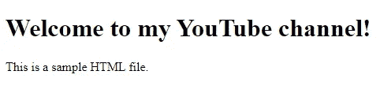

# 使用 Python 将 HTML 转换为 PDF

> 原文：<https://towardsdatascience.com/convert-html-to-pdf-using-python-4df78b40de1b>

## 在本教程中，我们将探索如何使用 Python 将 HTML 文件转换为 PDF


弗洛里安·奥利佛在 [Unsplash](https://unsplash.com/s/photos/html?utm_source=unsplash&utm_medium=referral&utm_content=creditCopyText) 上拍摄的照片

**目录**

*   介绍
*   示例 HTML 文件
*   使用 Python 将 HTML 文件转换为 PDF
*   使用 Python 将网页转换为 PDF
*   结论

# 介绍

有几个在线工具可以让你把 HTML 文件和网页转换成 PDF 格式，而且大多数都是免费的。

虽然这是一个简单的过程，但能够自动化它对于一些 HTML 代码测试以及将所需网页保存为 PDF 文件非常有用。

要继续学习本教程，我们需要:

*wkhtmltopdf* 是一个开源命令行工具，使用 Qt WebKit 渲染引擎将 HTML 文件渲染成 pdf。

为了在 Python 中使用它，我们还需要 *pdfkit* 库，它是 *wkhtmltopdf* 实用程序的包装器。

首先，为您的操作系统搜索 [wkhtmltopdf 安装程序](https://wkhtmltopdf.org/downloads.html)。对于 Windows，你可以在这里找到最新版本的 *wkhtmltopdf* 安装程序。只需下载。exe 文件并安装在您的计算机上。

记住安装目录的路径。
在我这里是:**C:\ Program Files \ wkhtmltopdf**

如果您没有安装 Python 库，请打开“命令提示符”(在 Windows 上)并使用以下代码进行安装:

```
pip install pdfkit
```

# 示例 HTML 文件

为了继续学习本教程，我们需要一些 HTML 文件。

下面是我们将在本教程中使用的一个示例 HTML 文件:

【https://pyshark.com/wp-content/uploads/2022/06/sample.html】

如果您下载它并在浏览器中打开，您应该会看到:



在代码编辑器中打开它，应该会显示:

# 使用 Python 将 HTML 文件转换为 PDF

让我们从使用 Python 将 HTML 文件转换成 PDF 开始。

**sample.html**文件与 **main.py** 文件位于同一目录下，代码为:


首先，我们需要找到 *wkhtmltopdf* 可执行文件**wkhtmltopdf.exe**的路径

回想一下，我们在**C:\ Program Files \ wkhtmltopdf**中安装了。exe 文件在该文件夹中。导航到它，您应该看到可执行文件的路径是:*C:\ Program Files \ wkhtmltopdf \ bin \ wkhtmltopdf . exe*

现在，我们已经拥有了所需的一切，可以使用 Python 轻松地将 HTML 文件转换为 PDF:

您应该会看到 sample.pdf 的**创建在同一个目录中:**


作者图片

哪个应该看起来像[这个](https://pyshark.com/wp-content/uploads/2022/06/sample.pdf)。

# 使用 Python 将网页转换为 PDF

使用 pdfkit 库，您还可以使用 Python 将网页转换为 PDF。

让我们把 [wkhtmltopdf](https://wkhtmltopdf.org/) 项目页面转换成 pdf！

在这一节中，我们将重用前一节中的大部分代码，除了现在我们将使用网页的 URL 和**而不是 HTML 文件。pdfkit 类的 from_url()** 方法:

您应该会看到**webpage.pdf**创建在同一个目录中:


作者图片

哪个应该看起来像[这个](https://pyshark.com/wp-content/uploads/2022/06/webpage.pdf)。

# 结论

在本文中，我们探索了如何使用 Python 和 *wkhtmltopdf* 将 HTML 转换成 PDF。

如果你有任何问题或对编辑有任何建议，请随时在下面留下评论，并查看我的更多 [Python 编程](https://pyshark.com/category/python-programming/)教程。

*原载于 2022 年 6 月 23 日 https://pyshark.com**的* [*。*](https://pyshark.com/convert-html-to-pdf-using-python/)