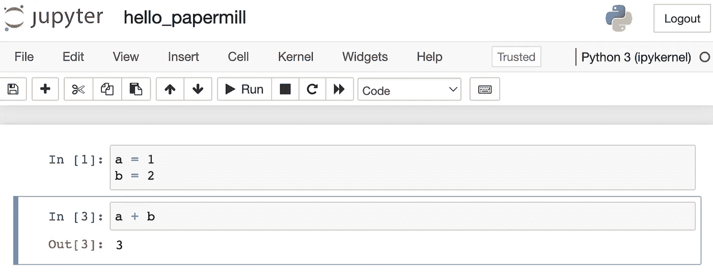
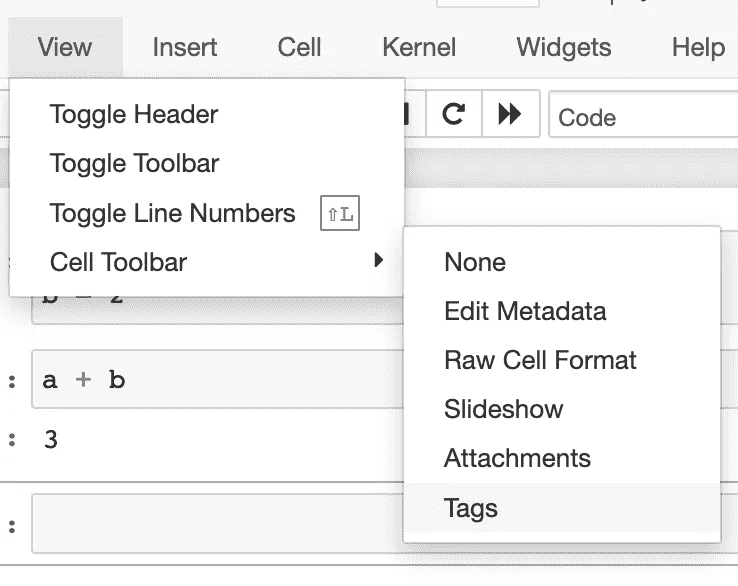
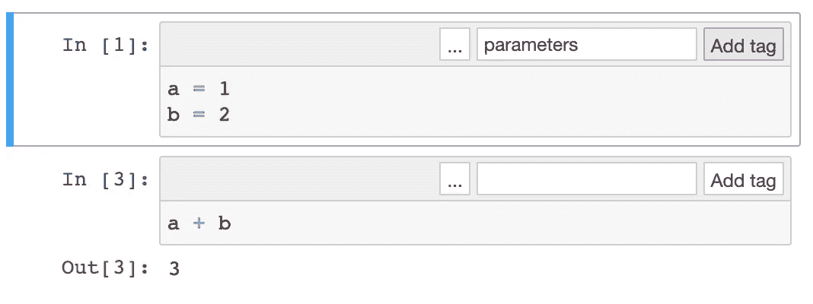
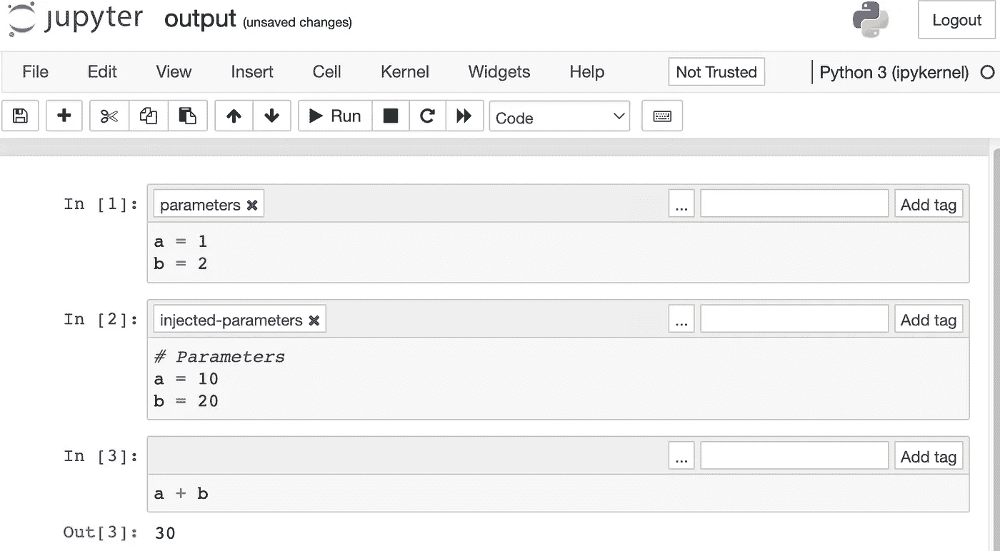
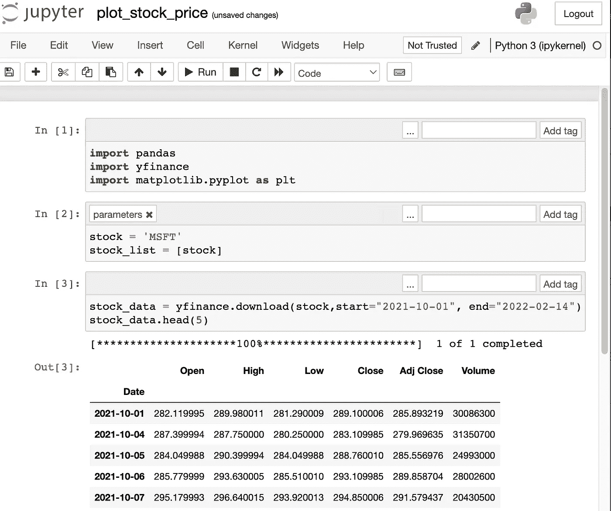
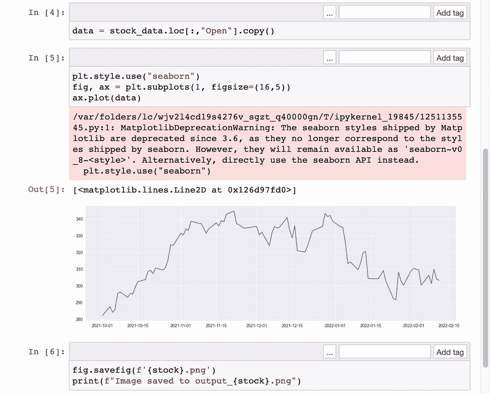
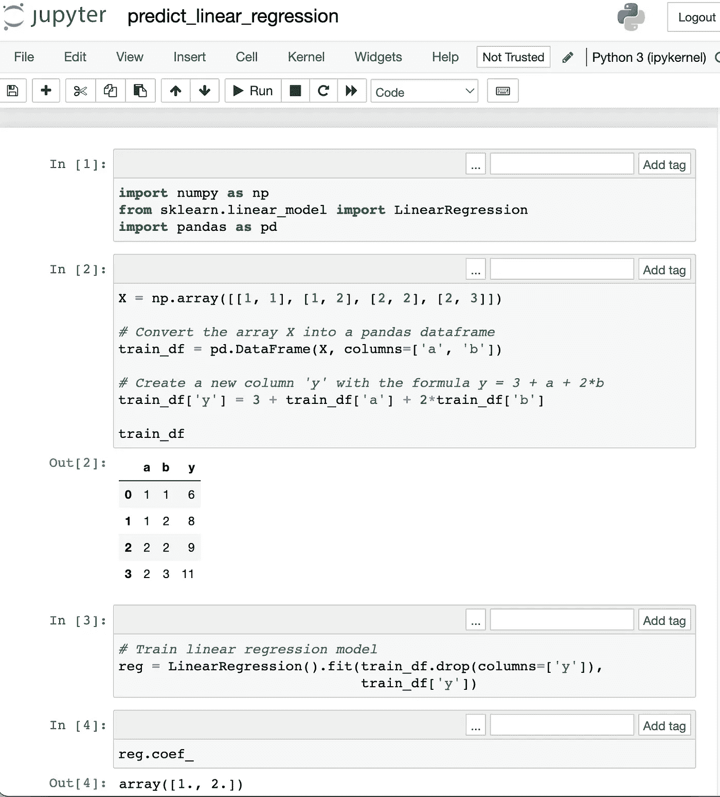
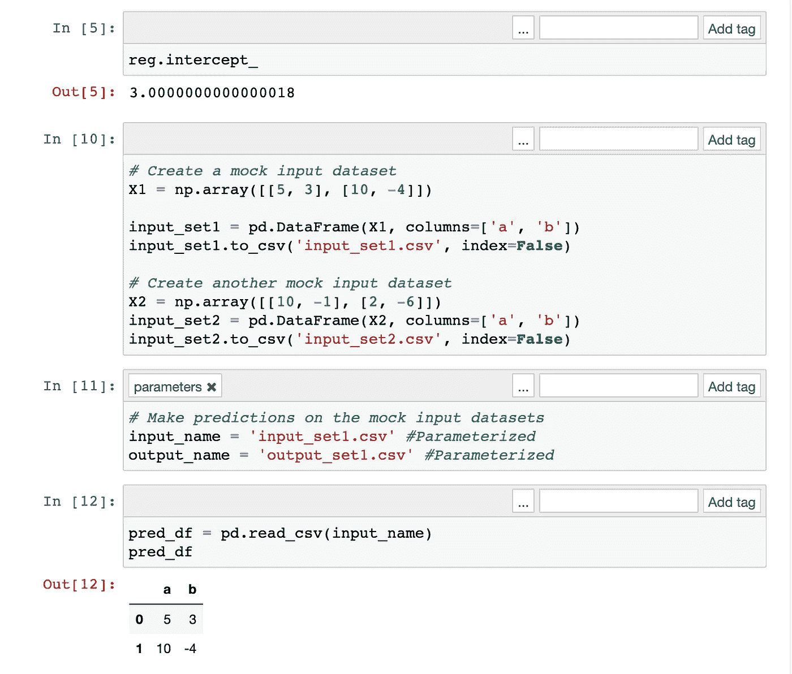
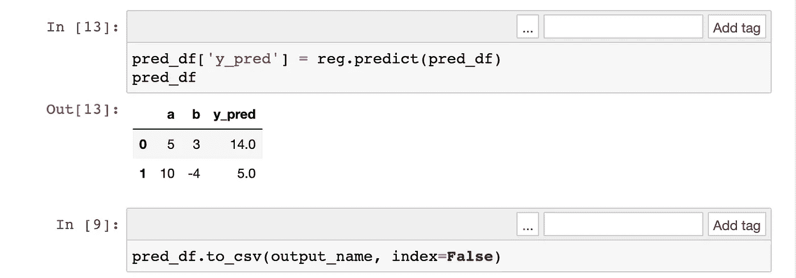

# 将 Jupyter 笔记本转换为功能

> 原文：<https://towardsdatascience.com/convert-jupyter-notebooks-into-functions-6fbda7b18419>

## 参数化笔记本，以便您可以通过编程方式运行它们

你已经在 Jupyter 笔记本上训练了你的机器学习模型。现在，您希望对每天获得的数据运行该模型。

日复一日，你创建了同一个笔记本的新副本并运行它。您存储笔记本的副本，并将结果传递给利益相关者。

在另一个场景中，您每天都有一组新的数据需要在 Jupyter notebook 上用相同的代码可视化。

因此，您创建了同一个笔记本的新副本，并修改了输入。同样，您存储笔记本的副本，并将结果传递给您的利益相关者。

听起来不痛苦吗？


这是你的桌面吗？只是一堆笔记本叠在一起而已！稳定扩散成像

如果我们有一个函数`run_notebook(input_data)`，这个问题就可以解决。通过提供参数`input_data`，笔记本将使用新的 input_data 运行。输出将是使用新数据运行的笔记本的副本。

这正是造纸厂所做的。

这里有一个它的快速演示。

# Papermill:参数化并自动执行 Jupyter 笔记本

它是一个用于参数化、执行和分析 Jupyter 笔记本的开源工具。只需将参数传入笔记本，Jupyter 笔记本就会自动运行。

## 造纸厂的使用案例

如果手动对多个数据集进行相同的分析，既耗时又容易出错。例如，每日报告控制面板可能需要每天根据新数据进行刷新。Papermill 实现了自动化。

Jupyter 笔记本中的机器学习算法可能用于每天生成结果。Papermill 可用于在生产中生成结果，而不是每天用新数据手动运行笔记本。

在这篇文章中，我回顾了:

*   安装造纸厂
*   Papermill 入门
*   使用 Papermill 定期生成可视化报告
*   在造纸厂生产中运行机器学习算法
*   你可以用 Papermill 做的其他事情
*   进一步的阅读和资源

# 1.安装造纸厂

只需在您的终端中运行以下命令。

```
pip install papermill[all]
```

# 2.Papermill 入门

## 在朱庇特笔记本上

1.  在你的桌面上创建一个 Jupyter 笔记本，命名为`hello_papermill`
2.  比方说，我们要参数化 *a* 和 *b* 来计算`a+b`。我们将创建这个代码块。



3.转到工具栏->视图->单元格工具栏->标签。



4.在第一个单元格的右上角键入`parameters`。点击“添加标签”。笔记本参数化！



5.启动终端并导航到您的桌面。

对于 Mac 用户，该命令是:

```
cd ~/Desktop/ 
```

对于 Windows 用户，该命令为

```
cd C:\Users\YOUR_USER_NAME_HERE\Desktop
```

6.用这个命令运行你的参数化笔记本。该命令告诉 Papermill“使用参数`a=10`和`b=20`运行`hello_papermill.ipynb`，并将结果存储在`output.ipynb`中”

```
papermill hello_papermill.ipynb output.ipynb -p a 10 -p b 20
```

7.从 Jupyter 界面，打开`output.ipynb`。您应该会看到以下自动生成的内容。



单元格[1]中的所有输入都被单元格[2]中的参数覆盖。请注意，单元格[2]是由 Papermill 自动生成的，并且具有注入参数标签。

# 3.使用 Papermill 定期生成可视化报告

现在我们已经浏览了 Papermill 的“hello world ”,让我们深入第一个可能的用例。

在运行这段代码之前，请安装以下软件包。

```
pip install yfinance
pip install matplotlib
```

在我的`Desktop`上，我创建了一个叫做`plot_stock_price`的 Jupyter 笔记本。

本笔记本:

*   接受参数`stock`，它是公司的股票代码(微软用`MSFT`，特斯拉用`TSLA`，Meta 用`Meta`)，
*   提取一家公司的股票价格，
*   绘制图表，
*   将图形导出为名为`output_{stock}.png`的文件

这是代码。

```
import pandas
import yfinance
import matplotlib.pyplot as plt

# selecting a stock ticker
stock = 'MSFT' # This line is parameterized.
stock_list = [stock]

# downloading the stock
stock_data = yfinance.download(stock,start="2021-10-01", end="2022-02-14")
stock_data.head(5)

# plot only the Opening price of ticket
data = stock_data.loc[:,"Open"].copy()

# Plot the data with matplotlib
plt.style.use("seaborn")
fig, ax = plt.subplots(1, figsize=(16,5))
ax.plot(data)

# Save the image as a PNG file
fig.savefig(f'output_{stock}.png')
print(f"Image saved to output_{stock}.png")
```



接下来，再次打开您的终端并导航到您的桌面。(上面我提供了一些说明)。运行此命令。这告诉 papermill“使用参数`stock='TSLA'`运行`plot_stock_price.ipynb`，并将输出笔记本存储到`output.ipynb`”。

```
papermill plot_stock_price.ipynb output_TSLA.ipynb -p stock 'TSLA' 
```

您应该在终端中看到类似这样的内容。

```
Input Notebook:  plot_stock_price.ipynb
Output Notebook: output_TSLA.ipynb
Executing:   0%|                                                                                                                                          | 0/8 [00:00<?, ?cell/s]
Executing notebook with kernel: python3
Executing: 100%|██████████████████████████████████████████████████████████████████████████████████████████████████████████████████████████████████| 8/8 [00:04<00:00,  1.81cell/s]
```

最后，再次检查你的桌面。你应该会看到两个文件:`output_TSLA.ipynb`和`output_TSLA.png`。太好了，我们已经成功运行了参数化笔记本。

# 4.在经过训练的机器上对不同数据集进行预测

下一个用例是我们熟悉的。

你已经在笔记本上训练了你的机器学习算法。现在，您需要定期对新数据运行算法。

在运行这段代码之前，请安装以下软件包。

```
pip install scikit-learn
pip install pandas
pip install numpy
```

在我的`Desktop`上，我创建了一个叫做`predict_linear_regression`的 Jupyter 笔记本。

这个笔记本

*   基于模拟数据训练线性回归模型，
*   以输入文件(CSV)格式作为参数读入，
*   创建模拟输入，
*   基于 CSV 文件中的输入进行预测，并且
*   将预测导出为名为`output_{stock}.png`的文件

```
import numpy as np
from sklearn.linear_model import LinearRegression
import pandas as pd

X = np.array([[1, 1], [1, 2], [2, 2], [2, 3]])

# Convert the array X into a pandas dataframe
train_df = pd.DataFrame(X, columns=['a', 'b'])

# Create a new column 'y' with the formula y = 3 + a + 2*b 
np.random.seed(5)
train_df['y'] = 3 + train_df['a'] + 2*train_df['b'] 

reg = LinearRegression().fit(train_df.drop(columns=['y']), 
                             train_df['y'])

# Create a mock input dataset 
X1 = np.array([[5, 3], [10, -4]])
input_set1 = pd.DataFrame(X1, columns=['a', 'b'])
input_set1.to_csv('input_set1.csv', index=False)

# Create another mock input dataset
X2 = np.array([[10, -1], [2, -6]])
input_set2 = pd.DataFrame(X2, columns=['a', 'b'])
input_set2.to_csv('input_set2.csv', index=False)

# Make predictions on the mock input datasets
input_name = 'input_set1.csv' # Parameterized
output_name = 'output_set1.csv' # Parameterized

# Read test input
pred_df = pd.read_csv(input_name)

# Make predictions 
pred_df['y_pred'] = reg.predict(pred_df)

pred_df.to_csv(output_name, index=False)
```



接下来，再次打开您的终端并导航到您的桌面。(上面我提供了一些说明)。运行此命令。这告诉 papermill“使用参数输入名`='input_set2.csv'`和输出名`='output_set2.csv'`运行`predict_linear_regression.ipynb`。最后，将输出笔记本存储到`predict_output.ipynb`。

```
papermill ./predict_linear_regression.ipynb ./predict_output2.ipynb -p input_name './input_set2.csv' -p output_name './output_set2.csv' 
```

您应该在终端中看到类似这样的内容。

```
Input Notebook:  ./predict_linear_regression.ipynb
Output Notebook: ./predict_output2.ipynb
Executing:   0%|                                                                                                                                         | 0/11 [00:00<?, ?cell/s]Executing notebook with kernel: python3
Executing: 100%|████████████████████████████████████████████████████████████████████████████████████████████████████████████████████████████████| 11/11 [00:05<00:00,  2.12cell/s]
```

最后，再次检查你的桌面。你应该看到两个文件:`predict_output2.ipynb`和`output_set2.csv`。很好，我们已经成功地为机器学习用例运行了一个参数化的笔记本。

# 5.用 Papermill 做更多

Papermill 还有更多有用的功能。这里我强调几个有趣的用法。

## 将笔记本电脑作为功能运行

你可以把笔记本作为一个函数来执行，而不是在终端中执行笔记本。这里有两个实现相同目标的备选方案。

备选方案 1:在终端中，导航到包含`predict_linear_regression.ipynb`的目录。然后，运行命令

```
papermill ./predict_linear_regression.ipynb ./predict_output2.ipynb -p input_name './input_set2.csv' -p output_name './output_set2.csv'
```

备选方案 2:在 Jupyter 中，导航到包含`predict_linear_regression.ipynb`的目录。在那里创建一个新的笔记本并运行命令。

```
import papermill as pm

pm.execute_notebook(
   'predict_linear_regression.ipynb',
   'predict_output2.ipynb',
   parameters = {'input_name': './input_set2.csv', 
                 'output_name': './output_set2.csv')
```

## 将您的结果上传到亚马逊 S3 或云

```
$ papermill predict_linear_regression.ipynb s3://bkt/output.ipynb -p alpha 0.6 -p l1_ratio 0.1
```

## 提供一个. yml 文件，而不是参数

```
$ papermill predict_linear_regression.ipynb s3://bkt/output.ipynb -f parameters.yaml
```

# 6.造纸厂的更多资源

*   网飞公布了他们如何使用 Papermill 自动执行笔记本日常数据分析和工程工作。
*   阅读[文档](https://github.com/nteract/papermill)以更清楚地了解它是如何工作的。

在这篇博文中，我们学习了如何用 Papermill 参数化一个笔记本。这是优化数据科学工作流程的绝佳工具。试试看！


使用 Papermill，这样你的笔记本就可以放在适当的位置。

我是 Travis Tang，在 tech 工作的数据科学家。我在开源图书馆的 TowardsDataScience 上发表博文。每天，我都会在 LinkedIn 上发布数据科学技巧。关注我，获取更多定期更新。