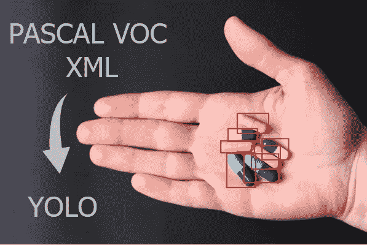
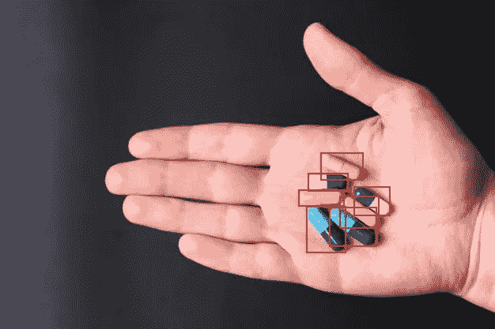

# 将 PASCAL VOC XML 转换为 YOLO 用于对象检测

> 原文：<https://towardsdatascience.com/convert-pascal-voc-xml-to-yolo-for-object-detection-f969811ccba5>

## 预处理影像数据集的技巧和诀窍



作者图片

本教程涵盖以下分步指南:

*   将 XML 注释转换为 YOLO 注释
*   使用新创建的 YOLO 注释可视化图像中的边界框
*   将数据集分为训练集、验证集和测试集

# 概观

## PASCAL VOC XML

PASCAL 视觉对象类(VOC)项目是最早的计算机视觉项目之一，旨在标准化数据集和注释格式。注释可以用于图像分类和对象检测任务。

以下代码片段是 PASCAL VOC XML 注释的示例:

根据其规范，注释将以人类可读的 XML 格式定义，并与图像具有相同的名称(除了扩展名之外)。它应该具有以下项目:

*   `folder` —图像的父目录。
*   `filename` —图像的名称(包括扩展名)。
*   `path` —图像的绝对路径
*   `source:database` —文件在数据库中的原始位置。仅在使用数据库时适用。否则，它将默认为`Unknown`。
*   `size:width` —图像的宽度，以像素为单位。
*   `size:height` —图像的高度，以像素为单位。
*   `size:depth` —图像的深度。对于对象检测任务，它表示通道的数量。
*   `segmented`-确定注释是线性的(0)还是非线性的(1)。非线性是指多边形形状。
*   `object:name` —对象的标签。
*   `object:pose` —确定对象的方向是否不同。正常图像默认为`Unspecified`。
*   `object:truncated` —确定对象是完全可见(0)还是部分可见(1)。部分可见是指隐藏在另一个对象后面的对象。
*   `object:difficult` —确定物体是易于识别(0)还是难以识别(1)。
*   `object:bndbox:xmin` —左上位置的 x 坐标。
*   `object:bndbox:ymin` —左上位置的 y 坐标。
*   `object:bndbox:xmax` —右下角位置的 x 坐标。
*   `object:bndbox:ymax` —右下角位置的 y 坐标。

PASCAL VOC XML 注释的一个主要问题是，我们不能直接使用它进行训练，尤其是在对象检测任务上。大多数最新的模型依赖于不同的注释格式。最受欢迎的是:

*   COCO——一个 JSON 文件包含整个数据集的五个信息部分。
*   YOLO —每个图像的单独文本文件，与预期图像具有相同的名称。

## YOLO

YOLO 的规格如下:

*   每个对象在文本文件中都应该有自己的一行
*   每一行应具有以下模式:`class x_center y_center width height`
*   类别号必须是从 0 开始的整数
*   `x_center`、`y_center`、`width`、`height`必须为规范化形式(范围从 0 到 1)

例如，上述注释可以用 YOLO 格式表示如下:

```
0 0.65814696485623 0.6966426858513189 0.07987220447284345 0.14148681055155876
0 0.7124600638977636 0.6882494004796164 0.09584664536741214 0.11990407673860912
```

继续下一节，学习如何将 XML 注释转换成 YOLO 文本文件。

# 将 PASCAL VOC XML 转换为 YOLO

在工作目录中创建一个名为`xml2yolo.py`的新脚本。确保数据集和 Python 脚本的结构如下:

```
root
├──annotations (folder)
├  ├── 1.xml
├  ├── 2.xml
├  └── n.xml
├──images (folder)
├  ├── 1.jpg
├  ├── 2.jpg
├  └── n.jpg
└──xml2yolo.py
```

## 导入

首先，在文件顶部追加以下导入语句:

```
import xml.etree.ElementTree as ET
import glob
import os
import json
```

## 效用函数

然后，定义以下效用函数:

*   `xml_to_yolo_bbox` —将 XML 边界框(`xmin`、`ymin`、`xmax`、`ymax`)转换为 YOLO 边界框(`x_center`、`y_center`、`width`、`height`)
*   `yolo_to_xml_bbox` —将 YOLO 边界框转换为 XML 边界框

```
def xml_to_yolo_bbox(bbox, w, h):
    # xmin, ymin, xmax, ymax
    x_center = ((bbox[2] + bbox[0]) / 2) / w
    y_center = ((bbox[3] + bbox[1]) / 2) / h
    width = (bbox[2] - bbox[0]) / w
    height = (bbox[3] - bbox[1]) / h
    return [x_center, y_center, width, height]def yolo_to_xml_bbox(bbox, w, h):
    # x_center, y_center width heigth
    w_half_len = (bbox[2] * w) / 2
    h_half_len = (bbox[3] * h) / 2
    xmin = int((bbox[0] * w) - w_half_len)
    ymin = int((bbox[1] * h) - h_half_len)
    xmax = int((bbox[0] * w) + w_half_len)
    ymax = int((bbox[1] * h) + h_half_len)
    return [xmin, ymin, xmax, ymax]
```

## 初始化

继续将以下变量添加到脚本中:

```
classes = []
input_dir = "annotations/"
output_dir = "labels/"
image_dir = "images/"os.mkdir(output_dir)
```

> 注意，如果在当前工作目录中存在一个名为 labels 的文件夹，那么`os.mkdir`将会产生一个错误。没有添加异常处理，因为它允许我们识别剩余文件并在干净的状态下工作。我们可以添加以下条件语句，在创建新目录之前检查该目录是否存在:

```
if not os.path.isdir(output_dir):
    os.mkdir(output_dir)
```

## 获取 XML 文件

之后，使用`glob.glob`函数获取`annotation`文件夹中所有`xml`文件的列表。循环检查标签文件是否有对应的图像:

```
files = glob.glob(os.path.join(input_dir, '*.xml'))
for fil in files:
    basename = os.path.basename(fil)
    filename = os.path.splitext(basename)[0]
    if not os.path.exists(os.path.join(image_dir, f"{filename}.jpg")):
        print(f"{filename} image does not exist!")
        continue
```

> 从逻辑上讲，标签文件应该有相应的图像文件。然而，图像文件不一定需要标签文件。一个图像文件可能不包含任何对象，我们称之为背景图像。

上面的代码将打印出没有图像对的注释的名称。要么删除注释，要么填充丢失的图像。

## 解析 XML 文件的内容

随后，使用`ET`模块解析 xml 文件的内容。调用`find`或`findall`函数从文件中提取特定的元素。每个元素对象都包含内置的`text`函数来获取底层值。追加结果，并将其保存为具有相同基本名称的文件。

```
files = glob.glob(os.path.join(input_dir, '*.xml'))
for fil in files:

    ... result = [] tree = ET.parse(fil)
    root = tree.getroot()
    width = int(root.find("size").find("width").text)
    height = int(root.find("size").find("height").text) for obj in root.findall('object'):
        label = obj.find("name").text
        if label not in classes:
            classes.append(label)
        index = classes.index(label)
        pil_bbox = [int(x.text) for x in obj.find("bndbox")]
        yolo_bbox = xml_to_yolo_bbox(pil_bbox, width, height)
        bbox_string = " ".join([str(x) for x in yolo_bbox])
        result.append(f"{index} {bbox_string}") if result:
        with open(os.path.join(output_dir, f"{filename}.txt"), "w", encoding="utf-8") as f:
            f.write("\n".join(result))
```

> 注意，新标签会自动添加到`classes`变量中。索引基于相应标签的第一次出现。因此，我们应该将 classes 变量保存为文本文件以供参考:

```
with open('classes.txt', 'w', encoding='utf8') as f:
    f.write(json.dumps(classes))
```

它将生成一个名为`classes.txt`的文本文件。文本文件将包含表示数据集中所有唯一类的字符串列表。例如:

```
["tablets"]
```

## 运行脚本

转换的[完整脚本如下:](https://gist.github.com/wfng92/c77c822dad23b919548049d21d4abbb8)

运行以下命令，将 XML 注释转换为 YOLO 格式的文本文件:

```
python xml2yolo.py
```

# 可视化边界框

在训练之前检查数据集的质量是一个很好的做法。有时，注释或图像配对可能是错误的。因此，需要验证数据集的质量。一个好方法是在相应图像的顶部绘制边界框。

我们可以使用`Pillow`或`OpenCV`包。本教程使用`Pillow`包来绘制边界框。

让我们创建另一个名为`draw.py`的脚本来可视化注释和图像。

## 导入

将以下导入语句添加到文件中:

```
from PIL import Image, ImageDraw
```

## 效用函数

我们将需要两个效用函数:

*   `yolo_to_xml_bbox` —将 YOLO 边界框转换回 XML 格式(基于像素)。这主要是因为`Pillow`的所有`ImageDraw.Draw`功能都使用像素。
*   `draw_image` —在输入图像的顶部绘制边界框。然后，通过用户界面显示出来。

```
def yolo_to_xml_bbox(bbox, w, h):
    # x_center, y_center width heigth
    w_half_len = (bbox[2] * w) / 2
    h_half_len = (bbox[3] * h) / 2
    xmin = int((bbox[0] * w) - w_half_len)
    ymin = int((bbox[1] * h) - h_half_len)
    xmax = int((bbox[0] * w) + w_half_len)
    ymax = int((bbox[1] * h) + h_half_len)
    return [xmin, ymin, xmax, ymax]def draw_image(img, bboxes):
    draw = ImageDraw.Draw(img)
    for bbox in bboxes:
        draw.rectangle(bbox, outline="red", width=2)
    img.show()
```

> 将`outline`变量修改为边界框的不同颜色。

## 初始化

继续初始化以下变量:

```
image_filename = "images/medical_pills.jpg"
label_filename = "labels/medical_pills.txt"
bboxes = []
```

> 相应地替换文件名。

## 图像处理

加载图像并将预处理数据存储到`bboxes`变量中:

```
img = Image.open(image_filename)with open(label_filename, 'r', encoding='utf8') as f:
    for line in f:
        data = line.strip().split(' ')
        bbox = [float(x) for x in data[1:]]
        bboxes.append(yolo_to_xml_bbox(bbox, img.width, img.height))
```

## 绘制边界框

最后，调用`draw_image`实用函数在图像上绘制边界框:

```
draw_image(img, bboxes)
```

## 运行脚本

以下 [Github 要点](https://gist.github.com/wfng92/f7d2e70f6e71ea672ffc2f96f8bb8cd0)中的完整脚本:

保存文件并在终端上运行以下命令:

```
python draw.py
```

该脚本将显示一个图像，并在其上绘制相应的边界框。例如:



作者图片

> 如果边界框与预期结果不一致，则图像或注释是错误的。

# 分成不同的组

下一步是将数据集分成不同的部分。为简单起见，本教程分为三组，即训练、验证和测试。创建一个名为`split_datasets.py`的新 Python 脚本。

## 导入

像往常一样，在脚本顶部添加以下导入语句:

```
import random
import glob
import os
import shutil
```

## 效用函数

之后，定义一个实用函数，将现有的图像和注释复制到新的文件夹中。

```
def copyfiles(fil, root_dir):
    basename = os.path.basename(fil)
    filename = os.path.splitext(basename)[0] # image
    src = fil
    dest = os.path.join(root_dir, image_dir, f"{filename}.jpg")
    shutil.copyfile(src, dest) # label
    src = os.path.join(label_dir, f"{filename}.txt")
    dest = os.path.join(root_dir, label_dir, f"{filename}.txt")
    if os.path.exists(src):
        shutil.copyfile(src, dest)
```

> 当脚本中有错误或缺陷时，使用复制而不是移动来防止数据的意外丢失。

## 初始化

继续初始化以下变量:

```
label_dir = "labels/"
image_dir = "images/"
lower_limit = 0
files = glob.glob(os.path.join(image_dir, '*.jpg'))
```

> `glob`用于图像文件，而不是注释，因为可能会出现图像不包含标签的情况。如果图像总数与标签文件总数不匹配，请不要惊讶。

我们将调用`random.shuffle`函数来随机重组数据集的顺序:

```
random.shuffle(files)
```

> 请注意，所有三个部分的最终分割在每次运行中都是不同的。如果数据集不平衡，这可能是一个问题。相应地修改脚本。

下一步是定义分割比例。本教程使用以下比率:

*   `train` — 80%的数据集
*   `val` —数据集的 10%
*   `test` — 10%的数据集

```
folders = {"train": 0.8, "val": 0.1, "test": 0.1}
check_sum = sum([folders[x] for x in folders])assert check_sum == 1.0, "Split proportion is not equal to 1.0"
```

> 添加一个断言来验证比率的最终总和等于 1 是一个很好的做法。这确保了每个部分之间没有数据集重叠。

只需更改字典的底层值。例如，下面的代码片段:

```
folders = {"train": 0.6, "val": 0.2, "test": 0.2}
```

将设定比率定义如下:

*   `train` — 60%的数据集
*   `val` — 20%的数据集
*   `test` — 20%的数据集

如果比例不等于 1，终端将输出以下错误消息。

```
AssertionError: Split proportion is not equal to 1.0
```

## 复制文件

最后但同样重要的是，将相应的图像和注释复制到所需的部分:

```
for folder in folders:
    os.mkdir(folder)
    temp_label_dir = os.path.join(folder, label_dir)
    os.mkdir(temp_label_dir)
    temp_image_dir = os.path.join(folder, image_dir)
    os.mkdir(temp_image_dir) limit = round(len(files) * folders[folder])
    for fil in files[lower_limit:lower_limit + limit]:
        copyfiles(fil, folder)
    lower_limit = lower_limit + limit
```

上面的代码片段将为 train、val 和 test 创建相应的文件夹。如果文件夹在创建过程中存在(在脚本的后续运行中),将会引发一个错误。每次运行前删除生成的文件夹，以确保没有数据集重叠。

## 运行脚本

分割数据集的[完整代码](https://gist.github.com/wfng92/20d7541d7fa455c4c1860b8735239d96)如下:

在终端中运行以下命令:

```
python split_datasets.py
```

完成后，我们应该在工作目录中获得以下结构:

```
root
├──annotations (folder)
├  ├── 1.xml
├  ├── 2.xml
├  └── n.xml
├──images (folder)
├  ├── 1.jpg
├  ├── 2.jpg
├  └── n.jpg
├──test(folder)
├  ├── images (folder)
├  └── labels (folder)
├──train(folder)
├  ├── images (folder)
├  └── labels (folder)
├──val (folder)
├  ├── images (folder)
├  └── labels (folder)
├──draw.py
├──split_datasets.py
└──xml2yolo.py
```

现在，我们可以使用它来训练对象检测模型，使用支持 YOLO 注释的机器学习框架。

# 结论

让我们回顾一下今天的话题。

本文首先简要介绍了 PASCAL VOC XML 和 YOLO 格式。

然后，它提供了将 PASCAL VOC XML 文件转换为 YOLO 注释的深入指导。

随后，它强调了验证新创建的注释的重要性。可以通过创建一个在图像顶部绘制边界框的脚本来进行验证。

最后，它介绍了如何将数据集分成三个不同的部分，即训练、验证和测试。

感谢你阅读这篇文章。祝你有美好的一天！

# 参考

1.  [YOLOv5 —列车定制数据](https://github.com/ultralytics/yolov5)
2.  [ka ggle——药丸检测数据集](https://www.kaggle.com/datasets/perfect9015/pillsdetectiondataset)