# 解释了卷积神经网络——如何用 Python 成功地对图像进行分类

> 原文：<https://towardsdatascience.com/convolutional-neural-networks-explained-how-to-successfully-classify-images-in-python-df829d4ba761>

## 神经网络

## 用完整的 Python 示例直观地解释了 Deep 回旋网，该示例教您如何构建自己的 DCNs

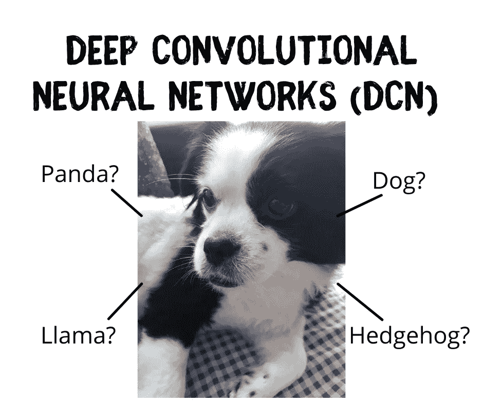

使用深度卷积神经网络的图像识别(DCN)。形象由[作者](https://medium.com/@solclover)。

# 介绍

一类特殊的神经网络叫做**卷积神经网络(CNN)** 是为图像识别而设计的。虽然这听起来可能超级幻想，但我向你保证，任何人都可以掌握它背后的主要思想。

在本文中，我将介绍 CNNs 的基本组成部分，并为您提供每个部分如何工作的示例。我还将介绍 Python 代码，您可以使用这些代码借助于 **Keras/Tensorflow** 库来构建**深度卷积神经网络**。

# 内容

*   机器学习算法领域中的卷积神经网络
*   卷积神经网络的结构是什么？它们是如何工作的？
*   一个完整的 Python 示例，向您展示如何构建和训练自己的 Deep CNN 模型

# 机器学习领域中的深度卷积神经网络(DCN)

下图是我尝试对最常见的机器学习算法进行分类的结果。

虽然我们经常以**监督**的方式将神经网络用于标注的训练数据，但我觉得它们在机器学习方面的独特方法值得单独归类。

因此，我的图显示了从机器学习领域的核心延伸出来的神经网络(NNs)。**卷积神经网络占据了 NNs 的一个分支，并且包含诸如 DCN、DN 和 DCIGN** 之类的算法。

下图为**互动图**，请点击不同类别**放大显示更多**👇。

机器学习算法分类。交互图由[作者](https://solclover.com/)制作。

***如果您喜欢【数据科学与机器学习】*** *，请* [*订阅*](https://bit.ly/3sItbfx) *获取带有我的新文章的电子邮件。*

# 卷积神经网络的结构是什么？它们是如何工作的？

让我们从比较典型的[前馈神经网络](/feed-forward-neural-networks-how-to-successfully-build-them-in-python-74503409d99a)和卷积神经网络的结构开始。

在传统的前馈神经网络中，我们有输入、隐藏和输出层，其中每一层可能包含多个节点。我们通常将**具有一个以上隐藏层**的网络称为**【深】**网络。

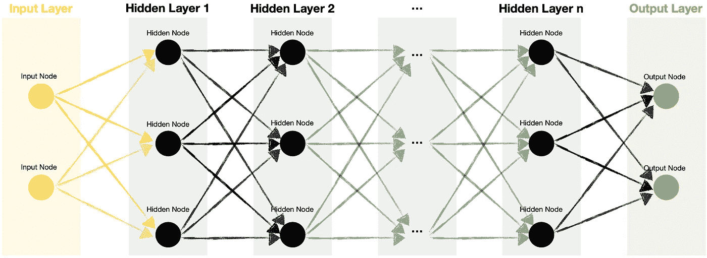

深度前馈神经网络。图片由[作者](https://medium.com/@solclover)提供。

与此同时，卷积神经网络(CNN)往往是多维的，包含一些特殊的层，毫不奇怪地被称为**卷积层**。此外，卷积层通常伴随着**池层(最大或平均)**，这有助于减少卷积特征的大小。

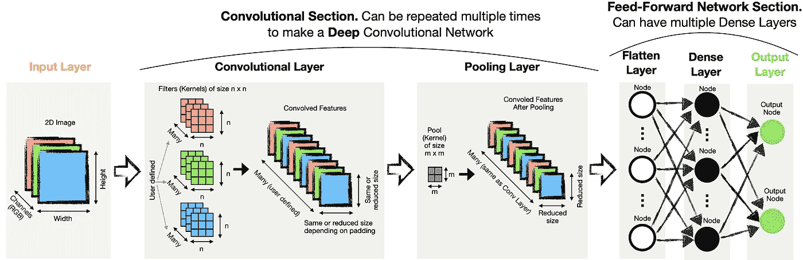

卷积神经网络。图片由[作者](https://medium.com/@solclover)提供。

## 卷积层

值得强调的是，我们可以有不同维度的卷积层:

*   一维( **Conv1D** ) —适用于文本嵌入、时间序列或其他序列。
*   二维( **Conv2D** ) —图像的典型选择。
*   三维( **Conv3D** ) —可用于视频，本质上只是图像序列，或用于 3D 图像，如 MRI 扫描。

因为我在本文中主要关注图像识别，所以让我们更仔细地看看 2D 卷积是如何工作的。1D 和 3D 卷积的工作方式相同，只是它们少了一个或多了一个维度。

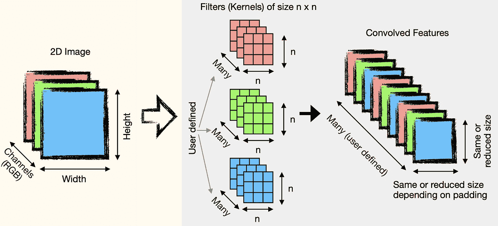

输入图像通过卷积层。图片由[作者](https://medium.com/@solclover)提供。

注意，对于灰度图片，我们只有一个通道。同时，我们将有三个独立的通道用于彩色图片，每个通道包含各自颜色(红、绿、蓝)的值。

我们还可以指定卷积层需要多少个滤波器。拥有多个过滤器可以让我们从图像中提取更广泛的特征。

## 卷积是如何工作的？

卷积有三个部分:输入(如 2D 图像)、滤波器(又称内核)和输出(又称卷积特征)。

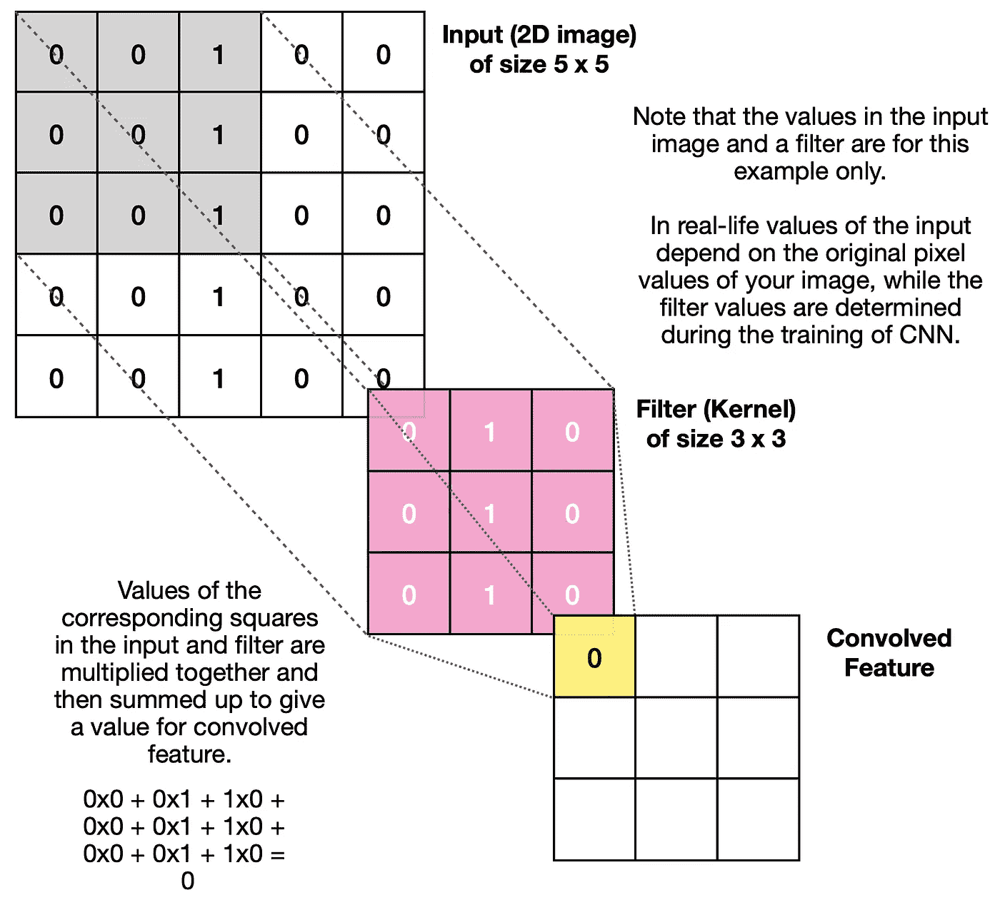

卷积。对输入数据应用过滤器的迭代过程中的第一次计算。图片由[作者](https://medium.com/@solclover)提供。

卷积过程是迭代的。首先，对输入图像的一部分应用滤镜，并记录输出值。然后，当**步距=1** 时，滤波器移动一个位置，或者当步距设置为较大数值时，滤波器移动多个位置，重复相同的过程，直到卷积特征完成。

下面的 gif 图像说明了对 5x5 输入应用 3x3 过滤器的过程。


卷积在起作用。Gif 图片由[作者](https://medium.com/@solclover)提供。

让我详细说明以上内容，让您更好地理解过滤器的用途。首先，您会注意到我的**自定义过滤器**在中间一列全是 1。这种类型的滤波器设计用于**识别输入图像中的垂直线**，因为只要出现垂直线，它就会给出强信号(高值)。

为了比较，如果我们应用一个为寻找水平线而设计的**过滤器，下面是卷积特征(输出)的样子:**

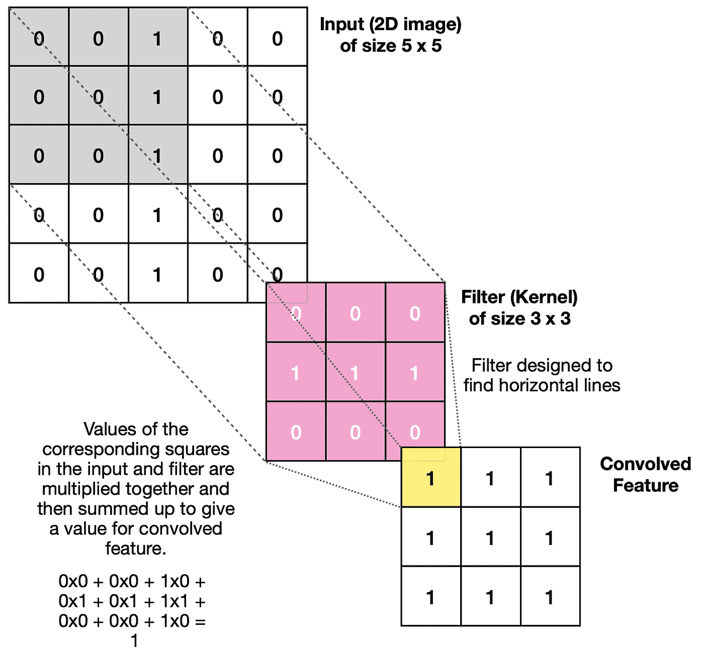

用于查找水平线的过滤器。图片作者[作者](https://medium.com/@solclover)。

如您所见，整个输出填充了相同的值，这意味着在输入图像中没有明确的水平线指示。

值得注意的是，我们**不需要手动指定不同滤波器的**值。滤波器的创建是在卷积神经网络的训练期间自动处理的。虽然，我们可以告诉算法**我们想要多少个滤波器**。

## 附加选项

设置卷积层时，我们还有几个选项可以调整:

*   **填充** —在某些情况下，我们可能希望输出与输入的大小相同。我们可以通过添加一些填充来实现这一点。同时，它可以使模型更容易捕捉驻留在图像边缘的基本特征。

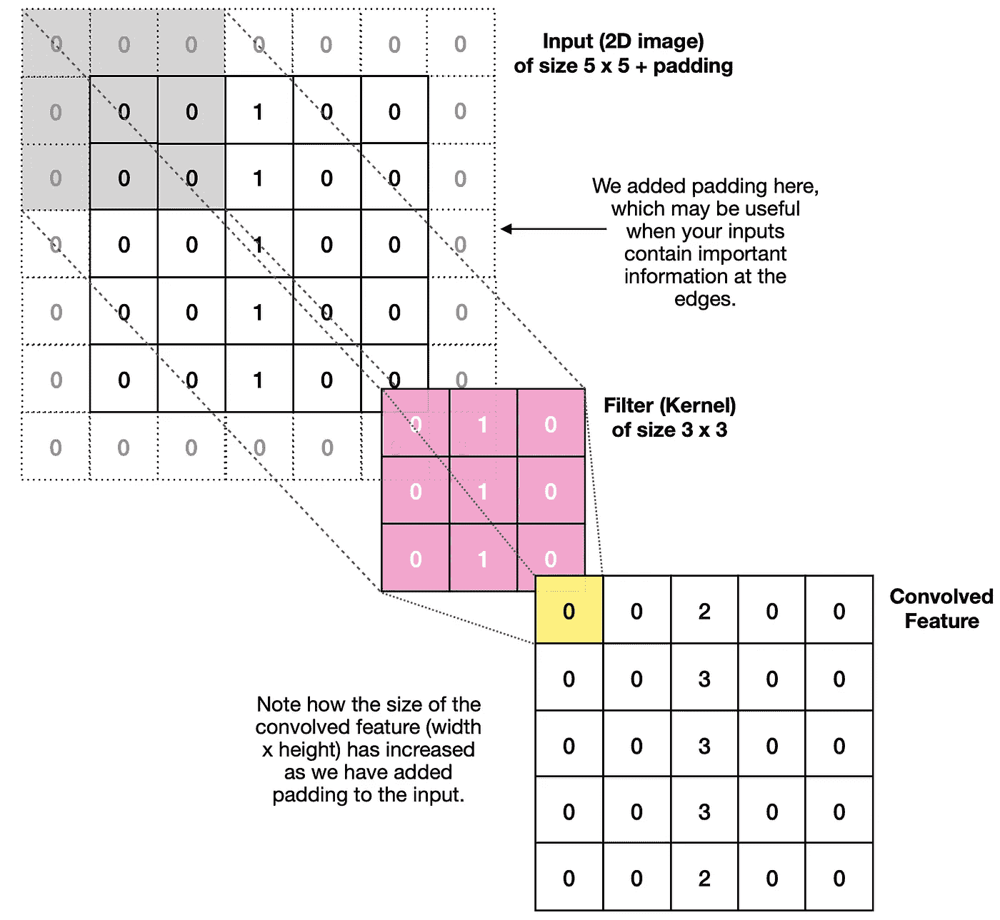

输入周围填充的卷积。图片由[作者](https://medium.com/@solclover)提供。

*   **步幅** —如果我们有大的图像，那么我们可能希望使用更大的步幅，即一次移动一个滤镜多个像素。虽然它确实有助于减小输出的大小，但较大的步幅可能会导致某些功能丢失，如下例所示:

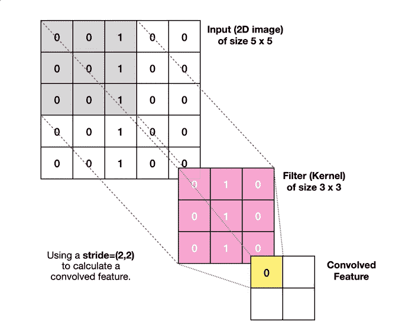

使用 stride=(2，2)的卷积运算。Gif 图片由[作者](https://medium.com/@solclover)提供。

## 多重卷积层

设置多个卷积层来改善网络通常是有益的。这些好处来自后续卷积层识别图像内的额外复杂性。

**深度卷积网络(DCN)** 中的第一层倾向于找到**低级**特征(例如，垂直、水平、对角线……)。同时，更深的层次可以识别更高层次的特征，如更复杂的形状，代表真实世界的元素，如眼睛、鼻子、耳朵等。

## 汇集层

通常在卷积层之后添加一个池层。其目的是减少卷积特征**的大小，提高计算效率**。此外，它可以通过**保持最强的激活**来帮助消除数据噪声。

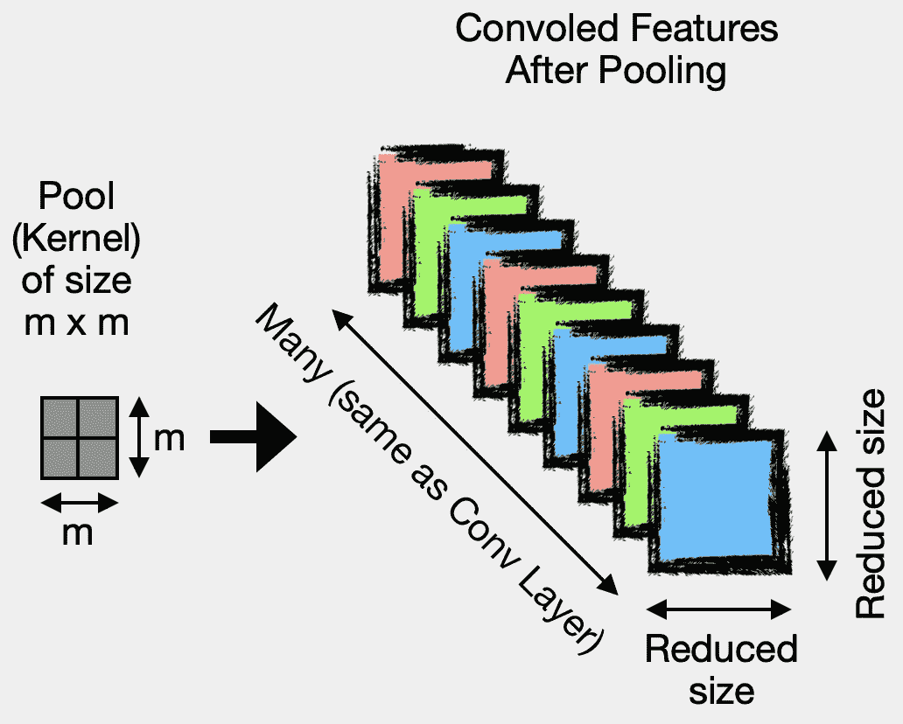

执行池化是为了减少卷积特征的大小。图片由[作者](https://medium.com/@solclover)提供。

有两种常用的池类型:

*   **Max pooling** —取内核覆盖区域的最高值(适合去噪)。
*   **平均池** —计算内核覆盖区域的平均值。

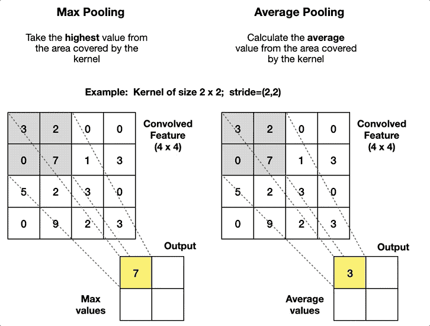

最大池化和平均池化图解。Gif 图片由[作者](https://medium.com/@solclover)提供。

## 展平和密集图层

一旦我们完成了卷积特征的推导，我们需要将它们展平。这使我们能够拥有一个一维输入向量，并利用传统的前馈网络架构。最后，我们训练网络以找到最佳的权重和偏差，这使我们能够正确地对图像进行分类。

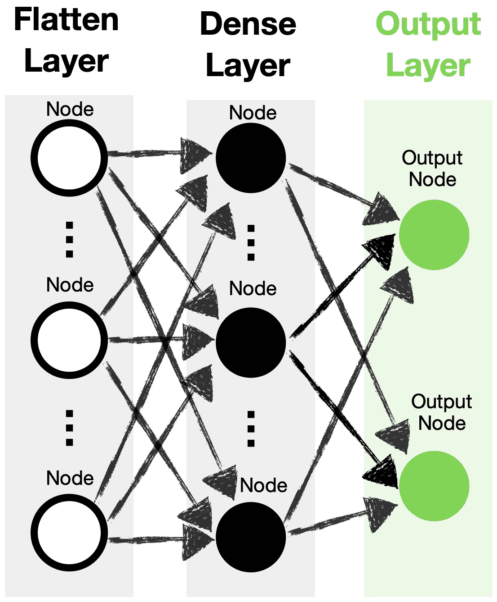

卷积神经网络的前馈部分。图片由[作者](https://medium.com/@solclover)提供。

根据数据的大小和复杂性，您可能希望有多对卷积层和池层，然后是多个密集层，使您的网络“更深”

[](https://solclover.com/membership)[](https://www.linkedin.com/in/saulius-dobilas/)

# 一个完整的 Python 例子，向你展示了如何构建和训练你自己的深度 CNN 模型

## 设置

我们需要获得以下数据和库:

*   加州理工学院 101 图像数据集([来源](https://data.caltech.edu/records/20086))

> **数据许可:** [归属 4.0 国际(CC BY 4.0)](https://creativecommons.org/licenses/by/4.0/)
> 
> 参考资料:飞飞、r .弗格斯和 p .佩罗娜。从少量训练实例中学习生成视觉模型
> :在
> 101 个对象类别上测试的增量贝叶斯方法。IEEE。CVPR 2004，基于生成模型的视觉研讨会。2004

*   用于数据操作的[熊猫](https://pandas.pydata.org/docs/)和 [Numpy](https://numpy.org/)
*   [Open-CV](https://pypi.org/project/opencv-python/) 和 [Matplotlib](https://matplotlib.org/stable/index.html) 用于摄取和显示图像
*   [Tensorflow/Keras](https://www.tensorflow.org/api_docs/python/tf) 用于构建神经网络
*   [Scikit-learn 库](https://scikit-learn.org/stable/index.html)用于拆分数据( [train_test_split](https://scikit-learn.org/stable/modules/generated/sklearn.model_selection.train_test_split.html) )、标签编码( [OrdinalEncoder](https://scikit-learn.org/stable/modules/generated/sklearn.preprocessing.OrdinalEncoder.html) )和模型评估([分类 _ 报告](https://scikit-learn.org/stable/modules/generated/sklearn.metrics.classification_report.html))

让我们导入库:

上面的代码打印了我在这个例子中使用的包版本:

```
Tensorflow/Keras: 2.7.0
pandas: 1.3.4
numpy: 1.21.4
sklearn: 1.0.1
OpenCV: 4.5.5
matplotlib: 3.5.1
```

接下来，我们下载并摄取加州理工学院 101 图像数据集。请注意，在这个例子中，我们将只使用四个类别(“达尔马提亚”、“刺猬”、“骆马”、“熊猫”)，而不是全部 101 个。

与此同时，我们通过调整数据大小和标准化数据、对标签进行编码并将其分成训练样本和测试样本来准备数据。

上面的代码打印出我们的数据的形状，对于输入数据是[samples，rows，columns，channels],对于目标数据是[samples，labels]:

```
Shape of whole data:  (237, 128, 128, 3)
Shape of X_train:  (189, 128, 128, 3)
Shape of y_train:  (189, 1)
Shape of X_test:  (48, 128, 128, 3)
Shape of y_test:  (48, 1)
```

为了更好地理解我们正在处理的数据，让我们显示一些输入图像。

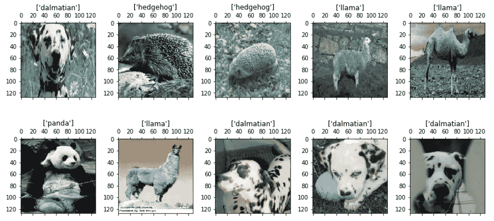

显示来自训练数据的 10 幅图像。图片由[作者](https://medium.com/@solclover)提供。

## 训练和评估深度卷积神经网络(DCN)

您可以按照代码中的注释来理解每个部分的作用。除此之外，这里有一些高层次的描述。

我将模型构建为具有多个**卷积**、**汇集**和**丢弃**层，以创建一个“深度”架构。正如本文前面提到的，初始卷积层帮助提取**低级特征**，而后面的卷积层识别更多的**高级特征**。

所以我的 DCN 模型的结构是:

*   输入层
*   第一组卷积、最大汇集和丢弃层
*   第二组卷积、最大汇集和丢弃层
*   第三组卷积、最大汇集和丢弃层
*   展平图层
*   密集隐藏层
*   输出层

请注意， **Dropout 层**根据我们提供的速率(在本例中为 0.2)随机将输入单位设置为 0。这意味着随机 20%的输入(要素/结点)将被设置为零，并且不会为模型贡献有意义的权重。**脱落层的目的是帮助防止过度贴合**。

最后，请注意，我在第一组卷积和最大池层中列出了所有可能的参数，因为我想给你一个可以更改的简单参考。但是，我们将它们中的大多数保留为默认值，因此我们不需要每次都显式列出它们(请参见第二组和第三组卷积层和最大池层)。

有了指定的模型结构，让我们编译它，训练它并打印结果。

上面的代码打印了一个模型结构的概要:

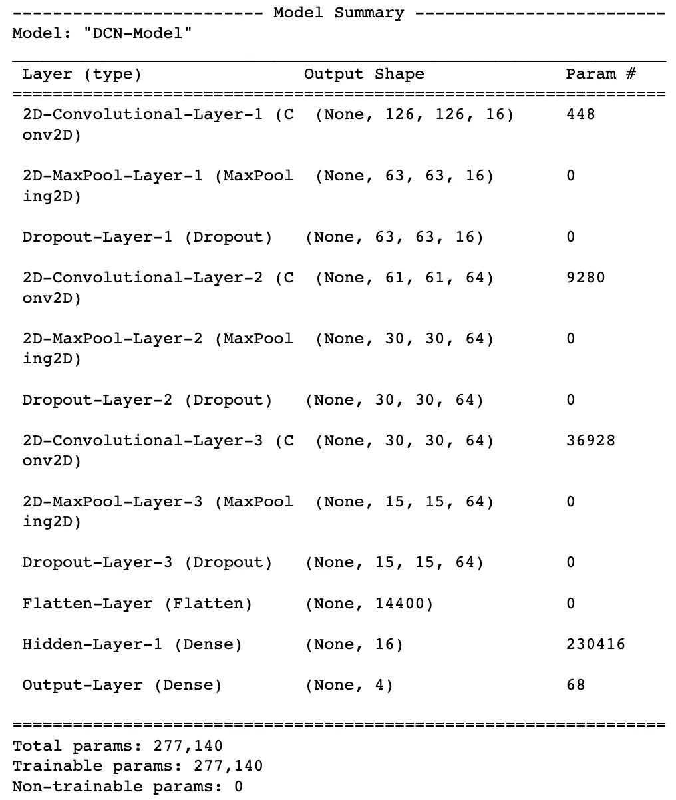

深度卷积神经网络(DCN)模型概述。图片由[作者](https://medium.com/@solclover)提供。

它还以分类报告的形式打印性能摘要:

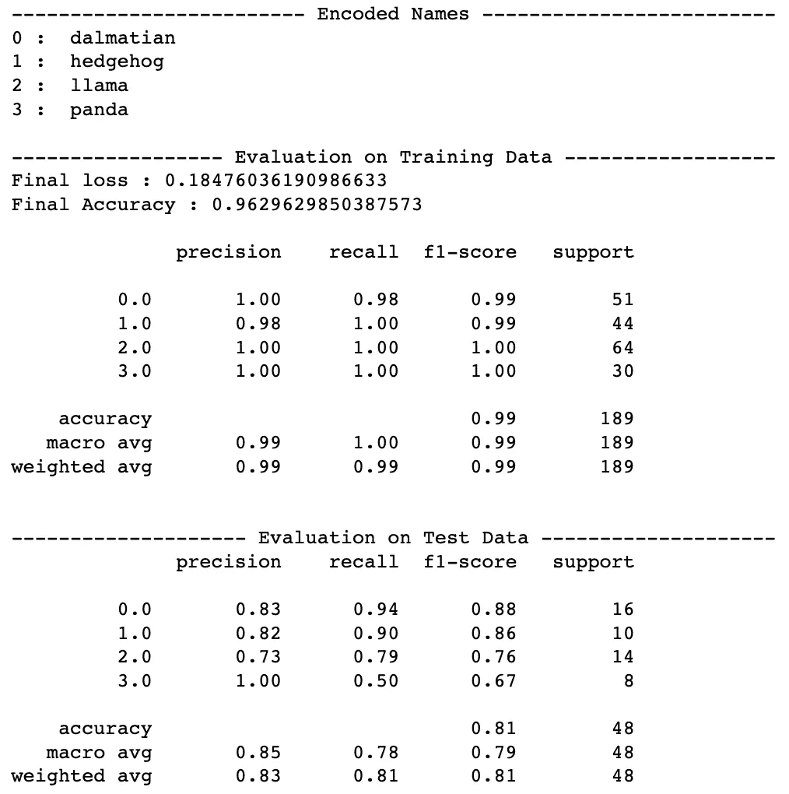

深度卷积神经网络(DCN)模型结果。图片由[作者](https://medium.com/@solclover)提供。

我们可以看到，该模型已经正确地识别了几乎所有的训练图像(f1-得分为 0.99)。然而，在测试数据上的表现却不尽如人意，f1 得分为 0.81。

可能会出现一些过度拟合的情况，因此值得尝试各种参数和网络结构，以找到最佳设置。与此同时，我们拥有的图像数量相对较少，这使得模型的训练和评估变得更加困难。

## 附加评估

最后，我想看看模型会把我的狗放在哪个类别。虽然我的狗不是达尔马提亚狗，但它是黑白相间的。我想知道这个模特是否会认出他是一只狗而不是一只熊猫😂

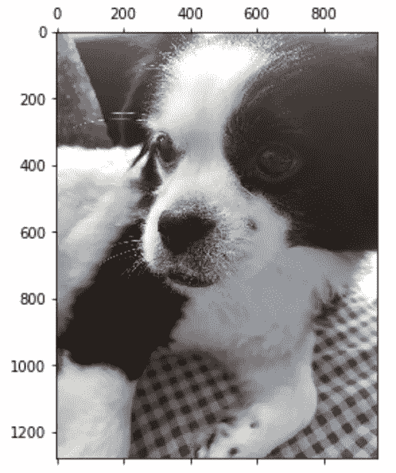

Jupyer 笔记本中我的狗的图像。图片由[作者](https://medium.com/@solclover)提供。

准备图像并使用先前训练的 DCN 模型来预测标签。

结果如下:

```
Shape of the input:  (1, 128, 128, 3)

DCN model prediction:  [['dalmatian']]

Probabilities for each category:
dalmatian  :  0.92895913
hedgehog  :  0.004558794
llama  :  0.010929748
panda  :  0.055552367
```

因此，模型已经确定我的狗是一只斑点狗，尽管有 5.5%的概率是一只熊猫😆

# 结束语

我真诚地希望你喜欢阅读这篇文章，并获得一些新的知识。

你可以在我的 [**GitHub 资源库**](https://github.com/SolClover/Art046_NN_DCN_Deep_Convolutional_Networks) 找到完整的 Jupyter 笔记本代码。可以随意用它来构建自己的深度卷积神经网络，如果有任何问题或建议，请随时联系。

还有，你可以在这里找到我的其他神经网络文章:[前馈](/feed-forward-neural-networks-how-to-successfully-build-them-in-python-74503409d99a)、[深度前馈](/deep-feed-forward-neural-networks-and-the-advantage-of-relu-activation-function-ff881e58a635)、 [RNN](/rnn-recurrent-neural-networks-how-to-successfully-model-sequential-data-in-python-5a0b9e494f92) 、 [LSTM](/lstm-recurrent-neural-networks-how-to-teach-a-network-to-remember-the-past-55e54c2ff22e) 、 [GRU](/gru-recurrent-neural-networks-a-smart-way-to-predict-sequences-in-python-80864e4fe9f6) 。

干杯！
**索尔·多比拉斯**

***如果你已经花光了这个月的学习预算，下次请记得我。*** *我的个性化链接加入媒介:*

[](https://solclover.com/membership) [## 通过我的推荐链接加入 Medium 索尔·多比拉斯

### 作为一个媒体会员，你的会员费的一部分会给你阅读的作家，你可以完全接触到每一个故事…

solclover.com](https://solclover.com/membership)