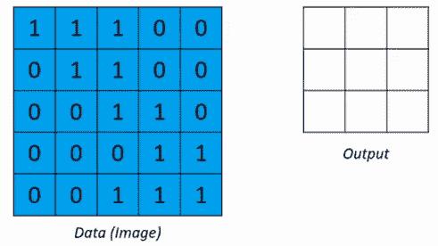
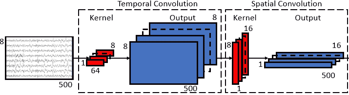
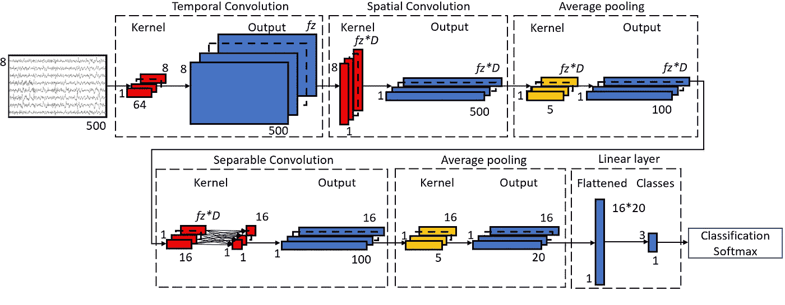

# 用于脑电图脑-机接口的卷积神经网络

> 原文：<https://towardsdatascience.com/convolutional-neural-networks-for-eeg-brain-computer-interfaces-9ee9f3dd2b81>

## PyTorch 和 TensorFlow 中的代码示例

深度学习(DL)在各个领域的受欢迎程度都有了巨大的增长。DL 也已经被用于脑-机接口(BCI)和脑电图(EEG)。然而，DL 模型需要适应脑电图数据。这是如何做到的？在 BCIs 领域，DL 方法有多成功？

图一。乔希·里默尔在 [Unsplash](https://unsplash.com?utm_source=medium&utm_medium=referral) 上的照片

在这篇文章中，我们首先解释了为什么对于脑机接口来说，与传统的机器学习(ML)方法相比，DL 更有优势。我们解释卷积神经网络(CNN)如何工作，以及它们如何被改变和用于脑电图数据。我们将深入研究一个特定的网络 EEGNET，并在 PyTorch 和 TensorFlow 中提供 EEGNET 的代码示例。最后，我们讨论了如何对脑电图数据进行深度迁移学习。

该职位的组织结构如下:

1.  为什么要用深度学习？
2.  脑电图数据的专用 CNN
3.  解释最流行的 CNN 脑电图数据:EEGNET
4.  TensorFlow 和 PyTorch 中的代码示例 EEGNET
5.  深度迁移学习可能吗？

尽情享受吧！

## 为什么要深度学习？

在 BCI 领域，两种常见的分类方法是公共空间模式(CSP)和黎曼几何(RG)。这两种方法之前都有大量的预处理，其中最重要的一步是频率滤波，这是一种提取特征的方法。CSP 和 RG 在[这里](https://medium.com/the-ultimate-bedroom-bci-guide/effective-machine-learning-for-eeg-bcis-fe322e584627)有更详细的解释，频率滤波在[这篇文章](https://medium.com/the-ultimate-bedroom-bci-guide/feature-engineering-for-motor-imagery-bcis-with-code-examples-b296992b0936)有更详细的解释。

用于特征提取步骤的滤波器范围必须由研究者手动选择，这引入了主观偏见。其次，受试者之间最显著的大脑信号的频率范围也不同。由于手动寻找每个对象的最佳范围可能非常彻底，研究人员通常选择一个大致的范围(例如 8-40 赫兹)，希望这个范围对所有对象都足够了。

这就是 DL 发挥作用的地方。

DL 的优势在于它是一种端到端的方法，其中在模型中结合了特征提取和分类。DL 模型可以从原始脑电图数据中提取特征，这意味着数据可以在没有研究人员手动选择过滤器的情况下进行预处理。一些研究使用原始脑电图数据[1]，而其他研究仅在 1–100Hz 的宽范围内应用带通滤波器，以最大限度地减少极低频和高频噪声伪像[2]。

这种端到端方法消除了研究人员对频率滤波的主观偏见，DL 模型能够了解每个个体对象的最佳范围。

现在我们知道了 DL 的优点，让我们看看 DL 是如何在 BCI 领域使用的！

## 脑电卷积神经网络

DL 在 BCI 领域最突出的例子是卷积神经网络(CNN)的应用，它最初用于图像等计算机视觉任务，但也用于音频信号。

图像和音频信号通常具有分层结构，其中附近的特征对于当前特征是重要的，而远处的特征不那么重要。当 EEG 数据被视为 2D 阵列，以时间步长数为宽度，以电极数为高度时(如图 2 所示)，EEG 数据具有与图像或音频信号相似的特征。附近时间点的数据对于当前数据点以及同一时间点其他通道的数据都很重要。使用卷积和非线性，CNN 可以在这些类型的数据中学习局部非线性特征和局部模式。

图 2:脑电图数据示例。脑电图数据可以被视为一个 2D 阵列，行是电极通道，列是时间点。图片作者。

CNN 通过使用内核来工作。内核是数据上的滑动窗口，从左到右、从上到下扫描。对于每次扫描，计算该窗口中的数据与内核值的点积，本质上总结了该窗口中数据的信息。下面的图 3 给出了一个直观的例子。

图 3:CNN 的滑动窗口。图片来自作者，灵感来自[来源](https://giphy.com/gifs/blog-daniel-keypoints-i4NjAwytgIRDW)。

关于 EEG 数据的 CNN，最流行的模型是用所谓的时间和空间卷积开发的。

时间卷积的核大小为 *1 x 时间点，*，其中滑动窗口将在特定时间帧内遍历每个通道，因此汇总了每个通道在该时间帧内的 EEG 数据。

对于每个时间点，对所有通道应用空间卷积，从而汇总所有通道的信息。卷积可以用不同的内核值应用多次，创建不同类型的原始数据摘要(称为特征映射)。

图 4:应用于脑电图数据的时间卷积和空间卷积。图片作者。

这种卷积的目的是通过用时间卷积表示频率滤波，用空间卷积表示空间滤波来表示 CSP 流水线。

EEGNET 是用于 EEG 分类的最流行的 DL 模型之一[1]。EEGNET 以其相对较大的网络和有限的参数数量而闻名，在最近的研究中被大量使用。

让我们详细解释 EEGNET，并附上代码示例！

## EEGNET

图 5:为我们的研究调整的 EEGNET 网络。图片作者。

EEGNET 由一个时间和空间卷积组成，但也有另一种形式的卷积，称为可分离卷积。在以下章节中，将对 EEGNET 进行解释。

请注意，原始的 EEGNET 与我们在这里解释的实现略有不同。例如，原始论文的作者将模型应用于 *64 个电极通道 x 128 个时间点*的 EEG 数据，而我们使用的是 *8 个电极通道 x 500 个时间点*的 EEG 数据。一般来说，建议在将网络应用于您自己的数据时，试验一下内核大小和参数值。

网络的第一层是时间卷积。卷积的内核大小与原始的 EEGNET 保持一致，大小为 *1 x 64* 。该层中的特征地图的数量，命名为过滤器大小( *fz* )，是基于超参数搜索选择的。每个卷积层在卷积后应用批量归一化，以归一化前一层的输出，从而确保下一层的归一化输入。

第二层是大小为 *8 x 1* 的空间卷积。第一尺寸等于电极通道的数量。来自前一层的特征图的数量乘以深度参数( *D* )，该深度参数也是基于超参数搜索选择的。应用批量标准化后，用指数线性单位(ELU)实现非线性。当 *x > 0，*时，ELU 保持输出 *x* 不变，并且对于 *x ≤ 0* ，函数*exp(x)—1*被应用。

然后，应用步长为 5 的核大小为*5×1*的时间平均池，对每 5 个时间点的数据进行平均以降低维数。由于我们研究中的输入大小(500)不能被原始网络中的步幅值 8 整除，所以我们选择了步幅值 5。

平均汇集后，辍学层紧随其后。在训练期间，dropout 以一定的概率随机地将输入的一些元素置零 *pdrop* 。这通过减少特定节点对早期层中的节点的依赖性来防止对训练数据的过度拟合，因为节点对之间的高度依赖性可能导致对训练数据中的特定特征的过度拟合，这不会出现在验证和测试数据中。通过超参数搜索找到了 *pdrop* 的值。

接下来，应用一个可分离的卷积层，该卷积层由一个核大小为 *1 x 16* 的时间卷积组成，如在原始 EEGNET 中所使用的，紧接着是一个 *1 x 1* 卷积，该卷积对来自前一层的所有特征映射上分组的核进行，本质上概括了特征映射上的时间卷积的输出。在这一层，另一批标准化和 ELU 被应用。

之后，应用了另一个 *5 x 1* 平均池，然后是一个 dropout 层。最后，数据被展平，并且应用了线性层。

与最初的 EEGNET 一样，上面解释的所有卷积层都是以步长 1 应用的，没有添加偏移。对于时间卷积，使用“相同”填充，其中零被添加到输入的左侧和右侧，以在卷积后具有相同的输出大小。

作为优化方法，使用了 Adam 优化器。Adam 的学习率 *lr* 也是通过超参数搜索找到的。

## PyTorch 和 TensorFlow 中的 EEGNET

现在所有的解释都结束了，让我们看看如何编写这个模型！

最初的作者在他们的 [Github 资源库](https://github.com/vlawhern/arl-eegmodels/blob/master/EEGModels.py)中提供了他们在 TensorFlow 中的模型实现。它们在 TensorFlow 中实现，归结为以下代码:

我们的实现是在 PyTorch 中开发的，可归结为:

## 转移学习？

EEGNET 在应用单个个体的数据时，很可能会表现得非常糟糕。为什么？仅仅是因为数据量不足以让 EEGNET 正确校准。由于这个原因，迁移学习(TL)已经被用于 BCI 领域，在将模型应用于新的主题之前，模型将从多个主题的数据中学习。然而，最初的实验表明，用于 EEG 数据的 TL 伴随着许多困难和问题。让我们检查一下。

**噪音可变性:**脑电图捕捉源自你大脑的电活动。然而，脑电图电极不是智能设备。他们不能区分来自大脑的电信号和其他电信号。这可能是很多信号。想想你的手机，显示器，空调，你能想到的。这里的难点在于，这些噪声源每天都不一样，在其他环境中也不一样。这种噪音的可变性会导致您自己的实验中的受试者和会话之间的差异。但是想象一下在完全不同的环境中捕获的数据集之间的差异。尽管这种噪声只会少量影响 EEG 数据，但当在多个数据集或多个受试者的数据上训练通用模型时，它仍然会带来困难[3]。

**脑电图仪:**另一个可变性的来源是脑电图仪本身。这里的主要组成部分是将帽子放置在对象的头上。虽然我们有一个标准化的电极放置方法([10–20 国际系统](https://en.wikipedia.org/wiki/10%E2%80%9320_system_(EEG)))，但是测量受试者头部的距离以及随后放置电极帽是一个稍微主观的过程。这导致受试者或会话之间的帽放置的微小差异，从而导致 EEG 信号的差异，因为电极可能离源自大脑的原始信号更远或更近。同样，当比较多个数据集的 EEG 数据时，这个问题变得更大。其他实验可能使用了不同的 EEG 设备，这些设备具有不同的材料和略微不同的帽放置..

**神经可变性:**大脑是一个复杂的器官。自然，用脑电图捕捉一个人的想法似乎很容易，但潜在的机制在受试者之间的差异中起着很大的作用，而且在同一受试者的日常差异中也是如此。

人们发现，对于相同的受试者，在相同的环境下执行相同的任务，大脑信号每天都不同[2]。这可能会在 DTL 过程中造成问题，而且还会使多天使用同一个模型变得困难。因此，模型应该每天微调或重新训练。

让 DTL 变得更加困难的是，一些受试者没有表现出足够强的大脑信号来被 DL 模型识别为模式[4]。在您的数据集中有这样的主题会在训练期间混淆 DL 模型。

最后，我们的思维方式也因人而异。如果我们以运动想象为例，我们可以用两种方式来实现它:

*   动觉:想象以第一人称视角执行运动任务。
*   视觉:想象某人或你自己从第三人称视角执行运动任务。

已经发现，与后者相比，第一种方法导致更清晰的大脑活动模式[5]。如果数据集包含两种方法的混合，这也会给 DTL 的学习过程带来问题。

**一种用于 EEG 迁移学习的方法:**为了总结迁移学习的主题，给出了将迁移学习应用于 EEG 数据的指南列表:

*   为了确保受试者之间的数据相似，最好的办法是自己收集数据。在收集数据的过程中，你可以控制对受试者的指示(例如，指示他们只进行动觉运动想象)。还有，用的是同一个脑电图仪，环境尽可能的相似，帽子放置你有控制权。
*   要执行 DTL，请在多个主题的数据上训练您的模型。对于特定的主题或会话，总是收集少量的数据来执行微调。将通用模型直接应用于新的主题或会话很可能会产生不好的结果。
*   在训练过程中，在训练集中有多个主题，但在验证集中也有一个主题。在每个历元之后，通过对来自该主题的少量数据微调当前模型来模拟微调过程，然后通过对该主题的剩余数据应用模型来获得您的验证准确性。

## 结论

在这篇文章中，我们讨论了:

*   深度学习如何凭借端到端学习的优势进入 BCI 领域
*   为什么卷积神经网络是 BCI 领域最受欢迎的深度学习模型，以及它们是如何工作的
*   关于 EEGNET 的深入解释，EEG net 是最受欢迎的 EEG 数据模型
*   然后，我们在 TensorFlow 和 PyTorch 中提供了 EEGNET 的代码
*   最后，我们讨论了在应用深度迁移学习时可能遇到的问题，以及如何通过专门的培训过程来克服这些问题。

感谢您的阅读。如果感兴趣的话，可以在我的另一篇文章[这里](https://medium.com/@timdb877/i-built-a-brain-computer-interface-to-play-space-invaders-using-thoughts-23980cb4faf7)中找到关于建立 BCI 系统所需的所有步骤的更多细节。

## 参考

1.  弗农·劳赫恩、阿米莉亚·J·梭伦、尼古拉斯·R·韦托维奇、斯蒂芬·M·戈登、周平雄和布伦特·J·兰斯。 [Eegnet:基于 eeg 的脑-计算机接口的紧凑卷积神经网络](https://arxiv.org/abs/1611.08024)。神经工程学报，15(5):056013，2018。
2.  张策，金永根，阿齐姆·埃斯坎达里安。 [EEG-Inception:用于基于 EEG 的运动想象分类的精确且健壮的端对端神经网络](https://arxiv.org/abs/2101.10932?utm_source=feedburner&utm_medium=feed&utm_campaign=Feed%3A+arxiv%2FQSXk+%28ExcitingAds%21+cs+updates+on+arXiv.org%29)。神经工程学报 18.4 (2021): 046014。
3.  雅尔达·沙里亚里、特里萨·M·沃恩、LM·麦卡恩、布伦丹·Z·艾利森、乔纳森·R·沃尔帕和迪安·J·克鲁森斯基。[使用纵向脑电图数据对肌萎缩侧索硬化患者脑机接口性能变化的探索。](https://pubmed.ncbi.nlm.nih.gov/31108477/)神经工程杂志，16(5):056031，2019。
4.  Benjamin Blankertz、Claudia Sanelli、Sebastian Halder、E . Hammer、Andrea Kübler、Klaus-Robert Müller、Gabriel Curio 和 Thorsten Dickhaus。[预测 bci 性能研究 bci 文盲。英国医学委员会神经科学，10(增刊 1):2009 年第 84 页](https://bmcneurosci.biomedcentral.com/articles/10.1186/1471-2202-10-S1-P84)
5.  克里斯塔·纽珀、莱因霍尔德·舍雷尔、米丽娅姆·赖纳和格特·普福尔茨赫勒。运动动作的想象:[单次脑电图中动觉和视觉-运动想象模式的差异效应](https://pubmed.ncbi.nlm.nih.gov/16236487/)。认知大脑研究，25(3):668–677，2005。